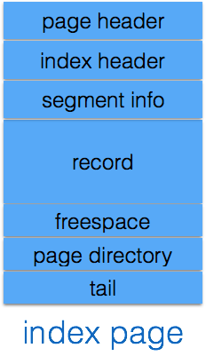
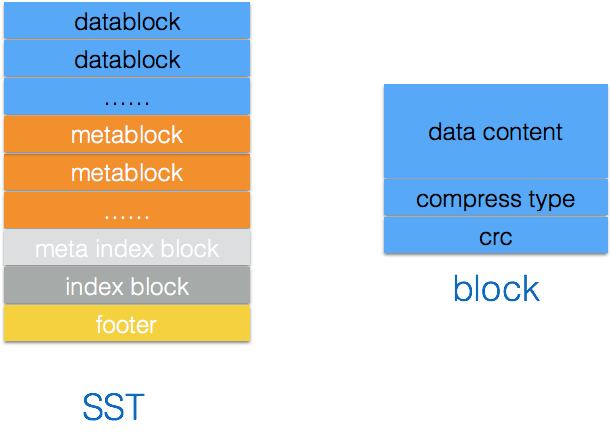
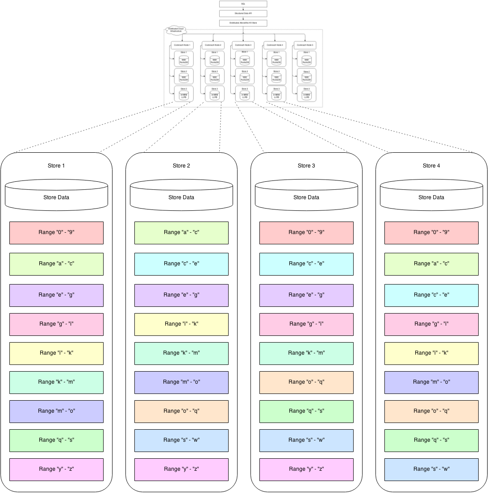

# MySQL · 特性介绍 · 一些流行引擎存储格式简介

**Date:** 2017/10
**Source:** http://mysql.taobao.org/monthly/2017/10/04/
**Images:** 11 images downloaded

---

数据库内核月报

 [
 # 数据库内核月报 － 2017 / 10
 ](/monthly/2017/10)

 * 当期文章

 PgSQL · 特性分析 · MVCC机制浅析
* MySQL · 性能优化· CloudDBA SQL优化建议之统计信息获取
* MySQL · 引擎特性 · InnoDB mini transation
* MySQL · 特性介绍 · 一些流行引擎存储格式简介
* MSSQL · 架构分析 · 从SQL Server 2017发布看SQL Server架构的演变
* MySQL · 引擎介绍 · Sphinx源码剖析(三)
* PgSQL · 内核开发 · 如何管理你的 PostgreSQL 插件
* MySQL · 特性分析 · 数据一样checksum不一样
* PgSQL · 应用案例 · 经营、销售分析系统DB设计之共享充电宝
* MySQL · 捉虫动态 · 信号处理机制分析

 ## MySQL · 特性介绍 · 一些流行引擎存储格式简介 
 Author: 张远 

 ## 概述

本文简要介绍了一些存储引擎存储结构，包括InnoDB, TokuDB, RocksDB, TiDB, CockroachDB, 供大家对比分析

## InnoDB

InnoDB 底层存储结构为B+树，结构如下

B树的每个节点对应innodb的一个page，page大小是固定的，一般设为16k。
其中非叶子节点只有键值，叶子节点包含完整数据。

InnoDB按segment, extent, page方式管理page

每个数据节点page结构如下

数据记录record按行存储，record具体格式由row_format决定.
详情可以参考[数据内核月报](http://mysql.taobao.org/monthly/2016/02/)

## TokuDB

TokuDB 底层存储结构为Fractal Tree

Fractal Tree的结构与B+树有些类似, 在Fractal Tree中，每一个child指针除了需要指向一个child节点外，还会带有一个Message Buffer ，这个Message Buffer 是一个FIFO的队列，用来缓存更新操作。

例如，一次插入操作只需要落在某节点的Message Buffer就可以马上返回了，并不需要搜索到叶子节点。这些缓存的更新会在查询时或后台异步合并应用到对应的节点中。

## RocksDB

RockDB的存储结构如下

RocksDB写入数据时，先写到memtable中,memtable一般为skiplist, memtable写满时转为immutable memtable并刷入Level 0.

Level0中的SST文件中的数据都是有序的，Level0中SST文件之间的数据范围可能存在重叠。
其他Level中的SST文件之间的数据范围不重叠。

RocksDB会以一定的[机制](https://github.com/facebook/rocksdb/wiki/Compaction)从低level compact数据到高level中。

RocksDB中SST文件的结构如下

MyRocks使用的存储引擎就是RocksDB, MyRocks的中RocksDB的数据映射关系参考 [之前的月报](http://mysql.taobao.org/monthly/2016/10/05/)

## TiDB

**TiDB的存储结构**

TiDB是分布式存储，分为两个部分TiKV和Placement Driver server。

TiKV用于存储真正的数据，TiKV由分布在不同机器上的RocksDB实例组成。
数据按范围划分为一个个Region. 并且会尽量保持每个 Region 中保存的数据不超过一定的大小(这个大小可以配置，目前默认是 64MB). 同一Region分布在不同的RocksDB实例中，一个RocksDB实例包含多个Region.
图中，Region4有三个副本分布在三个RocksDB实例中，这三个Region副本组成一个RaftGroup，副本间通过Raft协议保证一致性。

Placement Driver server（PD）， 也是一个集群，也通过Raft协议保证一致性。PD主要有以下作用：

* 存储region的位置等元数据信息
* 调度和rebalance regions, TiKV中的Raft leader等信息
* 分配全局事务ID

**TiDB的数据映射关系**

以下表为例

`create table user(user_id int primary key, name varchar(100), email varchar(200));
INSERT INTO user VALUES (1, “bob”, “huang@pingcap.com”);
INSERT INTO user VALUES (2, “tom”, “tom@pingcap.com”);
`
对应到RocksDB中的KV结构如下

 Key
 Values

 user/1
 bob huang@pingcap.com

 user/2
 tom tom@pingcap.com

## CockroachDB

**CockroachDB的存储结构**

CockroachDB的也是分布式存储，其结构和TiDB类似。CockroachDB按范围划分为Range，Range默认为64M，Range的存储为RocksDB， CockroachDB的一个node包含多个RocksDB实例。
Range副本分布在不同的node中，通过Raft协议保证一致。

Range的元数据信息也保存在Range中(靠前的Range中).

System keys come in several subtypes:

* Global keys store cluster-wide data such as the “meta1” and “meta2” keys as well as various other system-wide keys such as the node and store ID allocators.
* Store local keys are used for unreplicated store metadata (e.g. the StoreIdent structure). “Unreplicated” indicates that these values are not replicated across multiple stores because the data they hold is tied to the lifetime of the store they are present on.
* Range local keys store range metadata that is associated with a global key. Range local keys have a special prefix followed by a global key and a special suffix. For example, transaction records are range local keys which look like: \x01ktxn-.
* Replicated Range ID local keys store range metadata that is present on all of the replicas for a range. These keys are updated via Raft operations. Examples include the range lease state and abort cache entries.
* Unreplicated Range ID local keys store range metadata that is local to a replica. The primary examples of such keys are the Raft state and Raft log.

**CockroachDB的数据映射关系**

以下表为例

`create table mydb.customers(name varchar(100) primary key, address varchar(100) , URL varchar(100));
insert into mydb.customers values('Apple','1 Infinite Loop, Cupertino, CA','http://apple.com/');
`
表结构信息

 Key
 Values

 /system/databases/mydb/id
 51

 /system/tables/customer/id
 42

 /system/desc/51/42/address
 69

 /system/desc/51/42/url
 66

表中的数据

 Key
 Values

 /51/42/Apple/69
 1 Infinite Loop, Cupertino, CA

 /51/42/Apple/66
 http://apple.com/

## 最后
本文简要介绍了各存储引擎的结构，供大家参考，有错误之处请指正.

## 参考文档

* https://github.com/facebook/rocksdb
* https://www.percona.com/doc/percona-server/LATEST/tokudb/tokudb_intro.html
* https://github.com/cockroachdb/cockroach/blob/master/docs/design.md
* https://github.com/pingcap/tidb
* https://www.percona.com/live/plam16/sessions/how-we-build-tidb
* https://dev.mysql.com/doc/internals/en/innodb.html
* http://img3.tbcdn.cn/L1/461/1/d0069515c04809a449eda659386afbe966e0d1df

 阅读： - 

本作品采用[知识共享署名-非商业性使用-相同方式共享 3.0 未本地化版本许可协议](http://creativecommons.org/licenses/by-nc-sa/3.0/)进行许可。

 