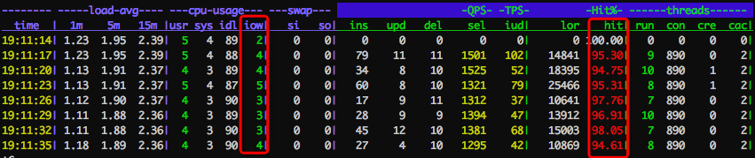
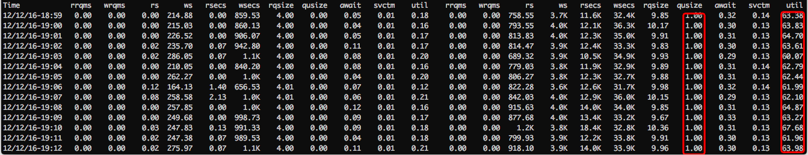
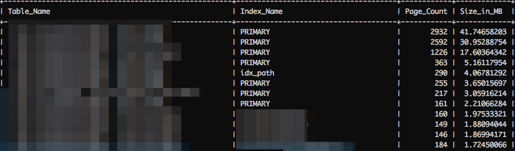
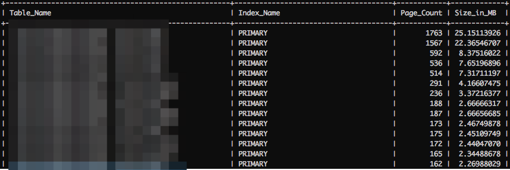
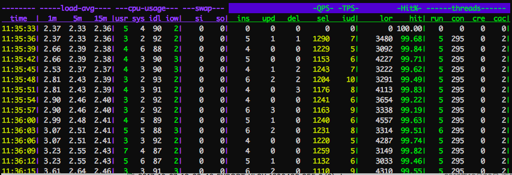

# MySQL · 最佳实践 · 什么时候该升级内存规格

**Date:** 2017/11
**Source:** http://mysql.taobao.org/monthly/2017/11/04/
**Images:** 6 images downloaded

---

数据库内核月报

 [
 # 数据库内核月报 － 2017 / 11
 ](/monthly/2017/11)

 * 当期文章

 MySQL · 数据恢复 · undrop-for-innodb
* MySQL · 引擎特性 · DROP TABLE之binlog解析
* MSSQL · 最佳实践 · SQL Server三种常见备份
* MySQL · 最佳实践 · 什么时候该升级内存规格
* MySQL · 源码分析 · InnoDB LRU List刷脏改进之路
* MySQL · 特性分析 · MySQL 5.7 外部XA Replication实现及缺陷分析
* PgSQL · 最佳实践 · 双十一数据运营平台订单Feed数据洪流实时分析方案
* MySQL · 引擎特性 · TokuDB hot-index机制
* MySQL · 最佳实践 · 分区表基本类型
* PgSQL · 应用案例 · 流式计算与异步消息在阿里实时订单监测中的应用

 ## MySQL · 最佳实践 · 什么时候该升级内存规格 
 Author: lingluo 

 ## 前言
在平时的工作中，会碰到用户想升级规格的case，有一些其实是没有必要的，这些通过优化设计或者改写SQL语句，或者加加索引可以达到不升级的效果，而有一些确实是需要升级规格的，比如今天讲的case。

## 追根溯源

### 查看表结构和索引
通过[CloudDBA](https://promotion.aliyun.com/ntms/act/dbaclouddba.html?spm=5176.7920929.720436.1.n2TD8C) 的SQL统计功能，发现SQL比较简单，也有索引，所以排除是这两方面设计的问题。

### 查看实例性能数据

innodb_buffer_pool命中率还不到99%，命中率不高的，而iowait>=2略微高，所以推测是命中率不高，导致数据在内存里换进换出导致。

系统层面io对列里面已经有少量的堆积；

## 查看内存内容
通过查看内存里面的数据和索引的大小，可以看到：

 `+--------+--------+---------+---------+---------+------------+---------+``| engine | TABLES | rows    | DATA    | idx     | total_size | idxfrac |``+--------+--------+---------+---------+---------+------------+---------+``| InnoDB |  11274 | 899.60M | 247.21G | 187.56G | 434.77G    |    0.76 |``+--------+--------+---------+---------+---------+------------+---------+`

数据和索引已经将近440G，而BP却还是1G，更加可以印证上面的推测(数据在内存里面被频繁的换进换出)。
再来验证下：

过十多分钟再看，BP里面的内容已经不一样了：

### 查看实例是如何用的
通过上一步我们可以发现，整个实例的空间是400G+，qps，tps都很低，逻辑读不算高，为什么BP命中率会这么低呢？
通过

`mysql>show global variables like "%buffer_pool%";
`
看到innodb_buffer_pool才1G，所有问题都已经明朗，那么如何解这个问题呢？

## 解决问题
我们再进一步看这个实例下面其实是有几十个库的，解决这个问题有两种方法：

1. 直接升级整个实例规格
2. 拆库

这么大的磁盘空间，又这么低的tps，所以我推荐第2种方法，拆分后其实也相当于变相地达到了升级实例规格的目的。把大实例拆成小实例后，再来看下对比：

## 结言
这个case是真正申请的内存规格小了些，所以这个是需要升级内存规格的。
一些小技巧，起到大作用，欢迎使用我们的经验沉淀下来的产品，您随叫随到的数据库专家[CloudDBA](https://promotion.aliyun.com/ntms/act/dbaclouddba.html?spm=5176.7920929.720436.1.n2TD8C)。

 阅读： - 

本作品采用[知识共享署名-非商业性使用-相同方式共享 3.0 未本地化版本许可协议](http://creativecommons.org/licenses/by-nc-sa/3.0/)进行许可。

 