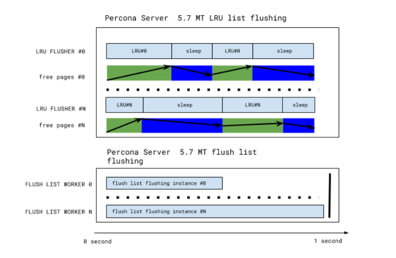

# MySQL · 源码分析 · InnoDB LRU List刷脏改进之路

**Date:** 2017/11
**Source:** http://mysql.taobao.org/monthly/2017/11/05/
**Images:** 3 images downloaded

---

数据库内核月报

 [
 # 数据库内核月报 － 2017 / 11
 ](/monthly/2017/11)

 * 当期文章

 MySQL · 数据恢复 · undrop-for-innodb
* MySQL · 引擎特性 · DROP TABLE之binlog解析
* MSSQL · 最佳实践 · SQL Server三种常见备份
* MySQL · 最佳实践 · 什么时候该升级内存规格
* MySQL · 源码分析 · InnoDB LRU List刷脏改进之路
* MySQL · 特性分析 · MySQL 5.7 外部XA Replication实现及缺陷分析
* PgSQL · 最佳实践 · 双十一数据运营平台订单Feed数据洪流实时分析方案
* MySQL · 引擎特性 · TokuDB hot-index机制
* MySQL · 最佳实践 · 分区表基本类型
* PgSQL · 应用案例 · 流式计算与异步消息在阿里实时订单监测中的应用

 ## MySQL · 源码分析 · InnoDB LRU List刷脏改进之路 
 Author: 令猴 

 之前的一篇内核月报[MySQL · 引擎特性 · InnoDB Buffer Pool](http://mysql.taobao.org/monthly/2017/05/01/) 中对InnoDB Buffer pool的整体进行了详细的介绍。文章已经提到了LRU List以及刷脏的工作原理。本篇文章着重从MySQL 5.7源码层面对LRU List刷脏的工作原理，以及Percona针对MySQL LRU Flush的一些性能问题所做的改进，进行一下分析。

在MySQL中，如果当前数据库需要操作的数据集比Buffer pool中的空闲页面大的话，当前Buffer pool中的数据页就必须进行脏页淘汰，以便腾出足够的空闲页面供当前的查询使用。如果数据库负载太高，对于空闲页面的需求超出了page cleaner的淘汰能力，这时候是否能够快速获取空闲页面，会直接影响到数据库的处理能力。我们将从下面三个阶段来看一下MySQL以及Percona对LRU List刷脏的改进过程。

众所周知，MySQL操作任何一个数据页面都需要读到Buffer pool进行才会进行操作。所以任何一个读写请求都需要从Buffer pool来获取所需页面。如果需要的页面已经存在于Buffer pool，那么直接利用当前页面进行操作就行。但是如果所需页面不在Buffer pool，比如UPDATE操作，那么就需要从Buffer pool中新申请空闲页面，将需要读取的数据放到Buffer pool中进行操作。那么官方MySQL 5.7.4之前的版本如何从buffer pool中获取一个页面呢？请看如下代码段：

`
buf_block_t*
buf_LRU_get_free_block(
/*===================*/
 buf_pool_t* buf_pool) /*!< in/out: buffer pool instance */
{
 buf_block_t* block = NULL;
 bool freed = false;
 ulint n_iterations = 0; 
 ulint flush_failures = 0; 
 bool mon_value_was = false;
 bool started_monitor = false;

 MONITOR_INC(MONITOR_LRU_GET_FREE_SEARCH);
loop:
 buf_pool_mutex_enter(buf_pool); // 这里需要对当前buf_pool使用mutex，存在锁竞争

 // 当前函数会检查一些非数据对象，比如AHI, lock 所占用的buf_pool是否太高并发出警告
 buf_LRU_check_size_of_non_data_objects(buf_pool);

 /* If there is a block in the free list, take it */
 block = buf_LRU_get_free_only(buf_pool);

 // 如果获取到了空闲页面，清零之后就直接使用。否则就需要进行LRU页面淘汰
 if (block != NULL) {

 buf_pool_mutex_exit(buf_pool);
 ut_ad(buf_pool_from_block(block) == buf_pool);
 memset(&block->page.zip, 0, sizeof block->page.zip);

 if (started_monitor) {
 srv_print_innodb_monitor =
 static_cast<my_bool>(mon_value_was);
 }

 block->skip_flush_check = false;
 block->page.flush_observer = NULL;
 return(block);
 }

 MONITOR_INC( MONITOR_LRU_GET_FREE_LOOPS );

 freed = false;
 /**
 这里会重复进行空闲页扫描，如果没有空闲页面，会根据LRU list对页面进行淘汰。
 这里设置buf_pool->try_LRU_scan是做了一个优化，如果当前用户线程扫描的时候
 发现没有空闲页面，那么其他用户线程就不需要进行同样的扫描。
 */

 if (buf_pool->try_LRU_scan || n_iterations > 0) {
 /* If no block was in the free list, search from the
 end of the LRU list and try to free a block there.
 If we are doing for the first time we'll scan only
 tail of the LRU list otherwise we scan the whole LRU
 list. */
 freed = buf_LRU_scan_and_free_block(
 buf_pool, n_iterations > 0);

 if (!freed && n_iterations == 0) {
 /* Tell other threads that there is no point
 in scanning the LRU list. This flag is set to
 TRUE again when we flush a batch from this
 buffer pool. */
 buf_pool->try_LRU_scan = FALSE;
 }
 }

 buf_pool_mutex_exit(buf_pool);

 if (freed) {
 goto loop;
 }

 if (n_iterations > 20
 && srv_buf_pool_old_size == srv_buf_pool_size) {
 // 如果循环获取空闲页的次数大于20次，系统将发出报警信息
 ...
}
 /* If we have scanned the whole LRU and still are unable to
 find a free block then we should sleep here to let the
 page_cleaner do an LRU batch for us. */

 if (!srv_read_only_mode) {
 os_event_set(buf_flush_event);
 }

 if (n_iterations > 1) {

 MONITOR_INC( MONITOR_LRU_GET_FREE_WAITS );
 // 这里每次循环释放空闲页面会间隔10ms
 os_thread_sleep(10000);
 }

 /* 如果buffer pool里面没有发现可以直接替换的页面（所谓直接替换的页面，
 是指页面没有被修改， 也没有别的线程进行引用，同时当前页已经被载入buffer pool），
 注意：上面的页面淘汰过程至少会尝试
 innodb_lru_scan_depth个页面。如果上面不存在可以淘汰的页面。那么系统将尝试淘汰一个
 脏页面（可替换页面或者已经被载入buffer pool的脏页面）。
 */
 if (!buf_flush_single_page_from_LRU(buf_pool)) {
 MONITOR_INC(MONITOR_LRU_SINGLE_FLUSH_FAILURE_COUNT);
 ++flush_failures;
 }

 srv_stats.buf_pool_wait_free.add(n_iterations, 1);

 n_iterations++;

 goto loop;
}

`

从上面获取一个空闲页的源码逻辑可以看出，buf_LRU_get_free_block会循环尝试去淘汰LRU list上的页面。每次循环都会去访问free list，查看是否有足够的空闲页面。如果没有将继续从LRU list去淘汰。这样的循环在负载比较高的情况下，会加剧对free list以及LRU list的mutex竞争。

MySQL空闲页面的获取依赖于page cleaner的刷新能力，如果page cleaner不能即时的刷新足够的空闲页面，那么系统就会使用上面的逻辑来为用户线程申请空闲页面。但如果让page cleaner加快刷新，又会导致频繁刷新脏数据，引发性能问题。 为了改善系统负载太高的情况下，page cleaner刷脏能力不足，进而用户线程调用LRU刷脏导致锁竞争加剧影响数据库性能，Percona对此进行了改善，引入独立的线程负责LRU list的刷脏。目的是为了让独立线程根据系统负载动态调整LRU的刷脏能力。由于LRU list的刷脏从page cleaner线程中脱离出来，调整LRU list的刷脏能力不再会影响到page cleaner。下面我们看一下相关的源码：

`/**
 该函数会根据系统的负载情况，或者是buffer pool的空闲页面的情况来动态调整lru_manager_thread的 刷脏能力。
*/
static
void
lru_manager_adapt_sleep_time(
/*==============================*/
 ulint* lru_sleep_time) /*!< in/out: desired page cleaner thread sleep
 time for LRU flushes */
{
 /* 实际的空闲页 */
 ulint free_len = buf_get_total_free_list_length();
 /* 期望至少保持的空闲页 */
 ulint max_free_len = srv_LRU_scan_depth * srv_buf_pool_instances;

 /* 下面的逻辑会根据当前的空闲页面与期望的空闲页面之间的比对，
 来调整lru_manager_thread的刷脏频率
 */
 if (free_len < max_free_len / 100) {

 /* 实际的空闲页面小于期望的1%，系统会触使lru_manager_thread不断刷脏。*/
 *lru_sleep_time = 0;
 } else if (free_len > max_free_len / 5) {

 /* Free lists filled more than 20%, sleep a bit more */
 *lru_sleep_time += 50;
 if (*lru_sleep_time > srv_cleaner_max_lru_time) {
 *lru_sleep_time = srv_cleaner_max_lru_time;
 }
 } else if (free_len < max_free_len / 20 && *lru_sleep_time >= 50) {

 /* Free lists filled less than 5%, sleep a bit less */
 *lru_sleep_time -= 50;
 } else {

 /* Free lists filled between 5% and 20%, no change */
 }
}

extern "C" UNIV_INTERN
os_thread_ret_t
DECLARE_THREAD(buf_flush_lru_manager_thread)(
/*==========================================*/
 void* arg __attribute__((unused)))
 /*!< in: a dummy parameter required by
 os_thread_create */
{
 ulint next_loop_time = ut_time_ms() + 1000;
 ulint lru_sleep_time = srv_cleaner_max_lru_time;

#ifdef UNIV_PFS_THREAD
 pfs_register_thread(buf_lru_manager_thread_key);
#endif /* UNIV_PFS_THREAD */

#ifdef UNIV_DEBUG_THREAD_CREATION
 fprintf(stderr, "InnoDB: lru_manager thread running, id %lu\n",
 os_thread_pf(os_thread_get_curr_id()));
#endif /* UNIV_DEBUG_THREAD_CREATION */

 buf_lru_manager_is_active = true;
 /* On server shutdown, the LRU manager thread runs through cleanup
 phase to provide free pages for the master and purge threads. */
 while (srv_shutdown_state == SRV_SHUTDOWN_NONE
 || srv_shutdown_state == SRV_SHUTDOWN_CLEANUP) {
 /* 根据系统负载情况，动态调整lru_manager_thread的工作频率 */
 lru_manager_sleep_if_needed(next_loop_time);

 lru_manager_adapt_sleep_time(&lru_sleep_time);

 next_loop_time = ut_time_ms() + lru_sleep_time;

 /**
 这里lru_manager_thread轮询每个buffer pool instances，尝试从LRU的尾部开始淘汰 innodb_lru_scan_depth个页面
 */
 buf_flush_LRU_tail();
 }

 buf_lru_manager_is_active = false;

 os_event_free(buf_lru_event);
 /* We count the number of threads in os_thread_exit(). A created
 thread should always use that to exit and not use return() to exit. */
 os_thread_exit(NULL);

 OS_THREAD_DUMMY_RETURN;
}

`

从上面的源码可以看到，LRU list的刷脏依赖于LRU_mangager_thread, 当然正常的page cleaner也会对LRU list进行刷脏。但是整个Buffer pool的所有instances都依赖于一个LRU list刷脏线程，负载比较高的情况下也很有可能成为瓶颈。

官方MySQL 5.7版本为了缓解单个page cleaner线程进行刷脏的压力，在5.7.4中引入了multiple page cleaner threads这个feature，用来增强刷脏速度，但是从下面的测试可以发现，即便是multiple page cleaner threads在高负载的情况下，还是会对系统性能有影响。下面的测试结果也显示了性能方面受到的影响。

就multiple page cleaner刷脏能力受到限制，主要是因为存在以下问题：
1） LRU List刷脏在先，Flush list的刷脏在后，但是是互斥的。也就是说在进Flush list刷脏的时候，LRU list不能继续去刷脏，必须等到下一个循环周期才能进行。
2） 另外一个问题就是，刷脏的时候，page cleaner coodinator会等待所有的page cleaner线程完成之后才会继续响应刷脏请求。这带来的问题就是如果某个buffer pool instance比较热的话，page cleaner就不能及时进行响应。

针对上面的问题，Percona改进了原来的单线程LRU list刷脏的方式，继续将LRU list独立于page cleaner threads并将LRU list单线程刷脏增加为多线程刷脏。page cleaner只负责flush list的刷脏，lru_manager_thread只负责LRU List刷脏。这样的分离，可以使得LRU list刷脏和Flush List刷脏并行执行。看一下修改之后的测试情况：

下面用Multiple LRU list flush threads的源码patch简单介绍一下Percona所做的更改。

`@@ -2922,26 +2876,12 @@ pc_flush_slot(void)
 } 
 
 if (!page_cleaner->is_running) {
- slot->n_flushed_lru = 0;
 slot->n_flushed_list = 0; 
 goto finish_mutex;
 } 
 
 mutex_exit(&page_cleaner->mutex);
 
/* 这里的patch可以看出LRU list的刷脏从page cleaner线程里隔离开来 */
- lru_tm = ut_time_ms();
-
- /* Flush pages from end of LRU if required */
- slot->n_flushed_lru = buf_flush_LRU_list(buf_pool);
-
- lru_tm = ut_time_ms() - lru_tm;
- lru_pass++;
-

@@ -1881,6 +1880,13 @@ innobase_start_or_create_for_mysql(void)
 NULL, NULL);
 }
/* 这里在MySQL启动的时候，会同时启动和Buffer pool instances同样数量的LRU list刷脏线程。 */
+ for (i = 0; i < srv_buf_pool_instances; i++) {
/* 这里每个LRU list线程负责自己对应的Buffer pool instance的LRU list刷脏 */
+ os_thread_create(buf_lru_manager, reinterpret_cast<void *>(i),
+ NULL);
+ }
+
+ buf_lru_manager_is_active = true;
+

`

综上所述，本篇文章主要从源码层面对Percona以及官方对于LRU list刷脏方面所做的改进进行了分析。Percona对于LRU list刷脏问题做了很大的贡献。从测试结果可以看到，如果负载较高，空闲页不足的情况下，Percona的改进起到了明显的作用。

 阅读： - 

本作品采用[知识共享署名-非商业性使用-相同方式共享 3.0 未本地化版本许可协议](http://creativecommons.org/licenses/by-nc-sa/3.0/)进行许可。

 