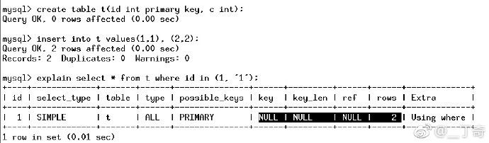
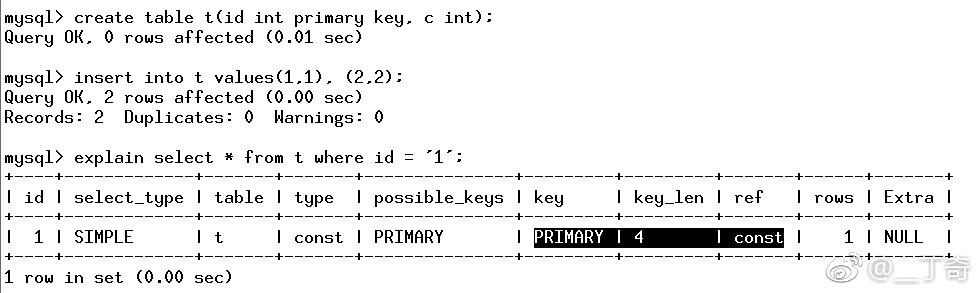
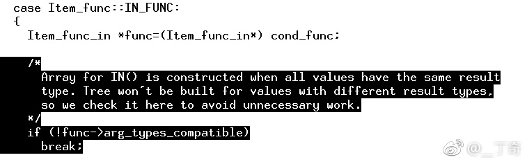

# MySQL · 最佳实践 · 一个“异常”的索引选择

**Date:** 2017/12
**Source:** http://mysql.taobao.org/monthly/2017/12/06/
**Images:** 4 images downloaded

---

数据库内核月报

 [
 # 数据库内核月报 － 2017 / 12
 ](/monthly/2017/12)

 * 当期文章

 MySQL · 引擎特性 · InnoDB 事务系统
* MySQL · 引擎特性 · Innodb 锁子系统浅析
* MySQL · 特性分析 · LOGICAL_CLOCK 并行复制原理及实现分析
* PgSQL · 源码分析 · AutoVacuum机制之autovacuum launcher
* MSSQL · 最佳实践 · SQL Server备份策略
* MySQL · 最佳实践 · 一个“异常”的索引选择
* PgSQL · 内核开发 · 利用一致性快照迁移你的数据
* PgSQL · 应用案例 · 手机行业分析、决策系统设计-实时圈选、透视、估算
* MySQL · 最佳实践 · 如何索引JSON字段
* MySQL · myrocks · 相关tools介绍

 ## MySQL · 最佳实践 · 一个“异常”的索引选择 
 Author: dingqi 

 ## 背景
在处理一个用户性能问题的时候, 发现有一个全表扫描语句, 上下文如下: 这是很奇怪的,

**Tips: MySQL在执行条件判断时,若参数类型与字段类型不匹配, 则会作类型转换, 符合转换规则的, 转换完成后可以利用索引**

而当参数为字符串,字段类型为整型时, 这个转换是成立的, 比如这个case. 

因此我们有必要查一下是什么原因.

## 分析
在优化器执行流程中, 要选择索引, 需要先判断where的部分的条件操作能否使用索引.经典的有,

**Tips: 在字段上作函数操作,是无法使用索引的. 比如 where c+1 = 10**

因此怀疑是在判断过程出了什么岔子.

调用栈 `mysql_select->mysql_execute_select->JOIN::optimize->get_quick_record_count->SQL_SELECT::test_quick_select->get_mm_tree->get_full_func_mm_tree->get_func_mm_tree`

一路下来都是预期内调用,直到 get_func_mm_tree返回了 NULL, 表示这个语句无法使用索引.

然后我们发现了这样一段代码,
 

简单说,就是在IN的入口有一个判断, 如果in中的字段类型不兼容, 则认为不可使用索引.
 而这个arg_types_compatible 的赋值逻辑是:` if (type_cnt == 1) arg_types_compatible = TRUE;`
 也就是说,当IN列表中出现超过一个字段类型时, 就认为类型不兼容.

这个本来是一个优化操作, 提前判断避免额外的后续判断.

## **对照实验**
至此,我们就清楚, 问题来自于IN和列表中的类型问题.
 以下几个对照试验可以作为验证:

` where id in (‘1’, ‘1’) 可以使用索引`

` where id = ‘1’ or id = 1 可以使用索引`

## 是不是bug?
如果把他当作bug处理,只需要在get_func_mm_tree函数中去掉上述最后一个图中的判断逻辑即可, 有兴趣的读者可以自己注释后验证.

前面的用户场景使用的是5.6,作为验证,我们测试了5.7版本,结果发现,**5.7中可以相同的语句序列使用此索引!**

翻了代码发现果然是去掉了这个判断.

但有趣的是, 官方并不是为了解决这个问题而作的修改, 实际上是在支持(a,b) in (X, Y)这样的语法时,由于这个语句就不能要求XY必须相同类型,因此去掉了这个判断, “阴差阳错”把这个问题改过来了.

翻了下commit log, 发现在5.7.3修复的, 因5.7.3之后,文章开头的这个例子的优化器结果就变了.

## 更多
所以我们看到, 实际上即使是小版本, 也是可能改变程序行为的.

而版本更新,尤其是要使用官方最新版本的特性, 有时候是必须作程序升级的.

而即使是小版本号的不同, 也可能对业务造成影响.

上述这个需求和现状,其实是有矛盾的, 运维的同学们可以考虑下, 如何处理这种潜在风险呢?

 阅读： - 

本作品采用[知识共享署名-非商业性使用-相同方式共享 3.0 未本地化版本许可协议](http://creativecommons.org/licenses/by-nc-sa/3.0/)进行许可。

 