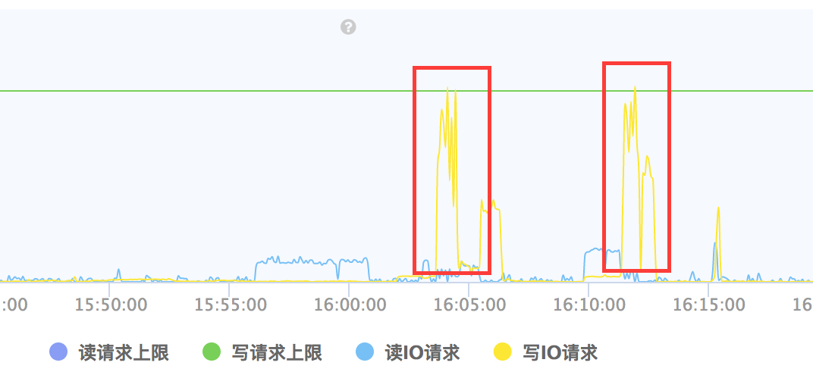

# MySQL · 案例分析 · RDS MySQL线上实例insert慢常见原因分析

**Date:** 2018/09
**Source:** http://mysql.taobao.org/monthly/2018/09/07/
**Images:** 2 images downloaded

---

数据库内核月报

 [
 # 数据库内核月报 － 2018 / 09
 ](/monthly/2018/09)

 * 当期文章

 MySQL · 引擎特性 · B+树并发控制机制的前世今生
* MySQL · 源码分析 · Innodb缓冲池刷脏的多线程实现
* MySQL · 引擎特性 · IO_CACHE 源码解析
* MySQL · RocksDB · Memtable flush分析
* MSSQL · 最佳实践 · 使用非对称秘钥实现列加密
* MongoDB · 引擎特性 · MongoDB索引原理
* MySQL · 案例分析 · RDS MySQL线上实例insert慢常见原因分析
* Redis · 引擎特性 · 基于 LFU 的热点 key 发现机制
* MySQL · myrocks · collation 限制
* PgSQL · 应用案例 · PostgreSQL 图像搜索实践

 ## MySQL · 案例分析 · RDS MySQL线上实例insert慢常见原因分析 
 Author: xianyong 

 ## 概述

insert慢是经常被问到的问题，笔者尝试在本文中对这个问题做一个分类梳理，列举的线上例子会做简化，希望对读者有所启发。
注意：因为阿里云MySQL线上实例还是以RDS 5.6为主体，本文的分析也是以5.6 innodb 引擎为主，其他版本的rds的实例可能略有差别。

## insert几个可能的性能瓶颈点

有关MySQL insert源码分析的文章，可以参看阿里云云栖社区的文章，例如：

1. 一条简单insert语句的调用栈
2. 一条insert语句的执行过程

基于insert源码分析，和MySQL事务的一般过程，可以看出insert语句执行过程中几个可能的瓶颈点，包括加锁，io和网络几个方面，

1. MDL锁， insert语句需要拿IX MDL 锁
2. 外键检查对主表加S行锁
3. insert转update操作需要的对老记录index entry的行锁
4. iops限制
5. 写binlog
6. semi-sync消息延迟

下面我们来看几个实际的例子，每个例子都会尽量和读者一起来分享一下根因定位方法和问题规避建议，

## insert语句慢示例分析

### MDL锁等待

MDL锁等待阻塞DML语句的问题比较常见，一般都是因为表上有运行时间比较长的DDL语句在运行，比如Optimize， Truncate table，Alter table等，诊断方法也很简单，
通过运行show processlist，就会看到被阻塞的语句的状态是 `Waiting for table metadata lock` ，如果权限足够的话，还可以看到blocker thread，
规避的方法是避免在业务高峰运行DDL语句，特别是耗时很长的对大表的DDL。

### 外键检查等待对主表记录的S锁

如果是insert的目标表有定义外键依赖，MySQL需要做参照完整性（RI）检查，会对主表的对应记录加S锁。如果主表记录上正好有没有提交的修改，就会带来insert事务的锁等待。
在笔者写这篇文章的时候，RDS的慢日志项目里面的lock time字段并没有清晰的反映这种因为RI带来的锁等待时间消耗。
在问题出现的当场，运行下面的query查看I_S表，找出阻塞关系。这种方法有其局限性，只能抓现行，如果阻塞已经消除了，后期就看不到了。

`SELECT
r.trx_id waiting_trx_id,
r.trx_mysql_thread_id waiting_thread,
r.trx_query waiting_query,
b.trx_id blocking_trx_id,
b.trx_mysql_thread_id blocking_thread,
b.trx_query blocking_query,
(Unix_timestamp() - Unix_timestamp(r.trx_started)) blocked_time
from information_schema.innodb_lock_waits w
inner join information_schema.innodb_trx b
on b.trx_id = w.blocking_trx_id
inner join information_schema.innodb_trx r
on r.trx_id = w.requesting_trx_id
`
阿里云MySQL RDS有计划会改进慢SQL lock time的记录，记录外键检查对主表记录S锁的等待时间； 另外，还会将所有发生过阻塞的thread的信息记录在内存表里，供后期问题排查使用。

外键检查对主表记录加锁慢的规避方法是加速释放主表的X行锁，避免长事务；或者是通过业务而不是MySQL数据库来保证参照完整性。

### insert转update操作需要拿老记录index entry上的S/X锁

如果新插入的记录项已经存在，但已经被标记为已删除，或者是使用了INSERT ON DUPLICATE KEY UPDATE, MySQL会将insert操作转成update操作。就会对老的index 项目加上X锁(如果是cluster
index对应的记录则加S锁)，来确保原有记录的删除/修改事务已经提交。

`------------------------
LATEST DETECTED DEADLOCK
------------------------
...
*** (1) TRANSACTION:
TRANSACTION 82234303407, ACTIVE 0.000 sec inserting
mysql tables in use 1, locked 1
LOCK WAIT 3 lock struct(s), heap size 1184, 2 row lock(s), undo log entries 1
LOCK BLOCKING MySQL thread id: 1275826132 block 1242176372
MySQL thread id 1242176372, OS thread handle 0x2abbbf103700, query id 30359943998 ... push_service update
INSERT INTO ... ON DUPLICATE KEY UPDATE ...
*** (1) WAITING FOR THIS LOCK TO BE GRANTED:
RECORD LOCKS space id 12214 page no 672677 n bits 264 index ... of table ... trx id 82234303407 lock_mode X waiting
Record lock, heap no 10 PHYSICAL RECORD: n_fields 4; compact format; info bits 0
...

*** (2) TRANSACTION:
TRANSACTION 82234303405, ACTIVE 0.001 sec inserting
mysql tables in use 1, locked 1
4 lock struct(s), heap size 1184, 3 row lock(s), undo log entries 1
INSERT INTO ... ON DUPLICATE KEY UPDATE ...
*** (2) HOLDS THE LOCK(S):
RECORD LOCKS space id 12214 page no 672677 n bits 264 index `...` of table ... trrx id 82234303405 lock_mode X
Record lock, heap no 10 PHYSICAL RECORD: n_fields 4; compact format; info bits 0
...

*** (2) WAITING FOR THIS LOCK TO BE GRANTED:
RECORD LOCKS space id 12214 page no 672677 n bits 264 index `...` of table ... trx id 82234303405 lock_mode X locks gap before rec insert intention waiting
Record lock, heap no 10 PHYSICAL RECORD: n_fields 4; compact format; info bits 0
...

*** WE ROLL BACK TRANSACTION (1)
`
上面是多条INSERT ON DUPLICATE KEY UPDATE并发执行导致的死锁，在master error log里面可以观测到。

这种问题的诊断可以通过查看慢日志的lock time字段来判断；如果发生了死锁，还可以查看master error log，也可类似MDL锁等待，从I_S表查看当前的阻塞关系。

### iops限制

笔者曾经遇到过insert作业时不时会变慢，但前端业务并没有什么高峰尖刺。后台分析可以看到用户binlog使用很重，大概每2分钟就会产生将近600M的binglog文件，依赖rds的系统诊断工具上也能观察到iops
打满的问题。

因为慢insert有明显的时间规律，怀疑有定期批处理。和客户沟通后，确认客户有设置event scheduler，每分钟会进行全表的数据归集操作，io压力比较大。后期让客户调整他们的数据归集逻辑后，insert慢的问题消失。

### 写binlog延迟

笔者还遇到一条insert语句一直没有成功返回, `show processlist`显示该条insert语句的状态是`query end`。笔者打印了当时的pstack信息，发现了如下的调用栈

`#0 0x0000003c00eab91d in nanosleep () from /lib64/libc.so.6
#1 0x0000003c00eab790 in sleep () from /lib64/libc.so.6
#2 0x00000000009967c6 in wait_for_free_space ()
#3 0x00000000009b29d9 in my_write ()
#4 0x000000000099a547 in my_b_flush_io_cache ()
#5 0x0000000000958892 in MYSQL_BIN_LOG::ordered_commit(THD*, bool, bool) ()
#6 0x0000000000959214 in MYSQL_BIN_LOG::commit(THD*, bool) ()
#7 0x000000000062c870 in ha_commit_trans(THD*, bool, bool) ()
#8 0x00000000008200e9 in trans_commit_stmt(THD*) ()
#9 0x000000000078aba1 in mysql_execute_command(THD*) ()
#10 0x00000000007910b0 in mysql_parse(THD*, char*, unsigned int, Parser_state*) ()
#11 0x0000000000792805 in dispatch_command(enum_server_command, THD*, char*, unsigned int) ()
#12 0x0000000000754535 in do_handle_one_connection(THD*) ()
#13 0x0000000000754589 in handle_one_connection ()
#14 0x0000003c01207851 in start_thread () from /lib64/libpthread.so.0
#15 0x0000003c00ee767d in clone () from /lib64/libc.so.6
`
这个调用栈很明显的说明了问题所在，就是binlog的磁盘没有剩余空间了，导致insert hang住。清理出足够的磁盘空间后，insert执行结束。

需要指出的是，MySQL 8.0增加了新的thread stage `WAITING FOR DISK`来提示等待磁盘空间，来辅助诊断，对应的commit id是’6de594adf488add4514884d18c337745b1d227fb’。

### semi-sync消息延迟

在有主备复制环境下，semi-sync消息延迟也可能导致insert变慢。笔者遇到一个慢insert，杜康慢日志显示此insert的执行时间正好是1秒。

查看master error log，发现在insert出现的时间点正好有这种信息

`...[Warning] Timeout waiting for reply of binlog (file: mysql-bin.000903, pos: 2519326), semi-sync up to file mysql-bin.000903, position 2519003.
`
而系统参数rpl_semi_sync_master_timeout也正好是1秒。因此，可以判定是因为网络抖动，semi-sync消息延迟导致的insert变慢。

## 总结

mysql insert语句执行慢的可能原因比较多，涵盖cpu，io，网络，锁等，在本文中分析了MySQL实例负载大，唯一键update、外键检查加锁带来的锁等待，semi-sync的网络开销，磁盘io限制，binlog日志满等导致的insert慢的问题。具体的原因需要具体分析，分析方法包括查看mysql已有的master-error log, slow log，另外，阿里云rds提供了强大的图形化工具包括我们查看系统负载曲线，慢日志详情，系统卡慢归总信息等，rds mysql内核团队有对定制系统诊断的能力，例如为慢日志添加更细的指标信息，包括锁等待时间等，并且也在一直加强对诊断问题缺失信息的补全，这些信息对于我们分析各种MySQL的性能问题都有很大的辅助。另外，保持MySQL版本的及时更新也是减少慢query或者是加快慢query诊断的推荐做法。

 阅读： - 

本作品采用[知识共享署名-非商业性使用-相同方式共享 3.0 未本地化版本许可协议](http://creativecommons.org/licenses/by-nc-sa/3.0/)进行许可。

 