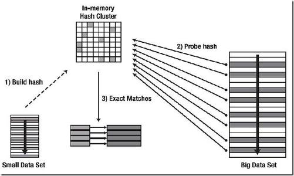

# MySQL · 新特征 · MySQL 哈希连接实现介绍

**Date:** 2019/11
**Source:** http://mysql.taobao.org/monthly/2019/11/02/
**Images:** 3 images downloaded

---

数据库内核月报

 [
 # 数据库内核月报 － 2019 / 11
 ](/monthly/2019/11)

 * 当期文章

 MySQL · 最佳实践 · 今天你并行了吗？---洞察PolarDB 8.0之并行查询
* MySQL · 新特征 · MySQL 哈希连接实现介绍
* MySQL · 最佳实践 · 性能分析的大杀器—Optimizer trace
* PgSQL · 未来特性调研 · TDE
* Database · 理论基础 · Multi-ART
* MySQL · 引擎特性 · RDS三节点企业版 一致性协议
* MySQL · 引擎特性 · RDS三节点企业版 Learner 只读实例

 ## MySQL · 新特征 · MySQL 哈希连接实现介绍 
 Author: yamin 

 ## 关键字
哈希连接, 火山模型，hash join，cost base optimizer（CBO），基于代价的优化器，nest-loop连接， build table， probe table，block nested loop（BNL）

## 摘要
本文将介绍一下MySQL的哈希连接设计与实现，包括MySQL在8.0.18版本中哈希连接实现的情况与限制。 同时作为内核月报，我们也会带领大家去看一看hash在MySQL中实现的一下比较详细的细节。

## 0. 哈希连接如何实现原理介绍
从MySQL 8.0.18开始，MySQL的执行引擎开始支持哈希连接这种多表连接的执行方式，哈希连接的支持对于MySQL执行引擎执行提供了更多的查询执行能力配套，因此后续在MySQL重构CBO优化器的时候，对于查询计划的选择提供了一个更多的一种可能性，同时nest-loop连接和哈希连接在不同场景下会有不一样的表现（如哈希连接特别适合在连接字段上没有索引的场景）。 后续我们可以对于MySQL的表现有一个比较大的期待。

好了，在开始写这篇月报前，网上简单搜索了一下关于MySQL Hash Join的文章，还真是很多介绍的文章。（包括官方和非官方相关的查询结果）

那我这篇内核月报，希望读者在阅读完之后能够获得一些怎样不一样的东西呢？因为本篇文章会发布在数据库内核月刊的公众号中，因此我会在介绍完哈希连接的一些概要信息之后（照顾到数据库经验不足的读者朋友们），将会带着读者更深入的了解MySQL哈希连接内部的一些事情。希望对有志加入数据库内核研发的读者有所帮助。

好的我们先来普及一下哈希连接的原理已经在MySQL数据库上真正实现哈希连接的时候我们会遇因为物理资源的限制而导致的了不同场景与不同的实现。

### 什么是哈希连接
哈希连接是一种执行连接的方法。如图2:（关于数据库连接的基础知识，本文就不做详细介绍，感兴趣的读者可以参看[3](#jump)）

图片来源www.2cto.com
如图2所示，要完成一个hash join算法实现需要三个步骤：

1. 选择合适的连接参与表作为内表（build table），构建hash表；
2. 然后使用另外一个表（probe table）的每一条记录去探测第一步已经构建完成的哈希表寻找符合连接条件的记录；
3. 输出匹配后符合需求的记录；

哈希连接根据内存是否能够存放的下hash表

### 经典哈希连接实现
经典哈希连接的主要特征是内存可以存放哈希连接创建的hash表。
经典哈希连接主要包括两部分：

* 选择参加连接的一个表作为哈希表候选表，扫描该表并创建哈希表；
* 选择另外一个表作为探测表，扫描每一行，在哈希表中找寻对应的满足条件的记录；
**特点：**
* 所有两个参加连接的表只需要被扫描一次；
* 需要整个哈希表都能够被存放在内存里面；
如果内存不能存放完整的哈希表，那么情况会变的比较复杂，一种解决方案如下：
 
 读取最大内存可以容纳的记录创建哈希表；
* 另外一张表对于本部分哈希表进行一次全量探测；
* 清理掉哈希表；
* 返回第一步重新执行，知道用于创建哈希表的表记录全部都被处理了一遍；
这种方案会导致用于探测的表会被扫描多次。

### 需要落盘哈希连接实现
因为经典哈希连接对于创建内存不能容纳的哈希表不友好，产生了另外一种算法就是可落盘的哈希算法。算法具体步骤如下：

1. 首先现使用哈希方法将参与连接的build table和probe table按照连接条件进行哈
希，将它们的数据划分到不同的磁盘小文件中去。这里小文件是经过计算的这些小的
build table可以全部读入并创建哈希表。
2. 当所有的数据划分完毕之后，按顺序加载每一组对应的build table和probe 
table的片段，进行一次经典哈希连接算法执行。因为每一个小片段都可以创建一个
能够完全被存放在内存中的哈希表。因此每一个片段的数据都只会被扫描一次。
** 注意：** 这里需要注意第一步划分数据的时候要防止数据倾斜。因为如果第一步划分分片数据不能划分好数据，可能会导致有的分区没用完用于创建哈希表的内存配额，而另外一些分区又放不下的尴尬情况。

## 1. MySQL的哈希连接实现
上面的部分都是用来普及一下哈希连接的基础知识，从现在开始我们将带大家去看看MySQL的hash join会是一个怎样的实现？

## 1.1. 选择哈希连接的标准
看到这个选择哈希连接的标准，很多读者可能会认为优化器根据哈希连接和nested-loop连接的性能比较来选择。在这里我要告诉大家，这个是MySQL hash join特征的最终目标，但是目前我们讲的标准是，在8.0.18这个版本，MySQL hash join启用的标准。

**“在MySQL 8.0.18版本下，优化器会仅仅简单的最大程度的替代Block Nested Loop方式执行为哈希连接执行。”**

* 每个连接当中，至少有一个等值连接条件；
* 在连接条件的两边出现的列都属于同一个表；
上面这个简单的标准就是当下哈希连接启动的标准。
实例：

` CREATE TABLE t1 (t1_1 INT, t1_2 INT);
 CREATE TABLE t2 (t2_1 INT, t2_2 INT)

 1) SELECT * FROM t1 JOIN t2 ON (t1.t1_1 = t2.t2_1);
 2) SELECT * FROM t1 JOIN t2 ON (t1.t1_1 = t2.t2_1 AND t1.t1_2 = t2.t2_2);
 3) SELECT * FROM t1 JOIN t2 ON (t1.t1_1 = t2.t2_1 AND t2.t2_2 > 43);
 4) SELECT * FROM t1 JOIN t2 ON (t1.t1_1 + t1.t1_2 = t2.t2_1);
 5) SELECT * FROM t1 JOIN t2 ON (FLOOR(t1.t1_1 + t1.t1_2) = CEIL(t2.t2_1 = 
t2.t2_2));
`
上面所有的t1和t2连接都会被启动哈希连接，

### 1.2. 当前哈希连接的限制
`SELECT * FROM t1 JOIN t2 ON (t1.col1 < t2.col1);
SELECT * FROM t1
 JOIN t2 ON (t1.col1 = t2.col1)
 JOIN t3 ON (t2.col1 < t3.col1);
`
上面两条查询都不会启动哈希连接执行，第一条查询因为没有等值连接条件；第二条查询因为t2和t3的连接没有等值连接条件使得整个查询都回退到原来的查询执行模式；

## 2.用户可干预的变化
MySQL用户可以通过三种手段来不同程度的干预MySQL哈希连接的选择与运行；

1. optimizer hint；
2. optimizer switch；
3. join_buffer_size调整；
用户可以通过optimizer hint和optimizer switch可以通知优化器是否采用哈希连接，join_buffer_size参数可以用来决定采用经典哈希连接实现还是需要落盘的哈希连接实现；
注意：当用户使用explain命令来观察哈希连接是否启动时，请选择 EXPLAIN FORMAT=tree 参数。

### Performance schema
哈希连接所使用来创建build table的内存使用情况全部记录在performance schema中。用户可以通过查询事件”memory/sql/hash_join”，in memory_summary_*:

`mysql> select * from memory_summary_global_by_event_name where event_name like "%hash_join%"\G
*************************** 1. row ***************************
 EVENT_NAME: memory/sql/hash_join
 COUNT_ALLOC: 139
 COUNT_FREE: 139
 SUM_NUMBER_OF_BYTES_ALLOC: 2577684
 SUM_NUMBER_OF_BYTES_FREE: 2577684
 LOW_COUNT_USED: 0
 CURRENT_COUNT_USED: 0
 HIGH_COUNT_USED: 27
 LOW_NUMBER_OF_BYTES_USED: 0
CURRENT_NUMBER_OF_BYTES_USED: 0
 HIGH_NUMBER_OF_BYTES_USED: 358580
1 row in set (0.00 sec)
`
如果哈希连接采用需落盘的方式执行，文件的使用信息在file_* 表中。所有的哈希连接创建的文件信息由事件”wait/io/file/sql/hash_join”跟踪；

`mysql> select * from file_summary_by_event_name where event_name like "%hash%"\G
*************************** 1. row ***************************
 EVENT_NAME: wait/io/file/sql/hash_join
 COUNT_STAR: 90
 SUM_TIMER_WAIT: 900042640
 MIN_TIMER_WAIT: 0
 AVG_TIMER_WAIT: 10000205
 MAX_TIMER_WAIT: 267632555
 COUNT_READ: 35
 SUM_TIMER_READ: 79219890
 MIN_TIMER_READ: 0
 AVG_TIMER_READ: 2263240
 MAX_TIMER_READ: 10019380
 SUM_NUMBER_OF_BYTES_READ: 271578
 COUNT_WRITE: 35
 SUM_TIMER_WRITE: 516922895
 MIN_TIMER_WRITE: 0
 AVG_TIMER_WRITE: 14769175
 MAX_TIMER_WRITE: 267632555
SUM_NUMBER_OF_BYTES_WRITE: 271578
 COUNT_MISC: 20
 SUM_TIMER_MISC: 303899855
 MIN_TIMER_MISC: 0
 AVG_TIMER_MISC: 15194860
 MAX_TIMER_MISC: 63246820
1 row in set (0.00 sec)
`
**优化小贴士：**

* 尽量使用大的join_buffer_size来避免使用落盘哈希连接方式；
* 确保哈希连接所打开的文件总数，小于max_open_files,避免因为哈希连接需要打开文件总数超过上限而导致查询执行终止；

## 3. 实现细节
从这部分开始，我们将更加深入到哈希连接实现的各个方面去给读者更为详细的设计与实现细节情况。

## 3.1 哈希功能
哈希功能是哈希连接算法的最最核心的部分。这部分被称作哈希策略使用

* 创建哈希表，MySQL选择了std::unordered_multimap作为哈希表的基础数据结构。这个是一个作为通用哈希表目的的一种实现；
 
 支持多值产生同一个哈希键；
* 支持哈希查找；
* 支持MySQL可以部署的所有操作系统平台；
使用xxHash64作为哈希函数，提供快速和高质量的hash服务；

### 3.2 划分数据与哈希表大小
哈希表的大小受join_buffer_size值的影响。 如果构建哈希表的时候达到了join_buffer_size所达到的上限；执行引擎将会将build表划分为多个分区。

`// Get the estimated number of rows produced by the join.
 const size_t rows_produced_by_join = QEP_TAB::->position()->prefix_rowcount;

 // Get how many rows we managed to put in the row buffer, and reduce it by a
 // given factor.
 const double reduction_factor = 0.9;
 const size_t rows_in_hash_table = row_buffer.Rows() * reduction_factor;

 // See how many rows we expect to find in the build input
 const size_t remaining_rows = rows_produced_by_join - rows_in_hash_table;

 // Finally, the number of files needed is the number of remaining rows divided
 // by the number of rows the row buffer can hold.
 const size_t files_needed = remaining_rows / rows_in_hash_table;
`
注意：这里有一个”reduction factor” 参数，将它设置为0.9使得，这个参数使得我们能够将内存中的哈希表完成的保存到文件，并能够顺利的读取回内存当中。如果这种哈希MySQL的选择是宁可多分配一些文件，来避免因为哈希表不能一次加载到内存导致的需要扫描两次probe table数据。

### 3.3 引入的新数据结构和函数
这一部分我们来介绍因为哈希连接特征，引入的数据结构。
###3.3.1 HashJoinRowBuffer 
HashJoinRowBuffer类是用来管理在内存哈希表中BufferRows。 HashJoinRowBuffer保存了因为创建哈希表而读入的行加上从连接条件中提取的hash键值。所有的内存都是从MEM_ROOT上分配，并在row buffer内部管理；

**该类提供的接口**

`HashJoinRowBuffer(const TableCollection &tables, size_t max_mem_available);
//Construct a row buffer that will hold the data given by "tables", and at most "max_mem_available" bytes of data.
bool Init(std::uint32_t hash_seed);
//Initialize the row buffer with the given seed to be used in the xxHash64 hashing.
void Clear(std::uint32_t hash_seed);
//Clears the row buffer of all data.
StoreRowResult StoreRow(const std::vector<Item_func_eq *> &join_conditions);
//Store the rows that currently lies in the tables' record buffers, where the key is extracted from the given join conditions.
void LoadRange(const Key &key);
//Prepare the row buffer for reading, by loading all rows that matches the given key.
bool Next();
//Get the next matching row in the row buffer.
BufferRow *GetCurrentRow() const;
//Return a pointer to the current matching row
`

#### 3.3.2 BufferRow
BufferRow类用来存储一行记录的所有数据，它按照记录格式使用指针和长度来标记记录中的字段，记录的各个字段被存放在一段连续分配的内存当中，这样可以非常方便的写入文件。 这个类使用Field::pack() 方法提取数据并包装成对应的数据存储起来，使用Field::unpack()提取和恢复数据到字段。

**该类提供的接口**

`bool StoreFromTableBuffers(const TableCollection &tables, MEM_ROOT *mem_root);
//Takes the row that currently lies in the tables record buffers and store it in this object. The data is allocated on the supplied MEM_ROOT.
void LoadIntoTableBuffers(const TableCollection &tables);
//Takes the data in this object and puts it back to the tables record buffer.
const uchar *data() const;
//Returns a pointer to the data
size_t data_length() const;
//Returns the length of the data.
`

#### 3.3.3 HashJoinChunk
HashJoinChunk类代表一个磁盘文件，用来存储行的。内部该类使用IO_CACHE结构来从磁盘读/写数据。

**该类提供的接口**

`bool Init(size_t file_buffer_size);
// Initialize the chunk file, and set the IO_CACHE with a buffer size of "file_buffer_size"
ha_rows num_rows() const;
// Return the number of rows that this chunk file holds
bool WriteRowToChunk(const hash_join_buffer::TableCollection &tables);
// Write the row that lies in the tables' record buffer out to this chunk file.
void PositionFile(ha_rows row_index);
// Position the chunk file for read at the given row index.
bool PutNextRowInTableBuffers(const hash_join_buffer::TableCollection &tables);
// Take the row that the chunk file is positioned at and put it back to the tables' record buffer. The file position is advanced by one row.
bool PrepareForRead();
// Flush all the file contents to disk. This must be called after we are done writing out data to the chunk file.
`

#### 3.3.4 HashJoinIterator
增加一个HashJoinIterator类，HashJoinIterator由两个迭代器构成，分别是左输入和右输入。左输入迭代器代表build哈希表，右输入迭代器代表探测表迭代器；

### 3.4 增加哈希连接迭代器到迭代器引擎系统
哈希连接只使用新的迭代器执行引擎。当优化器构建迭代器树时，每当遇到BNL会调用JOIN_CACHE::can_be_replaced_with_hash_join() 来判断是否能够启用哈希连接。当can_be_replaced_with_hash_join()发现至少一个符合条件的等值连接条件，则返回true，当发现有不满足条件的连接，MySQL将会回退到原生的迭代器。
当所有的连接通过函数ConnectJoins()函数构造完成后，我们将所有等值连接条件发送到哈希连接迭代器。 任何不能在哈谢迭代器执行的条件将会放在哈希连接迭代器后应用。
##4. 总结
本文通过对与MySQL 8.0.18新支持的哈希连接的介绍，让MySQL的开发人员可以更加了解哈希连接是如何设计与实现的。目前优化MySQL研发团队正在实现火山模型的查询执行引擎，后续等火山模型实现完成后，MySQL研发团队会重新构建一个基于代价的优化器。到了那个时候哈希连接的启用与否将会成为优化器构建的一种原生选择。

### 5. 参考
* 1. hash join in MySQL 8
* 2. Hash Join Optimization
* 3.多表连接的三种方式详解 hash join、merge join、 nested loop

 阅读： - 

本作品采用[知识共享署名-非商业性使用-相同方式共享 3.0 未本地化版本许可协议](http://creativecommons.org/licenses/by-nc-sa/3.0/)进行许可。

 