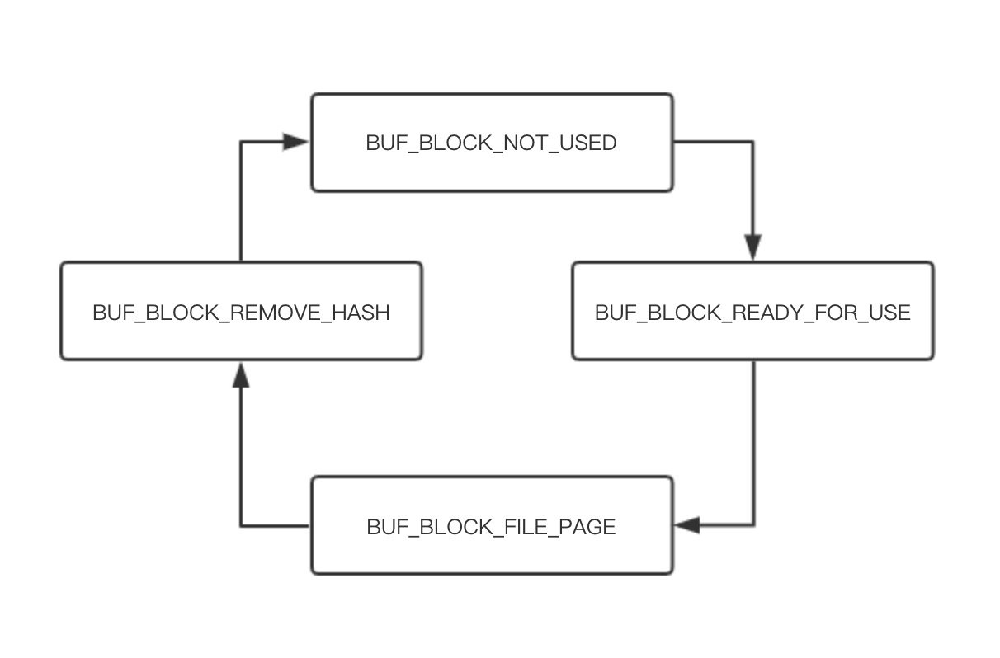

# MySQL · 引擎特性 · InnoDB Buffer Pool 浅析

**Date:** 2020/02
**Source:** http://mysql.taobao.org/monthly/2020/02/02/
**Images:** 2 images downloaded

---

数据库内核月报

 [
 # 数据库内核月报 － 2020 / 02
 ](/monthly/2020/02)

 * 当期文章

 MySQL · 引擎特性 · 庖丁解InnoDB之REDO LOG
* MySQL · 引擎特性 · InnoDB Buffer Pool 浅析
* MySQL · 最佳实践 · RDS 三节点企业版热点组提交
* MySQL · 引擎特性 · 8.0 heap table 介绍
* MySQL · 存储引擎 · MySQL的字段数据存储格式
* MySQL · 引擎特性 · MYSQL Binlog Cache详解

 ## MySQL · 引擎特性 · InnoDB Buffer Pool 浅析 
 Author: muxing 

 ## Buffer Pool简介

InnoDB中的数据访问是以Page为单位的，每个Page的大小默认为16KB，Buffer Pool是用来管理和缓存这些Page的。InnoDB将一块连续的内存大小划分给Buffer Pool来使用，并将其划分为多个Buffer Pool Instance来更好地管理这块内存，每个Instance的大小都是相等的，通过算法保证一个Page只会在一个特定的Instance中，划分为多个Instance的模式提升了Buffer Pool的并发性能。

在每一个Buffer Pool Instance中，实际都会维护一个自己的Buffer Pool模块，InnoDB通过16KB Page的方式将数据从文件中读取到Buffer Pool中，并通过一个LRU List来缓存这些Page，经常访问的Page在LRU List的前面，不经常访问的Page在后面。InnoDB访问一个Page时，首先会从Buffer Pool中获取，如果未找到，则会访问数据文件，读取到Page，并将其put到LRU List中，当一个Instance的Buffer Pool中没有可用的空闲Page时，会对LRU List中的Page进行淘汰。

由于Buffer Pool中夹杂了很多Page压缩的逻辑，即将实际的16KB Page压缩为8KB、4KB、2KB、1KB，这块逻辑暂时先跳过不去做分析，我们先按照默认Page就是16KB的逻辑来梳理Buffer Pool相关的逻辑。

## 主要组件介绍

#### Buffer Pool Instance：

InnoDB启动时会加载配置srv_buf_pool_size和srv_buf_pool_instances，分别是Buffer Pool总大小和需要划分的Instance数量，当srv_buf_pool_size小于1G时，srv_buf_pool_instances会被重置为1，单个Buffer Pool Instance的大小计算规则为：*size=srv_buf_pool_size/srv_buf_pool_instances*，每个Buffer Pool Instance的大小均相等。在Mysql 8.0中，最大支持64个Buffer Pool Instance，实际Instance在初始化时，为了加快分配速度，会根据运行环境进行调整并行初始化的数量，详细流程见Buffer Pool初始化。

在每个Buffer Pool Instance中都有包含自己的锁，mutex，Buffer chunks，各个页链表（如下面所介绍），每个Instance之间都是独立的，支持多线程并发访问，且一个page只会被存放在一个固定的Instance中，后续会详细介绍这个算法。

在每个Buffer Pool Instance中还包含一个page_hash的hash table，通过这个page_hash能快速找到LRU List中的page，避免扫描整个LRU List，极大提升了Page的访问效率。

#### Buffer chunks：

Buffer chunks是每个Buffer Pool Instance中实际的物理存储块数组，一个Buffer Pool Instance中有一个或多个chunk，每个chunk的大小默认为128MB，最小为1MB，且这个值在8.0中时可以动态调整生效的。每个Buffer chunk中包含一个buf_block_t的blocks数组（即Page），Buffer chunk主要存储数据页和数据页控制体，blocks数组中的每个buf_block_t是一个数据页控制体，其中包含了一个指向具体数据页的*frame指针，以及具体的控制体buf_page_t，后面在数据结构中详细阐述他们的关系。

#### 页链表：

以下所有的链表中的每个节点都是数据页控制体（buf_page_t）。

* **Free List：**如其名，Free List中存放的都是未曾使用的空闲Page，InnoDB需要Page时从Free List中获取，如果Free List为空，即没有任何空闲Page，则会从LRU List和Flush List中通过淘汰旧Page和Flush脏Page来回收Page。在InnoDB初始化时，会将Buffer chunks中的所有Page加入到Free List中。
* **LRU List：**所有从数据文件中新读取进来的Page都会缓存在LRU List，并通过LRU策略对这些Page进行管理。LRU List实际划分为Young和Old两个部分，其中Young区保存的是较热的数据，Old区保存的是刚从数据文件中读取出来的数据，如果LRU List的长度小于512，则不会将其拆分为Young和Old区。当InnoDB读取Page时，首先会从当前Buffer Pool Instance的page_hash查找，并分为三种情况来处理：

 如果在page_hash找到，即Page在LRU List中，则会判断Page是在Old区还是Young区，如果是在Old区，在读取完Page后会把它添加到Young区的链表头部
* 如果在page_hash找到，并且Page在Young区，需要判断Page所在Young区的位置，只有Page处于Young区总长度大约1/4的位置之后，才会将其添加到Young区的链表头部
* 如果未能在page_hash找到，则需要去数据文件中读取Page，并将其添加到Old区的头部
* **Flush List：**所有被修改过且还没来得及被flush到磁盘上的Page（脏页），都会被保存在这个链表中。所有保存在Flush List上的数据都会在LRU List中，但在LRU List中的数据不一定都在Flush List中。在Flush List上的每个Page都会保存其最早修改的lsn，即oldest_modification，虽然一个Page可能被修改多次，但只记录最早的修改。Flush List上的Page会按照其各自的oldest_modification进行降序排序，链表尾部保存oldest_modification最小的Page，在需要从Flush List中回收Page时，从尾部开始回收。

#### Mutex：

为保证各个页链表访问时的互斥，Buffer Pool中提供了对几个List的Mutex，如LRU_list_mutex用来保护LRU List的访问，free_list_mutex用来保护Free List的访问，flush_list_mutex用来保护Flush List的访问。

#### Page_hash：

在每个Buffer Pool Instance中都会包含一个独立的Page_hash，其作用主要是为了避免对LRU List的全链表扫描，通过使用space_id和page_no就能快速找到已经被读入Buffer Pool的Page。

## Buffer Pool代码分析

初步了解了Buffer Pool在InnoDB中扮演的角色后，接下来我们从以下几个方面来探讨一下在Mysql 8.0中InnoDB Buffer Pool的具体实现：

* **Buffer Pool 数据结构**
* **Buffer Pool 初始化**
* **Buffer Pool 读取和写入**
* **页链表的访问**

### Buffer Pool 数据结构

Buffer Pool主要包含三个核心的数据结构buf_pool_t、buf_block_t和buf_page_t，其定义都在include/buf0buf.h中，分别看一下其具体实现：

`struct buf_pool_t { //保存Buffer Pool Instance级别的信息
 ...
 ulint instance_no; //当前buf_pool所属instance的编号
 ulint curr_pool_size; //当前buf_pool大小
 buf_chunk_t *chunks; //当前buf_pool中包含的chunks
 hash_table_t *page_hash; //快速检索已经缓存的Page
 UT_LIST_BASE_NODE_T(buf_page_t) free; //空闲Page链表
 UT_LIST_BASE_NODE_T(buf_page_t) LRU; //Page缓存链表，LRU策略淘汰
 UT_LIST_BASE_NODE_T(buf_page_t) flush_list; //还未Flush磁盘的脏页保存链表
 BufListMutex XXX_mutex; //各个链表的互斥Mutex
 ...
}
`

```
struct buf_block_t { //Page控制体
 buf_page_t page; //这个字段必须要放到第一个位置，这样才能使得buf_block_t和buf_page_t的指针进行 转换
 byte *frame; //指向真正存储数据的Page
 BPageMutex mutex; //block级别的mutex
 ...
}

```

```
class buf_page_t {
 ...
 page_id_t id; //page id
 page_size_t size; //page 大小
 ib_uint32_t buf_fix_count; //用于并发控制
 buf_io_fix io_fix; //用于并发控制
 buf_page_state state; //当前Page所处的状态，后续会详细介绍
 lsn_t newest_modification; //当前Page最新修改lsn
 lsn_t oldest_modification; //当前Page最老修改lsn，即第一条修改lsn
 ...
}

```

主要的三个数据结构就都已经罗列在上面了，还有个比较重要的buf_page_state，这是一个枚举类型，标识了每个Page所处的状态，在读取和访问时都会对应不同的状态转换，接下来我们简单看一下：

`enum buf_page_state {
 BUF_BLOCK_POOL_WATCH, //看注释是给Purge使用的，先不关注
 BUF_BLOCK_ZIP_PAGE, //压缩Page状态，暂略过
 BUF_BLOCK_ZIP_DIRTY, //压缩页脏页状态，暂略过
 BUF_BLOCK_NOT_USED, //保存在Free List中的Page
 BUF_BLOCK_READY_FOR_USE, //当调用到buf_LRU_get_free_block获取空闲Page，此时被分配的Page就处于 这个状态
 BUF_BLOCK_FILE_PAGE, //正常被使用的状态，LRU List中的Page都是这个状态
 BUF_BLOCK_MEMORY, //用于存储非用户数据，比如系统数据的Page处于这个状态
 BUF_BLOCK_REMOVE_HASH //在Page从LRU List和Flush List中被回收并加入Free List时，需要先从 Page_hash中移除，此时Page处于这个状态
};
`

在不考虑压缩Page的情况下，buf_page_state的状态转换一般为：



### Buffer Pool 初始化

要说起Buffer Pool的初始化，就不得不先提到InnoDB的启动流程，我们首先从srv/srv0start.cc的srv_start函数看起，这里是整个InnoDB启动的地方。

`srv_start()->buf_pool_init(srv_buf_pool_size, srv_buf_pool_instances){//初始化Buffer Pool
 const ulint size = total_size / n_instances; //计算单个instance的大小
 buf_pool_ptr =
 (buf_pool_t *)ut_zalloc_nokey(n_instances * sizeof *buf_pool_ptr); //初始化buf_pool_t 数组
 #ifdef UNIV_LINUX //该宏定义主要为了加快Buffer Pool的并行初始化
 ulint n_cores = sysconf(_SC_NPROCESSORS_ONLN);
 if (n_cores > 8) {
 n_cores = 8; //Linux环境下最大并行度为8个
 }
 #else
 ulint n_cores = 4; //其他环境最大并行度为4个
 #endif /* UNIV_LINUX */
 
 //循环初始化Instance
 for (i = 0; i < n_instances; ) {
 ulint n = i + n_cores;
 if (n > n_instances) { //判断初始化最大并行度是否超过n_instances
 n = n_instances;
 }

 std::vector<std::thread> threads;

 std::mutex m;
 //并行创建Instance，调用buf_pool_create()函数
 for (ulint id = i; id < n; ++id) {
 threads.emplace_back(std::thread(buf_pool_create, &buf_pool_ptr[id], size,
 id, &m, std::ref(errs[id])));
 }
 i = n; //从n开始继续初始化
 ...
 }
} 
`

在buf0buf.cc::buf_pool_create()函数中会完成对Buffer Pool Instance的初始化，主要是Buffer Chunks的初始化，即调用buf_chunk_init()函数：

`buf_pool_create()->buf_chunk_init(){
 ...
 //分配内存，默认每个chunk的大小为128M，默认通过mmap来分配
 chunk->mem = buf_pool->allocator.allocate_large(mem_size, &chunk->mem_pfx);
 //从内存的头部开始分配block控制信息
 chunk->blocks = (buf_block_t *)chunk->mem;
 //frame是指向实际Page的指针，需要将其通过UNIV_PAGE_SIZE对齐，此时frame也指向内存区域的头部
 frame = (byte *)ut_align(chunk->mem, UNIV_PAGE_SIZE);
 //计算出该chunk能分配出多少个Page，
 chunk->size = chunk->mem_pfx.m_size / UNIV_PAGE_SIZE - (frame != chunk->mem);
 ulint size = chunk->size;
 /*
 一个Page包含一个的16KB的Page和一个对应的控制信息（buf_block_t），一个buf_block_t对应一个Page
 所有的Page页面都是连续在一起存储的组成了Page区，buf_block_t也是连续存储的组成了控制信息区
 控制信息区处于这块内存的前半部分，Page区域位于后半部分
 为了更容易理解这个循环所做的事情，我们先理一理思路
 如何把一块连续的内存分为两个区域，即控制信息区和Page区，且每个Page必须要有一个对应的buf_block_t 我们把整个连续内存拆分为一个个16KB大小的Page，然后把其中第一个Page用于存储所有的buf_block_t
 如果buf_block_t的数量太多导致第一个Page放不下，则需要把第二个Page也用于存储buf_block_t
 依次类推，每使用一个Page页用于存储buf_block_t，那么chunk的Page size就要减1
 frame是一个指向Page页的指针，它从chunk的头部出发，当有足够的空间用于存储buf_block_t， 即frame的地址大于整个buf_block_t控制信息需要的总长度，就会跳出While循环
 反之，空间不足则需要再花费一片Page，同时size--
 这样的分配模式能减少内存碎片的产生，能提高内存的使用率
 */
 while (frame < (byte *)(chunk->blocks + size)) {
 frame += UNIV_PAGE_SIZE;
 size--;
 }
 //最终获得的size是准确的Page数量
 chunk->size = size;
 
 block = chunk->blocks;
 //循环初始化所有的控制信息buf_block_t和Page
 for (i = chunk->size; i--;) {
 //初始化控制信息buf_block_t，并将其frame指针指向对应的Page地址
 buf_block_init(buf_pool, block, frame);
 UNIV_MEM_INVALID(block->frame, UNIV_PAGE_SIZE);
 //把所有的空闲Page添加到Buffer Pool Instance的Free List中
 UT_LIST_ADD_LAST(buf_pool->free, &block->page);
 //标记当前控制信息buf_block_t所指向的Page是在Free List中
 ut_d(block->page.in_free_list = TRUE);
 ut_ad(buf_pool_from_block(block) == buf_pool);
 
 block++;
 //frame指针指向下一个Page
 frame += UNIV_PAGE_SIZE;
 }
 //互斥量lock
 if (mutex != nullptr) {
 mutex->lock();
 }
 //注册chunk
 buf_pool_register_chunk(chunk);
 //互斥量unlock
 if (mutex != nullptr) {
 mutex->unlock();
 }
 ...
}
`

### Buffer Pool 读取和写入

Buffer Pool的读取逻辑和写入逻辑是混合在一起的，InnoDB需要访问一个Page时，必须要通过Buffer Pool进行获取，主要需要以下几个步骤：

1. 获取Page对应的Buffer Pool Instance
2. 从对应的Buffer Pool Instance的Page_hash中查找是否存在该Page，如存在，直接返回该Page的地址，并可能需要修改LRU List中的数据
3. 如果未能查找到，则需要读取数据文件，并从Free List中申请新的Page将其添加到LRU List中

接下来我们围绕这个主题逻辑，来分析一下Buffer Pool 读取和写入流程，实际读取Page的函数为buf0buf.cc::buf_page_get_gen()：

`buf_page_get_gen(const page_id_t &page_id, //page id
 const page_size_t &page_size, ulint rw_latch,
 buf_block_t *guess, ulint mode, const char *file,
 ulint line, mtr_t *mtr,
 bool dirty_with_no_latch) {
 ... 
 /*
 这个mode代表了访问Page的不同模式，会有不同的动作发生在后续的读取和写入流程中
 BUF_GET_NO_LATCH:对Page是读取还是修改，都不加锁。
 BUF_GET:默认获取Page的方式，如果Page不在LRU List中，则从数据文件读取，如果已经在LRU List中， 需要判断是否要把他加入到Young区的头部和是否需要线性预读。如果是读取则加读锁，修改则加写锁。
 BUF_GET_IF_IN_POOL:只在Buffer Pool中查找，如果Page在LRU List中，判断是否要把它加入到加入到 Young区的头部和是否需要线性预读，如果不在则直接返回空。如果是读取则加读锁，修改则加写锁。
 BUF_PEEK_IF_IN_POOL:与BUF_GET_IF_IN_POOL类似，只是不去调整LRU List链表
 BUF_GET_IF_IN_POOL_OR_WATCH:purge线程使用，暂时跳过一下
 BUF_GET_POSSIBLY_FREED:这个先跳过...
 */
 //通过page_id获取Page对应的Buffer Instance
 buf_pool_t *buf_pool = buf_pool_get(page_id);
 /*
 page_no_t ignored_page_no = page_id.page_no() >> 6;
 page_id_t id(page_id.space(), ignored_page_no);
 ulint i = id.fold() % srv_buf_pool_instances;
 return (&buf_pool_ptr[i]);
 实际就是将page_no右移6位，并计算一个fold值，然后取模Buffer Pool Instance数量，拿到一个Index之 后，再从buf_pool_ptr数组中获取。其中page_no的后六位被移除，是为了保证一个extent的数据能被缓存到 同一个Buffer Pool Instance中，便于后面的预读操作。
 */
loop:
 //调用buf_page_hash_get_low()从Page_hash中获取block，即Page
 block = (buf_block_t *)buf_page_hash_get_low(buf_pool, page_id);
 if(block == NULL){
 //如果未能从Page_hash中找到该Page，即Page不在LRU List中，则调用buf_read_page()从文件中读取
 if (buf_read_page(page_id, page_size)) {
 //读取成功，触发随机预读
 buf_read_ahead_random(page_id, page_size, ibuf_inside(mtr));
 retries = 0;
 } else if (retries < BUF_PAGE_READ_MAX_RETRIES) {
 //不成功，且小于最大重试次数，则重试
 //默认最大重试次数为100次
 ++retries;
 DBUG_EXECUTE_IF("innodb_page_corruption_retries",
 retries = BUF_PAGE_READ_MAX_RETRIES;);
 } else {
 //重试100次之后还是失败，报告错误
 ...
 }
 //重新去LRU中获取 
 goto loop;
 }else{
 fix_block = block;
 }
 
 //根据Page的类型进行不同的操作
 switch (buf_block_get_state(fix_block)) {
 buf_page_t *bpage;
 //正常的在LRU中的Page
 case BUF_BLOCK_FILE_PAGE:
 bpage = &block->page;
 //如果该Page正处于被Flush的状态，是不能被返回的
 if (fsp_is_system_temporary(page_id.space()) &&
 buf_page_get_io_fix_unlocked(bpage) != BUF_IO_NONE) {
 buf_block_unfix(fix_block);
 os_thread_sleep(WAIT_FOR_WRITE);
 goto loop;
 }
 break;
 case BUF_BLOCK_ZIP_PAGE:
 case BUF_BLOCK_ZIP_DIRTY:
 ...
 
 }
 //mode类型除BUF_PEEK_IF_IN_POOL外，都会进行判断是否需要把Page插入Young区的头部
 if (mode != BUF_PEEK_IF_IN_POOL) {
 buf_page_make_young_if_needed(&fix_block->page);
 }
 
 //为除了BUF_GET_NO_LATCH以外的操作加锁
 switch (rw_latch) {
 //不加锁
 case RW_NO_LATCH:
 fix_type = MTR_MEMO_BUF_FIX;
 break;
 //RW锁
 case RW_S_LATCH:
 rw_lock_s_lock_inline(&fix_block->lock, 0, file, line);
 fix_type = MTR_MEMO_PAGE_S_FIX;
 break;
 //RW SX 锁
 case RW_SX_LATCH:
 rw_lock_sx_lock_inline(&fix_block->lock, 0, file, line);
 fix_type = MTR_MEMO_PAGE_SX_FIX;
 break;
 default:
 ut_ad(rw_latch == RW_X_LATCH);
 rw_lock_x_lock_inline(&fix_block->lock, 0, file, line);
 fix_type = MTR_MEMO_PAGE_X_FIX;
 break;
 }
 //mode类型不为BUF_PEEK_IF_IN_POOL，且Page的是第一次被访问，需要进行线性预读操作
 if (mode != BUF_PEEK_IF_IN_POOL && !access_time) {
 //触发线性预读操作
 buf_read_ahead_linear(page_id, page_size, ibuf_inside(mtr));
 }
 //返回Page的控制信息
 return (fix_block);
} 
`

其中未在Page_hash中找到Page，且mode不为BUF_GET_IF_IN_POOL时，需要调用buf0rea.cc::buf_read_page()区文件中读取Page。

`buf0rea.cc::buf_read_page(...)
 |->buf_read_page_low(...)
 |->buf_page_init_for_read(...) //初始化Page，实际会从Free List中获取空闲Page
 |->fil_io(...) //从文件中读取数据，并填充Page
`

至此，Buffer Pool的读写操作大致流程就分析完了，但细节性的页链表的访问，如LRU List和Flush List的管理和淘汰，以及关于随机预读和线性预读操作的部分，还需要分析一下。我们先从页链表的访问看起：

#### 页链表的访问:

获取一个新的Page，并对其完成初始化工作，以便于后续的fil_io(…)将从数据文件中读取到的数据填充到该Page，其中会涉及到从Free List中获取空闲Page，如果无空闲Page则需要对LRU List和Flush List进行淘汰操作，我们先从buf_page_init_for_read(…)函数看起：

`buf_page_init_for_read(){
 ...
 //核心函数，用于获取一个空闲的Page，其中可能会触发LRU List和Flush List的淘汰
 block = buf_LRU_get_free_block(buf_pool);
 //LRU_list_mutex进入互斥状态
 mutex_enter(&buf_pool->LRU_list_mutex);
 //初始化Page
 buf_page_init(buf_pool, page_id, page_size, block);
 //加入至LRU List中
 buf_LRU_add_block(bpage, TRUE /* to old blocks */);
 //LRU_list_mutex退出互斥状态
 mutex_exit(&buf_pool->LRU_list_mutex);
 ...
 return (bpage);
}
`

当Buffer Pool Instance去获取一个空闲Page时，大多数情况下都会直接从Free List中获取一个空闲Page直接返回，除非Free List是空的，则需要去进行回收LRU List和Flush List中的Page，在进行查找和回收Page时，在buf_LRU_get_free_block()函数中，定义了一个n_iterations，这个参数用于标识是第几次进行迭代获取空闲Page，当第一次来获取Page时，n_iterations为0，总共分为三种情况作处理，具体如下：

* **n_iterations = 0:**

 直接调用buf_LRU_get_free_only()函数从Free List中获取Page；
* 如果未Free List中获取到空闲Page，且try_LRU_scan设置为True，则开始扫描LRU List尾部的BUF_LRU_SEARCH_SCAN_THRESHOLD（默认为100）数量个Page，找到一个可以被回收的Page（即没有事务在使用这个Page），调用buf_LRU_free_page()函数回收Page，并将其加入到Free List中，然后再调用buf_LRU_get_free_only()函数从Free List中获取Page；
* 如果在上一步操作中还是未找到空闲Page，则尝试从LRU List的尾部Flush一个Page到数据文件中，调用buf_flush_single_page_from_LRU()来完成对Page的Flush，并将其加入到Free List中，然后再调用buf_LRU_get_free_only()函数从Free List中获取Page；
* 如果还是未找到空闲Page，则将n_iterations++，并重复1-3的步骤从最开始继续循环获取Page。
* **n_iterations = 1:**

 此时和**n_iterations = 0**的执行流程几乎是一样的，只是在扫描LRU List时是扫描整个链表而不是只扫描尾部的一部分了，其余流程完全一致。如果未找到则将n_iterations++，并重复**n_iterations = 0**中1-3的步骤从最开始继续循环获取Page。
* **n_iterations > 1:**

 此时和**n_iterations = 1**流程完全一致，只是会在在flush之前每次sleep 10ms。如果还是找不到空闲Page，则继续将n_iterations++，并重复**n_iterations = 0**中1-3的步骤从最开始继续循环获取Page。

 当n_iterations > 20时，会打印一条频繁获取不到空闲Page的log。

到此，Buffer Pool的介绍就暂时告一段落了，后续会继续尝试从源码的角度来剖析压缩Page相关的逻辑，敬请关注。

 阅读： - 

[](http://creativecommons.org/licenses/by-nc-sa/3.0/)
本作品采用[知识共享署名-非商业性使用-相同方式共享 3.0 未本地化版本许可协议](http://creativecommons.org/licenses/by-nc-sa/3.0/)进行许可。

 [

 ](#0)