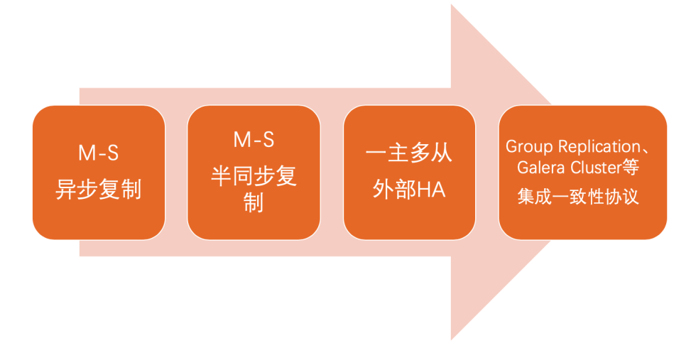
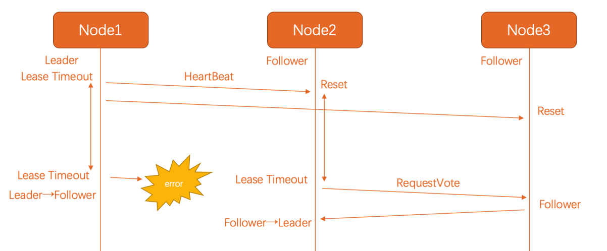
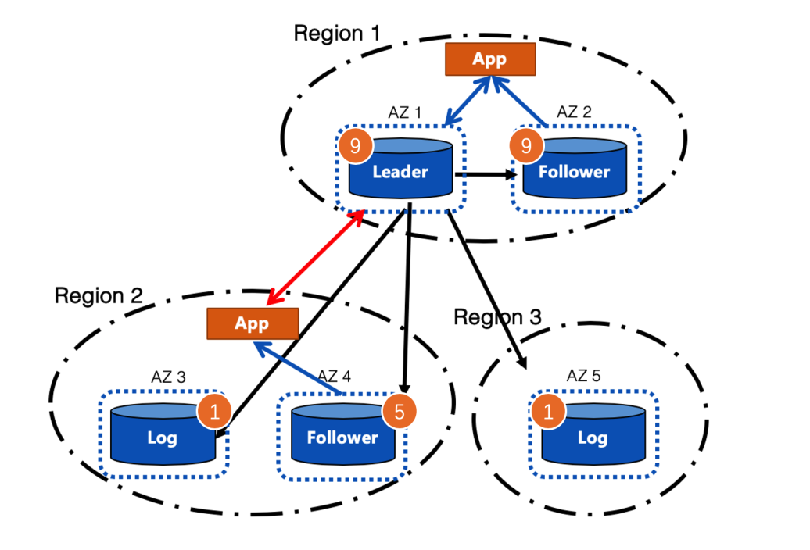
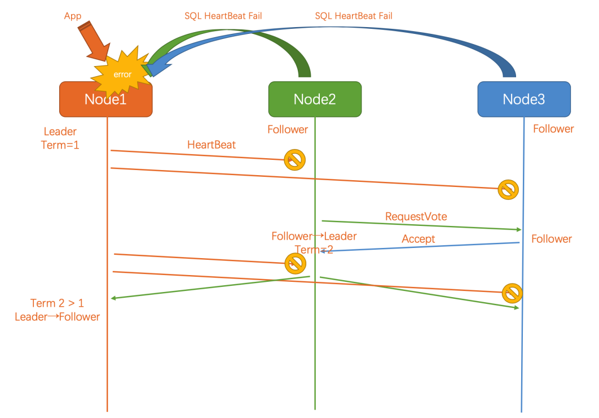

# MySQL · 产品特性 · RDS三节点企业版的高可用体系

**Date:** 2020/03
**Source:** http://mysql.taobao.org/monthly/2020/03/03/
**Images:** 7 images downloaded

---

数据库内核月报

 [
 # 数据库内核月报 － 2020 / 03
 ](/monthly/2020/03)

 * 当期文章

 MySQL · 引擎特性 · 8.0 Instant Add Column功能解析
* PgSQL · 引擎特性 · PostgreSQL 通信协议
* MySQL · 产品特性 · RDS三节点企业版的高可用体系
* AliSQL · 最佳实践 · Performance Agent
* MySQL · 内核分析 · InnoDB mutex 实现分析
* Database · 理论基础 · B link Tree
* MySQL · 引擎特性 · Latch 持有分析
* MySQL · 内核分析 · InnoDB 的统计信息
* MySQL · 引擎特性 · 排序实现
* PgSQL · 插件分析 · plProfiler

 ## MySQL · 产品特性 · RDS三节点企业版的高可用体系 
 Author: 甄平 

 ## 理解高可用问题

高可用（High Availability）是软件设计中的一个很古老的概念。高可用的问题由来已久，信息系统需要持续为用户提供服务，但是又要面对软硬件不可靠的事实。因此，一个优秀的高可用系统会通过组件的冗余来规避单点故障。当意外发生时，错误检测模块必须能够及时发现故障，并自动切换到备份系统，这个切换时间一般会要求在几秒或者几分钟之内完成。大家经常谈论的SLA、RPO、RTO，都是衡量高可用标准的计算方法，这里就不再赘述。

当前的时代背景，云计算逐渐成为水电煤气般的基础设施。对于数据库而言，高可用不仅仅是提供一个可以访问的SQL服务，还要保证数据的正确性和一致性。当前企业级客户对强一致、高可用数据库的需求越来越大，特别是金融、保险等业务场景。阿里云因此推出了RDS MySQL三节点企业版，提供极致的高可用方案。

## MySQL的高可用技术方案

首先我们简要回顾一下一些常见的MySQL高可用技术方案，整理一下各自的优缺点。

主备异步复制，当主库不可用的时候，可以切换到备库提供服务。由于是异步复制，可能存在备库比主库少数据的情况，相当于牺牲了数据一致性来保证可用性。

主备半同步复制，是异步复制的升级版。半同步要求主库binlog同步到备库之后，主库事务才允许提交。由于主备的网络延迟，主库的响应时间会有一定程度的受损。对于一主一备的半同步复制来说，如果备库不可用，主库要么暂停服务要么退化成异步复制。

由于一主一备半同步带来了备库可用性的问题，我们可以对备库再做一次冗余，采用一主多从的方案。该方案要求，binlog同步只要收到其中一个slave的ack，master即可提交事务，这就规避了单个备库不可用给主库带来的风险。但是当集群超过两个节点后，我们引入了一个新的挑战，如何保证只有一个master，以及如何保证所有slave都知道谁是master？所以还需要一个中心化的方案，即外部的HA模块，执行选主。然后我们会发现，为了解决一个问题，我们引入了一个新的问题，如何保证外部HA模块的高可用？比如像MHA，它自己也必须搭建成Master-Slave架构，有种跌入了递归深渊的感觉。为了更好地解决外部HA模块的高可用，一致性协议进入了视野，ZooKeeper方案应运而生，用一套ZooKeeper来管理HA，系统也变得越来越复杂。

实际上半同步复制技术也存在主备不一致的风险，原因在于当master将事务写入binlog，尚未传送给slave时master故障，应用切换到slave，虽然现在slave的事务与master故障前是一致的，但当主机恢复后，因最后的事务已经写入到binlog，所以在master上会恢复成已提交状态，从而导致主从之间的数据不一致。因此要做到强一致性，HA模块还要分析新老主库的binlog和relaylog，实现一系列复杂的回滚回补逻辑。

与其在外部HA这条路越走越远，不如把Paxos/Raft等一致性协议直接集成到MySQL内核中。Galera Cluster、MySQL Group Replication（MGR）等方案在社区中开始涌现出来。2016年，阿里巴巴数据库团队开始在集团内部沉淀一致性协议的实践经验。我们自研了一致性协议库X-Paxos并集成到AliSQL 5.7中，称之为X-Cluster。2017年第一年支持了双十一大促，此后开始大范围推广。经过2年的内部打磨，该版本改名三节点企业版在2019年7月正式上线公有云售卖。本文暂不比较三节点企业版和社区MGR等方案的优劣，下一章节会通过介绍我们的高可用体系，来说明即使数据库深度集成了一致性协议，依然存在很多挑战。

## RDS三节点的高可用体系

上一节列举了一些已有的MySQL高可用技术方案，可以看到各个方案对于高可用的理论标准越来越高。尽管不要求做到100%的高可用，这些方案都存在一些明显的问题。任何一个使用类似方案的架构，都有必要在此之上继续做一些缝缝补补。套用一句老话，“理想很丰满，现实很骨感”。总的来说，我们用冗余来保证故障容灾，同时又要在性能上和一致性上做权衡，必然要做出一些牺牲。很明显，高可用是一个高度依赖工程实践的问题。RDS三节点企业版，正是基于阿里巴巴丰富的业务场景实践，在社区MySQL的基础上，深入集成自研模块，打造出了一套完善可靠的高可用体系。

RDS三节点的高可用体系包含如下图的五大模块：

### 选举租约

文章[《RDS三节点企业版 一致性协议》](http://mysql.taobao.org/monthly/2019/11/06/)中我们讲了三节点企业版的核心模块：一致性协议。基于X-Paxos和AliSQL的集成，在100%兼容MySQL的基础上，实现了数据库的自动选主，日志同步，数据强一致，在线配置变更等功能。X-Paxos原理上是采用了unique proposer的Multi-Paxos方案。三节点的配置下，协议需要确保在同一时刻，只有一个Leader对外提供服务。

一般来说，基于Paxos/Raft等一致性协议的选主，都会采用租约（lease）的方案。选主最大的问题是要避免“双主”出现。如果当前Leader被网络隔离，其他节点在租约到期之后，会自动重新发起选主。而那个被隔离的Leader，发送心跳时会发现多数派节点不再响应，从而续租失败，解除Leader的状态，这也避免了“双Leader”现象出现。Follower约定在lease期间不发起新的选主，Leader先于Follower lease超时，从时序上最大程度上规避了“双主”问题的出现。不过实际上，从一致性协议角度来说，老主降级流程即使由于各种原因略微延后，也不会造成正确性的问题。比如Raft协议中，新主选出后，老主的term发起的提案是无法达成多数派的。避免“双主”本质上是为了尽快的通知外部Client主库已经变化，从而及时进行链路切换。

### 权重选主

权重选主理解上很简单，就是给每一个节点一个权重值，在主库不可用时，优先选取权重高的节点当新的主库。从实现上来说，权重是对Leader lease的一个微小修正，对于低权重的节点，每次会在lease原有timeout数值的基础上随机增加一个小的△t，权重越低，△t越大。基于这样的timeout策略，就可以保证在lease超时后，高权重的节点大概率会优先发起选主投票。权重选主主要应用在在三地五副本的场景下，在中心机房主库不可用时，我们希望优先切换到同城的另一个节点，来避免不必要的App跨城调用延迟。这样的设计既能保证高可用，也能保证高质量的服务。（三地五副本部署架构参考：[《RDS三节点企业版 一致性协议》](http://mysql.taobao.org/monthly/2019/11/06/)中跨域五副本一节）

这里要补充说明的是，分布式环境下的通信有很多不确定性，因此权重选主只是一个弱限制。在某些情况下依然可能选出一个低权重的节点当Leader，这并不影响整体系统的可用性。在实践过程中，我们发现目前的机制已经可以满足大部分的需求。

### 状态机诊断

从数据一致性角度来说，选主流程结束后，新的Leader必须回放完所有的老日志才能接受新的数据写入。因此，成功选主并不等价于服务可用，实际的不可用时间是选主时间（10s）和日志回放追平时间之和。三节点企业版在状态机应用日志的逻辑中，复用了MySQL的Slave和Worker线程，支持基于Table、Commit Order和Write Set三种模式的并行回放。在遇到大事务、DDL等场景下，和传统的Master-Slave复制模式一样，Follower可能会产生比较大的回放延迟。假如此时恰好主库出现故障，新选主的节点由于回放延迟，服务不可用时间充满了不确定性，那又如何保证SLA呢？

故障有可恢复和不可恢复之分，通过我们观察，除了那种机器宕机、磁盘坏块这类彻底恢复不了的场景，大部分故障都是短期的。比如网络抖动，一般情况下网络架构也是冗余设计的，可能过一小段时间链路就重新正常了。比如主库OOM、Crash等场景，mysqld_safe会迅速的重新拉起实例。恢复后的老主一定是没有延迟的，对于重启的场景来说，会有一个Crash Recovery的时间。这个时候，最小不可用时间变成了一个数学问题，到底是新主追回放延迟的速度快，还是老主恢复正常的速度快。因此，三节点企业版中，我们做了一个状态机诊断和主动切换的功能。

在三节点企业版的内核中，通过状态机诊断接口，服务层有能力向协议层汇报当前状态机的健康状况，包括回放延迟、Crash Recovery、系统负载等状态。当状态机健康状况影响服务可用性时，会尝试找一个更合适的节点主动切换出去。主动切换功能和权重选主也是深度整合的，在挑选节点的时候，也会考虑权重的信息。最终，服务恢复可用后诊断逻辑会自动停止，避免在稳定Leader的情况下产生不必要的切换。

### 磁盘探活

对于数据库这样有状态的服务来说，存储是影响可用性的重要因素之一。在本地盘部署模式下，数据库系统会遇到Disk Failure或者Data Corruption这样的问题。我们曾经遇到过这样的情况，磁盘故障导致IO卡住，Client完全无法写入新的数据。由于网络是连通状态，节点之前的选举租约可以正常维持，三节点自动容灾失效导致故障。有时候还会发生一些难以捉摸的事情，由于IO已经完全不正常了，进程在kernel态处于waiting on I/O的状态，无法正常kill，只有重启宿主机才能让节点间通信完全断掉触发选主。此外对于云服务的RDS来说，即使使用云盘等分布式存储，也有底层服务不可用的风险。

针对这类问题，我们实现了磁盘探活功能。对于本地盘，系统自动创建了一个iostate临时文件，定期向其中执行随机数据读写操作。对于云盘这类分布式存储，我们对接了底层的IO采样数据，定期来感知IO hang或者Slow IO的问题。探测失败次数达到某个阈值后，系统会第一时间断开协议层的网络监听端口，之后尝试重启实例。

### 反向心跳

基于已有的策略，我们已经可以覆盖99%的常规可用性问题。在长时间的线上实践中，我们发现有些问题从节点内部视角发现不了，比如主库连接数被占满，open files limit配置不合理导致“Too many open files”报错，以及代码bug导致的各种问题……对于这些场景，从选举租约、状态机、磁盘探活的角度，都无法正确的检测故障，因此最好有一个能从App视角去建连接、执行SQL、返回结果的全链路检测流程。因此催生了Follower反向心跳的需求，即Follower通过SQL接口去主动探测Leader的可用性。该设计有两个优势：首先是内核自封闭，借助三节点的其他非Leader节点，不依赖外部的HA agent进行选主判定，就不用再考虑HA agent本身的可用性问题；其次和内核逻辑深度整合，不破坏原有的选主逻辑。

整个流程如图所示，假设Node 1是Leader，给其他两个Follower正常发送心跳，但是对外的App视角已经不可服务。当Node 2和Node 3通过反向心跳多次尝试发现Leader的SQL接口不可服务之后，这两个Follower不再承认Leader发来的Heartbeat续租消息。之后若Node 2的选举权重相对较高，他会首先超时，并用新的term发起requestVote由Node 3投票选成主，对外开始提供服务。这个时候Node 2作为新主，也会同时开始给Node 1和Node 3发续租心跳。Node 1在收到新主发来的心跳消息之后，发现term比自己当前term大，就会主动降级成Follower。整个三节点又能回到正常的状态。

## 总结

本文从数据库面临的高可用问题入手，介绍了当前MySQL社区常用的技术架构。RDS三节点企业版基于长期业务实践的积累，建立了完善的自动容灾体系。通过对高可用技术的深度集成，在保证数据一致性的基础上，不仅能够为使用方提供及时的故障恢复，也解放了管控和运维。最后打一个广告，除了5.7，目前MySQL 8.0版本的三节点也已经在公有云上线，欢迎试用。

 阅读： - 

本作品采用[知识共享署名-非商业性使用-相同方式共享 3.0 未本地化版本许可协议](http://creativecommons.org/licenses/by-nc-sa/3.0/)进行许可。

 