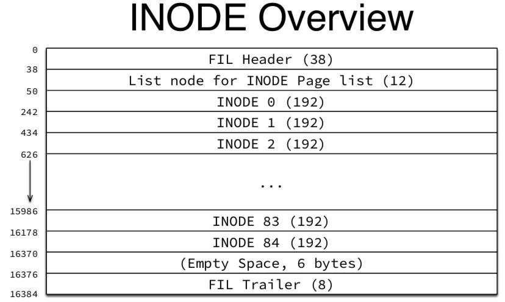

# MySQL · 引擎特性 · InnoDB 数据文件简述

**Date:** 2020/08
**Source:** http://mysql.taobao.org/monthly/2020/08/06/
**Images:** 7 images downloaded

---

数据库内核月报

 [
 # 数据库内核月报 － 2020 / 08
 ](/monthly/2020/08)

 * 当期文章

 MySQL · 引擎特性 · truncate table在大buffer pool下的优化
* MySQL · 引擎特性 · INNODB UNDO LOG分配
* MySQL · 内核特性 · Redo Logging动态开关
* MySQL · 引擎特性 · InnoDB Buffer Page 生命周期
* MySQL · 引擎特性 · InnoDB UNDO LOG写入
* MySQL · 引擎特性 · InnoDB 数据文件简述
* Database · 案例分析 · UTF8与GBK数据库字符集

 ## MySQL · 引擎特性 · InnoDB 数据文件简述 
 Author: $慕星 

 通常，我们在使用Mysql时，Mysql将数据文件都封装为了逻辑语义Database和Table，用户只需要感知并操作Database和Table就能完成对数据库的CRUD操作，但实际这一系列的访问请求最终都会转化为实际的文件操作，那这些过程具体是如何完成的呢，具体的Database和Table与文件的真实映射关系又是怎样的呢，下面笔者将通过对Mysql8.0 InnoDB引擎中的文件来剖析一下这个过程。

## InnoDB 文件简介

#### “.ibd”文件：

在InnoDB中，逻辑语义中的Database被转换为了一个独立的目录，也就是说不同Database的Table实际在物理存储时也是天然隔离的，需要关注的是一个很重要的配置项”innodb_file_per_table”，该参数控制在InnoDB中，是否将每个Table独立存储为一个单独的”.ibd”文件，在Mysql 8.0中该参数的默认值为True，即需要将每一个用户所创建的逻辑Table单独存储为一个”.ibd”文件，如果将该参数置为False的话，默认会将所有Table的数据放入同一个”.ibd”文件中，这种方式在多表场景中，在删除表之后回收空间等操作中会带来很大的不便，所以在正常使用中，更推荐使用每个Table单独存储为一个”.ibd”文件的方式。

#### TableSpace：

每个逻辑语义的Table在InnoDB中都被映射为了一个独立的TableSpace，具有唯一的Space_id，从Mysql8.0开始，所有的系统表也都使用InnoDB作为默认引擎，因此每个系统表，以及Undo也会有一个唯一的Space_ID来标识，而为了快速通过Space_id来识别具体的TableSpace类型，InnoDB特地按照不同的Space_id区段划分给了不同的TableSpace来使用：

`Table Space ID 分布
0x0 ： SYSTEM_TABLE_SPACE
0x1 ~ 0xFFF9E108: USER SPACE
0xFFF9E108 ~ 0xFFFFFB88: session temp table 
0xFFFFFF70 ~ 0xFFFFFFEF: undo tablespace ID
0xFFFFFFF0: redo log pseudo-tablespace
0xFFFFFFF1: checkpoint file space 
0xFFFFFFFD: innodb_temporary tablespace
0xFFFFFFFE: data dictionary tablespace
0xFFFFFFFF : invalid space
`

#### “.ibd” 文件结构：

众所周知，InnodDB采用Btree作为存储结构，当用户创建一个Table的时候，就会根据显示或隐式定义的主键构建了一棵Btree，而构成Btree的叶子节点被称为Page，默认大小为16KB，每个Page都有一个独立的Page_no。在我们对数据库中的Table进行修改时，最终产生的影响都是去修改对应TableSpace所对应的Btree上的一个或多个Page。这中间还涉及到BufferPool的联动，Page的修改都是在Buffer Pool中进行的，当Page被修改后，即被标记为Dirty Page，这些Page会从Buffer pool中flush到磁盘上，最终保存在”.ibd”文件中，完成对数据的持久化，BufferPool的细节我们就不在这里展开了，详情可以关注之前的月报InnoDB Buffer Pool浅析。

“.ibd”文件为了把一定数量的Page整合为一个Extent，默认是64个16KB的Page（共1M），而多个Extent又构成了一个Segment，默认一个Tablespace的文件结构如图所示：

其中，Segment可以简单理解为是一个逻辑的概念，在每个Tablespace创建之初，就会初始化两个Segment，其中Leaf node segment可以理解为InnoDB中的INode，而Extent是一个物理概念，每次Btree的扩容都是以Extent为单位来扩容的，默认一次扩容不超过4个Extent。

#### “.ibd”文件的管理Page：

为了更加方便管理和维护Extent和Page，设置了一些特殊的Page来索引它们，也就是大家常常提起的Page0，Page1，Page2，Page3，从代码的注释来看，各个Page的作用如下：

`/* We create a new generic empty tablespace.
 We initially let it be 4 pages:
 - page 0 is the fsp header and an extent descriptor page,
 - page 1 is an ibuf bitmap page,
 - page 2 is the first inode page,
 - page 3 will contain the root of the clustered index of the
 first table we create here. */
`

#### Page0和Extent 描述页：

我们今天主要展开一下Page0和Page2这两个特殊的Page，Page0即”.ibd”文件的第一个Page，这个Page是在创建一个新的Tablespace的时候初始化，类型为FIL_PAGE_TYPE_FSP_HDR，这个Page用来跟踪后续256个Extent（约256M）的空间管理，所以每隔256M空间大小就需要创建相仿于Page0的Page，这个Page被称之为Extent的描述页，这个Extent的描述页和Page0除了文件头部信息有些不同外，有着相同的数据结构，且大小都是为16KB，而每个Extent Entry占用40字节，总共分配出了256个Extent Entry，所以Page0和Extent描述页只管理后续256个Extent，具体结构如下：

而每个Extent entry中又通过2个字节来描述一个Page，其中一个字节表示其是否被使用，另外一个字节暂为保留字节，尚未使用，具体的结构如下图所示：

Page0会在Header的FSP_HEADER_SIZE字段中记录整个”.ibd”文件的相关信息，具体如下：

其中最主要的信息就是几个用于描述Tablespace内所有Extent和INode的链表，当InnoDB在写入数据的时候，会从这些链表上进行分配或回收Extent和Page，便于高效的利用文件空间。

#### Page2（INode Page）：

接下来我们再谈谈Page2，也就是INode Page，先来看看结构：

在INode Page的每一个INode Entry对应一个Segment，结构如下：

InnoDB通过Inode Entry来管理每个Segment占用的Page，Inode Entry所在的inode page有可能存放满，因此在Page0中维护了Inode Page链表。

Page0中维护了表空间内Extent的FREE、FREE_FRAG、FULL_FRAG三个Extent链表，而每个Inode Entry也维护了对应的FREE、NOT_FULL、FULL三个Extent链表。这些链表之间存在着转换关系，以便于更高效的利用数据文件空间。

当用户创建一个新的索引时，在InnoDB内部会构建出一棵新的btree(`btr_create`)，先为Non-leaf Node Segment分配一个INode Entry，再创建Root Page，并将该Segment的位置记录到Root Page中，然后分配Leaf Segment的Inode entry，也记录到root page中。

## InnoDB 内存中对”.ibd”文件的管理

前文中简单叙述了一下”.ibd”文件的结构和管理，接下来继续探讨一下在InnoDB内存中是如何维护各个Tablespace的信息的，而每个Tablespace又是如何和具体的”.ibd”文件映射起来的。

之前提到在”innodb_file_per_table”为ON的情况下，当用户创建一个表时，实际就会在datadir目录下创建一个对应的”.ibd”文件。在InnoDB启动时，会先从datadir这个目录下scan所有的”.ibd”文件，并且解析其中的Page0-3，读取对应的Space_id，检查是否存在相同Space_ID但文件名不同的”.ibd”文件，并且和文件名也就是Tablespace名做一个映射，保存在Fil_system的Tablespace_dirs midrs中，这个mdirs主要用来在InnoDB的crash recovery阶段解析log record时，会通过log record中记录的Space_id去mdirs中获取对应的ibd文件并打开，并根据Page_no去读取对应的Page，并最终Apply对应的redo，恢复数据库到crash的那一刻。

在InnoDB运行过程中，在内存中会保存所有Tablesapce的Space_id，Space_name以及相应的”.ibd”文件的映射，这个结构都存储在InnoDB的Fil_system这个对象中，在Fil_system这个对象中又包含64个shard，每个shard又会管理多个Tablespace，整体的关系为：Fil_system -> shard -> Tablespace。

在这64个shard中，一些特定的Tablesapce会被保存在特定的shard中，shard0是被用于存储系统表的Tablespace，58-61的shard被用于存储Undo space，最后一个，也就是shard63被用于存储redo，而其余的Tablespace都会根据Space_ID来和UNDO_SHARDS_START取模，来保存其Tablespace，具体可以查看shard_by_id()函数。

`Fil_shard *shard_by_id(space_id_t space_id) const
 MY_ATTRIBUTE((warn_unused_result)) {
#ifndef UNIV_HOTBACKUP
 if (space_id == dict_sys_t::s_log_space_first_id) {
 /* space_id为dict_sys_t::s_log_space_first_id, 返回m_shards[63] */
 return (m_shards[REDO_SHARD]);

 } else if (fsp_is_undo_tablespace(space_id)) {
 /* space_id介于
 dict_sys_t::s_min_undo_space_id 和
 dict_sys_t::s_max_undo_space_id之间，返回m_shards[UNDO_SHARDS_START + limit] */
 const size_t limit = space_id % UNDO_SHARDS;

 return (m_shards[UNDO_SHARDS_START + limit]);
 }

 ut_ad(m_shards.size() == MAX_SHARDS);

 /* 剩余的Tablespace根据space_id取模获得对应的shard */
 return (m_shards[space_id % UNDO_SHARDS_START]);
#else /* !UNIV_HOTBACKUP */
 ut_ad(m_shards.size() == 1);

 return (m_shards[0]);
#endif /* !UNIV_HOTBACKUP */
 }
`

其中，在每个shard上会保存一个Space_id和fil_space_t的map m_space，以及Space_name和fil_space_t的map m_names，分别用于通过Space_id和Space_name来查找对应的ibd文件。而每个fil_space_t对应一个Tablespace，在fil_space_t中包含一个fil_node_t的vector，意味着每个Tablesace对应一个或多个fil_node_t，也就是其中的”.ibd”文件，默认用户的Tablespace只有一个”.ibd”文件，但某些系统表可能存在多个文件的情况，这里要特别注明的一个情况是：**分区表实际是由多个Tablespace组成的，每个Tablespace有独立的”.ibd”文件和Space_id，其中”.ibd”文件的名字会以分区名加以区分，但给用户返回的是一个统一的逻辑表**。

之前提到InnoDB会将Tablesapce的Space_id，Space_name以及相应的”.ibd”文件的映射一直保存在内存中，实际就是在shard的m_space和m_names中，但这两个结构并非是在InnoDB启动的时候就把所有的Tablespace和对应的”.ibd”文件映射都保存下来，而是只按需去open，比如去初始化redo和Undo等，而用户表只有在crash recovery中解析到了对应Tablespace的redo log，才会去调用fil_tablespace_open_for_recovery，在scan出mdirs中找到对应的”.ibd”文件来打开，并将其保存在m_space和m_names中，方便下次查找。也就是说，**在crash recovery阶段，实际在Fil_system并不会保存全量的”.ibd”文件映射，这个概念一定要记住，在排查crash recovery阶段ddl问题的时非常重要**。

在crash recovery结束后，InnoDB的启动就已经基本结束了，而此时在启动阶段scan出的保存在mdirs中的”.ibd”文件就可以清除了，此时会通过ha_post_recovery()函数最终释放掉所有scan出的”.ibd”文件。那此时就会有小伙伴要问了，如果不保存全量的文件映射，难不成用户的读请求进来时，还需要重新去查找ibd文件并打开嘛？这当然不会，实际在InnoDB启动之后，还会去初始化Data Dictionary Table（数据字典，简称DD，后文中的DD代称数据字典），在DD的初始化过程中，会把DD中所保存的Tablesapce全部进行validate check一遍，用于检查是否有丢失ibd文件或者数据有残缺等情况，在这个过程中，会把所有保存在DD中的Tablespace信息，且在crash recovery中未能open的Tablespace全部打开一遍，并保存在Fil_system中，至此，整个InnoDB中所有的Tablespace的映射信息都会加载到内存中。具体的调用逻辑为：

`sql/dd/impl/bootstrapper.cc
|--initialize
 |--initialize_dictionary
 |--DDSE_dict_recover
storage/innobase/handler/ha_innodb.cc
 |--innobase_dict_recover
 |--boot_tablespaces
 |--Validate_files.validate
 |--alidate_files::check
 |--fil_ibd_open
`

当用户发起Create Table或Drop Table时，实际也会联动到Fil_system中m_space和m_names的信息，会对应的在其中添加或者删除”.ibd”文件的映射，并且也会持久化在DD中。

## 数据字典（DD）和”.ibd”文件的关系

接下来我们讨论一下数据字典和”.ibd”文件的关系，首先我们来介绍一下什么是数据字典。

数据字典是有关数据库对象的信息的集合，例如作为表，视图，存储过程等，也称为数据库的元数据信息。换一种说法来讲，数据字典存储了有关例如表结构，其中每个表具有的列，索引等信息。数据字典还将有关表的信息存储在INFORMATION_SCHEMA中 和PERFORMANCE_SCHEMA中，这两个表都只是在内存中，他们有InnoDB运行过程中动态填充，并不会持久化在存储中引擎中。 从Mysql 8.0开始，数据字典不在使用MyISAM作为默认存储引擎，而是直接存储在InnoDB中，所以现在DD表的写入和更新都是支持ACID的。

每当我们执行show databases或show tables时，此时就会查询数据字典，更准确的说是会从数据字典的cache中获取出相应的表信息，但show create table并不是访问数据字典的cache，这个操作或直接访问到schema表中的数据，这就是为什么有时候我们会遇到一些表在show tables能看到而show create table却看不到的问题，通常都是因为一些bug使得在DD cache中还保留的是旧的表信息导致的。

当我们执行一条SQL访问一个表时，在Mysql中首先会尝试去Open table，这个过程首先会访问到DD cache，通过表名从中获取Tablespace的信息，如果DD cache中没有，就会尝试从DD表中读取，一般来说DD cache和DD表中的数据，以及InnoDB内部的Tablespace是完全对上的。

在我们执行DDL操作的时候，一般都会触发清理DD cache的操作，这个过程是必须要先持有整个Tablespace的MDL X锁，在对DDL操作完成之后，最终还会修改DD表中的信息，而在用户发起下一次读取的时候会将该信息从DD表中读取出来并缓存在DD cache中。

鉴于篇幅有限，且数据字典涉及到的模块和逻辑也较多，今天的讨论就到此为止了，后续会专门写一个专题来详细讲一下数据字典，敬请期待。

 阅读： - 

本作品采用[知识共享署名-非商业性使用-相同方式共享 3.0 未本地化版本许可协议](http://creativecommons.org/licenses/by-nc-sa/3.0/)进行许可。

 