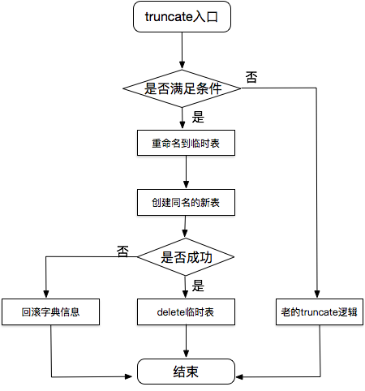

# MySQL · 引擎特性 · truncate table在大buffer pool下的优化

**Date:** 2020/08
**Source:** http://mysql.taobao.org/monthly/2020/08/01/
**Images:** 3 images downloaded

---

数据库内核月报

 [
 # 数据库内核月报 － 2020 / 08
 ](/monthly/2020/08)

 * 当期文章

 MySQL · 引擎特性 · truncate table在大buffer pool下的优化
* MySQL · 引擎特性 · INNODB UNDO LOG分配
* MySQL · 内核特性 · Redo Logging动态开关
* MySQL · 引擎特性 · InnoDB Buffer Page 生命周期
* MySQL · 引擎特性 · InnoDB UNDO LOG写入
* MySQL · 引擎特性 · InnoDB 数据文件简述
* Database · 案例分析 · UTF8与GBK数据库字符集

 ## MySQL · 引擎特性 · truncate table在大buffer pool下的优化 
 Author: kongzhi 

 ### 背景：
目前5.7仍然是使用最为广泛的版本，但是在实际的业务运维中，我们经常碰到truncate表时导致tps/qps抖动从而影响业务的情况，如果truncate的表比较多，监控就会像下图这样：

通过抓取堆栈发现：

` 0000000001237cce buf_LRU_flush_or_remove_pages(unsigned long, buf_remove_t, trx_t const*) 
 0000000001286bdc fil_reinit_space_header_for_table(dict_table_t*, unsigned long, trx_t*) 
 000000000114ca57 row_truncate_table_for_mysql(dict_table_t*, trx_t*) 
 0000000001046a64 ha_innobase::truncate() 
 0000000000e77398 Sql_cmd_truncate_table::handler_truncate(THD*, TABLE_LIST*, bool) 
 0000000000e77810 Sql_cmd_truncate_table::truncate_table(THD*, TABLE_LIST*) 
 0000000000e779d4 Sql_cmd_truncate_table::execute(THD*) 
 0000000000ce40d8 mysql_execute_command(THD*, bool) 
 0000000000ce6fdd mysql_parse(THD*, Parser_state*) 
 0000000000ce7a3a dispatch_command(THD*, COM_DATA const*, enum_server_command) 
 0000000000ce92cf do_command(THD*) 
 0000000000d92a60 threadpool_process_request(THD*) 
 0000000000da6137 worker_main(void*) 
 0000000000f617b1 pfs_spawn_thread 
 00002b498fd64e25 start_thread
`

正在删除buffer pool中的数据页, 而且这个过程会加buffer pool的锁，影响对buffer pool的读写访问，从而影响服务。
 官方这个问题由来已久，已经有很多相关的issue:
[https://bugs.mysql.com/bug.php?id=51325](https://bugs.mysql.com/bug.php?id=51325)
[https://bugs.mysql.com/bug.php?id=64284](https://bugs.mysql.com/bug.php?id=64284)
这个提到了drop table过程中删除自适应hash需要scan buffer pool 的LRU链表，5.7最新的版本已经修复了这个问题
[https://bugs.mysql.com/bug.php?id=68184](https://bugs.mysql.com/bug.php?id=68184)
而在这个bug中，分析了truncate table会比drop table在删除buffer pool page慢的本质原因，是因为truncate table 需要复用space id, 这导致必须把buffer pool中的老的表中的页全部删除，而drop table因为新旧表的页可用通过space id区分，只需要把flush list中的脏页删除就可以了，也就是可以用drop+create代替truncate来解决大buffer pool夯的问题，很遗憾这个修改实际上是在8.0上做的，也就是5.7我们需要自己实现。
 当然这个问题还有一个解法就是在buffer pool中新增按照表为单位的管理结构（通常也是链表），这样删除旧表的数据页时就不用锁住整个buffer pool去scan了，但这个实现也有两个问题：1.链表的维护本身是会影响正常的dml的，2 对现有的buffer pool实现侵入比较大。
 所以我们选择了truncate = drop + create的思路，这儿可能有人有点儿小疑问：能否直接让DBA drop+create, 这个当然可以操作，但是sql由一条变成了两条，同时这个操作不是一个statement的，中间可能会引起业务的报错，如果只是在服务器语法层做简单的替换应该也是类似的。

### 设计：
首先为了保证修改能尽量的稳定，在满足需求的前提下，需要能够动态开关和尽量减少对原有逻辑的侵入。8.0之前的ddl都不是原子的，但是为了尽可提
高ddl的原子性，在分析了innodb层的几个相关接口后，如果选择直接把delete和create接口修改字典数据放到一个事务里改动比较大, 尤其是对delete接口的
改造，而把rename+create放到一个事务里相对简单，这样我们就可以把truncate修改为 rename + create 一个事务里修改字典数据，它成功后再把rename的
临时表删除。 
truncate table t 修改为:rename t to #sqlxxxx; // 重命名到临时表
create table t;这个修改字典表和rename在一个事务里，如果失败字典表就还是老表
delete #sqlxxxx; // 删除之前的临时表减少对原有代码的侵入
选择判断一些前置条件：

* 不是临时表
* 是独立表空间（file_per_table)
* 表中不包含外键，这个主要是简化修改字典信息的逻辑

### 实现：
新增一个innodb系统变量：
truncate_algorithm // 决定是走老的原地truncate还是用drop_with_create的方式
增加一个判断table是否含有外键的接口，用于前缀检查

`ha_innobase::truncate()
/*===================*/ 
{
 DBUG_ENTER("ha_innobase::truncate");
 if (truncate_algorithm == TRUNCATE_DROP_WITH_CREATE) {
 if (!dict_table_is_temporary(m_prebuilt->table) &&
 dict_table_is_file_per_table(m_prebuilt->table) &&
 !is_refed_by_fk(m_prebuilt->table)) {
 DBUG_RETURN(drop_with_create_to_truncate());
 }
 else
 {
 ib::warn()<<table->s->table_name.str<<" can't use drop_with_create to truncate"<<
 "change to default in_place method";
 }

`
新加一个innodb的create接口，提供外部传入trx, 这样它就可以和rename共用一个trx修改字典表了

`ha_innobase::drop_with_create_to_truncate()
{
 DBUG_ENTER("ha_innobase::drop_with_create_to_truncate");
 ... ...
 int err = convert_error_code_to_mysql(
 innobase_rename_table(m_user_thd, trx, ib_table->name.m_name,
 temp_name, false),
 ib_table->flags, m_user_thd);
 ... ...
 err = create(name, table, &info, trx);
 DBUG_EXECUTE_IF("truncate_crash_after_create", DBUG_SUICIDE(););
 if (err) {
 ib::error()<<"Create table "<<name<<" failed.";
 }
 }
 trx_free_for_mysql(trx);
 
 if (!err) {
 ... ...
 err = open(table_name, 0, 0);
 if (!err) {
 ... ... 
 delete_table(temp_name);
 my_free(upd_buf);
 } 
 
 ... ...
 }
 mem_heap_free(heap);
 DBUG_RETURN(err);
}
`

### 后记：
8.0的truncate因为ddl已经支持原子性，所以实现更加优美，但思路和上面的类似。透过这个case，我也想表达一些多年来patch开源大妈解决用户痛点的一点儿小感悟：很多时候在权衡解决实现方案时我会把对原有实现的侵入作为一个很重要的考量，更多的复用久经考验的代码，保持兼容性，最大限度的让用户敢用你的代码，当然同时也是让自己少担风险，毕竟线上无小事，而不要为了追求所谓的完美重复造轮子。

 阅读： - 

本作品采用[知识共享署名-非商业性使用-相同方式共享 3.0 未本地化版本许可协议](http://creativecommons.org/licenses/by-nc-sa/3.0/)进行许可。

 