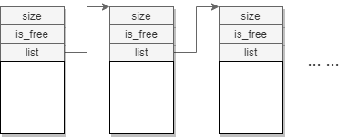
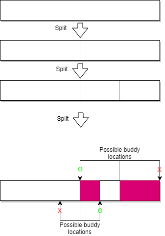
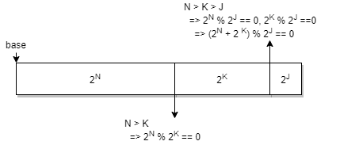
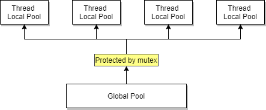

# MySQL · 源码阅读 · InnoDB伙伴内存分配系统实现分析

**Date:** 2020/09
**Source:** http://mysql.taobao.org/monthly/2020/09/04/
**Images:** 6 images downloaded

---

数据库内核月报

 [
 # 数据库内核月报 － 2020 / 09
 ](/monthly/2020/09)

 * 当期文章

 MySQL · 性能优化 · PageCache优化管理
* MySQL · 分布式系统 · 一致性协议under the hood
* X-Engine · 性能优化 · Parallel WAL Recovery for X-Engine
* MySQL · 源码阅读 · InnoDB伙伴内存分配系统实现分析
* PgSQL · 新特性探索 · 浅谈postgresql分区表实现并发创建索引
* MySQL · 引擎特性 · InnoDB隐式锁功能解析
* MySQL · Optimizer · Optimizer Hints
* Database · 新特性 · 映射队列

 ## MySQL · 源码阅读 · InnoDB伙伴内存分配系统实现分析 
 Author: 望湖 

 ## 1 Why？

 问题一：InnoDB为什么会需要伙伴内存分配系统？

InnoDB使用的内存分为以下几块：

1. Buffer pool
2. Redo log buffer
3. DD cache
4. Adaptive hash index
5. 每个事务用到的Lock需要的内存
6. SQL执行过程中需要的临时内存

其中占用内存最多的是Buffer Pool和Redo Log Buffer，都有自己专门的内存管理机制，基于定长的Page Frame或Log Block对内存进行管理。与之形成对比的，其他的内存使用项目要求进行灵活的动态分配和释放，灵活性主要体现在两方面：

1. 分配的内存长度是变长的，什么size都有可能，很难标准化为Page Frame Size或者是Log Block Size这样统一的长度去管理；
2. 内存分配和释放的时机也很灵活，在整个执行流程中，随时要使用，使用完了随时要释放；

这样灵活的内存管理需求就需要一个类似伙伴分配系统的完整内存管理机制来负责管理。

 问题二：灵活的内存使用需求完全可以用系统已有的malloc/free动态分配机制来实现，为什么InnoDB还需要自己实现伙伴分配系统？

系统提供的malloc/free动态内存管理机制对应用代码逻辑完全无感知，在释放内存时，除了很少的进程内暂留外会尽快把内存还给系统，以保证其他进程在分配内存时有足够多的内存可使用，这是作为OS的公平原则。这样做的一个显著问题是在使用动态内存总量波动比较大的场景中，会反复的出现Page Fault，影响系统的性能。所以像InnoDB这样，对内存管理有比较高控制力需求的系统，就需要结合自己的逻辑，来专门设计实现动态内存管理机制。

## 2 InnoDB伙伴分配系统的实现分析

下面开始分析InnoDB伙伴分配系统的具体实现，本文基于MySQL 5.6的代码来分析。

InnoDB的伙伴分配系统封装在对象mem_pool_t中，提供的主要操作是四个如下表所列。除此之外还有一些Debug和状态审计的能力。

 函数
 作用

 mem_pool_create
 创建一个mem_pool_t

 mem_pool_free
 销毁一个mem_pool_t

 mem_area_alloc
 从mem_pool_t中分配一块指定大小的内存

 mem_area_free
 释放一块之前由mem_area_alloc分配的内存

### 2.1 free list的管理

伙伴分配系统把所有相同大小的空闲内存块都通过一个链表串起来，形成一个free list。每块空闲内存头部都会划出一块额外的空间（MEM_AREA_EXTRA_SIZE）作为header，用于保存三个字段：

* 该内存块是否空闲
* 该内存块的大小
* 处于同一free list上的下一个内存块

如下图所示：

### 2.2 mem_pool_create的实现

mem_pool_create只接受一个参数：size，是在所创建的mem_pool_t中所能分配的最大内存总量。mem_pool_create时会直接向系统分配一块size大小的连续内存，之后所有的内存分配都在这块内存上展开，我们把这块内存称作pool。pool的起始地址称作base。

1个mem_pool_t内部维护了64条链表，分别是free_list[0 ~ 63]。链表free_list[n]上串起的都是长度为2的n次方的空闲内存块，可供分配。

输入的参数size可以是任意正整数，mem_pool_create会找到2的最大整数次幂N，满足2的N次方小于等于pool size。把这一大块内存首先切下来，设置好相关的header值，挂到free_list[N]上面。pool上面剩余的空间再重复上述步骤，分别挂到各个free_list上面，直到剩余的长度非常小（小于MEM_AREA_MIN_SIZE），最后的这一小段内存就会被弃置不用。

### 2.3 mem_area_alloc的实现

mem_area_alloc接受两个参数：在哪个mem_pool_t上进行内存分配和要分配多大的内存。

需要分配的内存大小可能是任意正整数。首先找到2的整数次方n，满足2的n次方大于等于要分配的大小加上MEM_AREA_EXTRA_SIZE。在free_list[n]上寻找空闲的内存块，如果free_list[n]不为空，则从上面摘下第一块空闲内存，如果free _list[n]为空，则需要启动空闲块的Split流程，从更大的空闲内存块中去进行切割，Split流程稍后介绍。

在找到了对应大小的空闲内存块后需要将其标记为已占用，指针跳过MEM_AREA_EXTRA_SIZE的范围后向上层用户返回。

### 2.4 Split操作的实现

当需要长度为2的n次方大小的内存块时，如果free_list[n]为空，说明当前2的n次方大小的空闲内存块已用完，需要把一块2的n+1次方大小的空闲内存块进行对切，来形成两块2的n次方大小的内存块供分配。典型的伙伴分配系统在进行split时总是进行对切，这也是伙伴系统的精髓，被对切形成的两块内存互为buddy关系。具体流程为：

* 检查free_list[n+1]是否为空，如果free_list[n+1]也为空，则需要进一步进入free_list[n+2]的Split流程；如果直到free_list[63]都为空，则触发OOM
* 当free_list[n+1]不为空时，从free_list[n+1]头部摘下第一个空闲块，将其切分为相同大小的两块，分别设置两块内存的header，更新size的大小为2的n次方，然后把这两块内存都加入free_list[n]
* 至此就完成了从free_list[n+1]到free_list[n]的split流程，可以返回 mem_are_alloc继续完成内存分配

### 2.5 mem_area_free的实现（Coalescing操作的实现）
用于释放一块之前通过mem_area_alloc分配的内存，接受两个参数：要把内存释放到哪个mem_pool_t和要释放的内存指针。

mem_area_free的核心关键是Coalescing流程，也就是当两块相邻的buddy内存都为空闲状态时，需要将其合并为一块大的空闲内存，这样才能不断减少系统中的碎片内存，否则当系统需要一块较大的连续内存时将出现无内存可分配的情况。

当一块内存被释放时，首先把指针倒退MEM_AREA_EXTRA_SIZE字节，找到内存块真正的开始地址。下一步就是找到这块内存的buddy内存块，如果buddy内存块也为空闲状态，就可以进行Coalescing了。

通过分析mem_area_alloc流程不难发现，伙伴分配系统中任意的内存块都是从两倍大小的内存对切产生，所以对于任意一块给定的内存块，它的buddy块一定只会出现在两个位置：当前内存块结束的地方，或者是当前内存块往前，当前内存块大小的位置，如下图所示。

这两个位置哪个才是正确的buddy呢，要知道如果寻找的buddy块地址不正确，那当我们去查询它的header信息时，因为里面存储的是用户数据，查询的结果将会是undefined，完全无法定位元信息。这里出现伙伴分配系统最核心的Trick，从mem_pool_create的初始化过程开始，到mem_area_alloc分配流程，可以保证：

`每一个内存块的Offset(内存块地址减去pool base)都是其size的整数倍。
`
初始化过程很好理解：切下的第一块内存Offset是0。后续每切下的一块内存之前，都有远大于自己Size的2的整数次幂长度的已切内存块在前面。如下图所示。

初始化状态满足每一个内存块的Offset(内存块地址减去pool base)都是其size的整数倍。之后因为每次Split时都是对切，一块长度为2SIZE的内存块，起始地址Offset是2SIZE * K，对切为两块小内存的起始Offset分别为2SIZE * K和2SIZE * K + SIZE，都是SIZE的整数倍。

综上所述，再次总结一下伙伴分配系统中的一个重要Invariant：**每一个内存块的Offset(内存块地址减去pool base)都是其size的整数倍**。

有了这个重要Invariant，对于给定的内存块，找到它的Buddy块就变得容易。假设给定的内存块的长度为SIZE，那它的起始地址Offset一定是K * SIZE，当它的右侧相邻内存块是buddy块时，要求K*SIZE是2SIZE的整数倍，也就是K是偶数。当它的左侧相邻内存块是buddy块时，要求(K-1) * SIZE是2SIZE的整数倍，也就是K是奇数。上述两个条件最多只有一个成立。

当找到正确的Buddy块地址后就可以通过Header信息定位其原信息。这里还有一个比较有意思的点，当我们已经手握2的n次方大小的内存块，试图往2的n+1次方大小的内存块进行Coalescing时，2的n+1次方的内存块元信息一定是存在的。反之当我们只有较大的内存块时，内存块内部的所有字节都可能存着用户的数据，较小class内存块上的元信息完全可能不存在，它只是较大内存块的一部分。这也是伙伴分配系统的特点。

如果一对buddy内存块都是空闲时，就可以把它们进行Coalescing，也就是从free_list[n]中摘除下来，更新header信息后，再插入free_list[n+1]。完成后需要继续检查 n+1级别的内存块是否能继续Coalescing到n+2级别的内存块，由此递归进行下去，直到无法Coalescing。

### 2.6 mem_pool_free的实现

mem_pool_free的过程非常简单，直接调用系统接口把pool释放即可。

## 3 并发分配/释放的支持

最后探讨一下从mem_pool_t中并发分配内存的实现。InnoDB做的比较简单，对于每一个mem_pool_t都有一个mem_pool_t.mutex进行保护，对mem_pool_t内部结构做出修改时都通过这一把大锁进行保护。

业界更高效的做法是通过thread cache来实现支持并发分配的伙伴分配系统。核心思想是对于每一个线程都通过thread local变量维护一个线程私有的内存pool，当线程私有pool中还有空闲内存时就从线程私有pool中进行分配，否则就从全局内存pool中，在获得大锁的保护下进行分配，如下图所示。

在并行伙伴分配系统中有下面几个问题是实现的挑战和艺术：

* 怎么尽可能的减少在Global Pool中的分配从而减少锁冲突？
* 当线程数量特别大时，怎么控制Thread Local Pool中缓存的内存大小，或者是控制Local Pool的数量，从而避免内存过多浪费，甚至被耗尽的问题？
* 当某个Local Pool中的内存被释放到一定量的时候，如何选择恰当的时机把它还回Global Pool，以高效的供其他Local Pool使用？

 阅读： - 

本作品采用[知识共享署名-非商业性使用-相同方式共享 3.0 未本地化版本许可协议](http://creativecommons.org/licenses/by-nc-sa/3.0/)进行许可。

 