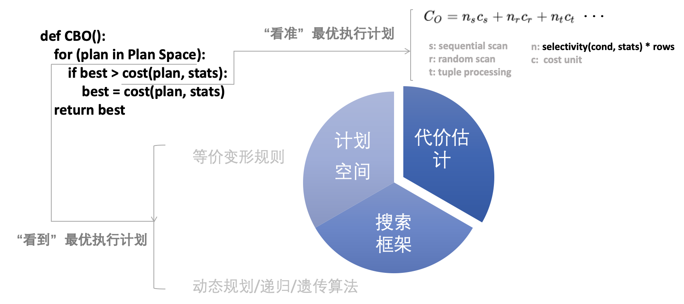
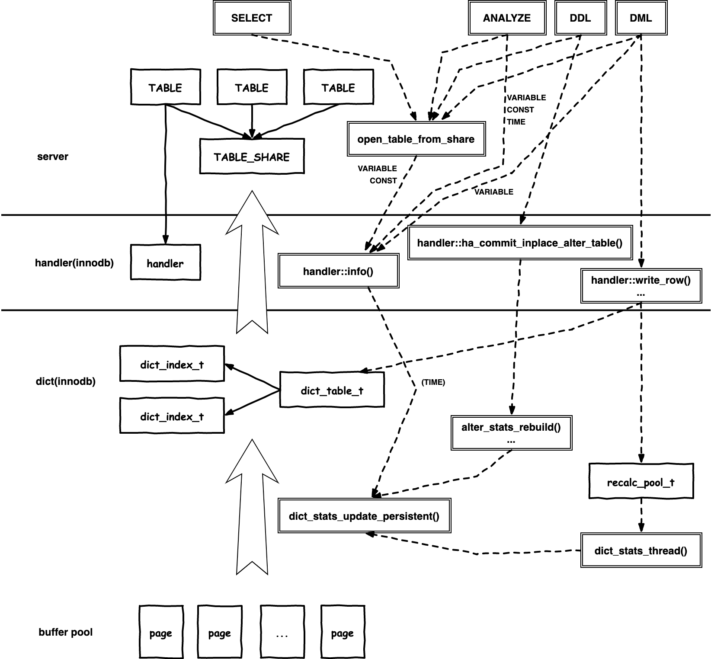
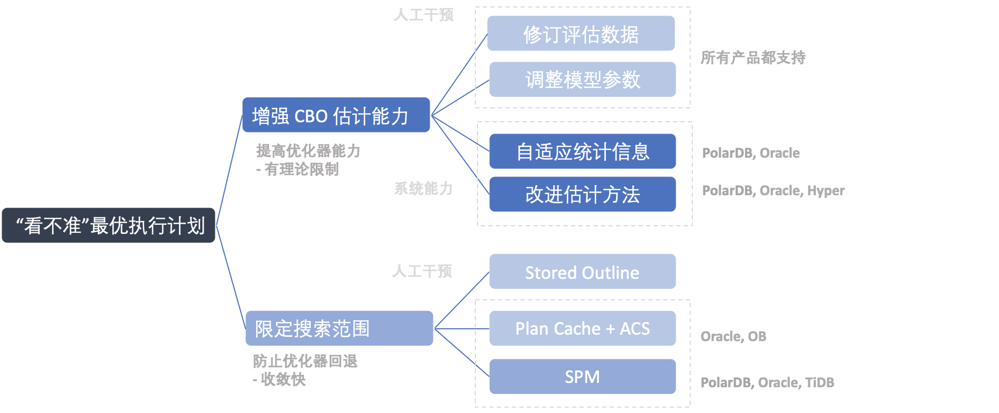

# MySQL · 内核特性 · 统计信息的现状和发展

**Date:** 2020/12
**Source:** http://mysql.taobao.org/monthly/2020/12/05/
**Images:** 4 images downloaded

---

数据库内核月报

 [
 # 数据库内核月报 － 2020 / 12
 ](/monthly/2020/12)

 * 当期文章

 Database · 发展前沿 · NewSQL数据库概述
* AliSQL · 内核新特性 · 2020技术总结
* MySQL · 引擎特性 · page cleaner 算法
* PolarDB · 引擎特性 · 历史库
* MySQL · 内核特性 · 统计信息的现状和发展

 ## MySQL · 内核特性 · 统计信息的现状和发展 
 Author: 开旺 

 ## 简介

我们知道查询优化问题其实是一个搜索问题。基于代价的优化器 ( CBO ) 由三个模块构成：计划空间、搜索算法和代价估计 [1] ，分别负责“看到”最优执行计划和“看准”最优执行计划。如果不能“看准”最优执行计划，那么优化器基本上就是瞎忙活，甚至会产生严重的影响，出现运算量特别大的 SQL ，造成在线业务的抖动甚至崩溃。

在上图中，代价估计用一个多项式表示，其系数 c 反应了硬件环境和算子特性，而数值 n 则由查询条件基于统计信息计算而得到。

现在主流的评估模型仍可溯源于 selinger 97 代价模型 [2] 。虽然各种机器学习模型从未停止过探索，但其效果上往往还不如极其简单的代价模型和比较精确的行数估计 ( cardinality estimation ) [3] 。统计信息的质量直接影响基数估算的准确性，其重要性是显而易见的。

 需要注意的是，基于统计数据和即时采样都可以获得行数估计。事实上 MySQL 的 range optimizer 和 ref optimizer 就是重度依赖于索引采样 (index dive) ，而 join optimizer 则用索引统计信息 (index stats ，又称 record per key 或者 density vector ) 。索引采样需要计算谓词范围内的 page 数和 page 平均密度，对于小范围评估非常准确，对于大范围评估误差就比较大，此外，需要读索引数据， I/O 路径比较长，开销有时也是不可忽视的。

谈到统计信息，就会涉及管理框架和统计数据两个部分。令人遗憾的是，在 MySQL 里这两部分都是非常原始的。本文主要讨论管理框架缺陷，同时会涉及数据质量问题。

## 统计信息管理

我们知道 MySQL 遵循的是计算 ( SQL ，又称 Server ) 和存储 ( Storage Engine ) 分层的设计，在两层之间有一个 handler 接口层。每个存储引擎都需要提供自己的 handler 实现。MySQL 主流存储引擎仍然是 InnoDB 。本文所讨论的统计信息问题正是与 InnoDB 密切相关的。

由于分层设计，统计信息就会存在两种组织方式： 1) Storage Engine 提供采样接口，而在 Server 层基于样本完成各种指标计算，也可以是 2) Storage Engine 提供统计信息，只在 handler 层中提供一些简单的格式适配。除了 8.0 引入的直方图是在 Server 层基于 handler 采样接口实现的，其他统计信息，都是直接从 Storage Engine 读出并在 hander 层适配的。

需要说明的是，商业数据库里广泛应用的直方图，在 MySQL 内核里还只是个配角，究其原因大概有：基于 index dive 的 range optimizer 在 MySQL 主要业务 TP 业务场景中表现还行 ，而 InnoDB 的采样算法 ( row-based random sampling ) 性能问题也限制了应用场景，直到到比较新的 8.0.19 版本 [4] 才发布了重点改进 ( block-based random sampling ) [5] 。

那么， InnoDB 的统计信息支持，有什么问题和影响呢？

### 总图

下面这个图中绘制了三层的不同对象和模块，从上到下依次是 Server 、handler 和 InnoDB 。图中包含了 Server 和 InnoDB 的统计信息表示，以及适配函数和更新机制。

### 信息表示

在 SQL 层中，统计信息存于 `TABLE` 对象和 `TABLE_SHARE` 对象中。 `TABLE` 是会话级的（在 MySQL 中，一个会话即一个客户连接），`TABLE_SHARE` 是全局共享的，语义上 `TABLE` 和 `TABLE_SHARE` 是多对一的关系。此外， `TABLE` 和 `TABLE_SHARE` 都有相应的缓存，分别称为 `table_open_cache` 和 `table_definition_cache` 。 为了优化锁竞争，`TABLE` 缓存做了哈希分区 ( 每个分区称为一个 instance ) 。

统计信息的表示和 open table 逻辑是密切相关的。open table 简单地讲，如果有 `TABLE` 对象就复用，否则根据 `TABLE_SHARE` 构造 ( `open_table_from_share` ) ，如果 `TABLE_SHARE` 都没有，那就先从数据字典 ( data dictionary ) 构造 `TABLE_SHARE` ，再构造 `TABLE` 。在构造 `TABLE` 时会将文件大小、page 大小和表行数等统计信息放到` handler::stats` 中，但索引统计信息和单列直方图仍然是放在 `TABLE_SHARE` 中为所有会话 `TABLE` 所共享的。

在 InnoDB 中，统计信息缓存在 `dict_table_t` 和 `dict_index_t` 中，前者包含表级统计信息 ( 行数、主索引字节数和二级索引总字节数 ) ，后者包含索引级统计信息（密度向量、B+树总页数和叶子页数）。而 InnoDB 采用了聚簇主键索引，所以，行数其实也是从主索引获得的。这些信息会持久化在 `mysql.innodb_table_stats` 和 `mysql.innodb_index_stats` 两个系统表中。

### 更新机制

统计信息收集是通过 `dict_stats_update_persistent()` 函数来完成的，具体收集算法这里不展开，其统计指标更新流程是：

`1. 持写锁
2. 统计信息缓存清零
3. 收集表和索引统计信息并更新缓存
4. 释放写锁
5. 持读锁获取缓存的快照
6. 将快照持久化到系统表中
`

显然，这里持写锁时间是会比较长的，这也可能是 `HA_STATUS_NO_LOCK` 需求的来源。在 `handler::info()` 同步信息时通常会带上 `HA_STATUS_NO_LOCK` 标记，表示读 Storage Engine 统计信息时不持读锁。

在 Server 和 Storage Engine 两层之间的信息同步是 `handler::info()` 接口负责的。这个接口函数通过一个参数来标记操作内容：

`HA_STATUS_VARIABLE 需要同步表级统计信息到 handler::stats (ha_statistics)
HA_STATUS_CONST 需要同步索引级统计信息到 TABLE_SHARE 里的 rec_per_key 结构
HA_STATUS_TIME 需要重新收集统计信息
HA_STATUS_NO_LOCK 从存储层读数据时不持锁 (dict_table_t::stats_latch)
`

具体标记由调用方根据场景来决定。由于重新收集统计信息时需要更新 `dict_table_t` 和 `dict_index_t` 相关字段，而同步统计信息时会读这些字段，这把锁可以保证读写版本是一致。统计信息一般是 8 字节数值，在 64-bit 机器上，这些数值本身的读写可以认为是原子的，统计信息对版本一致性也有一定的容忍度，直观上理解，读的时候不持锁也是可以的。

从总图也可以看到，DML 会将表级统计信息从 InnoDB 同步到 `handler::stats` ，重新构造 `TABLE` 时会同步表和索引统计信息，而 `ANALYZE` 命令除了同步表和索引统计信息之外，还要求重新收集。

### Information Schema 和 SHOW INDEX

当发生执行计划回退时，我们通常会试图求证于当前的统计信息，一种办法是使用 `SHOW INDEX` 命令，另一种是直接读 `mysql` 库中的两个统计表，或者 information schema 中的相关视图。但这两个命令是绕过 SQL 层的缓存，直接读 InnoDB 中缓存的统计信息，此外，还有专用的内部缓存表，即 `mysql.table_stats` 和 `mysql.index_stats` ，其缓存时间由系统变量 `information_schema_stats_expiry` 控制，默认有效期是一天。但优化器使用的是 SQL 层的缓存，也就是说，如果同步机制本身出了问题，那么，这两个命令其实产生欺骗的。事实上，这个同步机制确实也有点问题。目前并没有办法直接查看 SQL层缓存的统计信息，所以，唯一可信的是 optimizer trace 中的数值，虽然并非原始统计信息，但基本上也可以支持一定程度的还原。

### 更新机制

重新收集统计信息，有多种触发情况：用户可以主动发起 `ANALYZE` 命令来重新收集，重建表结束时也会重新收集，此外， InnoDB 的后台统计线程 ( `dict0stats_bg.cc` ) 还会在修改行数累积到一定数量时 ( persistent 10% 或 transient 1/16 , 见 `row_update_statistics_if_needed() ` ) 重新收集，样本大小分别由 `innodb_stats_persistent_sample_pages` 和 `innodb_stats_transient_sample_pages` 控制。考虑到采样开销，这两个参数的默认值是 20 和 8 ，也就是说，不管用户表数据量多大，InnoDB 都只采集 20 个 page 。

重新收集的入口函数是 `dict_stats_update_persistent()` 。顺便说一句， InnoDB 持久化统计信息是从 5.6.6 开始成为默认配置的 [7] [8] ，而非持久化统计信息继续应用于一些系统表，这两套逻辑还有一定的重叠度。

但是，对于 SQL 层维护的统计信息 ( 如直方图 ) ，由于没有更新计数的支持，所以，只能通过内部定时任务 ( events ) 或者外部定时任务来驱动更新。

### 问题和影响

#### 数据质量

InnoDB 统计信息对于无论多大的表，默认都只随机采样 20 个 page 。显然，对于这么小的 block-based sampling 样本，算法上很难产生可靠的统计 ，除非数据是趋向于均匀分布的。直方图虽然可以比较好地拟合数据分布，但也需要足够大的随机样本 [6] 。事实上，生产环境查询性能问题，很多是数据倾斜导致的。

#### 时效性

由于有 TABLE 缓存以及 TABLE_SHARE 缓存，什么时候构造 TABLE 对象，其实是不可预知的，换句话说，密度向量什么时候能够更新是没有保证的。理论上，只要会话缓存足够大，若不主动 ANALYZE ，密度向量可能长期没有更新！而新连接由于无可复用的 TABLE 对象，调用了 `open_table_from_share()` ，其他会话中该表相关的执行计划可能就莫名其妙变了。

顺便说一句， `ANALYZE` 命令不太常见，一方面，可能是因为大家误以为后台统计任务会合理地更新信息，另一方面，可能是因为确实是不知道什么时候需要更新，毕竟除了在批量更新或数据导入场景下可能是比较清晰的，其他时机都无从知晓。而且，它还有阻塞查询的概率风险 [9] 。

#### 一致性

从统计流程可以看到，在收集前有一个外部可见的缓存清零操作。也就是说，同步信息时不持读锁的话，除了版本不一致外，还可能读到零。当然 `info()` 读到零值时会进行一些处理，比如说，对于密度向量，它会认为表中所有记录都是相同的，对于元组数，它会认为是空表。显然，不管是那种处理，对于正常统计规律来讲，都是一个突变。一般来说，统计信息可以容忍一定范围的误差，甚至只要保持统计性质不变，长期不更新都可以，但突变就完全打破了这个基础，业务上就可能有莫名其妙的全表扫描，或者有更好的索引却不选。

在 20 个 page 的默认采样配置下，大概 20～30 ms 就完成了统计更新。但低耗时也掩盖了更多的管理逻辑问题：由于缺乏对统计收集任务的合理协调，实际情况是会有多次毫无意义的重复收集操作。

按说重建表时是要暂停收集统计信息的，但实际上新的统计任务仍然会由修改行数累积触发，当主索引处于 OnlineDDL 状态时，统计指标更新流程清零操作后会跳过搜集，读到零的时间窗口会被急剧放大，直到重建表结束后再恢复正常。随着 OnlineDDL [10] 越来越多的使用，生产环境全表扫描问题越来越多。好消息是，这个问题已经有修复方案了 [11] 。

### 解决办法

显然，现有更新机制的同步问题和一致性问题，属于程序缺陷，需要修复。 作为短期规避措施， `ANALYZE` 命令可以加到定时任务，但要修复潜在的阻塞风险 [9] 。

从优化器角度来看，InnoDB 统计信息不论在指标丰富程度还是管理框架方面，基本上无法满足各种优化场景的需要。统计质量导致“看不准” 最优执行计划，属于方案缺陷，可以从两个方面来着手：1) 增强估计能力和统计数据支持，2) 限定执行计划搜索空间。虽然都可以有一些人工干预的机制作为短期的过渡方案，但是，在比较大的部署规模下，为产出高效而稳定的执行计划，建立系统化的统计信息管理机制 [12] ，其重要性就是显而易见的了。

## 参考资料

[1] Chaudhuri, Surajit. “An overview of query optimization in relational systems.” Proceedings of the seventeenth ACM SIGACT-SIGMOD-SIGART symposium on Principles of database systems. 1998.

[2] Selinger, P. Griffiths, et al. “Access path selection in a relational database management system.” Proceedings of the 1979 ACM SIGMOD international conference on Management of data. 1979.

[3] Leis, Viktor, et al. “Query optimization through the looking glass, and what we found running the Join Order Benchmark.” The VLDB Journal 27.5 (2018): 643-668.

[4] Changes in MySQL 8.0.19,

[https://dev.mysql.com/doc/relnotes/mysql/8.0/en/news-8-0-19.html](https://dev.mysql.com/doc/relnotes/mysql/8.0/en/news-8-0-19.html)

[5] WL#8777: InnoDB: Support for sampling table data for generating histograms

[6] Chaudhuri, Surajit, Rajeev Motwani, and Vivek Narasayya. “Random sampling for histogram construction: How much is enough?.” *ACM SIGMOD Record* 27.2 (1998): 436-447.

[7] WL#6189 Turn InnoDB persistent statistics ON by default

[8] Changes in MySQL 5.6.6,

[https://dev.mysql.com/doc/relnotes/mysql/5.6/en/news-5-6-6.html](https://dev.mysql.com/doc/relnotes/mysql/5.6/en/news-5-6-6.html)

[9] ANALYZE TABLE Is No Longer a Blocking Operation,

[https://www.percona.com/blog/2018/03/27/analyze-table-is-no-longer-a-blocking-operation/](https://www.percona.com/blog/2018/03/27/analyze-table-is-no-longer-a-blocking-operation/)

[10] WL#5534 Online ALTER

[11] Analyze table leads to empty statistics during online rebuild DDL ,

[https://bugs.mysql.com/bug.php?id=98132](https://bugs.mysql.com/bug.php?id=98132)

[12] Chakkappen, Sunil, et al. “Adaptive statistics in Oracle 12c.” Proceedings of the VLDB Endowment 10.12 (2017): 1813-1824.

 阅读： - 

本作品采用[知识共享署名-非商业性使用-相同方式共享 3.0 未本地化版本许可协议](http://creativecommons.org/licenses/by-nc-sa/3.0/)进行许可。

 