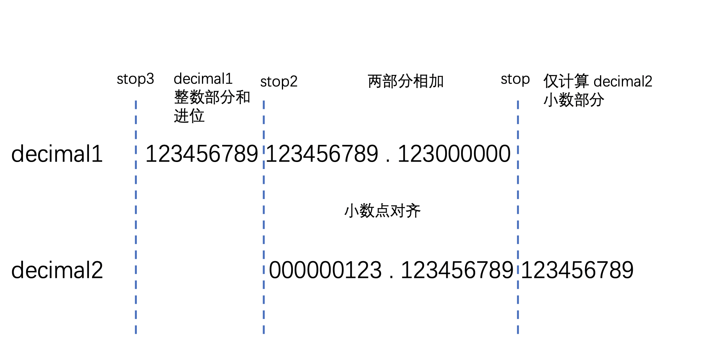
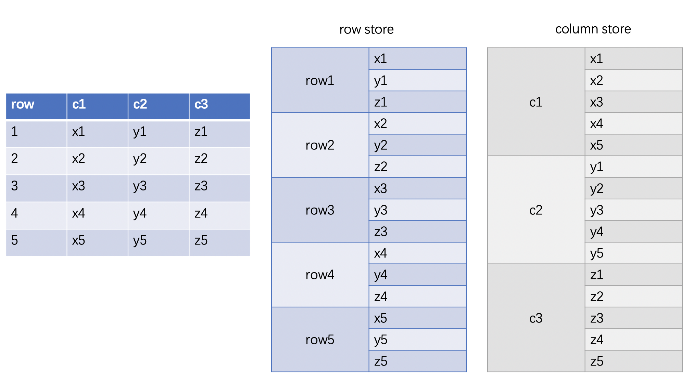

# MySQL · 源码阅读 · Decimal 的实现方法

**Date:** 2021/03
**Source:** http://mysql.taobao.org/monthly/2021/03/02/
**Images:** 3 images downloaded

---

数据库内核月报

 [
 # 数据库内核月报 － 2021 / 03
 ](/monthly/2021/03)

 * 当期文章

 MySQL · 引擎特性 · InnoDB Faster truncate/drop table space
* MySQL · 源码阅读 · Decimal 的实现方法
* PolarDB · 最佳实践 · 并行查询优化器的应用实践
* PolarDB · 引擎特性 · 物理复制热点页优化
* DataBase · 引擎特性 · OLAP/HTAP列式存储引擎概述
* MySQL · 源码阅读 · 白话Online DDL

 ## MySQL · 源码阅读 · Decimal 的实现方法 
 Author: 臻成 

 ## 背景
数字运算在数据库中是很常见的需求, 例如计算数量、重量、价格等, 为了满足各种需求, 数据库系统通常支持精准的数字类型和近似的数字类型. 精准的数字类型包含 int, decimal 等, 这些类型在计算过程中小数点位置是固定的, 其结果和行为比较可预测. 当涉及钱时, 这个问题尤其重要, 因此部分数据库实现了专门的 money 类型. 近似的数字类型包含 float, double 等, 这些数字的精度是浮动的.

本文将简要介绍 decimal 类型的数据结构和计算, 对比 decimal 在 MySQL, ClickHouse 两个不同类型系统中的实现差异, 描述实现 decimal 运算的主要思路. MySQL 在结果的长度比较接近上限的情况下, 会有比较违反直觉的地方, 本文会在最后列出这些可能需要注意的问题.

## 创建和使用 decimal

decimal 的使用在多数数据库上都差不多, 下面以 MySQL 的 decimal 为例, 介绍 decimal 的基本使用方法.

### 描述 decimal
与 float 和 double 不同, decimal 在创建时需要指定两个描述精度的数字, 分别是 precision 和 scale, precision 指整个 decimal 包括整数和小数部分一共有多少个数字, scale 指 decimal 的小数部分包含多少个数字, 例如：123.45 就是一个 precision=5, scale=2 的 decimal. 我们可以在建表时按照这种方式定义我们想要的 decimal.

### 在建表时定义 decimal
可以在建表时这样定义一个 decimal:

`create table t(d decimal(5, 2));
`

### 写入 decimal 数据
可以向其中插入合法的数据, 例如

`insert into t values(123.45);
insert into t values(123.4);
`

此时执行 select * from t 会得到

`+--------+
| d |
+--------+
| 123.45 |
| 123.40 |
+--------+
`

注意到 123.4 变成了 123.40, 这就是精确类型的特点, d 列的每行数据都要求 scale=2, 即小数点后有两位

当插入不满足 precision 和 scale 定义的数据时

`insert into t values(1123.45);
ERROR 1264 (22003): Out of range value for column 'd' at row 1
insert into t values(123.456);
Query OK, 1 row affected, 1 warning
show warnings;
+-------+------+----------------------------------------+
| Level | Code | Message |
+-------+------+----------------------------------------+
| Note | 1265 | Data truncated for column 'd' at row 1 |
+-------+------+----------------------------------------+
select * from t;
+--------+
| d |
+--------+
| 123.46 |
+--------+
`

类似 1234.5 (precision=5, scale=1)这样的数字看起来满足要求, 但实际上需要满足 scale=2 的要求, 因此会变成 1234.50(precision=6, scale=2) 也不满足要求.

### 取出 decimal 进行计算
计算的结果不受定义的限制, 而是受到内部实现格式的影响, 对于 MySQL 结果最大可以到 precision=81, scale=30, 但是由于 MySQL decimal 的内存格式和计算函数实现问题, 这个大小不是在所有情况都能达到, 将在后文中详细介绍. 继续上面的例子中：

`select d + 9999.999 from t;
+--------------+
| d + 9999.999 |
+--------------+
| 10123.459 |
+--------------+
`

结果突破了 precision=5, scale=2 的限制, 这里涉及运算时 scale 的变化, 基本规则是：

1. 加法/减法/sum：取两边最大的 scale
2. 乘法：两边的 scale 相加
3. 除法：被除数的 scale + div_precision_increment(取决于数据库实现)

## decimal 实现
在这一部分中, 我们主要介绍 MySQL 的 decimal 实现, 此外也会对比 ClickHouse, 看看 decimal 在不同系统中的设计与实现差异.

实现 decimal 需要思考以下问题

1. 支持多大的 precision 和 scale
2. 在哪里存储 scale
3. 在连续乘法或除法时, scale 不断增长, 整数部分也不断扩大, 而存储的 buffer 大小总是又上限的, 此时应该如何处理？
4. 除法可能产生无限小数, 如何决定除法结果的 scale?
5. decimal 的表示范围和计算性能是否有冲突, 是否可以兼顾

### MySQL
先来看看 MySQL decimal 相关的数据结构

`typedef int32 decimal_digit_t;

struct decimal_t {
 int intg, frac, len;
 bool sign;
 decimal_digit_t *buf;
};
`

MySQL 的 decimal 使用一个长度为 len 的 decimal_digit_t (int32) 的数组 buf 来存储 decimal 的数字, 每个 decimal_digit_t 最多存储 9 个数字, 用 intg 表示整数部分的数字个数, frac 表示小数部分的数字个数, sign 表示符号. 小数部分和整数部分需要分开存储, 不能混合在一个 decimal_digit_t 中, 两部分都向小数点对齐, 这是因为整数和小数通常需要分开计算, 所以这样的格式可以更容易地将不同 decimal_t 小数和整数分别对齐, 便于加减法运算. len 在 MySQL 实现中恒为 9, 它表示存储的上限, 而 buf 实际有效的部分, 则是由 intg 和 frac 共同决定. 例如：

`// 123.45 decimal(5, 2) 整数部分为 3, 小数部分为 2
decimal_t dec_123_45 = {
 int intg = 3;
 int frac = 2;
 int len = 9;
 bool sign = false;
 decimal_digit_t *buf = {123, 450000000, ...};
};
`

MySQL 需要使用两个 decimal_digit_t (int32) 来存储 123.45, 其中第一个为 123, 结合 intg=3, 它就表示整数部分为 123, 第二个数字为 450000000 (共 9 个数字), 由于 frac=2, 它表示小数部分为 .45

再来看一个大一点的例子：

`// decimal(81, 18) 63 个整数数字, 18 个小数数字, 用满整个 buffer
// 123456789012345678901234567890123456789012345678901234567890123.012345678901234567
decimal_t dec_81_digit = {
 int intg = 63;
 int frac = 18;
 int len = 9;
 bool sign = false;
 buf = {123456789, 12345678, 901234567, 890123456, 789012345, 678901234, 567890123, 12345678, 901234567}
};
`

这个例子用满了 81 个数字, 但是也有些场景无法用满 81 个数字, 这是因为整数和小数部分是分开存储的, 所以一个 decimal_digit_t (int32) 可能只存储了一个有效的小数数字, 但是其余的部分没有办法给整数部分使用, 例如一个 decimal 整数部分有 62 个数字, 小数部分有 19 个数字(precision=81, scale=19), 那么小数部分需要使用 3 个 decimal_digit_t (int32), 整数部分还有 54 个数字的余量, 无法存下 62 个数字. 这种情况下, MySQL 会优先满足整数部分的需求, 自动截断小数点后的部分, 将它变成 decimal(80, 18)

接下来看看 MySQL 如何在这个数据结构上进行运算. MySQL 通过一系列 decimal_digit_t(int32) 来表示一个较大的 decimal, 其计算也是对这个数组中的各个 decimal_digit_t 分别进行, 如同我们在小学数学计算时是一个数字一个数字地计算, MySQL 会把每个 decimal_digit_t 当作一个数字来进行计算、进位. 由于代码较长, 这里不再对具体的代码进行完整的分析, 仅对代码中核心部分进行分析, 如果感兴趣, 可以直接参考 MySQL 源码 strings/decimal.h 和 strings/decimal.cc 中的 decimal_add, decimal_mul, decimal_div 等代码.

* 准备步骤

 在真正计算前, 还需要做一些准备工作：

 MySQL 会将数字的个数 ROUND_UP 到 9 的整数倍, 这样后面就可以按照 decimal_digit_t 为单位来进行计算
* 此外还要针对参与运算的两个 decimal 的具体情况, 计算结果的 precision 和 scale, 如果发现结果的 precision 超过了支持的上限, 那么会按照 decimal_digit_t 为单位减少小数的数字.
* 在乘法过程中, 如果发生了 2 中的减少行为, 则需要 TRUNCATE 两个运算数, 避免中间结果超出范围.
* 加法主要步骤

 首先, 因为两个数字的 precision 和 scale 可能不相同, 需要做一些准备工作, 将小数点对齐, 然后开始计算, 从最末尾小数开始向高位加, 分为三个步骤：

 将小数较多的 decimal 多出的小数数字复制到结果中
* 将两个 decimal 公共的部分相加
* 将整数较多的 decimal 多出的整数数字与进位相加到结果中

* 乘法主要步骤

 乘法引入了一个新的 dec2, 表示一个 64 bit 的数字, 这是因为两个 decimal_digit_t(int32) 相乘后得到的可能会是一个 64 bit 的数字. 在计算时一定要先把类型转换到 dec2(int64), 再计算, 否则会得到溢出后的错误结果.

 `typedef decimal_digit_t dec1;
typedef longlong dec2;
` 

 乘法与加法不同, 乘法不需要对齐, 例如计算 11.11 * 5.0, 那么只要计算 1111*50=55550, 再移动小数点位置就能得到正确结果 55.550

 MySQL 实现了一个双重循环将 decimal1 的 每一个 decimal_digit_t 与 decimal2 的每一个 decimal_digit_t 相乘, 得到一个 64 位的 dec2, 其低 32 位是当前的结果, 其高 32 位是进位.

 `for (buf1 += frac1 - 1; buf1 >= stop1; buf1--, start0--) {
 carry = 0;
 for (buf0 = start0, buf2 = start2; buf2 >= stop2; buf2--, buf0--) {
 dec1 hi, lo;
 dec2 p = ((dec2)*buf1) * ((dec2)*buf2);
 hi = (dec1)(p / DIG_BASE);
 lo = (dec1)(p - ((dec2)hi) * DIG_BASE);
 ADD2(*buf0, *buf0, lo, carry);
 carry += hi;
 }
 if (carry) {
 if (buf0 < to->buf) return E_DEC_OVERFLOW;
 ADD2(*buf0, *buf0, 0, carry);
 }
 for (buf0--; carry; buf0--) {
 if (buf0 < to->buf) return E_DEC_OVERFLOW;
 ADD(*buf0, *buf0, 0, carry);
 }
}
`
* 除法主要步骤

 除法使用的是 Knuth’s Algorithm D, 其基本思路和手动除法也比较类似.

 首先使用除数的前两个 decimal_digit_t 组成一个试商因数, 这里使用了一个 norm_factor 来保证数字在不溢出的情况下尽可能扩大, 这是因为 decimal 为了保证精度必须使用整形来进行计算, 数字越大, 得到的结果就越准确.

 `norm2 = (dec1)(norm_factor * start2[0]);
if (likely(len2 > 0)) norm2 += (dec1)(norm_factor * start2[1] / DIG_BASE);
` 
 D3: 猜商, 就是用被除数的前两个 decimal_digit_t 除以试商因数

 `x = start1[0] + ((dec2)dcarry) * DIG_BASE;
y = start1[1];
guess = (norm_factor * x + norm_factor * y / DIG_BASE) / norm2;
` 

 这里如果不乘 norm_factor, 则 start1[1] 和 start2[1] 都不会体现在结果之中.

 D4: 将 guess 与除数相乘, 再从被除数中剪掉结果

 `for (carry = 0; buf2 > start2; buf1--) {
 dec1 hi, lo;
 x = guess * (*--buf2);
 hi = (dec1)(x / DIG_BASE);
 lo = (dec1)(x - ((dec2)hi) * DIG_BASE);
 SUB2(*buf1, *buf1, lo, carry);
 carry += hi;
}
carry = dcarry < carry;
` 

 然后做一些修正, 移动向下一个 decimal_digit_t, 重复这个过程.

 想更详细地了解这个算法可以参考 https://skanthak.homepage.t-online.de/division.html

### ClickHouse
ClickHouse 是列存, 相同列的数据会放在一起, 因此计算时通常也将一列的数据合成 batch 一起计算.

一列的 batch 在 ClickHouse 中使用 PODArray, 例如上图中的 c1 在计算时就会有一个 PODArray, 进行简化后大致可以表示如下:

`class PODArray {
 char * c_start = null;
 char * c_end = null;
 char * c_end_of_storage = null;
}
`

在计算时会讲 c_start 指向的数组转换成实际的类型, 对于 decimal, ClickHouse 使用足够大的 int 来表示, 根据 decimal 的 precision 选择 int32, int64 或者 int128. 例如一个 decimal(10, 2), 123.45, 使用这样方式可以表示为一个 int32_t, 其内容为 12345, decimal(10, 3) 的 123.450 表示为 123450. ClickHouse 用来表示每个 decimal 的结构如下, 实际上就是足够大的 int：

`template <typename T>
struct Decimal
{
 using NativeType = T;
 // ...
 T value;
};
using Int32 = int32_t;
using Int64 = int64_t;
using Int128 = __int128;
using Decimal32 = Decimal<Int32>;
using Decimal64 = Decimal<Int64>;
using Decimal128 = Decimal<Int128>;
`

显而易见, 这样的表示方法相较于 MySQL 的方法更轻量, 但是范围更小, 同时也带来了一个问题是没有小数点的位置, 在进行加减法、大小比较等需要小数点对齐的场景下, ClickHouse 会在运算实际发生的时候将 scale 以参数的形式传入, 此时配合上面的数字就可以正确地还原出真实的 decimal 值了.

`ResultDataType type = decimalResultType(left, right, is_multiply, is_division);

int scale_a = type.scaleFactorFor(left, is_multiply);
int scale_b = type.scaleFactorFor(right, is_multiply || is_division);
OpImpl::vector_vector(col_left->getData(), col_right->getData(), vec_res,
 scale_a, scale_b, check_decimal_overflow);
`

例如两个 decimal: a = 123.45000(p=8, s=5), b = 123.4(p=4, s=1), 那么计算时传入的参数就是 col_left->getData() = 123.45000 * 10 ^ 5 = 12345000, scale_a = 1, col_right->getData() = 123.4 * 10 ^ 1 = 1234, scale_b = 10000, 12345000 * 1 和 1234 * 10000 的小数点位置是对齐的, 可以直接计算.

* 加法主要步骤

 ClickHouse 实现加法同样要先对齐, 对齐的方法是将 scale 较小的数字乘上一个系数, 使两边的 scale 相等.

 `bool overflow = false;
if constexpr (scale_left)
 overflow |= common::mulOverflow(a, scale, a);
else
 overflow |= common::mulOverflow(b, scale, b);

overflow |= Op::template apply<NativeResultType>(a, b, res);
` 

 然后直接做加法即可. ClickHouse 在计算中也根据 decimal 的 precision 进行了细分, 对于长度没那么长的 decimal, 直接用 int32, int64 等原生类型计算就可以了, 这样大大提升了速度.

 `template <typename T>
inline bool addOverflow(T x, T y, T & res)
{
 return __builtin_add_overflow(x, y, &res);
}

template <>
inline bool addOverflow(__int128 x, __int128 y, __int128 & res)
{
 static constexpr __int128 min_int128 = __int128(0x8000000000000000ll) << 64;
 static constexpr __int128 max_int128 = (__int128(0x7fffffffffffffffll) << 64) + 0xffffffffffffffffll;
 res = x + y;
 return (y > 0 && x > max_int128 - y) || (y < 0 && x < min_int128 - y);
}
`
* 乘法主要步骤

 同 MySQL, 乘法不需要对齐, 直接按整数相乘就可以了, 比较短的 decimal 同样可以使用 int32, int64 原生类型. int128 在溢出检测时被转换成 unsigned int128 避免溢出时的未定义行为.

 `template <typename T>
inline bool mulOverflow(T x, T y, T & res)
{
 return __builtin_mul_overflow(x, y, &res);
}

template <>
inline bool mulOverflow(__int128 x, __int128 y, __int128 & res)
{
 res = static_cast<unsigned __int128>(x) * static_cast<unsigned __int128>(y); /// Avoid signed integer overflow.
 if (!x || !y)
 return false;

 unsigned __int128 a = (x > 0) ? x : -x;
 unsigned __int128 b = (y > 0) ? y : -y;
 return (a * b) / b != a;
}
`
* 除法主要步骤

 先转换 scale 再直接做整数除法. 本身来讲除法和乘法一样是不需要对齐小数点的, 但是除法不一样的地方在于可能会产生无限小数, 所以一般数据库都会给结果一个固定的小数位数, ClickHouse 选择的小数位数是和被除数一样, 因此需要将 a 乘上 scale, 然后在除法运算的过程中, 这个 scale 被自然减去, 得到结果的小数位数就可以保持和被除数一样.

 `bool overflow = false;
if constexpr (!IsDecimalNumber<A>)
 overflow |= common::mulOverflow(scale, scale, scale);
overflow |= common::mulOverflow(a, scale, a);
if (overflow)
 throw Exception("Decimal math overflow", ErrorCodes::DECIMAL_OVERFLOW);

return Op::template apply<NativeResultType>(a, b);
`

### 总结

MySQL 通过一个 int32 的数组来表示一个大数, ClickHouse 则是尽可能使用原生类型, GCC 和 Clang 都支持 int128 扩展, 这使得 ClickHouse 的这种做法可以比较方便地实现.
MySQL 与 ClickHouse 的实现差别还是比较大的, 针对我们开始提到的问题, 分别来看看他们的解答.

1. precision 和 scale 范围, MySQL 最高可定义 precision=65, scale=30, 中间结果最多包含 81 个数字, ClickHouse 最高可定义 precision=38, scale=37, 中间结果最大为 int128 的最大值 -2^127 ~ 2^127-1.
2. 在哪里存储 scale, MySQL 是行式存储, 使用火山模型逐行迭代, 计算也是按行进行, 每个 decimal 都有自己的 scale；ClickHouse 是列式存储, 计算按列批量进行, 每行按照相同的 scale 处理能提升性能, 因此 scale 来自表达式解析过程中推导出来类型中.
3. scale 增长, scale 增长超过极限时, MySQL 会通过动态挤占小数空间, truncate 运算数, 尽可能保证计算完成, ClickHouse 会直接报溢出错.
4. 除法 scale, MySQL 通过 div_prec_increment 来控制除法结果的 scale, ClickHouse 固定使用被除数的 scale.
5. 性能, MySQL 使用了更宽的 decimal 表示, 同时要进行 ROUND_UP, 小数挤占, TRUNCATE 等动作, 性能较差, ClickHouse 使用原生的数据类型和计算最大限度地提升了性能.

## MySQL decimal
在这一部分中, 我们将讲述一些 MySQL 实现造成的违反直觉的地方. 这些行为通常发生在运算结果接近 81 digit 时, 因此如果可以保证运算结果的范围较小也可以忽略这些问题.

1. 乘法的 scale 会截断到 31, 且该截断是通过截断运算数字的方式来实现的, 例如: select 10000000000000000000000000000000.100000000 * 10000000000000000000000000000000 = 10000000000000000000000000000000.100000000000000000000000000000 * 10000000000000000000000000000000.555555555555555555555555555555 返回 1, 第二个运算数中的 .555555555555555555555555555555 全部被截断
2. MySQL 使用的 buffer 包含了 81 个 digit 的容量, 但是由于小数部分必须和整数部分分开, 因此很多时候无法用满 81 个 digit, 例如: select 99999999999999999999999999999999999999999999999999999999999999999999999999.999999 = 99999999999999999999999999999999999999999999999999999999999999999999999999.9 返回 1
3. 计算过程中如果发现整数部分太大会动态地挤占小数部分, 例如: select 999999999999999999999999999999999999999999999999999999999999999999999999.999999999 + 999999999999999999999999999999999999999999999999999999999999999999999999.999999999 = 999999999999999999999999999999999999999999999999999999999999999999999999 + 999999999999999999999999999999999999999999999999999999999999999999999999 返回 1
4. 除法计算中间结果不受 scale = 31 的限制, 除法中间结果的 scale 一定是 9 的整数倍, 不能按照最终结果来推测除法作为中间结果的精度, 例如 select 2.0000 / 3 * 3 返回 2.00000000, 而 select 2.00000 / 3 * 3 返回 1.999999998, 可见前者除法的中间结果其实保留了更多的精度.
5. 除法, avg 计算最终结果的小数部分如果正好是 9 的倍数, 则不会四舍五入, 例如: select 2.00000 / 3 返回 0.666666666, select 2.0000 / 3 返回 0.66666667

 阅读： - 

本作品采用[知识共享署名-非商业性使用-相同方式共享 3.0 未本地化版本许可协议](http://creativecommons.org/licenses/by-nc-sa/3.0/)进行许可。

 