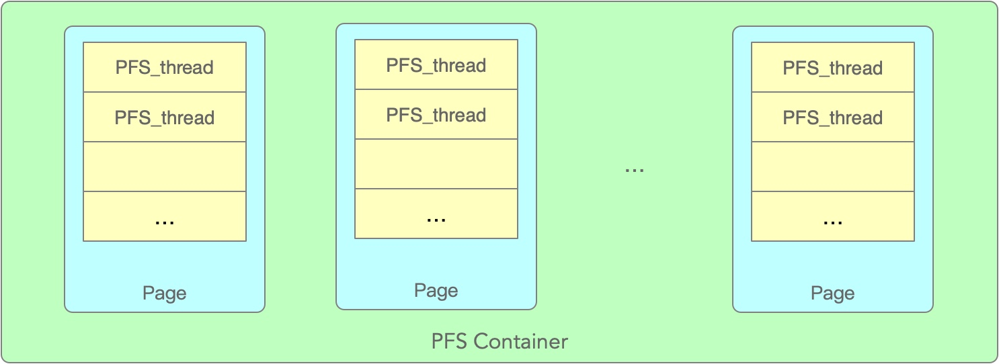

# MySQL · 资源管理 · PFS内存管理分析

**Date:** 2021/04
**Source:** http://mysql.taobao.org/monthly/2021/04/03/
**Images:** 2 images downloaded

---

数据库内核月报

 [
 # 数据库内核月报 － 2021 / 04
 ](/monthly/2021/04)

 * 当期文章

 MySQL · 内核特性 · Automatic connection failover
* MongoDB · 内核特性 · 一致性模型设计与实现
* MySQL · 资源管理 · PFS内存管理分析
* MySQL · HTAP · 分析型执行引擎
* MySQL · 内核分析 · InnoDB主键约束和唯一约束的实现分析
* MySQL · 源码阅读 · Window function解析

 ## MySQL · 资源管理 · PFS内存管理分析 
 Author: 之枢 

 ## 引言
Performance schema(PFS)是mysql提供的强大的性能监控诊断工具。
PFS将采集到的性能数据存储在performance_schema存储引擎中，全部保存在内存。打开pfs会带来一定的额外开销，为了尽可能小的影响业务，PFS的性能和内存管理也显得非常重要了。

[MySQL · 最佳实践 · 今天你并行了吗？—洞察PolarDB 8.0之并行查询](http://mysql.taobao.org/monthly/2019/11/01/)
在PolarDB 8.0中，我们领先社区支持了并行查询，Performance schema也添加了对并行查询的支持，因为并行的原因，对PFS带来了更大的并发访问的挑战。

[MySQL · 引擎特性 · Performance_schema 内存分配](http://mysql.taobao.org/monthly/2020/04/05/)
这篇已经对PFS的内存分配做了整体流程的分析，本文主要更深入分析下pfs的内存管理的底层机制，以及一些改进思路。
本文代码基于Mysql-8.0.24版本。

简单总结一下PFS内存分配模型：

* 一旦分配直到shutdown不会释放，但会复用已分配的内存
* 内存占用会随着负载升高而增加

#### 核心数据结构
PFS_buffer_scalable_container是PFS内存管理的核心数据结构，整体结构如下图：

Container中包含多个page，每个page都有固定个数的records，每个record对应一个事件对象，比如PFS_thread。每个page中的records数量是固定不变的，但page个数会随着负载增加而增长。

#### Allocate时Page选择策略

`PFS_buffer_scalable_container`是PFS内存管理的核心数据结构
涉及内存分配的关键数据结构如下：

`PFS_PAGE_SIZE // 每个page的大小, global_thread_container中默认为256
PFS_PAGE_COUNT // page的最大个数，global_thread_container中默认为256

class PFS_buffer_scalable_container {
 PFS_cacheline_atomic_size_t m_monotonic; // 单调递增的原子变量，用于无锁选择page
 PFS_cacheline_atomic_size_t m_max_page_index; // 当前已分配的最大page index
 size_t m_max_page_count; // 最大page个数，超过后将不再分配新page
 std::atomic<array_type *> m_pages[PFS_PAGE_COUNT]; // page数组
 native_mutex_t m_critical_section; // 创建新page时需要的一把锁
}
`

首先`m_pages`是一个数组，每个page都可能有free的records，也有可能整个page都是busy的，Mysql采用了比较简单的策略，轮训挨个尝试每个page是否有空闲，直到分配成功。如果轮训所有pages依然没有分配成功，这个时候就会创建新的page来扩充，直到达到page数的上限。

轮训并不是每次都是从第1个page开始寻找，而是使用原子变量`m_monotonic`记录的位置开始查找，`m_monotonic`在每次在page中分配失败是加1。

核心简化代码如下：

`value_type *allocate(pfs_dirty_state *dirty_state) {
 current_page_count = m_max_page_index.m_size_t.load();
 
 monotonic = m_monotonic.m_size_t.load();
 monotonic_max = monotonic + current_page_count;
 while (monotonic < monotonic_max) {
 index = monotonic % current_page_count;
 array = m_pages[index].load();
 pfs = array->allocate(dirty_state);
 if (pfs) {
 // 分配成功返回
 return pfs;
 } else {
 // 分配失败，尝试下一个page， 
 // 因为m_monotonic是并发累加的，这里有可能本地monotonic变量并不是线性递增的，有可能是从1 直接变为 3或更大，
 // 所以当前while循环并不是严格轮训所有page，很大可能是跳着尝试，换者说这里并发访问下大家一起轮训所有的page。
 // 这个算法其实是有些问题的，会导致某些page被跳过忽略，从而加剧扩容新page的几率，后面会详细分析。
 monotonic = m_monotonic.m_size_t++;
 }
 }
 
 // 轮训所有Page后没有分配成功，如果没有达到上限的话，开始扩容page
 while (current_page_count < m_max_page_count) {
 // 因为是并发访问，为了避免同时去创建新page，这里有一个把同步锁，也是整个PFS内存分配唯一的锁
 native_mutex_lock(&m_critical_section);
 // 拿锁成功，如果array已经不为null，说明已经被其它线程创建成功
 array = m_pages[current_page_count].load();
 if (array == nullptr) {
 // 抢到了创建page的责任
 m_allocator->alloc_array(array);
 m_pages[current_page_count].store(array);
 ++m_max_page_index.m_size_t;
 }
 native_mutex_unlock(&m_critical_section);
 
 // 在新的page中再次尝试分配
 pfs = array->allocate(dirty_state);
 if (pfs) {
 // 分配成功并返回
 return pfs;
 }
 // 分配失败，继续尝试创建新的page直到上限
 }
}
`

我们再详细分析下轮训page策略的问题，因为`m_momotonic`原子变量的累加是并发的，会导致一些page被跳过轮训它，从而加剧了扩容新page的几率。
举一个极端一些的例子，比较容易说明问题，假设当前一共有4个page，第1、4个page已满无可用record，第2、3个page有可用record。

当同时来了4个线程并发Allocate请求，同时拿到了的m_monotonic=0.

`monotonic = m_monotonic.m_size_t.load();
`

这个时候所有线程尝试从第1个page分配record都会失败(因为第1个page是无可用record)，然后累加去尝试下一个page

`monotonic = m_monotonic.m_size_t++;
`
这个时候问题就来了，因为原子变量++是返回最新的值，4个线程++成功是有先后顺序的，第1个++的线程后monotonic值为2，第2个++的线程为3，一次类推。这样就看到第3、4个线程跳过了page2和page3，导致3、4线程会轮训结束失败进入到创建新page的流程里，但这个时候page2和page3里是有空闲record可以使用的。

虽然上述例子比较极端，但在Mysql并发访问中，同时申请PFS内存导致跳过一部分page的情况应该还是非常容易出现的。

#### Page内Record选择策略
`PFS_buffer_default_array`是每个Page维护一组records的管理类。
关键数据结构如下：

`class PFS_buffer_default_array {
PFS_cacheline_atomic_size_t m_monotonic; // 单调递增原子变量，用来选择free的record
size_t m_max; // record的最大个数
T *m_ptr; // record对应的PFS对象，比如PFS_thread
}
`

每个Page其实就是一个定长的数组，每个record对象有3个状态`FREE`，`DIRTY`, `ALLOCATED`，`FREE`表示空闲record可以使用，`ALLOCATED`是已分配成功的，`DIRTY`是一个中间状态，表示已被占用但还没分配成功。

Record的选择本质就是轮训查找并抢占状态为free的record的过程。
核心简化代码如下：

`value_type *allocate(pfs_dirty_state *dirty_state) {
 // 从m_monotonic记录的位置开始尝试轮序查找
 monotonic = m_monotonic.m_size_t++;
 monotonic_max = monotonic + m_max;

 while (monotonic < monotonic_max) {
 index = monotonic % m_max;
 pfs = m_ptr + index;
 
 // m_lock是pfs_lock结构，free/dirty/allocated三状态是由这个数据结构来维护的
 // 后面会详细介绍它如何实现原子状态迁移的
 if (pfs->m_lock.free_to_dirty(dirty_state)) {
 return pfs;
 }
 // 当前record不为free,原子变量++尝试下一个
 monotonic = m_monotonic.m_size_t++;
 }
}
`

选择record的主体主体流程和选择page基本相似，不同的是page内record数量是固定不变的，所以没有扩容的逻辑。
当然选择策略相同，也会有同样的问题，这里的`m_monotonic`原子变量++是多线程并发的，同样如果并发大的场景下会有record被跳过选择了，这样导致page内部即便有free的record也可能没有被选中。

所以也就是page选择即便是没有被跳过，page内的record也有几率被跳过而选不中，雪上加霜，更加加剧了内存的增长。

#### pfs_lock
每个record都有一个`pfs_lock`，来维护它在page中的分配状态(free/dirty/allocated)，以及`version`信息。

关键数据结构：

`struct pfs_lock {
 std::atomic<uint32> m_version_state;
 }
`

pfs_lock使用1个32位无符号整型来保存version+state信息，格式如下：

**state**
低2位字节表示分配状态。

`state PFS_LOCK_FREE = 0x00
state PFS_LOCK_DIRTY = 0x01
state PFS_LOCK_ALLOCATED = 0x11
`
**version**
初始version为0，每分配成功一次加1，version就能表示该record被分配成功的次数

主要看一下状态迁移代码：

`// 下面3个宏主要就是用来位操作的，方便操作state或version
#define VERSION_MASK 0xFFFFFFFC
#define STATE_MASK 0x00000003
#define VERSION_INC 4

bool free_to_dirty(pfs_dirty_state *copy_ptr) {
 uint32 old_val = m_version_state.load();

 // 判断当前state是否为FREE，如果不是，直接返回失败
 if ((old_val & STATE_MASK) != PFS_LOCK_FREE) {
 return false;
 }

 uint32 new_val = (old_val & VERSION_MASK) + PFS_LOCK_DIRTY;

 // 当前state为free，尝试将state修改为dirty，atomic_compare_exchange_strong属于乐观锁，多个线程可能同时
 // 修改该原子变量，但只有1个修改成功。
 bool pass =
 atomic_compare_exchange_strong(&m_version_state, &old_val, new_val);

 if (pass) {
 // free to dirty 成功
 copy_ptr->m_version_state = new_val;
 }

 return pass;
}

void dirty_to_allocated(const pfs_dirty_state *copy) {
 /* Make sure the record was DIRTY. */
 assert((copy->m_version_state & STATE_MASK) == PFS_LOCK_DIRTY);
 /* Increment the version, set the ALLOCATED state */
 uint32 new_val = (copy->m_version_state & VERSION_MASK) + VERSION_INC +
 PFS_LOCK_ALLOCATED;

 m_version_state.store(new_val);
}
`

状态迁移过程还是比较好理解的, `由dirty_to_allocated`和`allocated_to_free`的逻辑是更简单的，因为只有record状态是free时，它的状态迁移是存在并发多写问题的，一旦state变为dirty，当前record相当于已经被某一个线程占有，其它线程不会再尝试操作该record了。

version的增长是在state变为PFS_LOCK_ALLOCATED时

## PFS内存释放
PFS内存释放就比较简单了，因为每个record都记录了自己所在的container和page，调用deallocate接口，最终将状态置为free就完成了。

最底层都会进入到pfs_lock来更新状态：

`struct pfs_lock {
 void allocated_to_free(void) {
 /*
 If this record is not in the ALLOCATED state and the caller is trying
 to free it, this is a bug: the caller is confused,
 and potentially damaging data owned by another thread or object.
 */
 uint32 copy = copy_version_state();
 /* Make sure the record was ALLOCATED. */
 assert(((copy & STATE_MASK) == PFS_LOCK_ALLOCATED));
 /* Keep the same version, set the FREE state */
 uint32 new_val = (copy & VERSION_MASK) + PFS_LOCK_FREE;

 m_version_state.store(new_val);
 }
}
`

## 内存分配的优化
前面我们分析到无论是page还是record都有几率出现跳过轮训的问题，即便是缓存中有free的成员也会出现分配不成功，导致创建更多的page，占用更多的内存。最主要的问题是这些内存一旦分配就不会被释放。

为了提升PFS内存命中率，尽量避免上述问题，有一些思路如下：

` while (monotonic < monotonic_max) {
 index = monotonic % current_page_count;
 array = m_pages[index].load();
 pfs = array->allocate(dirty_state);
 if (pfs) {
 // 记录分配成功的index
 m_monotonic.m_size_t.store(index);
 return pfs;
 } else {
 // 局部变量递增，避免掉并发累加而跳过某些pages
 monotonic++;
 }
 }
`

另外一点，每次查找都是从最近一次分配成功的位置开始，这样必然导致并发访问的冲突，因为大家都从同一个位置开始找，起始查找位置应该加入一定的随机性，这样可以避免大量的冲突重试。

总结如下：

1. 每次Allocate是从最近一次分配成功的index开始查找，或者随机位置开始查找
2. 每个Allocate严格轮训所有pages或records

## 内存释放的优化
PFS内存释放的最大的问题就是一旦创建出的内存就得不到释放，直到shutdown。如果遇到热点业务，在业务高峰阶段分配了很多page的内存，在业务低峰阶段依然得不到释放。

要实现定期检测回收内存，又不影响内存分配的效率，实现一套无锁的回收机制还是比较复杂的。
主要有如下几点需要考虑：

1. 释放肯定是要以page为单位的，也就是释放的page内的所有records都必须保证都为free，而且要保证待free的page不会再被分配到
2. 内存分配是随机的，整体上内存是可以回收的，但可能每个page都有一些busy的，如何更优的协调这种情况
3. 释放的阈值怎么定，也要避免频繁分配+释放的问题

针对PFS内存释放的优化，PolarDB已经开发并提供了定期回收PFS内存的特性，鉴于本篇幅的限制，留在后续再介绍了。

 阅读： - 

本作品采用[知识共享署名-非商业性使用-相同方式共享 3.0 未本地化版本许可协议](http://creativecommons.org/licenses/by-nc-sa/3.0/)进行许可。

 