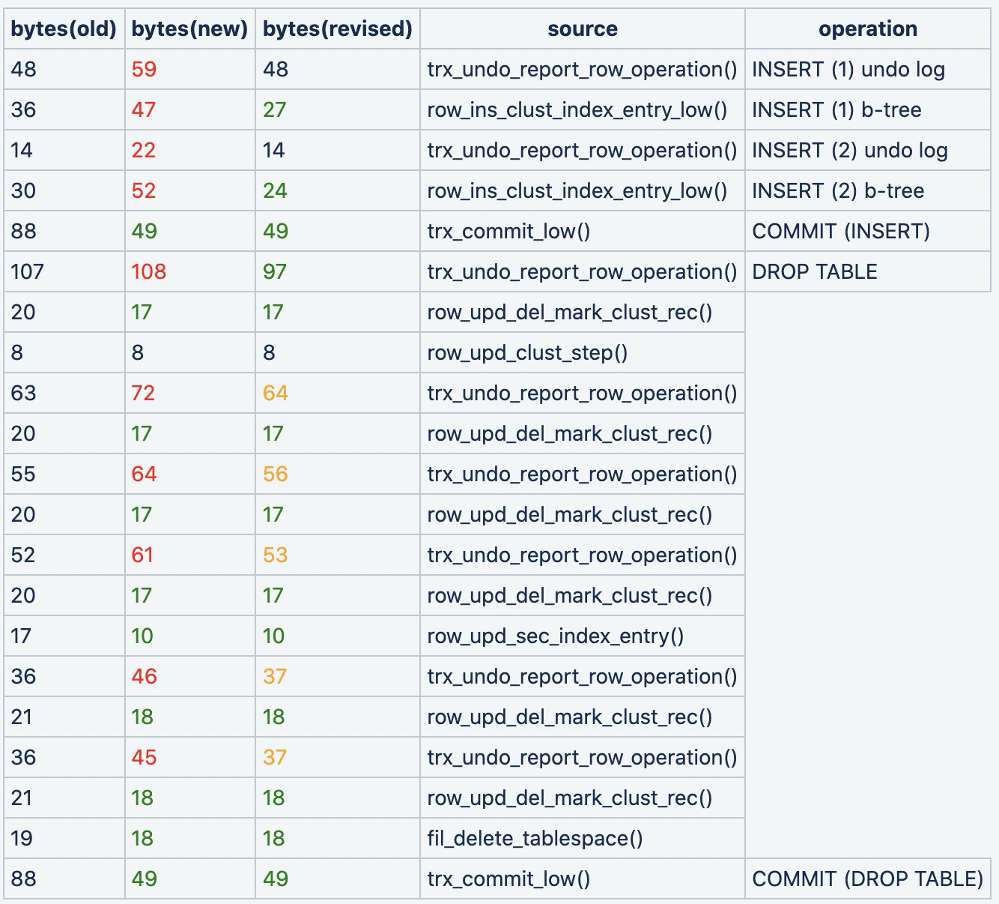
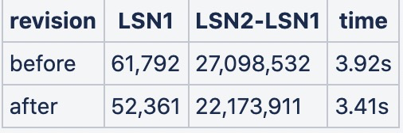

# MySQL · 引擎特性 · Redo Log record编码格式

**Date:** 2022/01
**Source:** http://mysql.taobao.org/monthly/2022/01/02/
**Images:** 7 images downloaded

---

数据库内核月报

 [
 # 数据库内核月报 － 2022 / 01
 ](/monthly/2022/01)

 * 当期文章

 DataBase · 理论基础 · B+树数据库加锁历史
* MySQL · 引擎特性 · Redo Log record编码格式
* SQL Server · 引擎特性 · 从SQL Server看列式存储
* MySQL · 源码分析 · TABLE信息的生命周期

 ## MySQL · 引擎特性 · Redo Log record编码格式 
 Author: jiasu.zzy 

 ## 引言
为保证数据库在意外崩溃或是断电重启之后依然保证一致性和持久性，MySQL InnoDB需要对每个page修改操作在磁盘上记录redo log，以便在崩溃恢复时重新应用内存中丢失的修改，恢复到崩溃前的状态。

redo log record的编码方式对数据库的性能是有一定影响的，表现在以下几点：

1. 编码方式影响redo log的大小，占用空间越是小，越是能减少写放大，提高写性能，同时也能减少崩溃恢复时扫描redo log的开销以及物理复制的网络传输开销（不同于基于binlog的逻辑复制，PolarDB基于redo log的物理复制性能更高）
2. 编码方式影响redo log的应用速度，应用速度越是快，越是能减少崩溃恢复的时间，同时也会提高物理复制性能
​

另外，编码方式也会影响代码的开发以及维护复杂度，现在流行的云原生数据库架构中redo日志具有核心地位（如Amazon Aurora将redo日志下沉到了存储层），合适的编码方式或许能简化一部分代码开发和维护工作。

## MySQL 8.0的redo log record编码
在MySQL 8.0中，记录对某个page进行修改的redo log record里通常会包含一些大概率分布在特定范围内的数值，比如标识一个page的space_id和page_no，而针对这种数值，innodb设计了一种简单的编码规则来予以压缩存储。下面就先介绍几种常见的编码方式。

### 32位压缩格式（占用1~5字节）
针对前缀连续出现0，以及前缀连续出现1，这两种情况的值，进行了压缩表示。
​

前缀连续出现0：

连续出现25个0，1字节：0nnnnnnn 表示0~127

连续出现18个0，2字节：10nnnnnn nnnnnnnn 表示128~16511

连续出现11个0，3字节：110nnnnn nnnnnnnn nnnnnnnn 表示16512~2113663

连续出现4个0，4字节： 1110nnnn nnnnnnnn nnnnnnnn nnnnnnnn 表示2113664~270549119

前缀连续出现1：

连续出现22个1，2字节：111110nn nnnnnnnn 表示0xFFFFFC00~0xFFFFFFFF

连续出现15个1，3字节：1111110n nnnnnnnn nnnnnnnn 表示0xFFFE0000~0xFFFFFBFF

连续出现8个1，4字节： 11111110 nnnnnnnn nnnnnnnn nnnnnnnn 表示0xFF000000~0xFFFDFFFF

其他情况，占用5字节：11110000 nnnnnnnn nnnnnnnn nnnnnnnn nnnnnnnn
​

具体代码见storage/innobase/include/mach0data.ic里的mach_write_compressed函数。**这种压缩格式适合在比较小的值或者特别大的值频繁出现的情况下使用，space_id和page_no就正好是这样的值**。

### 64位低压缩率格式（占用5~9字节）
将一个64位的值分为两部分，高位的前32bit使用上述的32位压缩格式进行存储，占用1~5字节，低位的后32bit不压缩直接存储，占用4字节。总共占用字节数

具体代码见storage/innobase/include/mach0data.ic里的mach_u64_parse_compressed函数。**这种格式适合在高位32位部分值特别小或特别大，而低位32位部分的值分布比较均匀的情况下使用**。

### 64位高压缩率格式（占用1~11字节）
将一个64位的值分为两部分，如果高位的前32bit都是0，那么直接写入低位32bit的压缩格式，占用1~5字节。

如果高位的32bit不全为0，则首个字节写入0xFF，之后写入高位32bit的压缩格式，共占用2~6字节；然后写入低位32bit的压缩格式，占用1~5字节，这种情况下总占用就是3~11字节。

具体代码见storage/innobase/include/mach0data.ic里的mach_u64_read_much_compressed函数。这种64位压缩格式比前一种适用范围窄一些，适合存储比较小的值。
​

### redo log record编码
下面介绍redo log record的编码格式。

redo log record有很多不同类型，首先每个record的第一个字节就是用来标识其类型的，目前MySQL 8.0版本中有五十多种redo record类型。

第一个字节：

1. 第一个bit，single_rec_flag，1表示这是单条redo log record组成的mtr，0表示这是多条redo log record组成的mtr
2. 后面7个bit，表示redo log record type

和特定page相关联的redo record，在第一个字节之后跟着的是space_id和page_no，并且都是使用上文介绍的32位压缩格式进行编码。

紧接着space_id和page_no之后的，就是各个record类型自己的log record body部分，每个类型有自己特定的编码方式。总体格式如下图所示

当然也有一些redo log record类型不包含space_id和page_no，比如MLOG_TABLE_DYNAMIC_META类型，用于记录表的auto_inc值，其中的table_id、dynamic metadata version以及auto_inc数值都是使用的上文所述的64位高压缩率格式编码。

本文不对每个具体的redo log record编码以及实现进行分析，感兴趣的读者可以参考[https://zhuanlan.zhihu.com/p/440476383](https://zhuanlan.zhihu.com/p/440476383)
​

## MariaDB社区动态
MariaDB从10.2版本之后便开始使用MySQL 5.7的InnoDB引擎，也继承了InnoDB的redo log record编码方式。不过从10.6版本之后MariaDB就对原本InnoDB的redo log record编码格式进行了比较大的改动，以期望得到更优的性能。
​

在[https://jira.mariadb.org/browse/MDEV-12353](https://jira.mariadb.org/browse/MDEV-12353)中，分析了若干mysql innodb原有redo log格式导致的性能问题：

1. 原本的redo log record没有包含它本身的长度，在crash recovery时不得不依次解析每个字节后才能得到完整的record
2. 原本的redo log record中包含了一些冗余内容，特别是需要使用mlog_parse_index函数来parse的record类型（在MySQL 8.0中，这些类型包括但不限于MLOG_COMP_REC_INSERT、MLOG_COMP_REC_UPDATE_IN_PLACE、MLOG_COMP_REC_DELETE、MLOG_COMP_PAGE_REORGANIZE等等，其中许多都是需要高频使用的）
3. 如果出现连续多个针对同一个page进行修改的redo log record，会把space_id和page_no重复多次写入redo，一方面提高了写放大另一方面也加重了crash recovery时的解析负担

针对这些存在的问题，MariaDB 10.6版本对redo log record编码格式进行了比较大的改动，总结如下：

1. 调整了log type的数量，缩减为12个type，其中有7种是代表page改动的，5种代表文件操作的，其中7种page改动的类型为：
 
 FREE_PAGE：释放一个page
2. INIT_PAGE：填零初始化一个page
3. WRITE：代表在page特定的偏移量处写入一串字节数据
4. MEMSET：与WRITE类型类似，但不同的是，会指定一个要写的data_length，而这个data_length会大于提供的字节串长度，apply时字节串会被重复地写入直到达到data_length长度为止
5. MEMMOVE：与MEMSET类似，但不同的是，会提供一个源数据的偏移量位置，apply时会从源位置拷贝数据到指定的位置
6. EXTENDED：仅靠WRITE/MEMSET/MEMMOVE来描述修改有时反而会让redo内容膨胀，这时候Mariadb就选择了使用EXTENDED类型按照传统的innodb方式来记录逻辑修改，EXTENDED表示此条record接下来会有subtype标识，目前有11种subtype
7. OPTION：表示crash recovery时可以被跳过的record类型，用于其他用途，以后会向此类型的subtype中添加checksum、binlog或是sql语句等内容（参考https://jira.mariadb.org/browse/MDEV-18976）

 调整redo log record的header格式如下：
 1. 第一个字节：第一个bit位是same_page，标识本条record是否与上一条record针对同一个page，如果是非page的操作，也会被置为1
2. 第一个字节：接下来3个bit位是log type
3. 第一个字节：后4个bit位是log record的长度，能表示长度范围为1～15的log record，对于长度超过15的record，之后会紧跟着上文所述的32位压缩格式编码的add_len，record的长度就是15+add_len
4. 对于page的修改，紧跟着add_len（如果有的话）之后的是space_id和page_no，分别都使用了上文所述的32位压缩格式表示

对于最经常使用的WRITE类型redo log record，后面跟着的是32位压缩格式的页内便宜offset（占用大小是1～3字节，因为page最大为16k）和要写入的数据内容
​

### 为什么需要EXTENDED类型

WRITE/MEMSET/MEMMOVE类型的redo record代表了对一个page纯粹物理上的改动，并不包含任何逻辑上的信息，对于某些修改操作，其占用的空间会比原本的逻辑编码方式要大。

以innodb中频繁出现的写undo操作为例：原本innodb在记录undo写入时是生成一条MLOG_UNDO_INSERT类型的redo log record，编码格式如下图所示

具体格式解析并应用的代码见MySQL 8.0的storage/innobase/trx/trx0rec.cc的trx_undo_parse_add_undo_rec函数，如下

`/** Parses a redo log record of adding an undo log record.
 @return end of log record or NULL */
byte *trx_undo_parse_add_undo_rec(byte *ptr, /*!< in: buffer */
 byte *end_ptr, /*!< in: buffer end */
 page_t *page) /*!< in: page or NULL */
{
 ulint len;
 byte *rec;
 ulint first_free;

 if (end_ptr < ptr + 2) {
 return (nullptr);
 }

 len = mach_read_from_2(ptr);
 ptr += 2;

 if (end_ptr < ptr + len) {
 return (nullptr);
 }

 if (page == nullptr) {
 return (ptr + len);
 }

 first_free = mach_read_from_2(page + TRX_UNDO_PAGE_HDR + TRX_UNDO_PAGE_FREE);
 rec = page + first_free;

 mach_write_to_2(rec, first_free + 4 + len);
 mach_write_to_2(rec + 2 + len, first_free);

 mach_write_to_2(page + TRX_UNDO_PAGE_HDR + TRX_UNDO_PAGE_FREE,
 first_free + 4 + len);
 ut_memcpy(rec + 2, ptr, len);

 return (ptr + len);
}
`

可以发现apply一条MLOG_UNDO_INSERT类型redo record本质上就是两件事情：

1. 把undo record的内容append拷贝到undo page里
2. 更新undo page的first_free标记位

这条redo所占用的空间是1+1~5+1~5+2+length字节，即5～13+length字节
​

而如果纯粹使用非EXTENDED类型的物理编码方式，这条MLOG_UNDO_INSERT会被拆解成以下两条redo record：

1. WRITE类型：包含space_id和page_no，在偏移量TRX_UNDO_PAGE_HDR + TRX_UNDO_PAGE_FREE处修改2字节的length，长度为1+1~5+1~5+2，即5~13字节
2. WRITE类型：same_page flag为1，不包含space_id和page_no，在偏移量offset处写入length+4字节的undo数据，长度为1+1~3+1~3+length+4，即7~14+length

​

总共占用空间为12~27+length字节，反而比之前innodb所使用的逻辑编码方式要大，所以mariadb使用了EXTENDED类型的UNDO_APPEND子类型，body部分的编码方式与之前的MLOG_UNDO_INSERT完全一致。其他的EXTENDED子类型具体见mariadb的storage/innobase/include/mtr0types.h

这里引用[https://jira.mariadb.org/browse/MDEV-12353]中的一张对比表格，第一列是原本innodb生成的redo log record大小，第二列是纯粹使用新的物理编码格式的大小，第三列是在引入EXTENDED子类型后占用的大小。

根据[https://jira.mariadb.org/browse/MDEV-12353](https://jira.mariadb.org/browse/MDEV-12353)中针对update场景的性能测试，修改了redo log record编码后，crash recovery的性能可以提高大约15%

不仅是redo log record的编码方式，最新版本的mariadb还对原本innodb的redo log的文件格式进行了大幅度修改（参考[https://jira.mariadb.org/browse/MDEV-14425](https://jira.mariadb.org/browse/MDEV-14425)），具体细节以后有时间会继续介绍。

 阅读： - 

本作品采用[知识共享署名-非商业性使用-相同方式共享 3.0 未本地化版本许可协议](http://creativecommons.org/licenses/by-nc-sa/3.0/)进行许可。

 