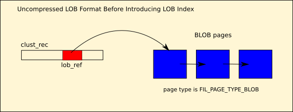
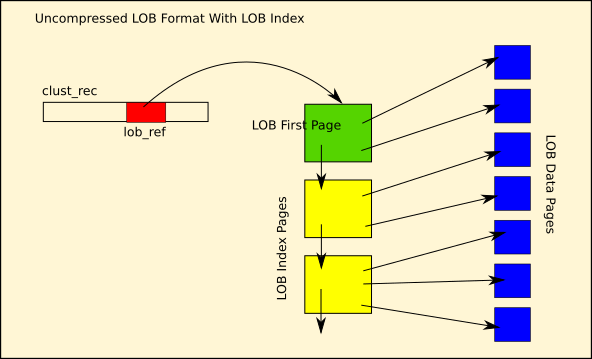
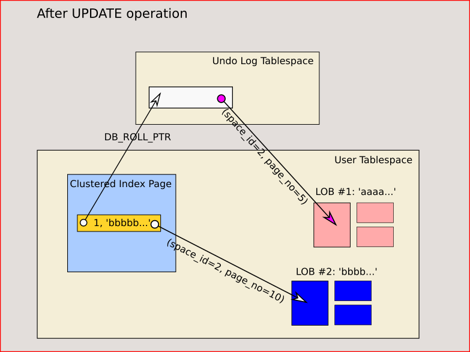
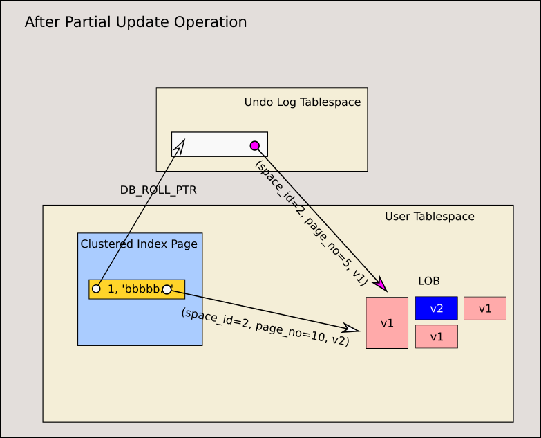

# InnoDB · 引擎特性 · LOB 物理结构

**Date:** 2022/05
**Source:** http://mysql.taobao.org/monthly/2022/05/03/
**Images:** 5 images downloaded

---

数据库内核月报

 [
 # 数据库内核月报 － 2022 / 05
 ](/monthly/2022/05)

 * 当期文章

 MySQL · 引擎特性 · InnoDB Physiological logging 原理分析
* MySQL · 引擎特性 · InnoDB unique check 的问题
* InnoDB · 引擎特性 · LOB 物理结构
* MySQL · undolog 的purge

 ## InnoDB · 引擎特性 · LOB 物理结构 
 Author: Yang Yuming 

 ## InnoDB LOB 物理结构

在 InnoDB 引擎中，对于 VARCHAR、VARBINARY、BLOB、TEXT 这类可变长字段，如果数据长度过长，会将其单独存储在主索引记录之外的 LOB page 上（从主索引所属的 tablespace 上分配），LOB 字段对应的主索引记录中只存储一个定长的 reference 指向它，而二级索引中的记录不会关联外部存储的 LOB 字段。

接下来我们主要介绍 LOB 字段的存储结构。

在 MySQL 8.0 引入 [Partial Update of JSON documents](https://dev.mysql.com/blog-archive/partial-update-of-json-values/) 功能之前，InnoDB 将一个 LOB 字段直接存储在多个 LOB page 中，这些 LOB page 组成一个单向链表，如下图所示：

主索引记录中可以包含多个 LOB reference，每个 LOB reference 指向 LOB 外部存储的第一个 page，之后的每个 LOB page 指向下一个 LOB page，这个单向链表中每个 LOB page 的类型都表示为 FIL_PAGE_TYPE_BLOB，即所有的 LOB page 类型都是一样的。

我们看到使用单项链表来组织 LOB page 非常简单，但限制是无法高效地随机访问 LOB 中的不同位置。例如，如果我们要访问的数据在第三个 LOB page 中，我们必须要先访问第一个 page 再访问第二个 page，最后才能访问第三个目标 page。如果 LOB 字段包含更多的 page，这个问题会影响更大，随机访问 LOB 中的数据是非常低效的。

因此我们需要一种更高效的方式来支持 LOB 数据的随机访问，首先要改变 LOB 字段的外部存储格式。MySQL 8.0 使用了 LOB index 来索引 LOB page，从而支持随机访问快速地定位到 LOB page。

如下图所示，LOB data page 存储实际的 LOB 数据，与旧版本不同的是增加了一层对 LOB data page 的索引，这些索引项存储在 LOB index page 里面，所有 LOB index page 组成一个单项链表。主索引记录中的 LOB reference 指向第一个 index page（LOB first page），随机访问 LOB 数据时，先在 index page 中顺序遍历索引项，找到目标 LOB page no 后再去读取 LOB page。理论上来说，对于非常大的字段，顺序遍历 index page 链表也不是最高效的方法，需要增加多级索引对 index page 进行索引，但是一般情况下单层索引已经足够了。

所有 LOB index 索引项组成双向链表，存储在 LOB first page 和 LOB index page 中，每个索引项主要包含如下信息：

* 前后索引项指针，构成双向链表；
* LOB data page number；
* 数据量（bytes）；
* 事务信息，trx id、undo no 等；
* 旧版本索引项链表；
* 该索引项所属的 LOB 版本号；

可以看到，前三项信息就可以支持 LOB 数据的随机访问，而事务信息、旧版本链表、LOB 版本号是为了支持事务隔离性。

利用 LOB index 的存储方式，MySQL 8.0 支持了 JSON 字段的部分更新，由于可以高效地随机访问 LOB 数据，对于频繁更新大 JSON 字段部分数据的场景有非常大的性能提升。在 8.0 版本之前，如果对一个 JSON 字段中的很小的一部分进行更新，也会将整个 JSON 数据重新写入一遍，而 8.0 版本的方式是通过 LOB index 查找 UPDATE 操作涉及的 LOB page，再以最小的代价更新 LOB page，有效降低了磁盘 IO。需要注意的是，最小的更新单元是每个 LOB page，即一个 LOB page 中的数据只有部分被更新，也会重新写入整个更新后的 LOB page。

## LOB 字段的 MVCC

在 MySQL 8.0 之前，LOB 字段的更新会重新写入整个 LOB 数据，因此对于 LOB 的 MVCC，每个 LOB 有一个自己版本号，其中的所有 LOB page 都属于同一个版本。如下图所示，表的主索引中有一个数据行，并且有一个 LOB 字段，主索引记录包含一个 LOB reference 指向 LOB 外部存储。

对 LOB 字段执行一次 update 之后：

* 在 user tablespace 存在两个版本的 LOB 数据：旧版本的 LOB 只能通过 undo log 中的记录访问到，主索引记录的 LOB reference 指向新版本的 LOB；
* update 操作产生了一个 undo log 记录，这个 undolog record 指向旧版本 LOB；
* 主索引记录通过 roll_ptr 字段指向 undo log record，从而支持多版本查询；
* undo log 记录中不直接存储 LOB，而是通过 LOB reference 指向 user tablespace 中的 LOB；
* undo log 记录中的 LOB reference 和主索引记录中的 LOB reference 是不同的版本；

其它事务首先读取主索引记录，如果发现该记录的最新版本不可见，就通过 roll_ptr 找到 undo log 记录并构建旧版本的记录，这个旧版本记录会指向旧版本的 LOB。

为了支持了 JSON 字段的部分更新，LOB 字段的 MVCC 方式也要做相应的修改。如下图所示，在 LOB 字段更新了部分数据后，user tablespace 中还是只有一个 LOB，更新操作只会修改部分 LOB data page，并且 LOB 中同时存在被修改 LOB data page 的多个版本：

我们看到 undo log 和主索引中记录中的 LOB reference 都指向同一个 LOB，但是 LOB reference 中会保存不同的版本号：例如，undo log 记录中的 LOB reference 包含版本号是 v1，主索引记录中 LOB reference 包含版本号是 v2（新版本）。LOB index 中的每个索引项（LOB index entry）都包含一个旧索引项的链表，用于访问到指定的 LOB 版本。

 阅读： - 

本作品采用[知识共享署名-非商业性使用-相同方式共享 3.0 未本地化版本许可协议](http://creativecommons.org/licenses/by-nc-sa/3.0/)进行许可。

 