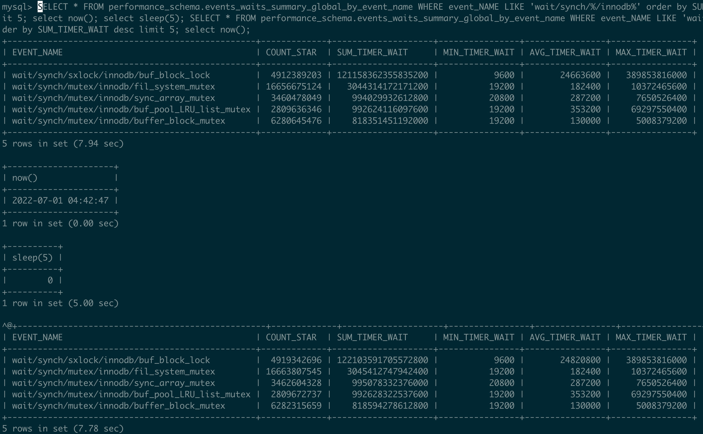
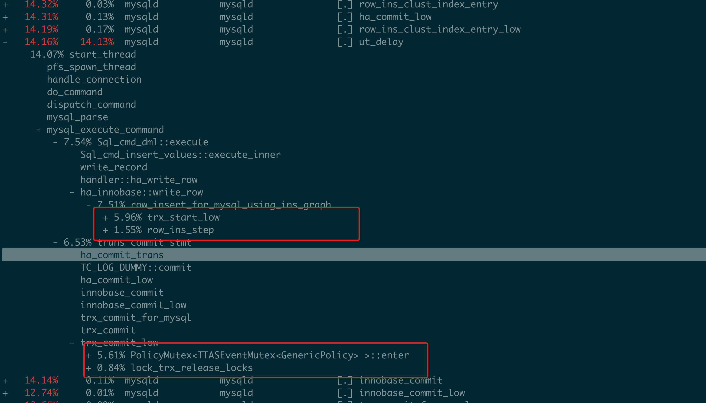
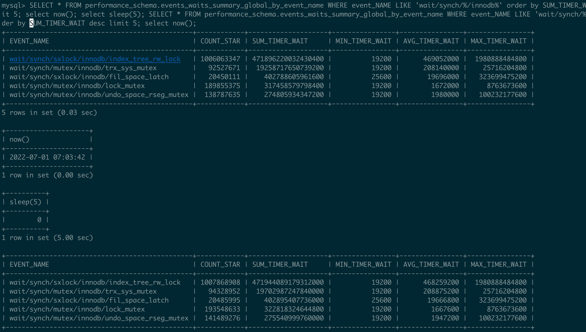

# MySQL · 引擎特性 · 通过performance_schema 定量分析系统瓶颈

**Date:** 2022/06
**Source:** http://mysql.taobao.org/monthly/2022/06/02/
**Images:** 4 images downloaded

---

数据库内核月报

 [
 # 数据库内核月报 － 2022 / 06
 ](/monthly/2022/06)

 * 当期文章

 MySQL · 引擎特性 · PolarDB-CloudJump：优化基于云存储服务的云数据库(发表于VLDB 2022)
* MySQL · 引擎特性 · 通过performance_schema 定量分析系统瓶颈
* MySQL · 源码阅读 · RAND 表达式
* MySQL中的HyperGraph优化器
* MYSQL·分区表特性·一致性哈希算法应用
* PolarDB ·性能大赛·云原生共享内存数据库性能优化

 ## MySQL · 引擎特性 · 通过performance_schema 定量分析系统瓶颈 
 Author: baotiao 

 目前在系统里面, 我们可以通过perf 或者 pt-pmp 汇总堆栈的方式来查看系统存在的热点, 但是我们仅仅能够知道哪些地方是热点, 却无法定量的说这个热点到底有多热, 这个热点占整个访问请求的百分比是多少? 是10%, 还是40%, 还是80%?

所以我们需要一个定量分析系统瓶颈的方法以便于我们进行系统优化.

本文通过Performance_schema 来进行定量的分析系统性能瓶颈.

原理如下:

performance_schema.events_waits_summary_global_by_event_name 这里event_name 值得是具体的mutex/sx lock, 比如trx_sys->mutex, lock_sys->mutex 等等, 这个table 保存的是汇总信息.

具体performance_schema 信息在这里 https://dev.mysql.com/doc/mysql-perfschema-excerpt/8.0/en/performance-schema-wait-summary-tables.html

通过两次调用具体的timer wait 可以算出具体某一个mutex/sx lock 等待的时间.

如果这个时间再除以每一个线程就可以算出每一个线程在这个Lock 上大概的等待时间, 然后就可以算出平均1s 内等在该mutex/sx lock 的占比.

比如我们知道在sysbench oltp_read_write 的小表测试中, 通过pstack 可以看到主要卡在page latch 上, 那么我们需要分析等待patch latch 占用了整个路径的时间大概是多长.

这里使用256 thread 进行压测, 计算出来等待的时间大概是

buf_block_lock = (122103591705572800-121158362355835200)/5/207/1000000000 = 913ms

也就是平均 1s 里面, 每一个thread 有913ms 等待在page lock 上, 占比90%. 这个信息和多次pstack 的信息也基本吻合.

fil_system_mutex = (3045412747942400-3044314172171200)/5/207 = 1ms

也就是平均1s 里面等待在fil_system_mutex 只有1ms, 占比0.1%

比如我们最常见的 oltp_insert 非 auto_inc insert 的场景中, 通过pstack 可以看到主要卡在trx_sys->mutex, 那么这个trx_sys->mutex 具体有多热呢?

以下是perf 相关信息.

上面红框下主要的热点都是需要去获得trx_sys->mutex, 从而可以操作全局活跃事务数组.

这里使用256 thread 进行压测, 计算出来等待的时间大概是

trx_sys_mutex =(19702987247840000-19258717650739200)/5/250/1000000000 = 355 ms

那么等待trx_sys->mutex 上占比大概是35%.

上面还有一个看过去大头的btree 上面的 index_tree_rw_lock 占比呢

index_tree_rw_lock = (471944089179312000-471896220032430400)/5/250/1000000000 = 38ms

虽然数据大, 因为跑的久, 但是其实这里只有3% 的占比

tips:

对比来说 perf 看到的信息是on-cpu 信息, 但是因为MySQL 的mutex/sxlock 都是通过backoff 机制进行, 在每一次线程切换出去之前都进行一段时间的spin, 所以mysql 的on-cpu 信息可以一定程度反应off-cpu 的结果.

pstack 更体现的是某一时刻off-cpu 的信息

performance_schame wait_event 也体现的是off-cpu 的信息.

 阅读： - 

本作品采用[知识共享署名-非商业性使用-相同方式共享 3.0 未本地化版本许可协议](http://creativecommons.org/licenses/by-nc-sa/3.0/)进行许可。

 