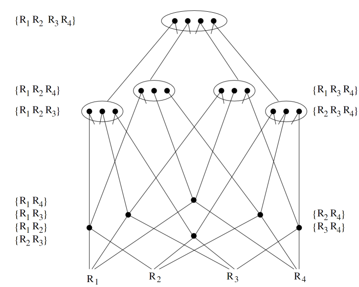
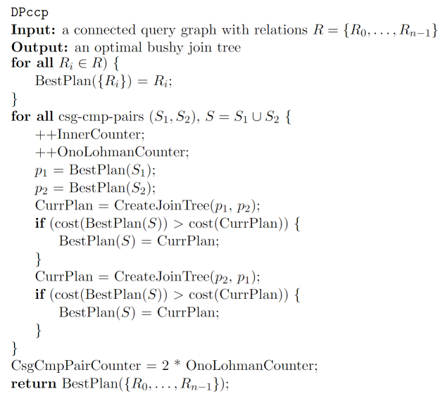
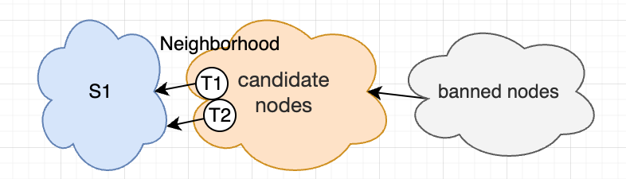
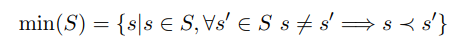
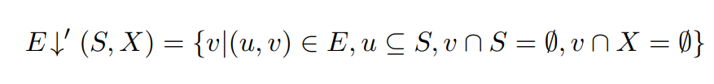
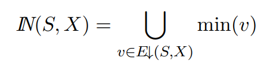
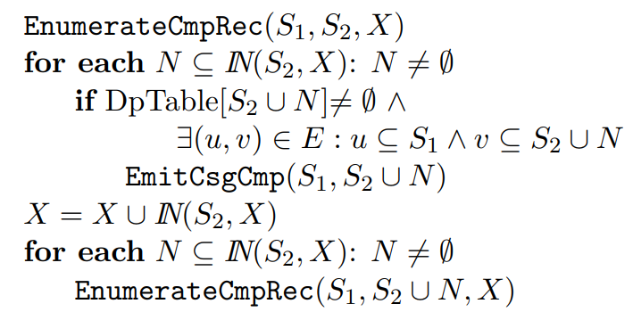
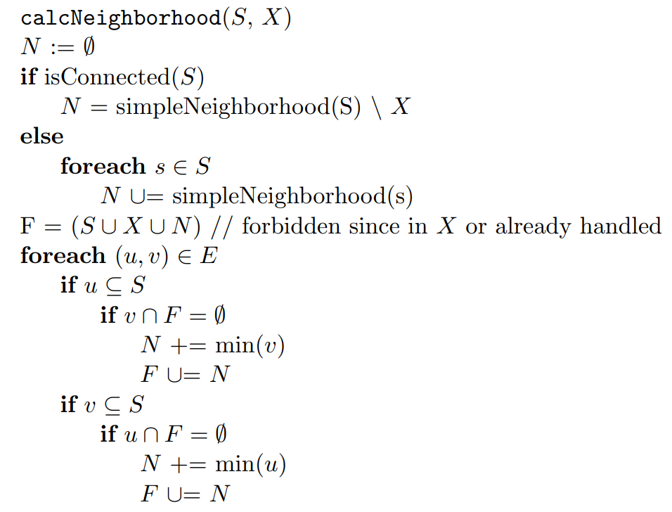

# MySQL中的HyperGraph优化器

**Date:** 2022/06
**Source:** http://mysql.taobao.org/monthly/2022/06/04/
**Images:** 10 images downloaded

---

数据库内核月报

 [
 # 数据库内核月报 － 2022 / 06
 ](/monthly/2022/06)

 * 当期文章

 MySQL · 引擎特性 · PolarDB-CloudJump：优化基于云存储服务的云数据库(发表于VLDB 2022)
* MySQL · 引擎特性 · 通过performance_schema 定量分析系统瓶颈
* MySQL · 源码阅读 · RAND 表达式
* MySQL中的HyperGraph优化器
* MYSQL·分区表特性·一致性哈希算法应用
* PolarDB ·性能大赛·云原生共享内存数据库性能优化

 ## MySQL中的HyperGraph优化器 
 Author: 虚室 

 ## 问题定义

### Join graph
为了应用经典的图算法，我们需要通过join构建出一张图，该图的定义为

* join语句中的每一个table都可以作为一个节点
* join语句中的每一个predicate都可以作为一条边

### Join tree
在经典的volcano模型中，每个query 会转成一颗树去执行，而join 部分也会转为其中的子树。不同的join tree对应不同的执行顺序，经典的join tree可以分为三类：left-deep、zig-zag 和 bushy

### 问题叙述
输入：一个join graph $G = (V, E)$

输出：一个join tree $T$，使得$C(T)$最小

\[T = Solve(G)\]

## DP算法（bottom-up）
Join Ordering的动态规划算法可以避免无谓的计算，比如：

\(C(R_1\Join R_2\Join R_3\Join R_4) > C(R_1\Join R_3\Join R_1\Join R_4) \\
if \space C(R_1\Join R_2\Join R_3) > C(R_1\Join R_3\Join R_2)\)
更形式化的描述是：

 如果一个join tree T是最优的，那么T的每个子树也是最优的

根据上面的理论，我们可以确定DP算法的大致思路：

* 将大图**划分**为子图，首先求得子图的最优join tree
* 通过组合子图的join tree来进一步求得大图的join tree

比如一个join graph其可能有四个表${R_1, R_2, R_3, R_4}$，动态规划算法流程如下

* 我们先考虑集合大小为1的解
* 当求解集合大小为$k$ 的解时，我们会将其划分为一对子集来求解



该算法需要注意

1. 我们在将子集对的join tree合并成大的时，需要判断两个子集是否可以连接
2. 不同的join tree对应不同的划分方式
 
 如果是left-deep tree，我们只需要结合**大小为1**和 **大小为k-1**的子树
3. 如果是bushy tree，如果需要考虑所有的组合情况

## Dpccp：基于连通子图的枚举
上述算法考虑了所有可能的组合方案。然而，当join graph不是clique的时候，这些方案有很多不合法（两个子图不连通），为了避免这种不合法的方案，Dpccp被提出。
Dpccp的核心策略就是我们只会枚举一对连通的子图。更形式化的说法是

 对于一个图$G=(V, E); V是点的集合，E是边的集合$，假设我们已经解出了一个子图$S_1$，我们需要枚举所有可能的子图$S_2$，$S_2$需要满足以下条件：

 1. $S_1$和 $S_2$至少存在一条边相连：$\exist u \in S_1, \exist v \in S_2, (u, v) \in E$
2. $S_1$和$S_2$不相交
3. $S_1$和 $S_2$是连通图（连通图也就是其内部任意两个点都可以找到一条path连接）

 而根据动态规划算法的要求，$S_2$还需要满足：

 1. $S_2$存在一个最优解

在Dpccp里$S_1$被称之为csg（connect-subgraph），$S_2$被称之为cmp（complement），$(S_1, S_2)$也被称之为csg-cmp pair。由此我们可以得到基本的算法：

### 枚举补图
如果给定一个连通子图$S_1$，DPccp如何枚举它的子图？在算法中，我们是通过邻居节点来枚举补图的，步骤如下：

* 找到该csg的邻居节点：即该节点和$S_1$中的节点存在一条边相连
* 以邻居节点为起点，枚举出候选节点的所有的连通子图



### 枚举顺序
在枚举csg-cmp-pair的时候，我们需要确定一个枚举顺序，使得

* 所有的子图和补图都枚举一遍
* 在枚举一个csg-cmp-pair $<S_1,S_2>$的时候，保证我们已经有$S_1, S_2$的最优解

为了满足上述要求Dpccp会给所有节点排序编号，即使得所有节点有全序关系。
然后按照如下步骤枚举子图$S_1$：

1. 按照从大到小的顺序确定一个初始节点$S ={u}$，其编号为$#u$
2. 找到这个集合$S$的邻居集 $N$，将$N$的所有的子集加入$S$以扩张$S$
 
 $N$中所有节点需要满足其编号 $\le #u$

 递归的进行第二步

整体的算法步骤如下：

1. 找到 csg
2. 枚举csg的所有补图
3. 用邻居扩张csg，然后对新的csg应用步骤2

### 问题

* 在join中，谓词可能会引用多个表：$T_1.x + T_2.y = T_3.x + T_4.y$（HyperGraph）

## Dphyp: 基于hyper graph的枚举
为了解决谓词多多引用问题，Dphyp定义了HyperGraph。HyperGraph与上述Join Graph不同的是

 在HyperGraph中，每个节点是表的集合，其可能包括一个或多个表，我们将其称之为hyper node

HyperGraph相比较普通的图而言，我们需要注意

* 在扩张子图的时候，每个hyper node要么全加入，要么不加入
* Hyper node可能互相包含或者重叠

在Dpccp的时候，我们是通过找到Neighborhood节点，然后逐步加入Neighborhood节点来扩张子图的。所以我们的问题就是：

1. **对于给定的子图 $S_1$，如何正确的计算它的相邻集合**
2. **给定相邻集合，我们如何得到合法的补图**

### 编号
对于HyperGraph中的所有表（不是节点），我们同样将他们编号得到一个全序关系。
对于每个hyper node，其编号为包含表的最小编号，记作：


### 相邻集合
首先我们给出对于子图$S$相邻集合的定义，其中$X$是排除掉的节点（比如编号小于起点的表）

为了简化实现，我们可以只记录每个hyper node的编号，也就是


### 枚举补图
这样我们便可通过将这些编号作为起点来进一步的枚举出所有补图
伪代码如下，该代码的功能是给定$S_1$，枚举其所有补图$S_2$。（其中$B_{min}(S_1) = {t | #t \geq min(S_1)}$）：

1. 计算邻居节点
2. 列举所有可以成为cmp的邻居节点
3. 以邻居节点为初始集，扩张新的补图

其中`EnumerateCmpRec`函数的功能是扩张补图$S_2$：
4. 找到出事集的邻居节点集合
5. 将集合加入$S_2$扩张 $S_2$
 
 列举出所有合法的$S_2$：
6. 进一步扩张$S_2$



### 去重
因为hyper node可能会存在包含或者重叠的关系，所以上述的枚举可能会做很多的冗余工作（比如对于$u_1 ={R_1, R_2, R_3}, u_2={R_2, R_3}$就会重复枚举${R_2, R_3}$）。

所以为了提高效率，我们需要尽量避免这种重复过程。已知在上述过程中，我们会让相邻表作为起点，然后逐步扩张它来生成子图。所以如果有多个hyper node**重叠**/包含，我们只需要保存一个表即可。



## 代码实现

### 数据结构
在Hyper graph中，没个表用其编号（实际就是索引）表示

每个边包含其链接的hyper node，每个hyper node使用位图表示（如果这条边的节点只包含一个表，被称为simple edge）

`struct Hyperedge {
 // The endpoints (hypernodes) of this hyperedge. See the comment about
 // duplicated edges in Node.
 //
 // left and right may not overlap, and both must have at least one bit set.
 NodeMap left;
 NodeMap right;
};

`
每个节点`Node`包含所有引用自己的边：

`struct Node {
 std::vector<unsigned> complex_edges, simple_edges;
 NodeMap simple_neighborhood = 0;
};
`
HyperGraph就是持有所有边和节点的结构体：

`struct Hypergraph {
 std::vector<Node> nodes; // Maximum 8*sizeof(NodeMap) elements.
 std::vector<Hyperedge> edges;
};
`

### 流程入口
入口代码：

`AccessPath *FindBestQueryPlan(THD *thd, Query_block *query_block, string *trace) {
 MakeJoinHypergraph();
 if (EnumerateAllConnectedPartitions()) {
 SimplifyQueryGraph();
 EnumerateAllConnectedPartitions());
 }
 .....construct access path
}
`

### 构建HyperGraph
自底向上的构建节点和边

`bool MakeJoinHypergraph(THD *thd, string *trace, JoinHypergraph *graph) {
 // 1. 构建expression tree
 RelationalExpression *root =
 MakeRelationalExpressionFromJoinList(thd, query_block->top_join_list);
 // 2. 谓词下推:对于无法推到 join/table 中到where 条件，会构建出inner join
 PushDownJoinConditions(thd, root, table_num_to_companion_set, &table_filters,
 &cycle_inducing_edges, trace);
 // 3. 构建HyperGraph
 MakeJoinGraphFromRelationalExpression(thd, root, trace, graph);
}
`

```
void MakeJoinGraphFromRelationalExpression(THD *thd, RelationalExpression *expr,
 string *trace,
 JoinHypergraph *graph) {
 if (expr->type == RelationalExpression::TABLE) {
 graph->nodes.push_back(JoinHypergraph::Node{expr});
 return;
 }

 MakeJoinGraphFromRelationalExpression(thd, expr->left, trace, graph);
 MakeJoinGraphFromRelationalExpression(thd, expr->right, trace, graph);
 const Hyperedge edge = FindHyperedgeAndJoinConflicts(thd, used_nodes, expr);
 graph->graph.AddEdge(edge.left, edge.right);
}

```

构建边（基于CD-C冲突检测算法）

`Hyperedge FindHyperedgeAndJoinConflicts(THD *thd, NodeMap used_nodes,
 Mem_root_array<ConflictRule> conflict_rules(thd->mem_root);
 ForEachJoinOperator(
 expr->left, [expr, &conflict_rules](RelationalExpression *child) {
 if (!OperatorsAreAssociative(*child, *expr)) {
 const NodeMap left = IntersectIfNotDegenerate(
 child->conditions_used_tables, child->left->nodes_in_subtree);
 conflict_rules.push_back(
 ConflictRule{child->right->nodes_in_subtree, left});
 }
 if (!OperatorsAreLeftAsscom(*child, *expr)) {
 const NodeMap right = IntersectIfNotDegenerate(
 child->conditions_used_tables, child->right->nodes_in_subtree);
 conflict_rules.push_back(
 ConflictRule{child->left->nodes_in_subtree, right});
 }
 });

 ForEachJoinOperator(
 expr->right, [expr, &conflict_rules](RelationalExpression *child) {
 if (!OperatorsAreAssociative(*expr, *child)) {
 const NodeMap right = IntersectIfNotDegenerate(
 child->conditions_used_tables, child->right->nodes_in_subtree);
 conflict_rules.push_back(
 ConflictRule{child->left->nodes_in_subtree, right});
 }
 if (!OperatorsAreRightAsscom(*expr, *child)) {
 const NodeMap left = IntersectIfNotDegenerate(
 child->conditions_used_tables, child->left->nodes_in_subtree);
 conflict_rules.push_back(
 ConflictRule{child->right->nodes_in_subtree, left});
 }
 });

 NodeMap total_eligibility_set =
 AbsorbConflictRulesIntoTES(used_nodes, &conflict_rules);

 if (!Overlaps(total_eligibility_set, expr->left->nodes_in_subtree)) {
 total_eligibility_set |= expr->left->nodes_in_subtree;
 total_eligibility_set =
 AbsorbConflictRulesIntoTES(total_eligibility_set, &conflict_rules);
 }
 if (!Overlaps(total_eligibility_set, expr->right->nodes_in_subtree)) {
 total_eligibility_set |= expr->right->nodes_in_subtree;
 total_eligibility_set =
 AbsorbConflictRulesIntoTES(total_eligibility_set, &conflict_rules);
 }
 expr->conflict_rules = std::move(conflict_rules);

 const NodeMap left = total_eligibility_set & expr->left->nodes_in_subtree;
 const NodeMap right = total_eligibility_set & expr->right->nodes_in_subtree;
 return {left, right};
}
`

### DPhyp 算法

入口函数：

`bool EnumerateAllConnectedPartitions(const Hypergraph &g, Receiver *receiver) {
 for (int seed_idx = g.nodes.size() - 1; seed_idx >= 0; --seed_idx) {
 NodeMap seed = TableBitmap(seed_idx);
 NodeMap forbidden = TablesBetween(0, seed_idx);
 NodeMap full_neighborhood = 0;
 NeighborhoodCache cache(0);
 // 1. 找到邻居节点
 NodeMap neighborhood =
 FindNeighborhood(g, seed, forbidden, seed, &cache, &full_neighborhood);
 // 2.枚举所有到补图
 EnumerateComplementsTo(g, seed_idx, seed, full_neighborhood,
 neighborhood, receiver));
 // 3. 扩张子图，然后再继续枚举补图
 ExpandSubgraph(g, seed_idx, seed, full_neighborhood, neighborhood,
 forbidden | seed, receiver));
 }
 return false;
}
`

#### 计算邻居节点

和上述伪代码完全一致，不过这里引入了一个新的数据结构full_neighborhood，该数据结构用于来判定后面的补图和子图是否连通。

`inline NodeMap FindNeighborhood(const Hypergraph &g, NodeMap subgraph,
 NodeMap forbidden, NodeMap just_grown_by,
 NeighborhoodCache *cache,
 NodeMap *full_neighborhood_arg) {
 NodeMap full_neighborhood =
 *full_neighborhood_arg; // Keep us out of aliasing trouble.
 NodeMap neighborhood = 0;

 NodeMap to_search =
 cache->InitSearch(just_grown_by, &neighborhood, &full_neighborhood);
 
 for (size_t node_idx : BitsSetIn(to_search)) {
 // Simple edges.
 // NOTE: This node's simple neighborhood will be added lazily to
 // full_neighborhood below. Forbidden nodes will also be removed below.
 neighborhood |= g.nodes[node_idx].simple_neighborhood;

 // Now go through the complex edges and see which ones point out of the
 // subgraph.
 for (size_t edge_idx : g.nodes[node_idx].complex_edges) {
 const Hyperedge e = g.edges[edge_idx];

 if (IsSubset(e.left, subgraph) &&
 !Overlaps(e.right, subgraph | forbidden)) {
 // e.right is an interesting hypernode (part of E↓'(S,X)).
 full_neighborhood |= e.right;
 if (!Overlaps(e.right, neighborhood)) {
 neighborhood |= IsolateLowestBit(e.right);
 }
 }
 }
 }

 neighborhood &= ~(subgraph | forbidden);
 full_neighborhood |= neighborhood;
 full_neighborhood_arg = full_neighborhood;
 return neighborhood;
}

`

#### 枚举补图

```
template <class Receiver>
[[nodiscard]] bool EnumerateComplementsTo(
 const Hypergraph &g, size_t lowest_node_idx, NodeMap subgraph,
 NodeMap full_neighborhood, NodeMap neighborhood, Receiver *receiver) {
 
 NodeMap forbidden = TablesBetween(0, lowest_node_idx);
 for (size_t seed_idx : BitsSetInDescending(neighborhood)) {
 // 1. 首先考虑simple node（也就是指包括一个表的hyper node）
 // 1.1. simple node <-> simple node
 NodeMap seed = TableBitmap(seed_idx);
 if (Overlaps(g.nodes[seed_idx].simple_neighborhood, subgraph)) {
 // 1.1.1 找到对应的那条边
 for (size_t edge_idx : g.nodes[seed_idx].simple_edges) {
 const Hyperedge e = g.edges[edge_idx];
 if (Overlaps(e.right, subgraph)) {
 // 1.1.2 将csg（subgraph）-cmp（seed）-pair加入dpTable中
 receiver->FoundSubgraphPair(subgraph, seed, edge_idx / 2));
 }
 }
 }
 // 1.2 simple node <-> complex node
 for (size_t edge_idx : g.nodes[seed_idx].complex_edges) {
 const Hyperedge e = g.edges[edge_idx];
 if (e.left == seed && IsSubset(e.right, subgraph)) {
 receiver->FoundSubgraphPair(subgraph, seed, edge_idx / 2));
 }
 }
 
 // 2. 继续扩张补图来进一步完成枚举（感觉这里不应该将TablesBetween(0, seed_idx)加入forbidden）
 NodeMap new_forbidden =
 forbidden | subgraph | (neighborhood & TablesBetween(0, seed_idx));
 NodeMap new_full_neighborhood = 0; // Unused; see comment on TryConnecting.
 NodeMap new_neighborhood = FindNeighborhood(g, seed, new_forbidden, seed,
 &cache, &new_full_neighborhood);
 ExpandComplement(g, lowest_node_idx, subgraph, full_neighborhood, seed,
 new_neighborhood, new_forbidden, receiver));
 }
 return false;
}

```

如果判断子图和补图链接

```
template <class Receiver>
[[nodiscard]] bool TryConnecting(const Hypergraph &g, NodeMap subgraph,
 NodeMap subgraph_full_neighborhood,
 NodeMap complement, Receiver *receiver) {
 for (size_t node_idx : BitsSetIn(complement & subgraph_full_neighborhood)) {
 // 1. 遍历所有既在补图又在full neighborhod中的节点
 // 2. 查看它们是否存在一条边，使得这条边的一个节点完整的包含在子图内
 // Simple edges.
 if (Overlaps(g.nodes[node_idx].simple_neighborhood, subgraph)) {
 for (size_t edge_idx : g.nodes[node_idx].simple_edges) {
 const Hyperedge e = g.edges[edge_idx];
 if (Overlaps(e.right, subgraph) && Overlaps(e.left, complement)) {
 receiver->FoundSubgraphPair(subgraph, complement, edge_idx / 2));
 }
 }
 }

 // Complex edges.
 NodeMap node = TableBitmap(node_idx);
 for (size_t edge_idx : g.nodes[node_idx].complex_edges) {
 const Hyperedge e = g.edges[edge_idx];

 // NOTE: We call IsolateLowestBit() so that we only see the edge once.
 if (IsolateLowestBit(e.left) == node && IsSubset(e.left, complement) &&
 IsSubset(e.right, subgraph)) {
 receiver->FoundSubgraphPair(subgraph, complement, edge_idx / 2)
 }
 }
 }
 return false;
}

```

#### 扩张子图

```
template <class Receiver>
[[nodiscard]] bool ExpandSubgraph(const Hypergraph &g, size_t lowest_node_idx,
 NodeMap subgraph, NodeMap full_neighborhood,
 NodeMap neighborhood, NodeMap forbidden,
 Receiver *receiver) {
 // 1. 针对那些已经求得最优解的子图，我们可以去枚举它们的补图 
 for (NodeMap grow_by : NonzeroSubsetsOf(neighborhood)) {
 NodeMap grown_subgraph = subgraph | grow_by;
 if (receiver->HasSeen(grown_subgraph)) {
 NodeMap new_full_neighborhood = full_neighborhood;
 NodeMap new_neighborhood =
 FindNeighborhood(g, subgraph | grow_by, forbidden, grow_by, &cache,
 &new_full_neighborhood);
 new_neighborhood |= forbidden & ~TablesBetween(0, lowest_node_idx);
 new_neighborhood |= neighborhood;
 EnumerateComplementsTo(g, lowest_node_idx, grown_subgraph,
 new_full_neighborhood, new_neighborhood,
 receiver))
 }
 }
 }
 // 2. 进一步去扩张csg
 for (NodeMap grow_by : NonzeroSubsetsOf(neighborhood)) {
 NodeMap grown_subgraph = subgraph | grow_by;

 NodeMap new_forbidden = (forbidden | neighborhood) & ~grown_subgraph;
 
 NodeMap new_full_neighborhood = full_neighborhood;
 NodeMap new_neighborhood =
 FindNeighborhood(g, subgraph | grow_by, new_forbidden, grow_by, &cache,
 &new_full_neighborhood);

 ExpandSubgraph(g, lowest_node_idx, grown_subgraph,
 new_full_neighborhood, new_neighborhood, new_forbidden,
 receiver));
 }
 }
 return false;
}

```

 阅读： - 

[](http://creativecommons.org/licenses/by-nc-sa/3.0/)
本作品采用[知识共享署名-非商业性使用-相同方式共享 3.0 未本地化版本许可协议](http://creativecommons.org/licenses/by-nc-sa/3.0/)进行许可。

 [

 ](#0)