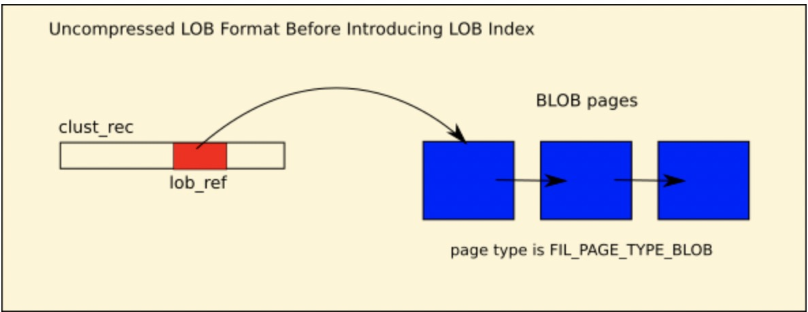
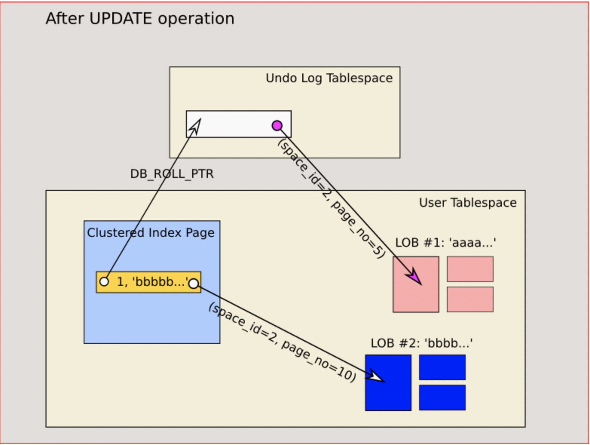
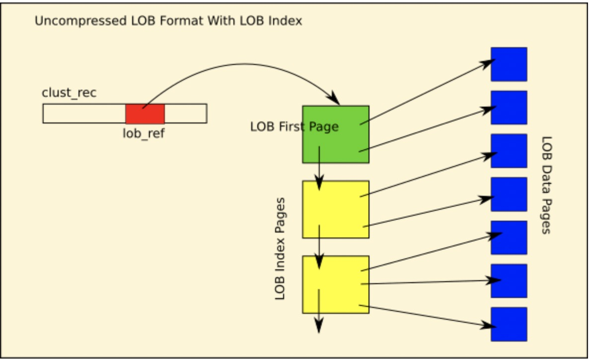
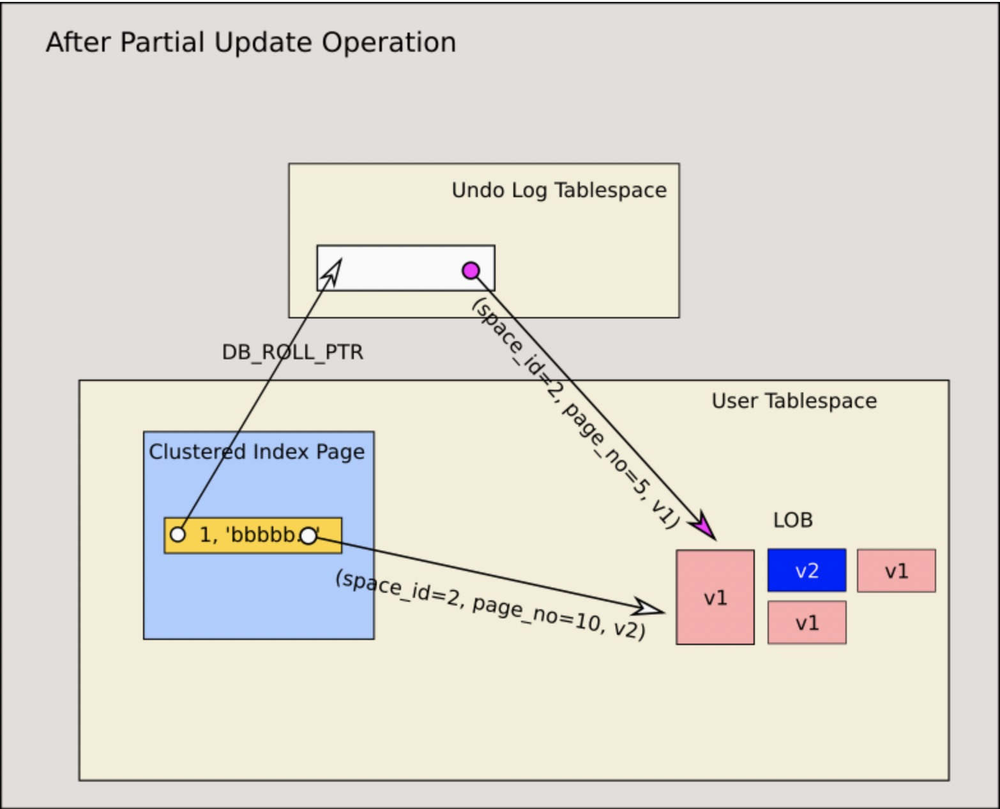

# MySQL · 源码分析 · innodb-BLOB演进与实现

**Date:** 2022/09
**Source:** http://mysql.taobao.org/monthly/2022/09/01/
**Images:** 5 images downloaded

---

数据库内核月报

 [
 # 数据库内核月报 － 2022 / 09
 ](/monthly/2022/09)

 * 当期文章

 MySQL · 源码分析 · innodb-BLOB演进与实现
* PolarDB MySQL · 多主架构 · 全局 Binlog 介绍
* 源码分析 · InnoDB Redo Log 重构
* PolarDB MySQL · PolarTrans事务系统介绍(一)

 ## MySQL · 源码分析 · innodb-BLOB演进与实现 
 Author: yunqian 

 ## BLOB 介绍
InnoDB 存储引擎中所有可变长度类型的字段（如 VARCHAR、VARBINARY、BLOB 和 TEXT）可以存储在主键记录内，也可以存储在主键记录之外的单独 BLOB 页中（在同一表空间内）。所有这些字段都可以归类为大对象。这些大对象要么是二进制大对象，要么是字符大对象。二进制大对象没有关联的字符集，而字符大对象有。在 InnoDB 存储引擎中，字符大对象和二进制大对象的处理方式没有区别，我们使用“BLOB”来指代上述的大对象字段。BLOB不同大小，不同场景，可以全部存储在主键，部分前缀存储在主键，或者全部存储在外部BLOB页中，本篇文章主要集中在BLOB全部存储在外部BLOB页中时，在innodb中是如何实现的，其他的在主键内部或者前缀在主键内部不再展开说明。只有主键可以在外部存储 BLOB 字段，二级索引不能有外部存储的字段，本文的讨论都是围绕着主键展开。

## BLOB 演进
### **5.6 和 5.7 BLOB**
在mysql 5.6和5.7中，innodb实现BLOB的外部存储，实际上将BLOB数据按照页大小切分存储到一批BLOB页中，这些BLOB页从前往后连接成一个链表，在主键上对应字段位置会存储一个指针lob ref(lob ref由 space id，page no，data len等数据构成)指向BLOB页链表的第一个页见,下图：


mysql 5.6 & 5.7 中针对BLOB数据的修改，会创建一个全新的BLOB数据，将主键上lob ref指向新的BLOB数据，undo中对应的lob ref会保存旧的BLOB数据。这样的实现，使得 5.6 和 5.7 中BLOB数据的多版本，完全是由undo来实现，blob只是由lob ref指向定位到数据，可参考下图：


### **8.0 BLOB**
由于mysql 5.6 和5.7中，所有针对blob数据的修改，必须整体替换一个BLOB对象，而BLOB对象占据的空间相对比较大，这样的实现方式一是造成空间的浪费，二是修改效率的降低。针对这些问题，在mysql 8.0中 innodb对BLOB进行了重新设计实现：给BLOB页链表加上索引lob index，这样可以快速定位到BLOB中任何位置，见下图：


在mysql 8.0 中支持了部分更新（partial update），即针对BLOB数据的更新，可以只更新BLOB内的一部分数据（实际上当前只支持特定的json函数）。这个BLOB新的实现解决了mysql 5.6 和 5.7中存在的问题，由于支持partial update，所以BLOB内部就需要维护更新数据的多版本，innodb通过给lob index增加lob versions链表来实现，即lob index不只是连接了前后lob index，串联BLOB页链表，同时lob index维护了对应BLOB页的多版本链表。当对数据进行partial update时，只是对被更新BLOB页增加一个新版本，并将旧版本串联起来，这里面每次partial update都会增加lob version，主键和undo的lob ref指向的都是blob的第一个页 first page，在blob内部基于lob version访问不同版本数据，见下图一次partial update；


## 5.6 & 5.7 BLOB实现
mysql 5.6 和 5.7 中blob设计实现相对简单，在主键和undo的lob ref指向外部的BLOB页链表数据，我们在此处主要分析下增删改查的关键函数实现。

### **insert & update**
BLOB的 update 操作是创建一个全新的版本，更新主键lob ref到新的BLOB，上版本数据保存在undo的lob ref中；insert操作只是创建一个全新的BLOB数据。BLOB的insert和update操作关键实现函数均是btr_store_big_rec_extern_fields，这个函数实现上就是为每个BLOB数据分配BLOB页，数据写入，将BLOB页串成链表，更新lob ref数据，具体见下面函数注解：

`dberr_t btr_store_big_rec_extern_fields(
... ...)
{
 ... ...

 // 遍历big_rec_vec，即遍历所有要插入或者更改的blob
 for (i = 0; i < big_rec_vec->n_fields; i++) {
 field_ref = btr_rec_get_field_ref(
 rec, offsets, big_rec_vec->fields[i].field_no);
 extern_len = big_rec_vec->fields[i].len;
 prev_page_no = FIL_NULL;

 // 对每个blob
 for (;;) {
 buf_block_t* block;
 page_t* page;

 mtr_start(&mtr);

 if (prev_page_no == FIL_NULL) {
 hint_page_no = 1 + rec_page_no;
 } else {
 hint_page_no = prev_page_no + 1;
 }
 // 分配page
alloc_another:
 block = btr_page_alloc(index, hint_page_no,
 FSP_NO_DIR, 0, alloc_mtr, &mtr);

 page_no = buf_block_get_page_no(block);
 page = buf_block_get_frame(block);

 // 将 prev page和刚分配的page 连接起来
 if (prev_page_no != FIL_NULL) {
 buf_block_t* prev_block;
 page_t* prev_page;

 prev_block = buf_page_get(space_id, zip_size,
 prev_page_no,
 RW_X_LATCH, &mtr);
 buf_block_dbg_add_level(prev_block,
 SYNC_EXTERN_STORAGE);
 prev_page = buf_block_get_frame(prev_block);

 if (page_zip) {
 mlog_write_ulint(
 prev_page + FIL_PAGE_NEXT,
 page_no, MLOG_4BYTES, &mtr);
 memcpy(buf_block_get_page_zip(
 prev_block)
 ->data + FIL_PAGE_NEXT,
 prev_page + FIL_PAGE_NEXT, 4);
 } else {
 mlog_write_ulint(
 prev_page + FIL_PAGE_DATA
 + BTR_BLOB_HDR_NEXT_PAGE_NO,
 page_no, MLOG_4BYTES, &mtr);
 }

 } else if (dict_index_is_online_ddl(index)) {
 row_log_table_blob_alloc(index, page_no);
 }

 // 压缩页写入blob page
 if (page_zip) {
 ... ...
 } else {
 // 非压缩页写入blob page，并和prev page串成链表
 mlog_write_ulint(page + FIL_PAGE_TYPE,
 FIL_PAGE_TYPE_BLOB,
 MLOG_2BYTES, &mtr);

 if (extern_len > (UNIV_PAGE_SIZE
 - FIL_PAGE_DATA
 - BTR_BLOB_HDR_SIZE
 - FIL_PAGE_DATA_END)) {
 store_len = UNIV_PAGE_SIZE
 - FIL_PAGE_DATA
 - BTR_BLOB_HDR_SIZE
 - FIL_PAGE_DATA_END;
 } else {
 store_len = extern_len;
 }

 // 将blob的部分数据写入分配的page中
 mlog_write_string(page + FIL_PAGE_DATA
 + BTR_BLOB_HDR_SIZE,
 (const byte*)
 big_rec_vec->fields[i].data
 + big_rec_vec->fields[i].len
 - extern_len,
 store_len, &mtr);
 mlog_write_ulint(page + FIL_PAGE_DATA
 + BTR_BLOB_HDR_PART_LEN,
 store_len, MLOG_4BYTES, &mtr);
 mlog_write_ulint(page + FIL_PAGE_DATA
 + BTR_BLOB_HDR_NEXT_PAGE_NO,
 FIL_NULL, MLOG_4BYTES, &mtr);

 extern_len -= store_len;

 if (alloc_mtr == &mtr) {
 rec_block = buf_page_get(
 space_id, zip_size,
 rec_page_no,
 RW_X_LATCH, &mtr);
 buf_block_dbg_add_level(
 rec_block,
 SYNC_NO_ORDER_CHECK);
 }

 // 更新blob ref
 mlog_write_ulint(field_ref + BTR_EXTERN_LEN, 0,
 MLOG_4BYTES, alloc_mtr);
 mlog_write_ulint(field_ref
 + BTR_EXTERN_LEN + 4,
 big_rec_vec->fields[i].len
 - extern_len,
 MLOG_4BYTES, alloc_mtr);

 if (prev_page_no == FIL_NULL) {
 btr_blob_dbg_add_blob(
 rec, big_rec_vec->fields[i]
 .field_no, page_no, index,
 "store");

 mlog_write_ulint(field_ref
 + BTR_EXTERN_SPACE_ID,
 space_id, MLOG_4BYTES,
 alloc_mtr);

 mlog_write_ulint(field_ref
 + BTR_EXTERN_PAGE_NO,
 page_no, MLOG_4BYTES,
 alloc_mtr);

 mlog_write_ulint(field_ref
 + BTR_EXTERN_OFFSET,
 FIL_PAGE_DATA,
 MLOG_4BYTES,
 alloc_mtr);
 }

 prev_page_no = page_no;

 mtr_commit(&mtr);

 if (extern_len == 0) {
 break;
 }
 }
 }
 }

func_exit:
 return(error);
}
`
### **delete**
由于可以外部存储的BLOB数据，只存在主键上，所以删除blob数据，实际是删除主键，这时只是给主键加了一个delete mark标志，没有实际删除，在undo purge流程中将blob数据实际删除。

### **purge & rollback**
由于mysql 5.6 和 5.7 中对blob数据的更新删除都是整体操作，所以update blob或者删除主键，旧数据的删除均是在undo purge中；rollback操作相对 undo purge，删除的是最新的blob数据，两者在blob操作上是一致的，最终均是调用函数btr_free_externally_stored_field来删除blob数据，该函数实现相对比较简单，遍历blob页，逐个删除页，最后更新lob ref为空FIL_NULL。具体见下面函数注解：

`void btr_free_externally_stored_field()
{
 ... ...
 // 遍历blob所有的页并释放，
 for (;;) {
 ... ...
 page_no = mach_read_from_4(field_ref + BTR_EXTERN_PAGE_NO);
 page = buf_block_get_frame(ext_block);

 if (ext_zip_size) {
 // 压缩页释放blob page
 ... ...
 } else {
 // 非压缩页释放blob page
 ut_a(!page_zip);
 btr_check_blob_fil_page_type(space_id, page_no, page,
 FALSE);

 // 记录下一个待释放的page no
 next_page_no = mach_read_from_4(
 page + FIL_PAGE_DATA
 + BTR_BLOB_HDR_NEXT_PAGE_NO);

 // 释放当前page
 btr_page_free_low(index, ext_block, 0, &mtr);

 // 更新blob ref相关数据，page no，extern len
 mlog_write_ulint(field_ref + BTR_EXTERN_PAGE_NO,
 next_page_no,
 MLOG_4BYTES, &mtr);
 /* Zero out the BLOB length. If the server
 crashes during the execution of this function,
 trx_rollback_or_clean_all_recovered() could
 dereference the half-deleted BLOB, fetching a
 wrong prefix for the BLOB. */
 mlog_write_ulint(field_ref + BTR_EXTERN_LEN + 4,
 0,
 MLOG_4BYTES, &mtr);
 }

 /* Commit mtr and release the BLOB block to save memory. */
 btr_blob_free(ext_block, TRUE, &mtr);
 }
}
`

### **fetch**
blob数据在更新及读取的时候，会作为一个整体读取出来，具体实现函数是btr_copy_blob_prefix， 该函数遍历BLOB页链表，读取所有数据，见下面函数注解：

`ulint btr_copy_blob_prefix(
/*=================*/
 byte* buf, /*!< out: the externally stored part of
 the field, or a prefix of it */
 ulint len, /*!< in: length of buf, in bytes */
 ulint space_id,/*!< in: space id of the BLOB pages */
 ulint page_no,/*!< in: page number of the first BLOB page */
 ulint offset) /*!< in: offset on the first BLOB page */
{
 ulint copied_len = 0;
 // 循环遍历读出blob所有page
 for (;;) {
 mtr_t mtr;
 buf_block_t* block;
 const page_t* page;
 const byte* blob_header;
 ulint part_len;
 ulint copy_len;

 mtr_start(&mtr);

 block = buf_page_get(space_id, 0, page_no, RW_S_LATCH, &mtr);
 buf_block_dbg_add_level(block, SYNC_EXTERN_STORAGE);
 page = buf_block_get_frame(block);

 btr_check_blob_fil_page_type(space_id, page_no, page, TRUE);

 blob_header = page + offset;
 part_len = btr_blob_get_part_len(blob_header);
 copy_len = ut_min(part_len, len - copied_len);

 memcpy(buf + copied_len,
 blob_header + BTR_BLOB_HDR_SIZE, copy_len);
 copied_len += copy_len;

 page_no = btr_blob_get_next_page_no(blob_header);

 mtr_commit(&mtr);

 if (page_no == FIL_NULL || copy_len != part_len) {
 UNIV_MEM_ASSERT_RW(buf, copied_len);
 return(copied_len);
 }

 /* On other BLOB pages except the first the BLOB header
 always is at the page data start: */

 offset = FIL_PAGE_DATA;

 ut_ad(copied_len <= len);
 }
}
`

## 8.0 blob实现
mysql 8.0中 innob对blob的实现相对复杂一点，下面我们针对8.0 blob的多版本、代码及数据结构、及围绕着增删改查等做进一步的实现说明。

### **多版本**
上面我们已经针对mysql 8.0的blob多版本做了一些介绍，这里我们展开说明下，在mysql 8.0中，blob的多版本应该分为三种情况：

1. 没有partial update，插入及更新都是全量blob的替换，这种情况blob多版本和5.6 5.7 版本一致，only undo多版本
2. 有partial update，则在由undo构建到指定主键版本后，需要基于主键上lob ref的lob version在blob内部构建出合适的version， undo多版本+blob多版本
3. 还有一种情况当针对一个blob页更新的数据小于100字节时，此时即使有partial update，也不再使用，而是直接将更改记录到undo中，这种情况在构建出blob版本后，还需要将undo中记录的blob
更改apply到对应版本的blob上，undo多版本+blob多版本+undo small change多版本apply
8.0 update blob导致blob版本发生变化图解
 ### **代码文件及数据结构介绍**
 #### **代码文件**
 8.0 blob实现代码主要集中在include/ 及lob/目录，具体文件见下面说明：

 * lob0del.h lob0del.cc lob::Deleter，在purge时，特定场景清理blob对象
* lob0inf.h 主要是blob insert read update等接口
* lob0ins.h lob0ins.cc Inserter实现blob的insert
* lob0lob.h lob0lob.cc blob实现的入口函数，包括外部使用blob的一些函数及一些结构体和宏定义
* lob0int.h lob0int.cc blob index实现
* lob0first.h lob0first.cc blob first page实现
* lob0undo.h lob0undo.cc 实现blob small change记录在undo上时，使用这些undo构建blob的mvcc版本
* lob0impl.h lob0impl.cc 一些page node定义及一些blob 函数的实现
* lob0util.h lob0util.cc blob page的数据结构及page的分配
* lob0zip.h zlob0* 压缩页的相关blob实现
 #### **数据结构**
 8.0中blob实现主要的数据结构由first_page_t，index_entry_t及data_page_t组成，其中first_page_t表示first page上数据的组织，blob ref指向的page为frist page；index_entry_t为各个blob data page的索引node，存放在first page及特定的index page上，这些index entry串成一个链表，表示一个blob分配成多个page，index entry有助于快速定位blob中间某个位置，为partial update提供条件，另外每个index entry上会有一个version 列表，表示对应blob page的多个版本，实现blob的多版本；data_page_t为存放blob数据的page。各个数据结构的具体数据组织见下面：

`/** The first page of an uncompressed LOB. */
struct first_page_t : public basic_page_t {
 /** Version information. One byte. */
 static const ulint OFFSET_VERSION = FIL_PAGE_DATA;

 /** One byte of flag bits. Currently only one bit (the least
 significant bit) is used, other 7 bits are available for future use.*/
 static const ulint OFFSET_FLAGS = FIL_PAGE_DATA + 1;

 /** LOB version. 4 bytes.*/
 static const uint32_t OFFSET_LOB_VERSION = OFFSET_FLAGS + 1;

 /** The latest transaction that modified this LOB. */
 static const ulint OFFSET_LAST_TRX_ID = OFFSET_LOB_VERSION + 4;

 /** The latest transaction undo_no that modified this LOB. */
 static const ulint OFFSET_LAST_UNDO_NO = OFFSET_LAST_TRX_ID + 6;

 /** Length of data stored in this page. 4 bytes. */
 static const ulint OFFSET_DATA_LEN = OFFSET_LAST_UNDO_NO + 4;

 /** The trx that created the data stored in this page. */
 static const ulint OFFSET_TRX_ID = OFFSET_DATA_LEN + 4;

 /** The offset where the list base node is located. This is the list
 of LOB pages. */
 static const ulint OFFSET_INDEX_LIST = OFFSET_TRX_ID + 6;

 /** The offset where the list base node is located. This is the list
 of free nodes. */
 static const ulint OFFSET_INDEX_FREE_NODES =
 OFFSET_INDEX_LIST + FLST_BASE_NODE_SIZE;

 /** The offset where the contents of the first page begins. */
 static const ulint LOB_PAGE_DATA =
 OFFSET_INDEX_FREE_NODES + FLST_BASE_NODE_SIZE;

 static const ulint LOB_PAGE_TRAILER_LEN = FIL_PAGE_DATA_END;
 ... ...
}
`

```
struct index_entry_t {
 /** Index entry offsets within node. */
 static const ulint OFFSET_PREV = 0;
 static const ulint OFFSET_NEXT = OFFSET_PREV + FIL_ADDR_SIZE;

 /** Points to base node of the list of versions. The size of base node is
 16 bytes. */
 static const ulint OFFSET_VERSIONS = OFFSET_NEXT + FIL_ADDR_SIZE;

 /** The creator trx id. */
 static const ulint OFFSET_TRXID = OFFSET_VERSIONS + FLST_BASE_NODE_SIZE;

 /** The modifier trx id. */
 static const ulint OFFSET_TRXID_MODIFIER = OFFSET_TRXID + 6;
 static const ulint OFFSET_TRX_UNDO_NO = OFFSET_TRXID_MODIFIER + 6;

 /** The undo number of the modifier trx. */
 static const ulint OFFSET_TRX_UNDO_NO_MODIFIER = OFFSET_TRX_UNDO_NO + 4;
 static const ulint OFFSET_PAGE_NO = OFFSET_TRX_UNDO_NO_MODIFIER + 4;
 static const ulint OFFSET_DATA_LEN = OFFSET_PAGE_NO + 4;

 /** The LOB version number. */
 static const ulint OFFSET_LOB_VERSION = OFFSET_DATA_LEN + 4;

 /** Total length of an index node. */
 static const ulint SIZE = OFFSET_LOB_VERSION + 4;
 ... ...
}

```

```
struct data_page_t : public basic_page_t {
 static const ulint OFFSET_VERSION = FIL_PAGE_DATA;
 static const ulint OFFSET_DATA_LEN = OFFSET_VERSION + 1;
 static const ulint OFFSET_TRX_ID = OFFSET_DATA_LEN + 4;
 static const ulint LOB_PAGE_DATA = OFFSET_TRX_ID + 6;
}

```

### **insert & update**
mysql 8.0中 blob，insert操作插入一个整体的BLOB数据，update操作可能会插入一个整体的BLOB数据，也可能进行partial update，但无论哪种情形，最终都是由函数btr_store_big_rec_extern_fields实现，，该函数先将rec上所有blob字段的blob ref标记为beging modified，然后逐个blob根据情况进行insert或者partial update，并根据页的压缩与否有两套不同的insert和partial update函数实现，在插入或者更新完毕后，更新blob ref信息。我们下面对btr_store_big_rec_extern_fields、lob::insert和lob::update函数进行注解：

`dberr_t btr_store_big_rec_extern_fields(trx_t *trx, btr_pcur_t *pcur,
 const upd_t *upd, ulint *offsets,
 const big_rec_t *big_rec_vec,
 mtr_t *btr_mtr, opcode op) {
 
 ... ...
 /* Create a blob operation context. */
 BtrContext btr_ctx(btr_mtr, pcur, index, rec, offsets, rec_block, op);
 InsertContext ctx(btr_ctx, big_rec_vec);

 // 设置rec中所有blob字段的blob ref标记为beging modified，在函数返回时，该类析构时去掉该标志
 Being_modified bm(btr_ctx, big_rec_vec, pcur, offsets, op, btr_mtr);

 // 遍历rec中所有的blob 字段，逐个插入或者更新blob data
 for (uint i = 0; i < big_rec_vec->n_fields; i++) {
 ulint field_no = big_rec_vec->fields[i].field_no;
 byte *field_ref = btr_rec_get_field_ref(index, rec, offsets, field_no);
 ref_t blobref(field_ref);

 // 判断blob是否有能进行partial update字段，如果是则会尝试进行blob partial update，构建blob多版本，
 // 如果否，则完成插入一个全新的blob
 bool can_do_partial_update = false;
 if (op == lob::OPCODE_UPDATE && upd != nullptr &&
 big_rec_vec->fields[i].ext_in_old) {
 can_do_partial_update = blobref.is_lob_partially_updatable(index);
 }

 // 压缩页场景的blob插入及更新，此处不详细展开
 if (page_zip != nullptr) {
 ... ...
 } else {
 // 普通页类型的blob插入与更新
 bool do_insert = true;

 if (op == lob::OPCODE_UPDATE && upd != nullptr &&
 blobref.is_big(rec_block->page.size) && can_do_partial_update) {
 if (upd->is_partially_updated(field_no)) {
 /* Do partial update. */
 error = lob::update(ctx, trx, index, upd, field_no, blobref);
 ... ...
 } else {
 // 标记旧的blob为不能进行partial update，后面会插入一个全新的blob，包括全新的first page
 // 此时旧的blob即可以被purge掉了
 blobref.mark_not_partially_updatable(trx, btr_mtr, index,
 dict_table_page_size(table));
 }
 }

 // 插入一个全新的blob 
 if (do_insert) {
 error = lob::insert(&ctx, trx, blobref, &big_rec_vec->fields[i], i);
 ... ...
 }
 }

 if (error != DB_SUCCESS) {
 break;
 }
 }
 return (error);
 ... ...
}
`

blob数据insert根据压缩与否分为insert和z_insert，我们在此主要结合代码分析下非压缩场景，insert函数的实现：insert函数主要是将blob数据按照page切分，存储到多个blob data page中（first page存储开始的一部分data数据），并为每个blob data page建立对应的blob index entry，所有的index entry构成链表

`dberr_t insert(InsertContext *ctx, trx_t *trx, ref_t &ref,
 big_rec_field_t *field, ulint field_j) {
 ... ...
 // 此处原本意图是当blob长度不是足够大时，blob存储不再使用lobindex，退化使用5.6 blob页列表的方式
 // 但ref_t::is_big always 返回true，所以这部分代码实际走不进去，无效代码路径
 if (!ref_t::is_big(page_size, len)) {
 /* The LOB is not big enough to build LOB index. Insert the LOB without an
 LOB index. */
 Inserter blob_writer(ctx);
 return blob_writer.write_one_small_blob(field_j);
 }

 // 分配并初始化first page，直接初始化 10个 lobindex entry，及其他信息
 first_page_t first(mtr, index);
 buf_block_t *first_block = first.alloc(mtr, ctx->is_bulk());
 ... ...

 // 写一部分blob data数据到first page
 ulint to_write = first.write(trxid, ptr, len);
 total_written += to_write;
 ulint remaining = len;

 {
 /* Insert an index entry in LOB index. */
 flst_node_t *node = first.alloc_index_entry(ctx->is_bulk());

 // 更新一些信息到first index entry，并且设置blob data page为first page
 index_entry_t entry(node, mtr, index);
 entry.set_page_no(first.get_page_no());
 entry.set_data_len(to_write);
 entry.set_lob_version(1);
 flst_add_last(index_list, node, mtr);

 first.set_trx_id(trxid);
 first.set_data_len(to_write);
 }

 ulint nth_blob_page = 0;
 const ulint commit_freq = 4;

 // 写余下的blob数据到其他blob page，并为每个blob page建立对应的index entry
 while (remaining > 0) {
 // 分配data page
 data_page_t data_page(mtr, index);
 buf_block_t *block = data_page.alloc(mtr, ctx->is_bulk());

 if (block == nullptr) {
 ret = DB_OUT_OF_FILE_SPACE;
 break;
 }

 // 写数据到blob data page
 to_write = data_page.write(ptr, remaining);
 total_written += to_write;
 data_page.set_trx_id(trxid);

 /* Allocate a new index entry */
 flst_node_t *node = first.alloc_index_entry(ctx->is_bulk());

 if (node == nullptr) {
 ret = DB_OUT_OF_FILE_SPACE;
 break;
 }

 // 更新信息到index entry
 index_entry_t entry(node, mtr, index);
 entry.set_page_no(data_page.get_page_no());
 entry.set_data_len(to_write);
 ... ...
 // 添加entry到entry list
 entry.push_back(first.index_list());

 ut_ad(!entry.get_self().is_equal(entry.get_prev()));
 ut_ad(!entry.get_self().is_equal(entry.get_next()));

 page_type_t type = fil_page_get_type(block->frame);
 ut_a(type == FIL_PAGE_TYPE_LOB_DATA);

 // 基于一定频率更新blob ref
 if (++nth_blob_page % commit_freq == 0) {
 ctx->check_redolog();
 ref.set_ref(ctx->get_field_ref(field->field_no));
 first.load_x(first_page_id, page_size);
 }
 }

 if (ret == DB_SUCCESS) {
 // 更新blob ref
 ref.update(space_id, first_page_no, 1, mtr);
 ref.set_length(total_written, mtr);
 }

 return ret;
}
`

partial update 实现根据页压缩与否分为update和z_update，在此我们主要说非压缩页函数update：

`dberr_t update(InsertContext &ctx, trx_t *trx, dict_index_t *index,
 const upd_t *upd, ulint field_no, ref_t blobref) {

 // 判断此次update是不是small update，改变的字节少于100为small change，small change的更新
 // 直接更新blob data，并且undo log记录相应变更，即small change的多版本有undo log来实现，
 // 非 small change则需要为对应的page增加新的page版本，即此时blob的多版本由blob的index entry
 // 结合多版本blob data page实现
 const bool small_change =
 (bytes_changed <= ref_t::LOB_SMALL_CHANGE_THRESHOLD);

 upd_field_t *uf = upd->get_field_by_field_no(field_no, index);

 // 更新信息到first page
 first_page_t first_page(mtr, index);
 first_page.load_x(first_page_id, page_size);
 first_page.set_last_trx_id(trx->id);
 first_page.set_last_trx_undo_no(undo_no);
 uint32_t lob_version = 0;

 // small change不变更blob version，否则增加对应blob version
 if (small_change) {
 lob_version = first_page.get_lob_version();
 } else {
 lob_version = first_page.incr_lob_version();
 }

 for (Binary_diff_vector::const_iterator iter = bdiff_vector->begin();
 iter != bdiff_vector->end(); ++iter, ++count) {
 const Binary_diff *bdiff = iter;

 if (small_change) {
 // small change直接更改blob data page的内容
 err = replace_inline(ctx, trx, index, blobref, first_page,
 bdiff->offset(), bdiff->length(),
 (byte *)bdiff->new_data(uf->mysql_field));

 } else {
 // 非 small change，则需为page增加新的data page，将数据写入新的page，并为新的page
 // 分配index entry，将index entry加入entry list的头部
 err = replace(ctx, trx, index, blobref, first_page, bdiff->offset(),
 bdiff->length(), (byte *)bdiff->new_data(uf->mysql_field),
 count);
 }

 if (err != DB_SUCCESS) {
 break;
 }
 }

 blobref.set_offset(lob_version, mtr);

 return err;
}
`

### **purge & rollback**
多版本的purge，最新版本的rollback本质上是一样的，就是在多版本中，去掉一个或者一些版本，只不过purge是最老的一些版本，rollback是最新版本的一个或者一些版本数据，mysql 8.0中blob的purge或者rollback，主要实现函数是lob::purge,该函数根据传入的参数，判断出是rollback还是purge操作，是purge部分blob数据还是整个blob数据，除了一些特殊情况考虑外，整个函数的主要实现就是一个双层while循环，最外一层循环遍历index entry，内层循环遍历index entry的多个版本entry，并基于trx_id和undo_no判断是否可以purge掉，这个判断就决定了是部分数据的purge还是全量数据的purge。下面是lob::purge函数的注解：

`// purge函数的一些细节比较多，但多数都有相应的注释，我们这里只说明主要处理逻辑
void purge(DeleteContext *ctx, dict_index_t *index, trx_id_t trxid,
 undo_no_t undo_no, ulint rec_type, const upd_field_t *uf,
 purge_node_t *purge_node) {
 ... ...
 // 压缩页purge
 if (page_type == FIL_PAGE_TYPE_ZLOB_FIRST) {
 z_purge(ctx, index, trxid, undo_no, rec_type, purge_node);
 return;
 }

 // rollback blob操作 
 if (is_rollback) {
 rollback(ctx, index, trxid, undo_no, rec_type, uf);
 return;
 }

 ... ...

 // 双重循环遍历所有index entry，及index entry对应的version 列表，全量blob purge和paritial update purge
 // 均是在此处实现，基于vers_entry.can_be_purged结合trx_id和undo_no判断是否可以purge对应blob page
 while (!fil_addr_is_null(node_loc)) {
 flst_node_t *node = first.addr2ptr_x(node_loc);
 cur_entry.reset(node);

 flst_base_node_t *vers = cur_entry.get_versions_list();
 fil_addr_t ver_loc = flst_get_first(vers, &lob_mtr);

 /* Scan the older versions. */
 while (!fil_addr_is_null(ver_loc)) {
 flst_node_t *ver_node = first.addr2ptr_x(ver_loc);
 index_entry_t vers_entry(ver_node, &lob_mtr, index);

 if (vers_entry.can_be_purged(trxid, undo_no)) {
 ver_loc = vers_entry.purge_version(index, vers, free_list);
 } else {
 ver_loc = vers_entry.get_next();
 }
 }

 node_loc = cur_entry.get_next();
 cur_entry.reset(nullptr);

 /* Ensure that the parent mtr (btr_mtr) and the child mtr (lob_mtr)
 do not make conflicting modifications. */
 ut_ad(!lob_mtr.conflicts_with(mtr));
 mtr_commit(&lob_mtr);
 mtr_start(&lob_mtr);
 lob_mtr.set_log_mode(log_mode);
 first.load_x(page_id, page_size);
 }

 // purge完后更新blob ref
 ref.set_page_no(FIL_NULL, mtr);
 ref.set_length(0, mtr);
}
`

### **fetch**
读取及update操作都要对blob数据进行读取，由上面我们知，mysql 8.0的blob多版本是分三种情况的，第一和第二种情况，blob数据的读取，具体实现均是由函数lob::read实现（lob::z_read读取压缩页不再详细说明）。第三种情况是结合lob::read函数读取出来的blob数据，apply undo_vers_t中的small change数据构建出需要的blob版本数据。这里我们详细说明下lob::read函数，该函数读取一个由blob ref标明的lob version的blob，函数的核心逻辑是外层循环遍历blob index entry列表，内部循环为每个entry选择合适的版本数据，读取出来。 下面是lob::read函数注解：

```
ulint read(ReadContext *ctx, ref_t ref, ulint offset, ulint len, byte *buf) {
 ... ...
 // 遍历lob index entry列表
 while (!fil_addr_is_null(node_loc) && want > 0) {
 old_version.reset(nullptr);

 node = first_page.addr2ptr_s_cache(cached_blocks, node_loc);
 cur_entry.reset(node);

 cur_entry.read(entry_mem);

 const uint32_t entry_lob_version = cur_entry.get_lob_version();

 // 如果entry第一个版本大于lob ref的lob_version，则遍历该entry的version列表，找到符合版本要求的index entry(对应的version<=lob_version)
 if (entry_lob_version > lob_version) {
 flst_base_node_t *ver_list = cur_entry.get_versions_list();
 /* Look at older versions. */
 fil_addr_t node_versions = flst_get_first(ver_list, &mtr);
 // 遍历entry version列表找到合适的版本
 while (!fil_addr_is_null(node_versions)) {
 flst_node_t *node_old_version =
 first_page.addr2ptr_s_cache(cached_blocks, node_versions);

 old_version.reset(node_old_version);

 old_version.read(entry_mem);

 const uint32_t old_lob_version = old_version.get_lob_version();

 if (old_lob_version <= lob_version) {
 /* The current trx can see this
 entry. */
 break;
 }
 node_versions = old_version.get_next();
 old_version.reset(nullptr);
 }
 }

 page_no_t read_from_page_no = FIL_NULL;
 // 将数据从该entry对应的data page中读取出来
 if (old_version.is_null()) {
 read_from_page_no = cur_entry.get_page_no();
 } else {
 read_from_page_no = old_version.get_page_no();
 }

 actual_read = 0;
 if (read_from_page_no != FIL_NULL) {
 if (read_from_page_no == first_page_no) {
 actual_read = first_page.read(page_offset, ptr, want);
 ptr += actual_read;
 want -= actual_read;

 } else {
 buf_block_t *block = buf_page_get(
 page_id_t(ctx->m_space_id, read_from_page_no), ctx->m_page_size,
 RW_S_LATCH, UT_LOCATION_HERE, &data_mtr);

 data_page_t page(block, &data_mtr);
 actual_read = page.read(page_offset, ptr, want);
 ptr += actual_read;
 want -= actual_read;

 page_type_t type = page.get_page_type();
 ut_a(type == FIL_PAGE_TYPE_LOB_DATA);

 if (++data_pages_count % commit_freq == 0) {
 mtr_commit(&data_mtr);
 mtr_start(&data_mtr);
 }
 }
 }

 total_read += actual_read;
 page_offset = 0;
 node_loc = cur_entry.get_next();
 }

 mtr_commit(&mtr);
 mtr_commit(&data_mtr);
 return total_read;
}

```

## 参考
1. https://dev.mysql.com/blog-archive/externally-stored-fields-in-innodb/
2. https://dev.mysql.com/blog-archive/mysql-8-0-innodb-introduces-lob-index-for-faster-updates/
3. https://dev.mysql.com/blog-archive/mysql-8-0-mvcc-of-large-objects-in-innodb/

 阅读： - 

[](http://creativecommons.org/licenses/by-nc-sa/3.0/)
本作品采用[知识共享署名-非商业性使用-相同方式共享 3.0 未本地化版本许可协议](http://creativecommons.org/licenses/by-nc-sa/3.0/)进行许可。

 [

 ](#0)