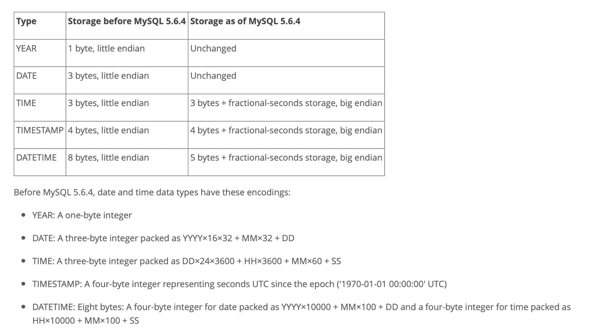

# MySQL Temporal Data Types

**Date:** 2022/12
**Source:** http://mysql.taobao.org/monthly/2022/12/02/
**Images:** 2 images downloaded

---

数据库内核月报

 [
 # 数据库内核月报 － 2022 / 12
 ](/monthly/2022/12)

 * 当期文章

 PolarDB MySQL 新特性 - Partial Result Cache
* MySQL Temporal Data Types
* Innodb 中的 Btree 实现 (一) · 引言 & insert 篇
* MySQL · 业务场景 · 业务并发扣款，金额未扣
* PolarDB MySQL · 功能特性 · Fast Query Cache技术详解与最佳实践
* PolarDB MySQL · 功能特性 · 大表分页查询优化
* 查询性能定位没现场？要统计各维度Top SQL？PolarDB MySQL新功能SQL Trace

 ## MySQL Temporal Data Types 
 Author: lefeng 

 ## 前言

日常工作中，我们会经常遇到日期和时间这类数据，MySQL有对应的数据类型来存储，分别是DATE，TIME，DATETIME，TIMESTAMP和YEAR，这些数据类型统称为temporal数据类型。

MySQL在文档 https://dev.mysql.com/doc/refman/8.0/en/date-and-time-types.html 中对日期和时间相关的数据类型做了介绍，本文将对这些内容进行梳理，并深入到MySQL内核层探究其实现。

## 概述

在5.6.4版本以后，MySQL对这些数据类型的支持有了部分变化，

1. 把原来little-endian的存储方式变成了big-endian。这样一来，可以按照字节对数据进行比较（byte comparable），而不用等到读取所有字节后再进行比较，可以提升性能。
2. 新增小数部分的支持（小数点后最多支持6位数字），以满足某些场景下用户对更高精度的需求。仅限于TIME/TIMESTAMP/DATETIME三种类型。

如果要定义一个带有小数部分的数据类型，可以使用type_name(fsp)，fsp是0-6的数字，表示小数点后数字的位数。0表示无小数位，如果不指定，默认是0。小数点后每2位数字占用一个字节，最多占用3个字节（6位数字）。

下面是一个定义带小数部分的数据类型的例子，

`CREATE TABLE t1 (t TIME(3), dt DATETIME(6), ts TIMESTAMP(0));
`

### YEAR

年份，显示格式为4个字符表示的年份。范围是`1901- 2155`，可以为字符或者数字。

值得注意的是，输入的值也可以是2个字符或数字表示的年份，MySQL会在解析时自动做一个转换，

​ 0 - 69 : 2000 - 2069

​ 70 - 99 : 1970 - 1999

### DATE

日期。显示格式是`YYYY-MM-DD`，范围是`1000-01-01` to `9999-12-31`。

### TIME(fsp)

存储时间数据，显示格式为`hh:mm:ss [.fraction]`。可接受的值的范围是`-838:59:59.000000` 到 `838:59:59.000000`。

至于为什么有负时间值，MySQL文档给了说明，

 The hours part may be so large because the `TIME` type can be used not only to represent a time of day (which must be less than 24 hours), but also elapsed time or a time interval between two events (which may be much greater than 24 hours, or even negative).

可以看到，这里所指的时间不仅可以表示一天中的某个时间点，还可以表示两个事件的时间间隔，自然就可以超过24小时，且可能为负值。

### DATETIME(fsp)

包含日期和时间两部分，显示格式是`YYYY-MM-DD hh:mm:ss [.fraction]`，支持的日期范围是 `1000-01-01 00:00:00.000000` 到 `9999-12-31 23:59:59.999999`。

### TIMESTAMP(tsp)

时间戳，包含日期和时间两部分，显示格式是`YYYY-MM-DD hh:mm:ss [.fraction]`，支持的日期范围是`1970-01-01 00:00:01.000000 UTC` 到 `2038-01-19 03:14:07.999999 UTC`。

其表示的是自`1970-01-01 00:00:00`开始的时间差（秒），所以`1970-01-01 00:00:00`不是一个合法值，因为其对应的时间差是0，而0已经用来表示`0000-00-00 00:00:00`。当输入非法的日期或者时间值时，解析的时候会把其转换成`0000-00-00 00:00:00`。

## 内核层的实现

本部分将以MySQL 8.0.18的代码为基础，介绍MySQL从客户端接收到日期和时间数据后的处理流程，以及存入磁盘的过程。

在开始之前，我们先介绍两个数据结构，`MYSQL_TIME`和`timeval`。

`/*
 Structure which is used to represent datetime values inside MySQL.

 We assume that values in this structure are normalized, i.e. year <= 9999,
 month <= 12, day <= 31, hour <= 23, second <= 59. Many functions
 in server such as my_system_gmt_sec() or make_time() family of functions
 rely on this (actually now usage of make_*() family relies on a bit weaker
 restriction). Also functions that produce MYSQL_TIME as result ensure this.
 There is one exception to this rule though if this structure holds time
 value (time_type == MYSQL_TIMESTAMP_TIME) days and hour member can hold
 bigger values.
*/
typedef struct MYSQL_TIME {
 unsigned int year, month, day, hour, minute, second;
 unsigned long second_part; /**< microseconds */
 bool neg;
 enum enum_mysql_timestamp_type time_type;
} MYSQL_TIME;

`

对于temporal数据类型，MySQL在接收到客户端发送来的日期和时间数据后，会进行解析，将结果保存在`MYSQL_TIME`这个结构体中，其中，

* second_part，小数部分表示的微秒(us)，其值为 “小数部分 * 1000000”。如果小数为0.001，这里的值为1000。
* neg，是否为负值，**仅对TIME类型有效**。

如果目标列是TIMESTAMP数据类型，会进一步将MYSQL_TIME中保存的值转换成相对于`1970-01-01 00:00:00`的时间差（函数`datetime_with_no_zero_in_date_to_timeval()`），并保存在`timeval`结构体中。

`typedef struct timeval {
 long tv_sec;
 long tv_usec;
} timeval;
`

**接下来**，对于一些数据类型，如DATE，将解析后的日期和时间数据转换成整数，根据目标列自身的长度（固定长度），以big-endian的方式进行存储。

`/**
 Convert in-memory date representation to on-disk representation.

 @param ltime The value to convert.
 @param [out] ptr The pointer to store the value to.
*/
void my_date_to_binary(const MYSQL_TIME *ltime, uchar *ptr) {
 long tmp = ltime->day + ltime->month * 32 + ltime->year * 16 * 32;
 int3store(ptr, tmp);
}
`

而对于支持小数的部分数据类型，则会区别对待，

* TIMESTAMP，直接将`timeval`中保存的秒和微秒以big-endian的方式存储到磁盘中。
* TIME和DATETIME，将小数部分的值保存在longlong值低3位字节中，整数部分的值保存在其它高位字节中，这种方式称为“紧凑格式”（packed format）。

TIME类型的值转换成紧凑格式，

`/**
 Convert time value to numeric packed representation.

 @param my_time The value to convert.
 @return Numeric packed representation.
*/
longlong TIME_to_longlong_time_packed(const MYSQL_TIME &my_time) {
 /* If month is 0, we mix day with hours: "1 00:10:10" -> "24:00:10" */
 long hms = (((my_time.month ? 0 : my_time.day * 24) + my_time.hour) << 12) |
 (my_time.minute << 6) | my_time.second;
 longlong tmp = my_packed_time_make(hms, my_time.second_part);
 return my_time.neg ? -tmp : tmp;
}
`

DATETIME类型的值转换成紧凑格式，

`/**
 Convert datetime to packed numeric datetime representation.

 @param my_time The value to convert.
 @return Packed numeric representation of my_time.
*/
longlong TIME_to_longlong_datetime_packed(const MYSQL_TIME &my_time) {
 longlong ymd = ((my_time.year * 13 + my_time.month) << 5) | my_time.day;
 longlong hms = (my_time.hour << 12) | (my_time.minute << 6) | my_time.second;
 longlong tmp = my_packed_time_make(((ymd << 17) | hms), my_time.second_part);
 assert(!check_datetime_range(my_time)); /* Make sure no overflow */
 return my_time.neg ? -tmp : tmp;
}
`

**最后**，为了支持字节比较，还需要对以“紧凑格式”保存的longlong值做进一步处理，才能根据目标列数据类型的长度（固定长度，整数部分 + 分数部分）存储到磁盘中。

* TIME。前面提到过，TIME数据类型可以允许负的时间值，这里对整数部分加上TIMEF_INT_OFS，将有符号整数转换成无符号整数，通过这种方式，所有整数（包含负数）都可以支持字节比较（byte comparable）。
* DATETIME。整数部分加上0x8000000000LL，为了跟HA_KETYPE_BINARY兼容。

下面是存储TIME数据类型数据的函数，可以看到，整数部分会加上`TIMEF_INT_OFS`（或`TIMEF_OFS`），整数部分和分数部分均以big-endian的方式进行存储。

`/**
 On disk we convert from signed representation to unsigned
 representation using TIMEF_OFS, so all values become binary comparable.
*/
#define TIMEF_OFS 0x800000000000LL
#define TIMEF_INT_OFS 0x800000LL

/**
 Convert in-memory numeric time representation to on-disk representation

 @param nr Value in packed numeric time format.
 @param [out] ptr The buffer to put value at.
 @param dec Precision.
*/
void my_time_packed_to_binary(longlong nr, uchar *ptr, uint dec) {
 assert(dec <= DATETIME_MAX_DECIMALS);
 /* Make sure the stored value was previously properly rounded or truncated */
 assert((my_packed_time_get_frac_part(nr) %
 static_cast<int>(log_10_int[DATETIME_MAX_DECIMALS - dec])) == 0);

 switch (dec) {
 case 0:
 default:
 mi_int3store(ptr, TIMEF_INT_OFS + my_packed_time_get_int_part(nr));
 break;

 case 1:
 case 2:
 mi_int3store(ptr, TIMEF_INT_OFS + my_packed_time_get_int_part(nr));
 ptr[3] = static_cast<unsigned char>(
 static_cast<char>(my_packed_time_get_frac_part(nr) / 10000));
 break;

 case 4:
 case 3:
 mi_int3store(ptr, TIMEF_INT_OFS + my_packed_time_get_int_part(nr));
 mi_int2store(ptr + 3, my_packed_time_get_frac_part(nr) / 100);
 break;

 case 5:
 case 6:
 mi_int6store(ptr, nr + TIMEF_OFS);
 break;
 }
}
`

以big-endian方式存储DATETIME类型数据的原理相同，只是使用的字节数不同， 其对应的函数是`my_datetime_packed_to_binary()`，感兴趣的读者可自行查看。

 阅读： - 

本作品采用[知识共享署名-非商业性使用-相同方式共享 3.0 未本地化版本许可协议](http://creativecommons.org/licenses/by-nc-sa/3.0/)进行许可。

 