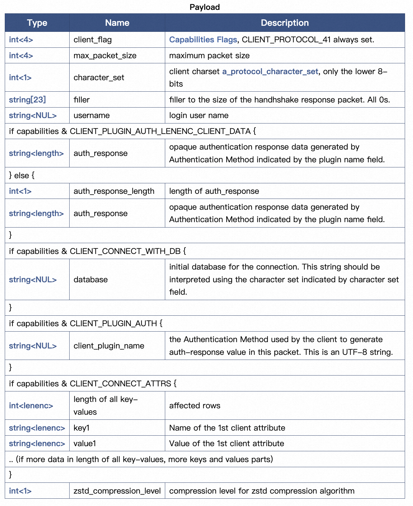
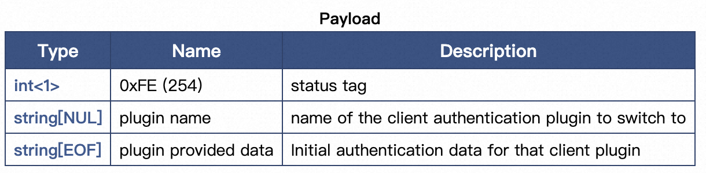
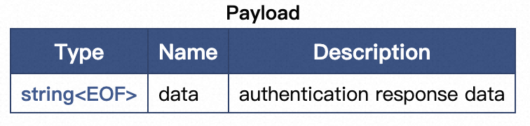

# MySQL · 源码分析 · 鉴权过程

**Date:** 2023/05
**Source:** http://mysql.taobao.org/monthly/2023/05/03/
**Images:** 5 images downloaded

---

数据库内核月报

 [
 # 数据库内核月报 － 2023 / 05
 ](/monthly/2023/05)

 * 当期文章

 MySQL · 源码解析 · InnoDB中undo日志的组织及实现
* PolarDB ·引擎特性· DDL中MDL锁的优化和演进
* MySQL · 源码分析 · 鉴权过程
* PolarDB·引擎特性·PolarDB IMCI中的行列融合执行
* PolarDB MySQL · 功能特性 · Cube, grouping sets功能介绍与实现

 ## MySQL · 源码分析 · 鉴权过程 
 Author: 有扈 

 ## 前言
在整个mysql client connection生命周期中，mysql 鉴权过程位于第一步。当鉴权完成之后，连接进入command phase，可以向server发送command。本文主要介绍鉴权过程，具体指client在进行连接时所提供的user与password是否正确。

 本文内容基于 MySQL Community 8.0.33 Version

## 鉴权过程
mysql 支持多种插件进行鉴权，常见的有native_password_authenticate, caching_sha2_password_authenticate等。本文首先将以native_password_authenticate为例，结合mysql 8.0 源码简述client与server 在鉴权期间所做的交互；之后结合源码分析切换鉴权插件场景下的交互过程。

### native_password 鉴权
mysql 鉴权过程发生在client 与server建立tcp连接后，mysql server监听到建立连接请求后，开始处理。

`mysqld_main()
 ...
 mysqld_socker_acceptor->connection_event_loop()
 loop {
 listen_for_connection_event()
 process_new_connection()
 m_connection_handler->add_connection() // 以One_thread_connection_handler::add_connection为例
 my_thread_init()
 thd = channel_info->create_thd()
 thd_prepare_connection(thd)
 login_connection_thd()
 set read/write timeout
 check_connection()
 acl_check_host //检查host或者ip是否与某个用户匹配
 ...
 acl_authenticate() // 具体的鉴权过程
 while(thd alive) {
 do_command(); // 鉴权完成后，进入command phase
 }
 end_connection()
 close_connection() // 结束请求
 }
`

#### **鉴权连接过程**

当开始进行鉴权时

1. server首先向client端发送 initial Handshake包，其中包含了server端使用的鉴权插件以及关键的scramble信息。
2. client端在接收到server发送的 Handshake包之后，将根据使用的鉴权插件对scramble进行处理，之后将结果包装至Handshake Response包中发送给server。
3. server在接收到Handshake Response包之后，根据返回的结果进行认证，判断鉴权是否成功。

下面将结合源码，分析client与server在通过native_password_authenticate插件验证成功的交互过程。

#### **server发送initial Handshake**

`acl_authenticate()
 auth_plugin_name = default_auth_plugin_name // 首先使用默认的鉴权插件
 mpvio.scramble[SCRAMBLE_LENGTH] = 1 // 标记当前的thd还未生成scramble
 do_auth_once()
 prepare plugin //根据设置的auth_plugin_name来准备对应的鉴权插件
 auth->authenticate_user() // 发起第一次鉴权，这里以native_password_authenticate为例
 if(mpvio->scramble[SCRAMBLE_LENGTH])
 generate_user_salt() // 如果还未生成scramble，则生成一份
 mpvio->write_packet() //server_mpvio_write_packet，将scramble发送至client
 if (mpvio->packets_written == 0) // 如果是第一次server发送给client
 send_server_handshake_packet()
`

在server第一次向client发送包时，在send_server_handshake_packet中会构建[Protocol::HandshakeV10](https://dev.mysql.com/doc/dev/mysql-server/latest/page_protocol_connection_phase_packets_protocol_handshake_v10.html)类型的packet，其中包含的字段信息如图中所示。其中包含了protocol version，server version，scramble，auth_plugin_name等关键信息。

#### **client接收initial Handshake，发送Handshake Response**

`csm_read_greeting // client 接收server 发送过来的第一个包

csm_parse_handshake // client端解析server端发送过来的第一个包，解析得到Protocol version、scramble、plugin name 等关键信息

csm_authenticate()
 run_plugin_auth()
 authsm_begin_plugin_auth()
 if (default_plugin valid)
 auth_plugin = default_plugin
 else
 auth_plugin = server_plugin_name // client端优先使用默认的鉴权插件
 pkt_received = true // 标记已经读取过Handshake packet
 authsm_run_first_authenticate_user
 auth_plugin->authenticate_user()
 vio->read_packet() //client_mpvio_read_packet，得到server端发送过来的scramble
 if (pkt_received)
 skip read data // 如果已经读取过Handshake packet，跳过插件内的读
 scramble(server_scramble_data, mysql->passwd) //使用server端发送过来的scramble对passwd进行处理
 vio->write_packet() //send_client_reply_packet，client端将加密过后的scramble发送给server
 prep_client_reply_packet // 准备Handshake Response包
 my_net_write() && net_flush() // 发送Handshake Response包
`

在client发送Handshake Response至server时，在prep_client_reply_packet中，会构建[Protocol::HandshakeResponse41](https://dev.mysql.com/doc/dev/mysql-server/latest/page_protocol_connection_phase_packets_protocol_handshake_response.html#sect_protocol_connection_phase_packets_protocol_handshake_response41)类型的packet，其中包含的字段信息如图所示。其中包含了client_flag、auth_response、client_plugin_name等关键信息。

#### **server接收Handshake Response**

`acl_authenticate()
 do_auth_once()
 authenticate_user
 ... // server发送第一个包
 mpvio->read_packet() // server_mpvio_read_packet
 parse_client_handshake_packet // 解析Handshake Response包
 //处理 client发送过来的 scramble
 if (check_scramble)
 return OK // server client鉴权完成
`

server在接收到Handshake Response包之后，检测scramble是否正确，来判断client是否可以进行连接。client鉴权成功后，进入command phase阶段。

### 切换鉴权插件

#### **切换鉴权插件连接过程**

在MySQL Community 8.0.33 Version 中，server与client的默认鉴权插件都为caching_sha2_password，用户在创建user时，可能会将某个user的鉴权方式更改为其他插件，例如修改为native_password。当存在这种现象时，通过client连接user时则会发生切换鉴权插件。

在server接收到Handshake Response Packet之后，如果发现client使用的鉴权插件与server端存储的插件不同，则会返回Authentication Switch Request Packet，client接收到之后则会切换所使用的插件，再次进行鉴权流程。

#### **server 发送Authentication Switch Request**

`acl_authenticate()
 do_auth_once()
 authenticate_user()
 ... // server发送第一个包
 mpvio->read_packet() // server_mpvio_read_packet()
 parse_client_handshake_packet() // 解析Handshake Response包
 get mpvio->acl_user_plugin // 从server本地读取user所对应的鉴权插件
 if (mpvio->acl_user_plugin != mpvio->plugin) // user需要使用的鉴权插件与server目前使用的不一致
 mpvio->status = MPVIO_EXT::RESTART
 
 if (mpvio.status == MPVIO_EXT::RESTART)
 do_auth_once()
 authenticate_user()
 mpvio->write_packet() // server_mpvio_write_packet
 if (mpvio->status == MPVIO_EXT::RESTART)
 send_plugin_request_packet // 发送Authentication Switch Request
`

server通过解析client发送的Handshake Response包，发现server所使用的鉴权插件与user需要使用的插件不一致的话，则会将mpvio.status设置为MPVIO_EXT::RESTART。之后再次发起鉴权流程，在第二轮交互流程中，server向client发送的包不再是Protocol::HandshakeV10，而是通过send_plugin_request_packet构建Protocol::AuthSwitchRequest 类型的packet，其中包含的字段信息如下图所示，其中包含了要求client所使用的plugin name 以及此插件所需要的scramble数据。

#### **client接收Auth Switch Request，发送Auth Switch Response**

`authsm_handle_change_user_result
 if (mysql->net.read_pos[0] == 254) // 读取到server发送的AuthSwitchRequest包标志位
 authsm_run_second_authenticate_user
 ctx->auth_plugin_name = server_send_plugin_name // client获取server发来的所要求的鉴权插件
 pkt_received = true
 authenticate_user() // 进入新的插件的鉴权流程
 mpvio->read_packet() // client_mpvio_read_packet
 if (pkt_received)
 get data // 得到server发来的scramble
 mpvio->write_packet() // client_mpvio_write_packet
 if (mpvio->packets_written > 0)
 my_net_write && net_flush // 直接将加密后的scramble发送至server
`

client在接收到AuthSwitchRequest之后，切换鉴权所使用的插件，在read_packet时，得到被包含在AuthSwitchRequest packet内的scramble数据，在write_packet时通过mpvio->packets_written判断此时切换鉴权插件过程中，因此不再构建Handshake Response包，而是构建[Protocol::AuthSwitchResponse](https://dev.mysql.com/doc/dev/mysql-server/latest/page_protocol_connection_phase_packets_protocol_auth_switch_response.html)包，其中包含的信息为client加密后的scramble。

#### **server 接收Auth Switch Response**

`acl_authenticate() //第二次鉴权过程
 do_auth_once()
 authenticate_user()
 ... // server发送AuthSwitchRequest
 mpvio->read_packet() // server_mpvio_read_packet
 protocol->read_packet()
 *buf = protocol->get_net()->read_pos; // 直接读取client加密后的scramble
 if (check_scramble)
 return OK // server client鉴权完成
`

server在接收到AuthSwitchResponse之后，不再通过parse_client_handshake_packet去解析包中内容，而是直接读取包里加密后的scramble。client鉴权成功后，进入command phase阶段。

## 参考资料

[mysql connection_phase](https://dev.mysql.com/doc/dev/mysql-server/latest/page_protocol_connection_phase.html)

[MySQL · 源码分析 · 连接与认证过程](http://mysql.taobao.org/monthly/2018/08/07/)

 阅读： - 

本作品采用[知识共享署名-非商业性使用-相同方式共享 3.0 未本地化版本许可协议](http://creativecommons.org/licenses/by-nc-sa/3.0/)进行许可。

 