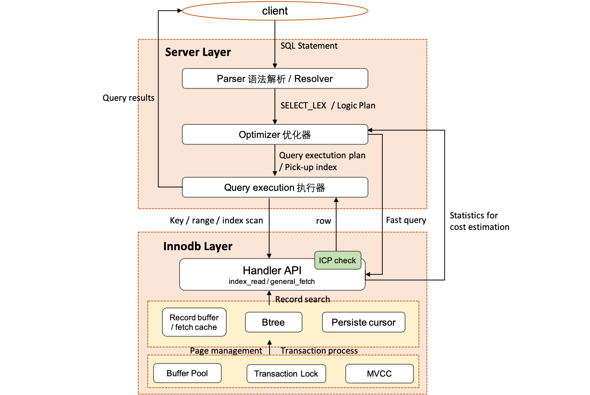
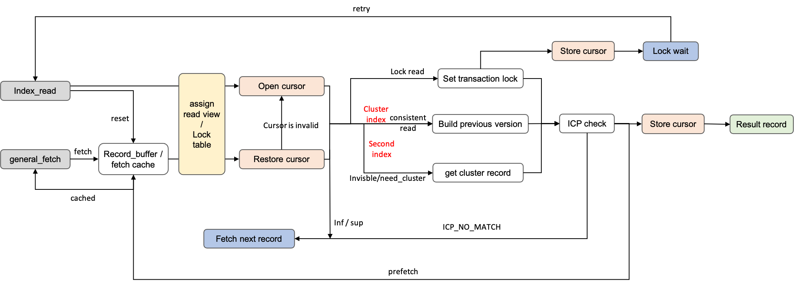

# Innodb 中的 Btree 实现 (二) · select 篇

**Date:** 2023/07
**Source:** http://mysql.taobao.org/monthly/2023/07/03/
**Images:** 3 images downloaded

---

数据库内核月报

 [
 # 数据库内核月报 － 2023 / 07
 ](/monthly/2023/07)

 * 当期文章

 MySQL · 工具使用 · 通过GDB non-stop mode 调试MySQL
* MySQL·源码分析·索引选择
* Innodb 中的 Btree 实现 (二) · select 篇

 ## Innodb 中的 Btree 实现 (二) · select 篇 
 Author: 谢榕彪(归墨) 

 本文内容基于 MySQL Community 8.0.13 Version

在 [上一篇文章](https://zhuanlan.zhihu.com/p/594678689)，介绍了 MySQL Innodb 的 Btree 组织、搜索和并发控制的实现，以及 Insert 的路径解析。这篇文章继续来看 MySQL Innodb 如何基于 btree 来读取所需数据。

## 1. MySQL 的 select 流程
MySQL server 是由两部分组成，如图 1，server 层处理用户的 SQL，生成操作 Innodb 物理数据的执行计划。对于从 client 接收的 SQL 语句，通过 Parser 生成语法查询树（SELECT_LEX），即逻辑执行计划（query_expression 及 query_block）[7]，每个 query_block 对应一个特定的 select 查询，而每个 query_expresssion 包含多个 query_block，如由 UNION AND/OR 谓词连接的 SELECT 查询。

对于 query_block，通常有很多不同的执行方案：如需要选择访问的 btree 索引，以及访问 btree 数据的方式（index scan、range scan or index lookup），对于 INNER JOIN 的查询，还需要考虑不同表的 JOIN 顺序。Optimizer 优化器会对其中一些的可能方案的 cost 进行估计，选择 cost 低的生成物理执行计划，存储引擎提供用于估计 cost 的统计信息。

最后由执行器操纵存储引擎提供的 API 读取索引的数据，此时在 Innodb 层，Server 的 SQL 查询，就已经转化为对 btree 索引的点查询或者范围查询，Innodb 在读取过程中会考虑数据的管理（page management），以及事务的隔离和并发访问（transaction lock 和 MVCC），最后将读取的 record 返回给 server 层，进行过滤，返回给用户。

图 1: MySQL 的 select 流程 

## 2 索引选择
**选择索引是查找 record 的第一步**，如果一张表包含多个索引，optimizer 会找到代价最低的索引和查找路径。

首先，对于用主键值（pk）和常量值时作为唯一搜索条件 (select where pk = value)，直接走 fast_path_using_primary 访问主键索引，这是最快的，避免优化器的计算开销，在 explain 命令能看到 access_type 为 const。

**否则会分别计算每种路径的 cost 来生成执行计划**。

mysql 的优化器是 cost-based 的模型，cost 计算如图 2 所示，由访问行数和 cost 常量计算，

cost 常量是事先设置不同操作（如 key 的比较、page 访问）的常量，可以通过 mysql.server_cost 和 mysql.engine_cost 系统表进行配置。

访问行数由索引访问方式、Join 和 子查询决定，索引的访问方式可以分为以下几种：

1. table scan: 全表扫描，潜在的访问模式，所有 select 操作都能通过全表扫描得到结果 (access_type = all)。
2. index scan: 索引扫描，如果二级索引中存储的 fields 值已满足需求。索引扫描通常比全表扫描快，因为索引的大小通常小于表数据 (access_type = index)。
3. range scan: 只检索给定范围内的行 (access_type = range)。
4. index lookup: 正常的索引搜索 (unique 索引的 access_type 为 const 或者 eq_ref，非 unique 索引的 access_type 为 ref)。

为了尽量不影响性能，不同执行路径的 cost 都是基于采样的统计信息的计算得到，以 table scan 为例，其计算过程为主键索引 page 数目 * cost 常量。这里 cost 常量主要是 IO 开销，包括内存访问开销和磁盘访问开销，Innodb 没有提供任何关于某个索引的 page 在内存和磁盘的比例。因此通过启发式方式进行估计，table size 小于 buffer pool 的 20 %，则认为都在内存中，大于 buffer pool，认为都在磁盘中。介于 20 % 和 100 % 之间，则按比例线性缩放。

MySQL 索引和数据是由存储引擎进行管理的，因此 Innodb 还会为上层优化器提供用于估计 cost 的接口，如常见的：

* scan_time: 返回主键索引的 page 数目。
* read_time: 基于 range 的 record 数目和 index record 总数目的比例计算该 range 的 page 数目。
* record_in_range: 估计 range 范围内的 record 数目，在每次 range 查询时，涉及的索引都会触发，具体实现是会根据 range 的 start key 和 end_key 分别做 cursor 搜索，记录 btree 搜索过程中的所有 page，根据 page 的 record 集合做 record 数目的粗略估计。

## 3. Innodb 的 Btree 查找

Innodb 引擎层主要提供三个接口来访问 btree 的数据：

* index_init: 基于 server 层选择的索引号切换访问的索引。
* **index_read**: 根据 server 层待查找的 search_tuple 将 cursor 定位到索引的 page 上，并读取一行数据，点查询调用 index_read 即返回。范围查询会基于 where 条件的 start_key 和 end_key 的其中一个构建 search_tuple，获取一行数据，如果没有 where 条件，走索引扫描，会从索引的最左或者最右 page 开始查找。
* **general_fetch**: 对于范围查询，基于 index_read 的 cursor 定位，读取前一行或者后一行数据，并移动 cursor。

index_read 和 general_fetch 核心实现流程都在 row_search_mvcc 中。

图 3: row_search_mvcc 的查找流程 

record_buffer / fetch_cache 是用于 general_fetch 时提升多行读取操作效率的循环队列的缓存结构，其中 record_buffer 是上层 server 层每个用户连接所持有的表信息 TABLE 提供的，如果上层没有提供，Innodb 会使用自己组织的 fetch_cache。在 general_fetch 中如果扫描方向一致，并且缓存中有数据，会直接从缓存中拿，否则会清空缓存结构。

**缓存中没有，走正常的查找逻辑。**

基于事务隔离级别，在 RC 和 RR MVCC 快照读下，会先分配 Read View（当前时刻的活跃事务列表），用于后续的可见性判断。在序列化级别或者 Select for update（定位需要更新的数据）时，会对表加意向锁。

之后，将 cursor 定位到 Btree 中的具体 Page 的 record 上，对于 Index_read，会重新 open 一个 cursor，从 root 结点一路向下遍历到叶子 page，过程中对沿路 page 加 S 锁。如果是范围查询或者 Select for update，会将 cursor 的定位信息保存下来，生成持久化 cursor，避免后续使用 cursor 中的 page 和 record 信息，还要重新遍历 btree 加锁，减少寻路开销。

* **持久化 cursor**，store cursor 的 record 和 page 指针，以及 modify_clock (类似一种版本信息，当 page 发生修改时，会递增 modify_clock) 保存下来。当 restore 恢复时，在 modify_clock 不变情况下，直接对 page 加锁，减少寻路开箱。

Index_read 会把定位的 record 和 search_tuple 进行比较，不满足条件会返回 record 不存在错误，RR 隔离级别往上会加上 Gap 锁，防止事务提交前其他线程插入满足条件的数据。

接下来，对于序列化级别或者 Select for update 的 lock read 类型，会对 record 加逻辑事务锁，基于事务隔离级别，RC 加 LOCK_REC_NOT_GAP 锁，RR 加 NEXT_KEY 锁。加锁失败会 store cursro，等待相应逻辑锁释放，重试。

如果是不加事务锁的一致性读，READ_UNCOMMITTED 无需考虑任何事，否则先判断 record 的当前版本是否可见，主键索引使用 record 的 trx_id 值和前面获取的 read_view 判断是否可见，不可见则需要遍历 undo 链，构建旧版本进行读取。对于二级索引使用 page 上的 max_trx_id 来粗粒度地判断，如果不可见，需要回到主键索引拿完整的 record 进行判断。

* ICP (index condition pushdown) check，这里做了一个优化，mysql 将 where 的谓词中的条件下推到引擎，这样二级索引回表前，主键索引返回 server 层时，先进行 ICP 判断，如果已经不满足条件，无需再回主键索引进一步判断可见性了。

ICP check 后，不满足条件直接将 cursor 移动到下一个 record，循环判断，否则将结果返回给上层。

## 4. 引用

[1] [Innodb 中的 Btree 实现 (一) · 引言 & insert 篇](https://zhuanlan.zhihu.com/p/594678689)

[2] [TokuDB · 源码分析 · 一条query语句的执行过程](http://mysql.taobao.org/monthly/2017/01/10/)

[3] [InnoDB：B-tree index（2）](https://zhuanlan.zhihu.com/p/164728032)

[4] [MySQL · 特性分析 · 优化器 MRR & BKA](http://mysql.taobao.org/monthly/2016/01/04/)

[5] [The Unofficial MySQL 8.0 Optimizer Guide](http://www.unofficialmysqlguide.com/introduction.html)

[6] [EXPLAIN Output Format](https://dev.mysql.com/doc/refman/8.0/en/explain-output.html)

[7] [Details of the Architecture of MySQL 8.0 Server Layer](https://www.alibabacloud.com/blog/details-of-the-architecture-of-mysql-8-0-server-layer_598909)

 阅读： - 

本作品采用[知识共享署名-非商业性使用-相同方式共享 3.0 未本地化版本许可协议](http://creativecommons.org/licenses/by-nc-sa/3.0/)进行许可。

 