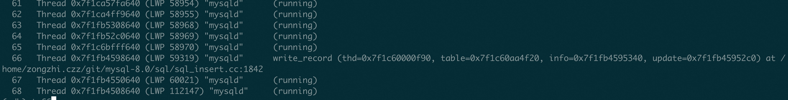
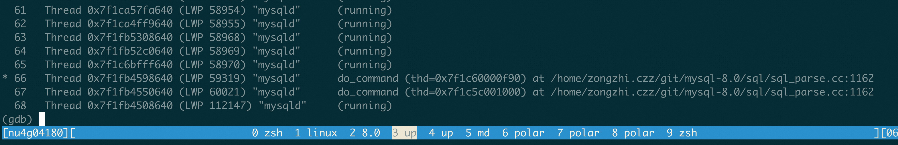
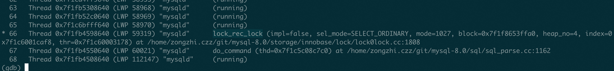
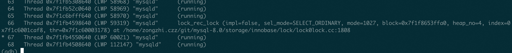

# MySQL · 工具使用 · 通过GDB non-stop mode 调试MySQL

**Date:** 2023/07
**Source:** http://mysql.taobao.org/monthly/2023/07/01/
**Images:** 5 images downloaded

---

数据库内核月报

 [
 # 数据库内核月报 － 2023 / 07
 ](/monthly/2023/07)

 * 当期文章

 MySQL · 工具使用 · 通过GDB non-stop mode 调试MySQL
* MySQL·源码分析·索引选择
* Innodb 中的 Btree 实现 (二) · select 篇

 ## MySQL · 工具使用 · 通过GDB non-stop mode 调试MySQL 
 Author: baotiao 

 通过GDB non-stop mode 调试MySQL, 特别是用于复现死锁场景, 需要按照一定的并发顺序写入才可以构造出来, 通过GDB non-stop mode 可以非常方便进行构造

但是用法是先开启 GDB, 然后在 attach mysql_pid 才可以. 不能启动的时候就 attach 到 mysql pid

可以通过设置set non-stop on, non-stop mode 来实现gdb 只block 一个thread, 然后其他thread 继续执行的方法.

In non-stop mode, when a thread stops to report a debugging event, *only* that thread is stopped;

经常需要配合这几个一起用

https://www.zeuthen.desy.de/dv/documentation/unixguide/infohtml/gdb/Non_002dStop-Mode.html

set target-async 1

set pagination off

set non-stop on

这一行可以直接启动的时候就设置好

gdb –quiet -ex ‘set pagination off’ -ex ‘set target-async on’ -ex ‘set non-stop on’

在 non-stop mode 里面, 如果断点被某一个线程命中, 那么只有该线程是停止的, 其他线程继续 running.. 上图可以看到只有 Thread 66 是停止的, 其他 Thread 都在运行钟.

在 non-stop mode 中, 如果想让其他所有 Thread 继续运行, 需要执行 c -a(continue -a), 如果只是执行 c(continue), 那么只有当前 thread 运行.

通过 continue 只运行当前 Thread, 就可以切换 Thread, 执行 continue, 做到多个 Thread 轮流运行的效果, 用于复杂场景复现.

比如这个 example 把断点打在 do_command 上面, 那么就两个 client 连接进来执行 命令以后, 都停止在了 do_command 上, 这个时候可以按照我们的需求去执行哪一个 thread.

比如我这里又增加了一个 breakpoint lock_rec_lock, 我想让 Thread 66 先执行, 那么我就t 66, 然后在这里执行 continue, 那么就会发现 t 66 跳到下一个断点.

这个时候可以再切到 Thread 67 让他去执行, 因为 Thread 66 已经断在一个地方了. 这个时候我们直接让 Thread 67 执行完成就变成这样

可以看到 Thread 66 还停在这里, 但是 Thread 67 已经执行结束了.

 阅读： - 

本作品采用[知识共享署名-非商业性使用-相同方式共享 3.0 未本地化版本许可协议](http://creativecommons.org/licenses/by-nc-sa/3.0/)进行许可。

 