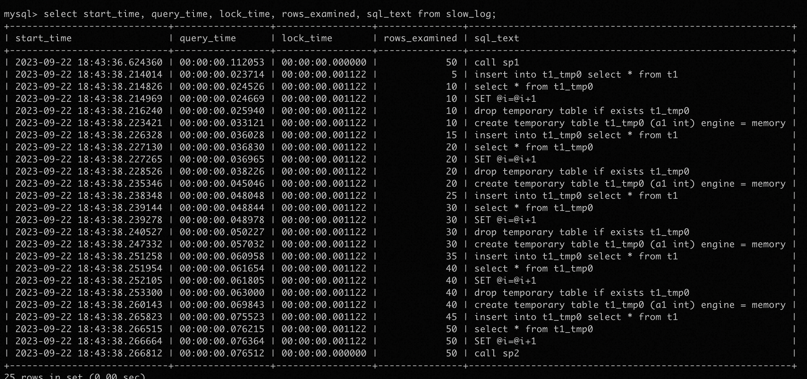

# MySQL · 源码分析 · store procedure记录了过多的slow_log的问题详解

**Date:** 2023/09
**Source:** http://mysql.taobao.org/monthly/2023/09/01/
**Images:** 2 images downloaded

---

数据库内核月报

 [
 # 数据库内核月报 － 2023 / 09
 ](/monthly/2023/09)

 * 当期文章

 MySQL · 源码分析 · store procedure记录了过多的slow_log的问题详解
* MySQL · 工具使用 · MySQL client pager/edit/tee 介绍
* 云原生数据库PolarDB MySQL 8.0.2 DDL介绍

 ## MySQL · 源码分析 · store procedure记录了过多的slow_log的问题详解 
 Author: 张旭明(玄旭) 

 ## 背景

最近遇到一个问题，深入把mysql的slow_log又研究了一遍，给大家分享一下。
问题的现象如下：

1. slow log中记录了store procedure中执行的全部SQL
2. store procedure执行时间小于long_query_time，内部执行的SQL也全部被记录到了slow log中
3. store procedure中create temporary命令记录在slow log中的信息显示，随着多次执行，执行时间和扫描行数都在增长

深入研究代码后，找到了复现方法， 复现用例详见附录，感兴趣的可以自己试一下。

下面是call sp1和call sp2后，slow log的内容：



从图中可以看到，对于sp1来说，slow log只记录了call sp1这一条记录，对于sp2来说，则记录了存储过程执行的全部内容，同时rows_examined和执行时间与当条SQL的实际情况不一致。

## slow_log机制

### mysql.slow_log表结构

mysql.slow_log建表语句

`CREATE TABLE `slow_log` (
 `start_time` timestamp(6) NOT NULL DEFAULT CURRENT_TIMESTAMP(6) ON UPDATE CURRENT_TIMESTAMP(6),
 `user_host` mediumtext NOT NULL,
 `query_time` time(6) NOT NULL,
 `lock_time` time(6) NOT NULL,
 `rows_sent` int(11) NOT NULL,
 `rows_examined` int(11) NOT NULL,
 `db` varchar(512) NOT NULL,
 `last_insert_id` int(11) NOT NULL,
 `insert_id` int(11) NOT NULL,
 `server_id` int(10) unsigned NOT NULL,
 `sql_text` mediumblob NOT NULL,
 `thread_id` bigint(21) unsigned NOT NULL
) ENGINE=CSV DEFAULT CHARSET=utf8 COMMENT='Slow log'
`

 Field
 Comments

 start_time
 SQL语句执行完写slow log的时间

 user_host
 执行SQL语句的用户和主机名

 query_time
 SQL语句的执行时间，不包括锁等待时间

 lock_time
 执行SQL语句前，等待锁的时间

 rows_sent
 SQL语句返回的结果集行数, thd->get_sent_row_count()

 rows_examined
 SQL聚集执行时扫描的行数, thd->get_examined_row_count()

 db
 执行SQL语句的库名

 last_insert_id
 thd->stmt_depends_on_first_successful_insert_id_in_prev_stmt

 insert_id
 thd->auto_inc_intervals_in_cur_stmt_for_binlog

 server_id
 服务器ID

 sql_text
 执行的SQL语句

 thread_id
 执行SQL的线程ID

## 主要列内容的产生方法

### 1. `start_time`

`start_time`实际上写入的是函数`bool Log_to_csv_event_handler::log_slow`的参数`current_time`

` // In function
 bool Log_to_csv_event_handler::log_slow(……) {
 ……
 /* store the time and user values */
 assert(table->field[SQLT_FIELD_START_TIME]->type() == MYSQL_TYPE_TIMESTAMP);
 ull2timeval(current_utime, &tv);
 table->field[SQLT_FIELD_START_TIME]->store_timestamp(&tv);
 ……
 }
`

`current_time`是在下面的函数中获取并传给`log_slow`方法

`bool Query_logger::slow_log_write() {
 ……
 ulonglong current_utime = my_micro_time();
 ……
 for (Log_event_handler **current_handler = slow_log_handler_list;
 *current_handler;) {
 error |= (*current_handler++)
 ->log_slow(thd, current_utime,
 (thd->start_time.tv_sec * 1000000ULL) +
 thd->start_time.tv_usec,
 user_host_buff, user_host_len, query_utime,
 lock_utime, is_command, query, query_length);
 }
 ……
}
`

### 2. `query_time`和`lock_time`

`query_time`和`lock_time`的产生方法

` bool Query_logger::slow_log_write() {
 ……
 query_utime = (current_utime - thd->start_utime);
 lock_utime = thd->get_lock_usec();
 ……
 }
`

### 3. SQL执行过程中`slow_log`相关变量的变化过程和写入`slow_log`的时机

```
dispatch_command(thd) // 开始执行SQL
-> ……
-> thd->enable_slow_log = true; // 初始化enable_slow_log为true
-> thd->set_time()
 -> ……
 -> start_utime = my_micro_time(); // 设置sql开始执行的时间
 -> ……
-> dispatch_sql_command(thd)
 -> mysql_reset_thd_for_next_command(thd)
 -> thd->reset_for_next_command()
 -> ……
 -> thd->m_sent_row_count = thd->m_examined_row_count = 0;
 -> ……
 -> parse_sql(thd) // 语法解析
 -> mysql_execute_command(thd) // 执行SQL
 -> ……
-> thd->update_slow_query_status() // 更新状态，为写slow_log作准备
 -> 如果SQL执行时间超过了long_query_time， server_status |= SERVER_QUERY_WAS_SLOW
 -> 这里用了当前时间和start_utime的差值进行比较，判断超过long_query_time的时间包括query_time和lock_time
-> log_slow_statement(thd) // 写slow_log入口
 -> if (log_slow_applicable(thd)) // 判断当前查询是否需要记录到slow_log中
 log_slow_do(thd) // 当前查询记录到slow_log中
-> …… 

```

### 4. 存储过程和`slow_log`相关的逻辑

下面的流程只表示了存储过程执行SQL的主要调用链，不包含其他类型的语句

`mysql_execute_command
-> Sql_cmd_dml::execute()
 -> Sql_cmd_call::execute_inner()
 -> sp_head::execute_procedure
 -> 如果thd->enable_slow_log == true并且不是在event中调用
 save_enable_slow_log = true
 thd->enable_slow_log = false // 在存储过程中临时关闭slow log
 -> sp_head::execute
 循环对存储过程中的每一条SQL执行
 -> sp_instr_stmt::execute
 -> sp_instr_stmt::validate_lex_and_execute_core
 -> sp_lex_instr::reset_lex_and_exec_core
 -> sp_instr_stmt::exec_core
 -> mysql_execute_command
 -> thd->update_slow_query_status()
 -> if (log_slow_applicable(thd)) 
 log_slow_do(thd)
 -> 如果save_enable_slow_log == true， thd->enable_slow_log = ture // 恢复enable_slow_log状态
`

可以看到在存储过程执行开始的时候，会将线程的`enable_slow_log`开关关闭，执行完成后，会再打开

### 5. `log_slow_applicable`逻辑

1. 子查询/被kill/执行出错/解析出错，返回false
2. `set warn_no_index = `下面3个条件的与值
 
 `thd->server_statu & (SERVER_QUERY_NO_INDEX_USED | SERVER_QUERY_NO_GOOD_INDEX_USED )`

 查询包含JT_ALL的表或包含动态range scan的表

 1. `log_queries_not_using_indexe = true`
2. `!(sql_command_flags[thd->lex->sql_command] & CF_STATUS_COMMAND)`

 根据`sql_command_flags`的设置的值，这个条件表明SQL不是SHOW相关的命令

 `set log_this_query = ` 下面2个条件的与值
 1. `(thd->server_status & SERVER_QUERY_WAS_SLOW) || warn_no_index`

 查询是慢查询或`warn_no_index`为`true`
2. `thd->get_examined_row_count() >= thd->variables.min_examined_row_limit`
 `SQL`的扫描数据行数不小于变量`min_examined_row_limit`的值

 如果slow log没有开启，返回false `thd->enable_slow_log == false || opt_slow_log`

 `set suppress_logging = log_throttle_qni.log(thd, warn_no_index)`

 `log_throttle_qni.log(thd, warn_no_index)` 用来计算该条未使用索引的SQL是否需要写入到`slow_log`，计算需要使用到参数`log_throttle_queries_not_using_indexes `, 该参数表明允许每分钟写入到`slow_log`中的未使用索引的SQL的数量，0表示不限制

 如果 `suppress_logging == false` 并且 `log_this_query == true` 返回true， 表示需要记录slow_log

### 6. `log_slow_admin_statements` 干了什么

根据官方文档说明，这个开关表示需要记录执行慢的admin语句，从代码上可以看到，admin语句包含了下面的SQL

` check table xxx;
 analyze table xxx;
 optimize table xxx;
 repair table xxx;
 create index ....;
 drop index ...;
`

相关功能代码`execute`方法中，会在执行命令之前，执行： 
 `thd->enable_slow_log = opt_log_slow_admin_statements`

执行完成后，并没有恢复 `thd->enable_slow_log` 的值

## 问题发生的实际原因

根据以上的信息，我们可以总结出问题发生的根本原因

1. 存储过程中包含的`analyze table`命令，导致执行存储过程时，被关闭的`thd->enable_slow_log`，又被打开了
2. 存储过程执行中，并不会`reset start_utime`和`examined_rows`，只有在存储过程开始执行的时候会`reset`, 存储过程中每条查询SQL都会导致`examined_rows`的值进行增长，SQL记录`slow_log`时计算查询时间的方法是跟`start_utime`进行比较，会导致存储过程中每条SQL记录到`slow_log`的查询时间一直在增加
3. `log_queries_not_using_indexe = on`，导致记录存储过程中执行SQL的慢日志检查时，不检查实际执行时间，忽略了`long_query_time`的限制

## 总结

`mysql slow_log`不是简单的打开开关`slow_query_log`，设置`long_query_time`就可以了，通过这个问题分析，我们可以更了解`mysql slow_log`的工作原理，以便我们在分析数据库慢查询问题的过程中更好的使用`mysql slow_log`。

下表是对slow log相关变量的总结说明

 变量
 说明

 `slow_query_log`
 `slow log`总开关，全局变量

 `log_output`
 记录日志的方式，取值范围`TABLE`或`FILE`，如果是`TABLE`，`slow log`记录在系统表 `mysql.slow_log`中，如果是`FILE`记录在文件中，文件路径由参数`slow_query_log_file`指定

 `slow_query_log_file`
 `FILE`方式记录`slow log`时保存文件的路径

 `long_query_time`
 记录slow log的时间阈值，单位是秒，最小0， 最大 31536000 (365天)

 `log_slow_admin_statements`
 `admin sql` 是否记录慢日志，默认是`OFF`

 `min_examined_row_limit`
 记录慢日志的SQL的最小扫描行数，小于该值的SQL不会记录到慢日志

 `log_queries_not_using_indexe`
 查询包含未使用索引的表(`JT_ALL`)，或使用动态`range scan`的表时，是否记录SQL到慢日志，开启这个开关后，检查是否记录慢SQL时会忽略执行时间的检查结果

 `log_throttle_queries_not_using_indexes`
 每分钟记录到慢日志中未使用索引的查询语句的数量，0 表示不限制，超过改数量的SQL不会写入到慢日志

## 参考
[1] [MySQL Source Code](https://github.com/mysql/mysql-server/tree/8.0)

## 附录

### 1. 复现用例
```
set global log_queries_not_using_indexes =on;
set global log_slow_admin_statements = on;
set global slow_query_log = on;
set long_query_time = 10000;

create table t1(a1 int);
insert into t1 values(1);
insert into t1 values(2);
insert into t1 values(3);
insert into t1 values(4);
insert into t1 values(5);

delimiter //
create procedure sp1()
begin
 set @i = 0;
 while @i < 5 DO
 drop temporary table if exists t1_tmp0;
 create temporary table t1_tmp0 (a1 int);
 insert into t1_tmp0 select * from t1;
 select * from t1_tmp0;
 set @i=@i+1;
 END while;
end //

create procedure sp2()
begin
analyze table t1;
 set @i = 0;
 while @i < 5 DO
 drop temporary table if exists t1_tmp0;
 create temporary table t1_tmp0 (a1 int);
 insert into t1_tmp0 select * from t1;
 select * from t1_tmp0;
 set @i=@i+1;
 END while;
end //

delimiter ;

truncate mysql.slow_log;
select * from mysql.slow_log;
call sp1;
select * from mysql.slow_log;
call sp2;
select * from mysql.slow_log;

```

 阅读： - 

[](http://creativecommons.org/licenses/by-nc-sa/3.0/)
本作品采用[知识共享署名-非商业性使用-相同方式共享 3.0 未本地化版本许可协议](http://creativecommons.org/licenses/by-nc-sa/3.0/)进行许可。

 [

 ](#0)