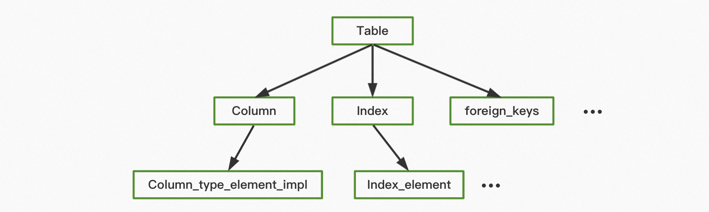
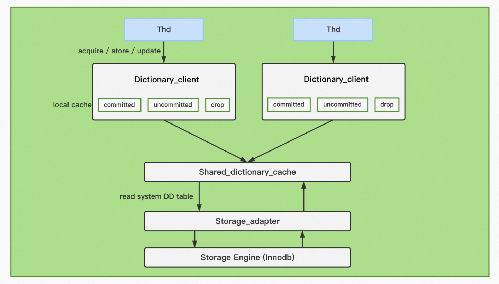
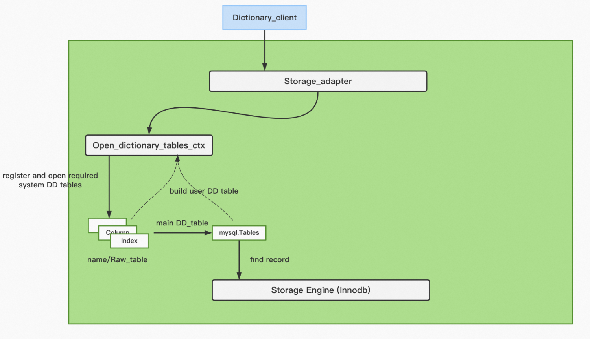
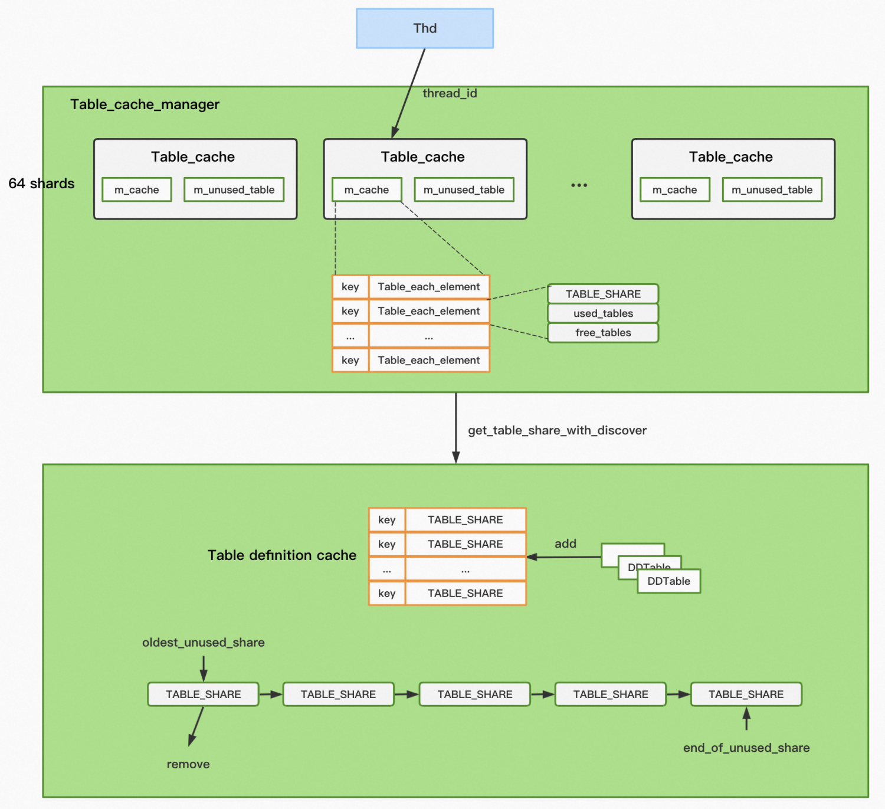

# MySQL 中的元数据管理

**Date:** 2023/10
**Source:** http://mysql.taobao.org/monthly/2023/10/03/
**Images:** 5 images downloaded

---

数据库内核月报

 [
 # 数据库内核月报 － 2023 / 10
 ](/monthly/2023/10)

 * 当期文章

 PolarDB Serverless弹性能力探索指南
* PolarDB MySQL DBA工具库新增一员猛将Statement Outline
* MySQL 中的元数据管理

 ## MySQL 中的元数据管理 
 Author: 谢榕彪(归墨) 

 最近总是会涉及到一些 MySQL 元数据的问题，正好整理一下学习到的 MySQL 中的元数据管理模块，这里主要从数据字典和表定义两块来看，总结一下学习的要点。

 本文内容基于 MySQL Community 8.0.13 Version

## 1. 数据字典

### 1.1 MySQL 中的元数据

MySQL 的元数据存在很多种类，包括 Schema，Table，Index，View，Tablespace 等等，描述了数据库中库，表，索引，视图，文件等属性，在 MySQL 中也被称为数据字典，每种资源都被抽象为 DD object，每个 DD object 有一个 Object_id 标识，MySQL 内部实现也是以简洁的多态和模版方式实现的。不同的 DD object 有着类似的访问模式，**MySQL 预留了多张系统的 DD 表来持久化和构建 DD object 信息**，在 MySQL 8.0，这些系统的 DD 表存储 Innodb 引擎的共享 DD 系统表空间 (mysql.ibd) 中，是在 MySQL 初始化数据目录就构建好的，这些系统 DD 表在 debug 模式下可以像正常用户表一样访问，如 tables，columns, indexes 等表。

`MySQL> SET SESSION debug='+d,skip_dd_table_access_check';
MySQL> SELECT name, schema_id, hidden, type 
 > FROM mysql.tables where schema_id=1 AND hidden='System';
+------------------------------+-----------+--------+------------+
| name | schema_id | hidden | type |
+------------------------------+-----------+--------+------------+
| tables | 1 | System | BASE TABLE |
| columns | 1 | System | BASE TABLE |
| indexes | 1 | System | BASE TABLE |
| foreign_keys | 1 | System | BASE TABLE |
...
+------------------------------+-----------+--------+------------+

`

MySQL 中的 DD object 的描述是一种树形结构，如图 1 所示，每个 DD object 都会有一个根系统 DD 表来存储该 DD object 的核心信息，也能够直接访问该系统 DD 表来检查 DD object 的存在性，并结合其他的子 DD 表信息辅助构建出 DD object, 并缓存在内存。如 DD table（Table_impl）的根系统 DD 表就是 mysql.tables 这张 DD 表，结合 mysql.columns 以及 mysql.indexes 等就能构建出表的完整信息，同时 index 又是以 Index_element 子 DD 系统表进行描述的，**这种递归的树形结构构成了 MySQL 中 DD object 的完整的描述信息**，这里简单称作 DD 描述树。

图 1

### 1.2 DD object 的两级缓存

每次都从系统的 DD 表构建需要的 DD object 是很低效的，因此 DD 模块维护了两级缓存来保存已经构建的 DD object 信息。

图 2: DD object 的两级缓存

我们知道当 MySQL 建立连接后，会保留有当前连接上下文 thd 对象，thd 中的 Dictionary_client 是专门用于和 DD 模块交互，获取 DD object 信息的。每个 DD object 信息，可能存在于三个位置，

* Dictionary_client 的局部缓存，**也是 DD object 获取的入口**，包括三种类型 committed，uncommited, drop, 代表和持久化系统 DD 表信息一致的，修改但未持久化的，已经删除的 DD object 缓存。每种类型的缓存是一个 Object_registry 对象，按照 DD object 的种类划分，每个种类有基于 Object_id，name 等四种哈希表，当获取一个 DD object 时，从 uncommited, drop, committed 依次获取。
* Shared_dictionary_cache 的共享缓存，和 Object_registry 对象类似，也是按照 DD object 种类划分，增加了并发访问的控制逻辑，由多个 Dictionary_client 共享。
* 通过 Storage_adapter 从系统 DD 表获取信息进行构建。

### 1.3 DD object 的查找，更新和持久化

以表的元信息 Table 为例，其实现类是 Table_impl，其构建通过 **Storage_adapter** 从引擎中读取系统的 DD 表的信息，本质这些系统的 DD 表也是以 Btree 组织数据的。

每个要构建的 DD object 其需要的系统 DD 表都是提前设置好的，当打开一个 DD table 时，首先会打开其所需的所有系统 DD 表，从根系统 DD 表（mysql.tables）中走 Innodb 的 btree 查找逻辑判断是否存在，存在会返回该 DD object 的 Raw_Record 记录，restore_attributes 会从根系统 DD table 的 DD object 中查找的 record 提取所需要的值，restore_children 是从涉及的 DD 描述树中其他的系统 DD 表查找信息存储到 Table_impl 中。

图 3: DD object 的查找过程

对于更新和新建一个 DD object，和查找类似，会用 Table_impl 信息先构建一个 Raw_Record 记录，store_attributes 更新根系统 DD 表，store_children 更新子系统 DD 表，递归存储树形结构中的 DD 系统表。

对于树形结构中每个 DD 系统表的更新，最终都是走引擎的 Btree 写入逻辑，持久化到 mysql.ibd 的表空间中。

而对于系统的 DD 表的建立，在 mysql 初始化数据目录就定义好（register_table），表结构都是事先写好的，然后在mysql 数据字典模块初始化时，从上层 create_tables 一路打通到 innodb 层建立的。

## 2. 表定义信息

### 2.1 TABLE 和 TABLE_SHARE

前面介绍数据字典是 MySQL 维护元数据的模块，MySQL 真正操作表数据是基于表定义对象 TABLE，和存储引擎和数据打交道，每个 TABLE 内有一个handler，表示使用的引擎对象，Innodb 引擎对应的表定义信息是 dict_table_t，TABLE 对表保留有操作数据的必备的信息，如表及字段的特征信息，元数据锁，record 查找结果等。每次执行 SQL 时，都会将涉及的表列表（TABLE_LIST，如 Join 多个表）逐个 open，**最终是从数据字典中的 Table_impl 获取构建 TABLE 的对象信息**。

**TABLE 对象由每个 thd 局部持有**，通过 prev 和 next 指针串起了正在操作这个 thd 所控制的所有 TABLE 对象。即 THD::opened_tables。因为不同 thd 可能同时访问相同的表，**因此 TABLE 都对应一个全局的对象TABLE_SHARE**。每个 TABLE 都是从 TABLE_SHARE 构建而来，在 TABLE_SHARE 也存有每个 TABLE 的引用次数。

### 2.2 server 层的缓存策略

为了避免每次都从 DD 模块中构建 TABLE 对象，表定义信息也有自己的缓存策略，Server 层和 Innodb 层的缓存管理是相互独立的。

Thd 的局部表定义 TABLE 是由 table_cache_manager 管理的，为了提高并发度，首先按 Thd 的 thread_id 分片，每个 Thd 对应一个 Table_cache 结构，Table_cache 中 m_unused_table 缓存了所有的空闲 TABLE 对象，m_cache 是按照 “database_name + table_name” 和 Table_each_element 的哈希表，Table_each_element 唯一对应于一个 TABLE_SHARE，独立管理着和该 TABLE_SHARE 的所有使用和空闲的 TABLE 对象。

因为 Table_cache 是按照 thread_id 分片，**因此同个 TABLE_SHARE 可能分布在多个 Table_cache 的 Table_each_element 中**，分布信息也记录在 TABLE_SHARE 中。

table_cache_manager 的大小由 table_cache_size 控制，平均划分到 Table_cache 中。

图 4: TABLE 的缓存管理

当从 Table_cache_manager 找不到可用的 TABLE_SHARE 对象，会从 Table definition cache 中获取，Table definition cache 是所有 Table_Share 的缓存（包括正在使用或者未被使用的），其大小由 table_def_size 控制。当 TABLE_SHARE 被释放后会被加入 oldest_unused_share 链表尾部缓存，下次开表时直接复用，超过 table_def_size 时，也优先从 oldest_unused_share 中释放。

### 2.3 Innodb 层的表定义信息

Innodb 中同样需要使用表定义信息，在 innodb 的形式是 dict_table_t，缓存在 dict_sys_t 中，大小和 TABLE_SHARE 的缓存一样，由 table_def_size 控制。

包括了两个哈希表：按 name 索引的 table_hash 和 按 id 索引的 table_id_hash；以及两个 LRU 链：用于剔除 的 table_LRU 以及不剔除的 table_non_LRU。

table_non_LRU 中的表不会被缓存主动剔除 [3]，如常用的系统 DD 表 (sys_tables, sys_columns, …)，引用关系的表 (dict_foreign_add_to_cache), 全文索引的表 (fts_optimize_add_table)，便于删表，删表逻辑时保证快速从缓存加载表。

table_LRU 随着开表（dict_table_open_on_name 和 dict_table_open_on_id）动态调整缓存中的 dict_table_t。master 线程也会定时清理 table_LRU 中超出的 dict_table_t。

dict_table_t 的开表流程也是基于临时 TABLE_SHARE 构建的。

在 dict_sys_t 中还保留一些系统 DD 表直接指针标识，使用时直接访问，避免从哈希表中查找。

## 引用

[1][MySQL · 源码分析 · 详解 Data Dictionary](http://mysql.taobao.org/monthly/2021/08/02/)

[2][MySQL · 源码分析 · TABLE信息的生命周期](http://mysql.taobao.org/monthly/2022/01/04/)

[3][MySQL · 功能分析 · MySQL表定义缓存](http://mysql.taobao.org/monthly/2015/08/10/)

[4][MySQL 8.0: Data Dictionary Architecture and Design](https://dev.mysql.com/blog-archive/mysql-8-0-data-dictionary-architecture-and-design/)

 阅读： - 

本作品采用[知识共享署名-非商业性使用-相同方式共享 3.0 未本地化版本许可协议](http://creativecommons.org/licenses/by-nc-sa/3.0/)进行许可。

 