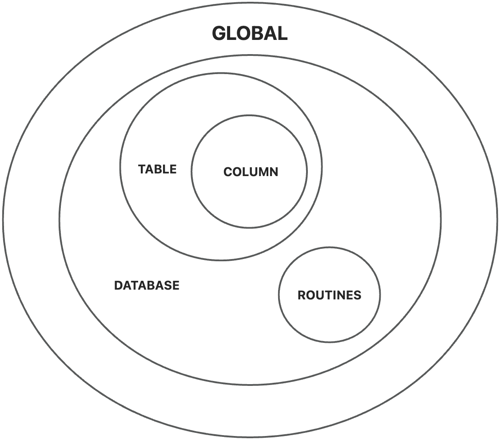
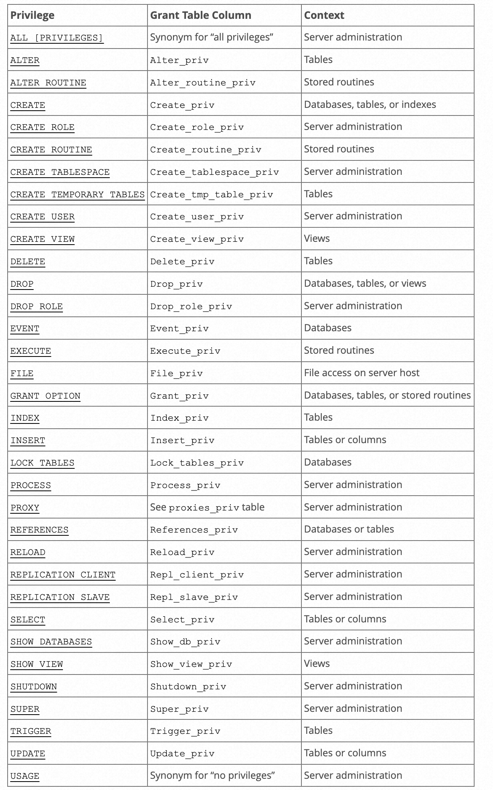
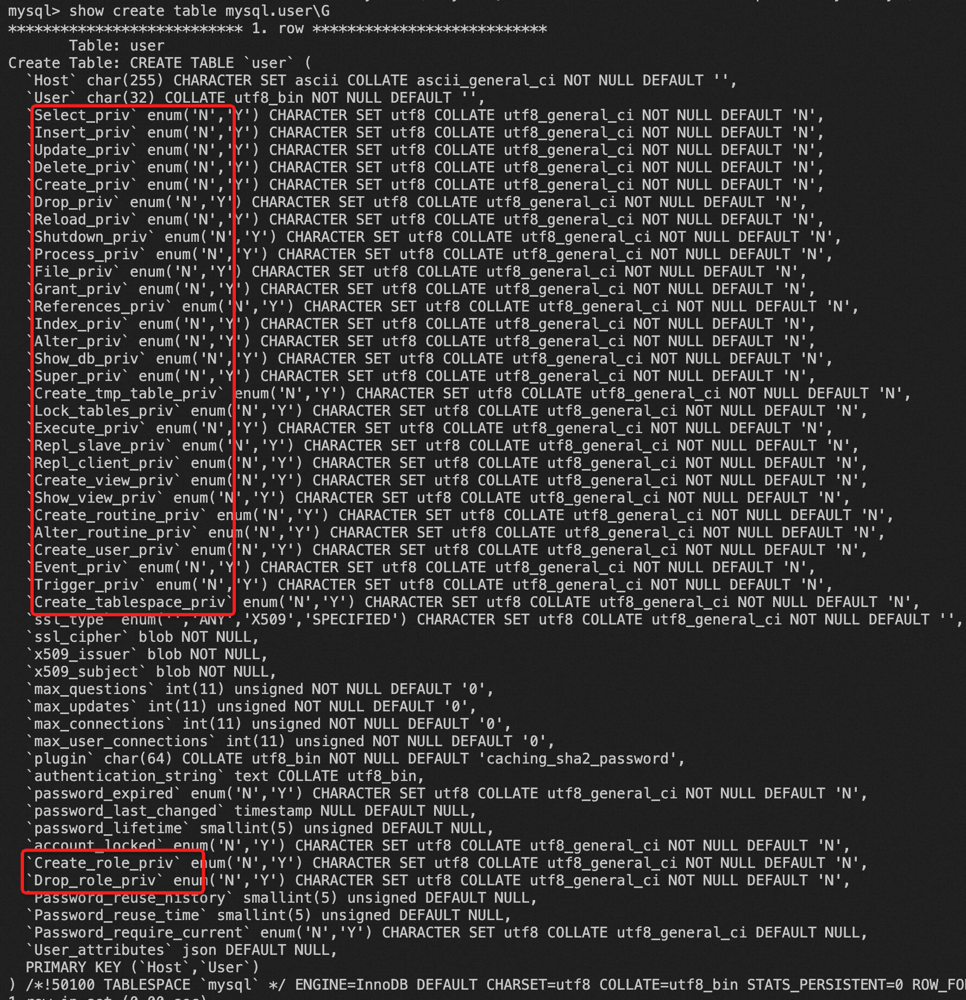
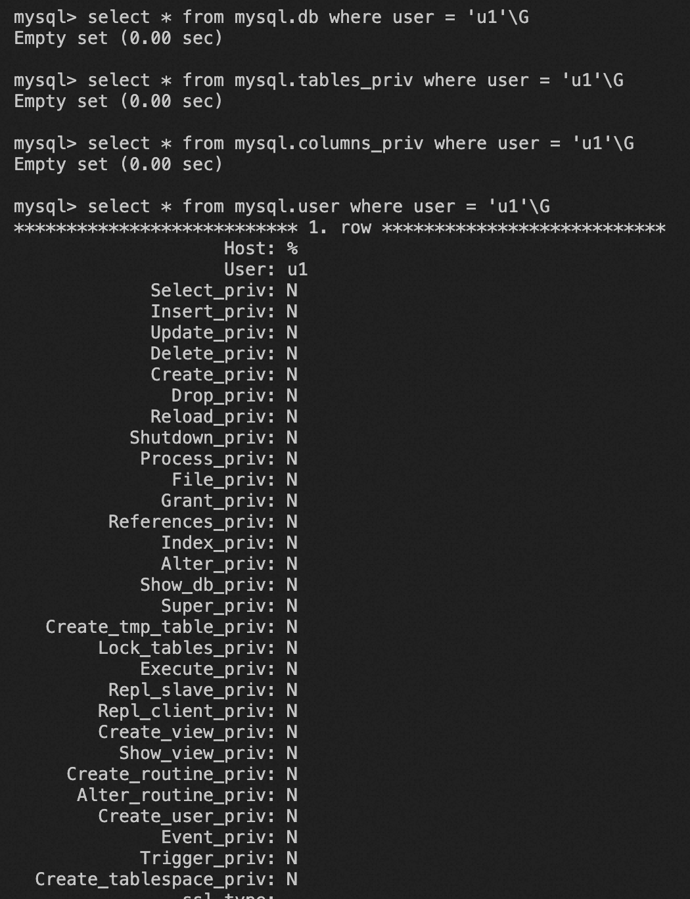
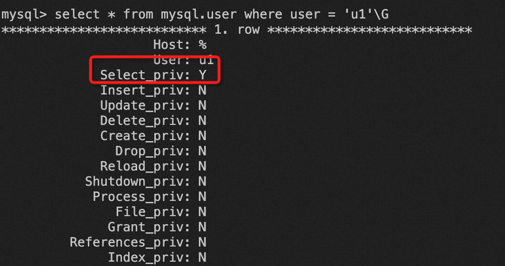
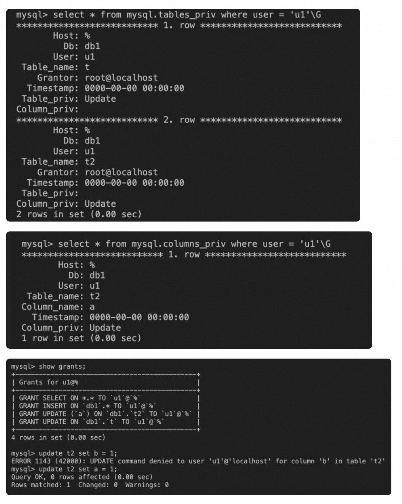

# MySQL 权限管理

**Date:** 2024/01
**Source:** http://mysql.taobao.org/monthly/2024/01/02/
**Images:** 7 images downloaded

---

数据库内核月报

 [
 # 数据库内核月报 － 2024 / 01
 ](/monthly/2024/01)

 * 当期文章

 PolarDB子查询改写系列（三）子查询折叠
* MySQL 权限管理
* MySQL 深潜 - 直方图采样优化

 ## MySQL 权限管理 
 Author: 有扈 

 # MySQL 权限简介
MySQL中账号权限（这里仅代表静态权限）决定了账户可以执行哪些操作。大家都对一些简单的使用方式比较熟悉，例如授予某个账户在某个database select等权限，或者授予某个账户在具体某个table的update权限。但是MySQL中具体是如何实现权限控制以及如何对权限进行划分的，大部分人还是不太熟悉的。本文将会对MySQL中的权限管理，以及内核中如何实现权限控制进行介绍。

# MySQL 权限层级分类
在MySQL中这些权限按照权限的控制范围可以分为以下几类：

* global
* database
* table
* colunm
* routines

控制的层级范围示意图：

在对于这些权限进行授权时，有以下的规则。

1. 授予高层级的某个权限，下一个层级的权限会同样获得到。
 * 例如：如果授予user_1 在 全局 的select 权限，那么 user_1 在所有database的所有table 都具有select 权限。
* 例如：如果授予user_1 在 database db_1 的update 权限，那么 user_1 在 所有 db_1 下的所有table 都具有 select 权限。
2. 有部分权限是专属于某一个层级的，这样的权限不可以在其他层级授权。
 * 例如：global 级别有 create user 权限，这个权限仅可能在global 级别被授权，不可以在database级别授权。
* 例如：create routine权限，仅可以在global 级别以及 database级别授权，不可以在table级别授权

下面的例子是不同权限，授权在不同层级的结果。授权在不对应层级的话，会报错。

`mysql> grant create user on db1.* to u1;
ERROR 1221 (HY000): Incorrect usage of DB GRANT and GLOBAL PRIVILEGES
grant create user on *.* to u1;

mysql> grant create routine on db1.t to u1;
ERROR 1144 (42000): Illegal GRANT/REVOKE command; please consult the manual to see which privileges can be used
mysql> grant create routine on db1.* to u1;
Query OK, 0 rows affected (0.01 sec)
mysql> grant create routine on *.* to u1;
Query OK, 0 rows affected (0.01 sec)

mysql> grant update(a) on db1.* to u1;
ERROR 1144 (42000): Illegal GRANT/REVOKE command; please consult the manual to see which privileges can be used
mysql> grant update(a) on *.* to u1;
ERROR 1144 (42000): Illegal GRANT/REVOKE command; please consult the manual to see which privileges can be used
mysql> grant update(a) on db1.t2 to u1;
Query OK, 0 rows affected (0.01 sec)
`

MySQL对授权层级的检测，主要在两个地方

1. 语法解析的时候，会进行初步的检测，检测一些容易发现的授权层级失败。例如对列权限的 grant revoke ，但是选择的层级是database或者global 级别。
2. mysql_grant时候，会在代码里面进行解析，判断需要grant 或者revoke的权限 是否与 授权的层级是一致的。（例如检测table name 是否为空，db name 是否为空）

这一部分的具体逻辑，会在本文后面权限更新的位置详细讲一下。

下图是MySQL中可以控制的所有静态权限。第一列是权限的名称，用在执行grant/revoke 语句里面的词词法；第二列是存储在mysql表中的定义；第三列是权限控制的范围。

# MySQL 权限存储

当授予不同层级的权限后，会记录到对应的表里面:

* 在global 层级进行权限的更新，则会记录到mysql.user表中
* 在db 层级进行权限更新，会记录到mysql.db表中
* 在table层级进行权限更新，会记录到mysql.tables_priv表中
* 在column层级中进行权限更新，会记录到mysql.columns_priv 中

可以查看mysql.user、mysql.db等表的定义。例如：mysql.user表

当权限发生变化时，具体存储权限信息的表中数据也会更改。

当u1 无权限时

授予u1 global select 权限后

授予 u1 db1.t2.a update 权限后

# MySQL 权限更新
通过grant 语法来更新某个账户的权限时，大体的执行逻辑是：

1. 判断当前grant/revoke是更新哪些权限
2. 判断需要更新的权限需要写到哪些表里面

## 判断当前更新权限
在代码层面，这些权限通过位的方式进行表示。所有权限用一个uint来表示，目前所有的权限一共是31位，用uint表示刚好。

`#define SELECT_ACL (1L << 0)
#define INSERT_ACL (1L << 1)
#define UPDATE_ACL (1L << 2)
#define DELETE_ACL (1L << 3)
#define CREATE_ACL (1L << 4)
#define DROP_ACL (1L << 5)
#define RELOAD_ACL (1L << 6)
#define SHUTDOWN_ACL (1L << 7)
#define PROCESS_ACL (1L << 8)
#define FILE_ACL (1L << 9)
`
在进行语法解析时，得到当前grant/revoke 语句具体要更新的权限是哪些。

`role_or_privilege_list:
 role_or_privilege
 {
 $$= NEW_PTN Mem_root_array<PT_role_or_privilege *>(YYMEM_ROOT);
 if ($$ == NULL || $$->push_back($1))
 MYSQL_YYABORT; // OOM
 }
 | role_or_privilege_list ',' role_or_privilege
 {
 $$= $1;
 if ($$->push_back($3))
 MYSQL_YYABORT; // OOM
 }
 ;

role_or_privilege:
 ......
 | SELECT_SYM opt_column_list
 { $$= NEW_PTN PT_static_privilege(@1, SELECT_ACL, $2); }
 |......
`

同时在上面讲到了执行权限更新时，权限需要跟层级关系匹配，当时举了个例子,当出现列上的权限更新的时候，授权的级别必须是table，这个限制的检测在语法解析的时候实现的。

`grant_ident:
 ......
 | schema '.' '*'
 {
 LEX *lex= Lex;
 lex->current_query_block()->db = $1.str;
 if (lex->grant == GLOBAL_ACLS)
 lex->grant = DB_OP_ACLS;
 else if (lex->columns.elements)
 {
 my_error(ER_ILLEGAL_GRANT_FOR_TABLE, MYF(0));
 MYSQL_YYABORT;
 }
 }
 | '*' '.' '*'
 {
 LEX *lex= Lex;
 lex->current_query_block()->db = NULL;
 if (lex->grant == GLOBAL_ACLS)
 lex->grant= GLOBAL_ACLS & ~GRANT_ACL;
 else if (lex->columns.elements)
 {
 my_error(ER_ILLEGAL_GRANT_FOR_TABLE, MYF(0));
 MYSQL_YYABORT;
 }
 }
`

## 修改对应权限表
在经过语法解析后，可以得到需要授权的table，或者database。大体的逻辑如下：

1. table不为空 (table 或者列级别的权限授予)
 a. grant routine
 b. grant table_grant
 * update table grant (语法解析时，对column级别的权限要求记录在column->rights 中) 因此更新时，对于colunm的权限更新，不需要在table中写进去。
* update column table
2. table为空： db层级 或者 global 层级
 a. replace_user_table 首先进行user 表更新，如果db为null，证明是全局的权限，直接将要求的rights全部授予。否则是0，replace_user_table 将rights传递进去，更改每个位置对应的权限(Acl_table_user_writer::update_privileges)。
 b. db 不为null，则需要更改db级别的权限
 * 在这个位置会判断 grant 语句中需要的权限是否 全部是DB_acls，进行层级检测

 ` ulong db_rights = filtered_rights & DB_ACLS;
 if (db_rights == filtered_rights) {
 if ((ret = replace_db_table(thd, tables[ACL_TABLES::TABLE_DB].table,
 db, *user, db_rights, revoke_grant))) {
 error = true;
 if (ret < 0) break;

 continue;
 }
 thd->add_to_binlog_accessed_dbs(db);
 } else {
 // 如果需要更新的权限不全是DB_acls，则报错
 my_error(ER_WRONG_USAGE, MYF(0), "DB GRANT", "GLOBAL PRIVILEGES");
 error = true;
 continue;
 }
` 
 c. 判断权限满足层级要求之后，去更新table表

# MySQL 权限认证
以select sql为例。在sql语句解析的过程中，会得到table list，在sql_cmd_select::precheck中会进行检测权限，check_table_access。
权限认证的时候从user db table colunm层次依次判断。认证时候的总体逻辑是将 user -> da -> table -> colunm的权限 并起来，对于上一层级拥有的权限，直接向下传递。
举个例子：

`create table t (a int, b int);
grant select(a) on db1.t to u1;

select a from t;
`

这个时候，只有mysql.table_priv表中记录 u1 在 t 中 有 select 权限，但是并不知道是哪一列。column_priv 表中记录了u1 在 t 中有select 权限。具体权限认证的逻辑是：

`check_table_access ： want_access
1.check_access 首先判断user 表 以及 db 表。 获取两张表中user & db的权限。 对于table list中的每个表，得到一个uint，表示对表有哪些权限。
 - user 表中的权限 -> cache 在Security_context::m_master_access 中。判断是否满足权限需求。
 - db 表中的权限 -> cache acl->dbs. 通过user、host、db得到对 table 所在的database有哪些权限。
 - 如果这个时候，发现在对应的表上权限不足，我们需要向下层级继续进行判断。（引入partial revoke 之后如果满足层级需求则仍需要判断，本篇文章不引入partial revoke逻辑）
2. check_grant 判断table级别的权限
 - 判断global 权限是否满足，满足退出
 - 判断得到的privileges 是否满足，满足退出
 - 继续判断table 表，table_hash_search 根据 user、host、db、table找到拥有的table 权限，以及列权限，这里的列权限是表中所有列的并集。
 - 得到table中的权限之后，继续更新table list中的grant.privilege 中的 int，并且将表中的各列的权限放入table list中，如果table中的列权限的并集不能满足需求，那么直接返回error。
`

check_table_access后得到了 table list表中，每个table list中会记录了

* 当前user对此表拥有的权限
* 当前user对表中列所拥有的权限（所有列权限的并集）

之后在select 解析执行中,select_lex::prepare阶段，填充fields对列的权限进行检查。对列的权限在 Item_field::fix_fields() 进行检查,从table grant中判断当前列的权限。

 阅读： - 

本作品采用[知识共享署名-非商业性使用-相同方式共享 3.0 未本地化版本许可协议](http://creativecommons.org/licenses/by-nc-sa/3.0/)进行许可。

 