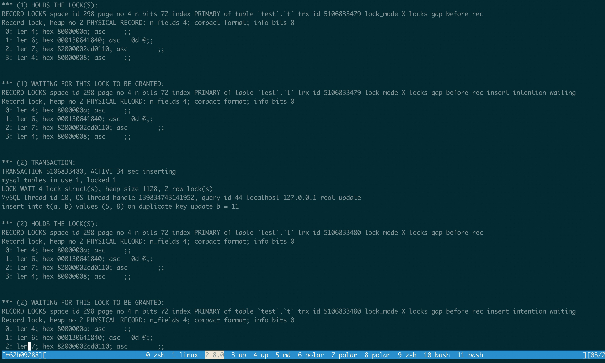

# MySQL · 源码分析 · MySQL deadlock cause by lock inherit

**Date:** 2024/03
**Source:** http://mysql.taobao.org/monthly/2024/03/02/
**Images:** 2 images downloaded

---

数据库内核月报

 [
 # 数据库内核月报 － 2024 / 03
 ](/monthly/2024/03)

 * 当期文章

 MySQL · 死锁场景 · 并发插入相同主键场景
* MySQL · 源码分析 · MySQL deadlock cause by lock inherit
* PolarDB 单实例多租户模式介绍

 ## MySQL · 源码分析 · MySQL deadlock cause by lock inherit 
 Author: baotiao 

 In our user environment, we find deadlock cause by this example.

However, in this case, sometimes session 2 and session 3 lead to dead lock and sometimes it won’t.

`create table t(a int AUTO_INCREMENT, b int, PRIMARY KEY (a));
insert into t(a, b) values(10, 8);
insert into t(a, b) values(5, 8); 

session 1: begin; delete from t where a=5;
session 2: insert into t(a, b) values (5, 8) on duplicate key update b = 11;
session 3: insert into t(a, b) values (5, 8) on duplicate key update b = 11;

session 1: commit;

# Then sometimes session 2 and session 3 lead to dead lock and sometimes it won't.
`

I find the root cause is lock inherit cause the deadlock.

In session 1 get the record 5 X, REC_NOT_GAP lock.

Then session 2 waiting in the record 5 X, REC_NOT_GAP lock.

And session 3 waiting in the record 5 X, REC_NOT_GAP lock.

`+-----------+------------+-----------+---------------+-------------+-----------+
| thread_id | index_name | lock_type | lock_mode | LOCK_STATUS | lock_data |
+-----------+------------+-----------+---------------+-------------+-----------+
| 148 | PRIMARY | RECORD | X,REC_NOT_GAP | WAITING | 5 |
| 150 | PRIMARY | RECORD | X,REC_NOT_GAP | WAITING | 5 |
| 146 | PRIMARY | RECORD | X,REC_NOT_GAP | GRANTED | 5 |
+-----------+------------+-----------+---------------+-------------+-----------+
`

Then when session 1 execute commit, there is two scenario:

Whether the record 5 was purged after session 1 commit and before session 2 and session 3 was executing.

If the record was not purged, the record 5 won’t be physical deleted, then only one session, session2 or session 3 will get the 5 X, REC_NOT_GAP lock, then the session 2 and session 3 doing the insert one by one.

This scenario will not cause deadlock.

If the record was purged, the record 5 was physical deleted, then the waiting records will inherit to next record. Then session 2 and session 3 will wait for record 10, X GAP lock. Then session 2 and session 3 will both get the record 10, X GAP lock. Then they will doing the insert work, both sessions hold the X GAP lock and waiting other’s X,GAP,INSERT_INTENTION lock. Then deadlock happend.

Get the lock information by adding a breakpoint before deadlock check.

`+-----------+------------+-----------+------------------------+--------------+-----------+
| thread_id | index_name | lock_type | lock_mode | LOCK_STATUS | lock_data |
+-----------+------------+-----------+------------------------+--------------+-----------+
| 148 | PRIMARY | RECORD | X,GAP | GRANTED | 10 |
| 148 | PRIMARY | RECORD | X,GAP,INSERT_INTENTION | WAITING | 10 |
| 150 | PRIMARY | RECORD | X,GAP | GRANTED | 10 |
| 150 | PRIMARY | RECORD | X,GAP,INSERT_INTENTION | WAITING | 10 |
+-----------+------------+-----------+------------------------+--------------+-----------+
`

The deadlock information from mysql

The default behaviour of lock inherit is Let the next record’s GAP lock inherit the record’s REC_NOT_GAP lock.

However, in this case, the X REC_NOT_GAP lock is conflict with X REC_NOT_GAP lock, after the inherit, X REC_NOT_GAP lock inherit to next record’s X GAP lock. The X GAP lock won’t conflict with X GAP lock. Then two sessions both get the X GAP lock, then the deadlock happened.

I suggest in X REC_NOT_GAP lock inherit case, let the next record inherit the NEXT-KEY lock, then in this case NEXT_KEY lock conflict with NEXT_KEY lock, the deadlock won’t happened.

 阅读： - 

本作品采用[知识共享署名-非商业性使用-相同方式共享 3.0 未本地化版本许可协议](http://creativecommons.org/licenses/by-nc-sa/3.0/)进行许可。

 