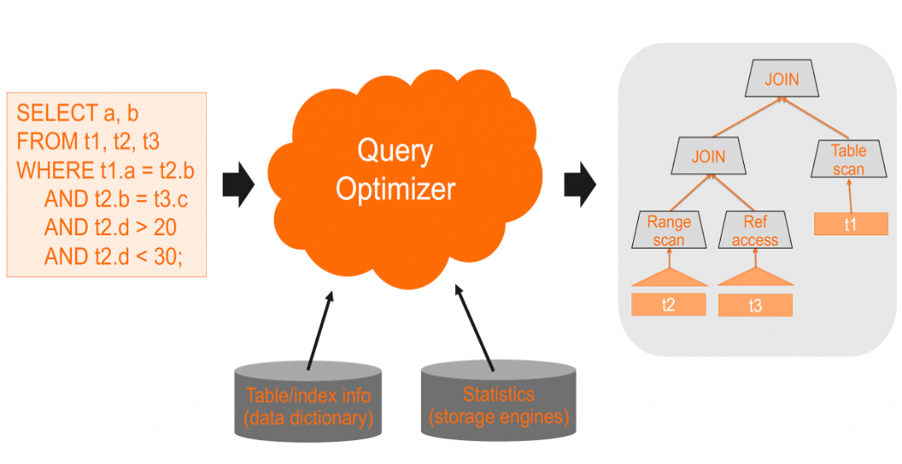
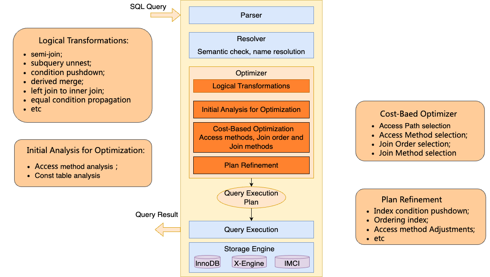
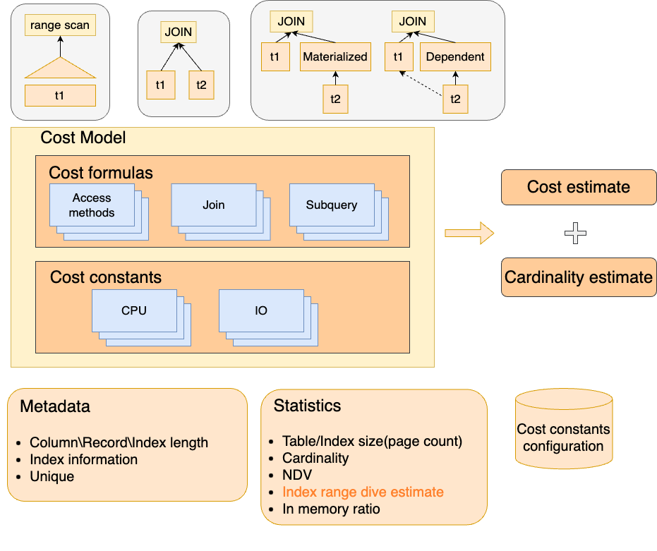
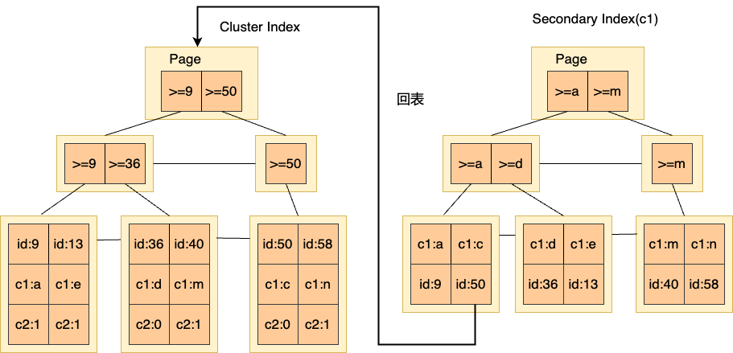

# MySQL查询优化分析 - MySQL优化执行的基础概念

**Date:** 2024/04
**Source:** http://mysql.taobao.org/monthly/2024/04/01/
**Images:** 7 images downloaded

---

数据库内核月报

 [
 # 数据库内核月报 － 2024 / 04
 ](/monthly/2024/04)

 * 当期文章

 MySQL查询优化分析 - MySQL优化执行的基础概念
* PT_PERF：基于 Intel PT 的时延性能分析工具
* 如何使用 Intel Processor Trace 工具查看任意函数执行时间

 ## MySQL查询优化分析 - MySQL优化执行的基础概念 
 Author: 勉仁 

# 前言
在数据库中，业务查询的性能优化是维护系统效率和稳定性的关键因素。我们在处理查询性能优化时，常常会面对：查询缓慢的原因分析，优化器在计划选择中为何出现误判，如何提升查询执行效率等种种问题。MySQL查询优化分析会通过数篇文章去讲解如何分析与优化MySQL查询性能，将会围绕MySQL优化执行的基础概念、PolarDB MySQL的查询优化和执行加速相关功能、查询分析工具与方法、常见的查询性能问题与解决方式展开叙述。本文MySQL查询优化分析系列的第一篇文章，介绍MySQL优化执行的基础概念。
用户查询经过词法、语法解析后，由优化器分析选择执行计划，经过执行器执行返回客户数据。本文分别介绍MySQL优化器框架、代价模型，MySQL基表访问、JOIN、子查询执行方式。通过这些内容，对MySQL优化器计划的选择，执行计划的执行方式有一个基础的了解。

# MySQL优化器框架
优化器基于各类元数据信息和数据库收集的统计信息，选择其认为代价最低的执行计划。

MySQL优化器的主要流程如下：

* 逻辑优化

对查询做逻辑等价变换，例如semi-join、子查询解关联、谓词下推、视图合并、左连接转内连接、等值推导等。对查询做等价变换后，查询生成更优的执行计划，有更多的计划选择。

* 初始的优化分析

对表各个可能的访问路径做一个扫描行数和代价分析。扫描行数和代机的分析，可以帮助后续选择合适的基表路径，有初始的Join表排序帮助能够快速剪枝，后续在Join条件关联索引和常量索引之间做选择。
同时会分析出Const Table。Const Table是指在表条件上有primary key或者unique key等值访问的表，从约束条件上确认最多只会获取一行数据。Const Table在优化期间就会执行，获取要访问的数据，相关的列在后续优化中即可作为常量，使后续优化可以更加准确。同时如果Const Table上不存在满足条件的数据行，在优化期间就可以被发现，从而跳过后续的优化和执行过程。

* 基于代价的物理优化

这期间会对表的访问路径（哪个索引）和访问方式（等值REF、范围RANGE），Join Order和Join方式（Nest Loop Join、Hash Join）做选择。

* 计划的改进

会对执行计划做进一步改进优化。
把索引谓词下推到引擎，执行期间可以在引擎层提前过滤更多的数据，减少回表还有和SQL层的交互。
当有Order by/Order by limit的时候，对Ordering index的选择，从而避免对数据排序。
访问方式在这个阶段也可能做调整。在基表访问选择时候，由于估算等原因，可能同一个索引有更多条件覆盖的RANGE扫描代价比等值REF代价高。该阶段会调整为选择可以利用更多条件的RANGE扫描。

# MySQL代价模型

## 代价模型整体框架
代价模型对计划的选择非常关键。MySQL代价模型除了代价公式外主要是依赖元数据和统计信息。代价公式包含了主要执行算子的代价计算方式，基表访问、JOIN、子查询等。元数据包括了：行/列/索引长度，索引是否唯一等，统计信息包含了：表/索引大小、表行数、NDV、索引访问行数dive估算、数据在内存中的占比等。

## 表访问的代价模型
表的访问代价在表路径选择和Join Order选择中都非常关键，所以本文主要针对表访问的代价做介绍。
我们先了解一下InnoDB中的数据组织形式。InnoDB主表（Cluster Index）存储了所有列的数据，二级索引（Secondary Index）存储了二级索引列和主键列。当访问路径是二级索引，需要获取主键行的时候，会通过主键在Cluster Index上定位具体数据行来获取，这一行为我们称为回表。该操作对比遍历btree叶子节点的数据行开销大很多，在很多查询性能分析中是一个关键因素。需要回表的场景有：

1. 当访问二级索引，除了二级索引列和主键列，要获取其他列的数据。
2. 需要回表判断索引行可见性。每一个主键行都存储了trx_id，可以用来判断行的可见性。但是在二级索引上，record上面是没有trx_id信息，是每一个Page存储了一个PAGE_MAX_TRX_ID，记录最新更改该page最大的trx_id。当查询ReadView的min_trx_id小于PAGE_MAX_TRX_ID时，该二级索引page上的每一条数据都需要回表判断可见性，即使我们并不需要访问其他数据列。
3. 对于update/delete等需要加行锁的场景，当通过二级索引访问时，会回表给主键行加行锁。

表的访问代价由表访问的IO代价（引擎访问代价）和CPU代价（SQL层计算）代价组成。
CPU代价公式如下：
cpu_cost = rows * ROW_EVALUATE_COST。
其中rows是会访问处理的行数，是通过统计信息估算或者动态采样而来。ROW_EVALUATE_COST是常量系数，默认为0.1。
虽然有不同的访问路径，但IO的代价公式都可以描述为：
io_cost = pages * PAGE_READ_COST。
pages表示会访问到的page数量。不同访问路径中，pages表示如下：

* Table Scan的访问，pages是主表Cluster Index上leaf page数量。
* Index Scan，pages是要访问二级索引上leaf page的数量。
* 不需要回表的主键或索引的范围Range或者等值Ref访问，会通过访问行数在表行数中的占比，推算要访问的leaf page数量。
* 要回表的索引访问。由于每一次回表都最终要定位到主键上的一个page，回表访问page数就等于回表行数。在代价模型中，忽略了二级索引自身page访问数量。pages在回表场景就是二级索引访问的行数。从这里我们也可以看到回表的代价很高，真实执行也是开销很大的操作。

在IO代价中，系数PAGE_READ_COST并不是一个简单的常量，而是考虑了磁盘与内存访问的占比。其公式是：
PAGE_READ_COST=BUFFER_READ_COST * in_mem_pct + IO_READ_COST * on_disk_pct
BUFFER_READ_COST：0.25、IO_READ_COST：1.0
in_mem_pct是通过InnoDB统计索引对应btree在内存中page数目与索引叶子节点数目的比例来计算。其余即是磁盘访问占比。

从上面表访问代价模型，我们可以看到一些关键信息：访问路径的扫描行数（page数目）是重点；索引回表性能比覆盖索引扫描性能差很多，全表扫描的执行时间也可能比太大数据量非覆盖索引的访问快。

# MySQL统计信息的查看与配置
本节介绍MySQL统计信息存储、查看、关联相关的系统表及命令。
统计信息相关的系统表：

* mysql.innodb_table_stats

存储了表的总行数，主键clustered index上page数，非主键索引的page总数。

* mysql.innodb_index_stats

存储了主键及二级索引上page数目，叶子节点page数目，索引前缀列的NDV。

* mysql.server_cost

存储了代价系数。

* information_schema.tables

可以查看表总的数据量、数据碎片和索引数据量
查看统计信息命令有：

* Show index from table_name;

可以用来查看表索引的NDV信息，及其他索引的元数据信息。
收集统计信息命令有：

* Analyze table table_name;

重新收集表的统计信息。

* Optimize table table_name;

重组织表数据，回收表的空间碎片。这是一个DDL操作。可用于对有大量数据碎片的表重组数据减少存储空间，线上需要谨慎操作。
统计信息主要变量：

* innodb_stats_persistent_sample_pages

收集统计信息时的采样page数。
如果遇到基础统计信息，如表的行数、索引NDV不准的情况，可以适当调大innodb_stats_persistent_sample_pages配置，使用Analyze table命令来重新收集统计信息。

# MySQL表访问、JOIN、子查询的执行

## 表的访问方式
MySQL执行中，表访问索引和访问方式的选择非常关键，若索引和访问方式选择错误会严重影响查询效率。我们首先看一下MySQL的表访问方式。

* Const

常量表的访问。对于有条件pk/uk=const_value的表，可以确定性的最多只会获取一行。这些表就会在优化期间访问获取对应行，该表的列就会看成常量值参与后续优化，从而得到更准确的计划。如果没有对应的行，那么查询在优化期间就会直接返回空集给客户端。

* EQ_REF

对表上pk/uk唯一索引的等值关联访问。条件：pk/uk = join_table.column。

* REF

普通索引的常量等值或者等值关联访问。条件：key_part = const, key_part = join_table.column。

* REF_OR_NULL

索引等值条件与IS NULL用OR表达式组合。key_part = const OR key_part IS NULL。

* RANGE

索引范围访问。key_part > const_a AND key_part < const_b； key_part in (const_a, const_b); key_part = const_a OR key_part = const_b。
对于索引列in list条件和用OR表达式组合起来的多个等值条件，这也都是RANGE访问方式。
对于索引REF/REF_OR_NULL/RANGE扫描行数的估算主要是通过在查询时索引dive估算获取。index dive估算方式会获取查询每个range的left_rec和right_rec，当左右边界之间的page数目比较多的时候，会最大扫描N_PAGES_READ_LIMIT(10) 个pages。然后扫描行数为: pages数目 * 采样行数/采样page数。

* ALL

ALL为全表扫描。当表没用索引条件或者索引访问代价大于全表扫描会选择全表扫描。

* INDEX

全索引扫描。该访问方式虽然选择了索引，但是扫描全部索引数据，没有索引条件生成范围来减少扫描。

* INDEX MERGE

索引合并扫描。
当查询条件为key1_part = cont_a AND key2_part = const_b时候，可能会选择intersection index merge，将两个索引结果取交集再去访问主表获取所有要访问的列，从而减少回表IO。但如果两个索引访问的数据行基本重复，对比单索引就多了一次索引访问。而对于DML语句，由于索引访问时候就会锁主表数据行，回表访问，intersection的index merge操作就不会提升性能，而且由于单语句多个索引访问会导致并发死锁情况。
当查询条件为key1_part = const_a OR key2_part = const_b的时候，可能会选择union index merge方式。这样可以合并两个索引的结果获取要访问的数据，否则单个索引无法获取扫描范围。

* FULLTEXT

 ## JOIN
 MySQL join order的选择算法是，Greedy Search（有限穷举+贪婪），相关算法的详解可以参考https://zhuanlan.zhihu.com/p/542499821

目前仅支持生成left deep join（左深树）的方式。MySQL 8.0在发展中的Hypergraph join optimizer支持bushy join，目前尚未做到可以线上业务使用。
JOIN Method目前支持Nest Loop Join和Hash Join。
对于JOIN执行效率的关键点包括：是否有关联索引、是否有过滤性强的条件，如果没有索引关联，所用版本是否有HASH JOIN。

## Subquery
子查询为数据库操作提供了便利性，同时如果优化器未能选择合适计划或者使用不当会严重影响执行效率，尤其是在处理大数据量的时候。本节介绍各类子查询和可能的执行方式。

* 标量子查询

标量子查询一次执行仅返回一个数值，可以出现在single column的位置。例如：
SELECT c1, (SELECT s1 FROM t2) FROM t1; 出现在SELECT List中。
SELECT * FROM t1 WHERE column1 = (SELECT MAX(column2) FROM t2);出现在比较符中。

* IN/NOT IN, ANY(SOME)， ALL子查询

这类子查询能否使用合适的查询变换是执行效率的关键。
对于这类IN子查询：WHERE c1 IN (SELECT c1 FROM t2); MySQL会转换为semijoin。
对于子查询：WHERE c1 NOT IN (SELECT c1 FROM t2); MySQL从8.0.17开始会转换为anti-join。但在此之前的版本是使用Dependent subquery执行方式。
对于大于ANY子查询会转换为大于min值，例如 WHERE c1 > ANY (SELECT c1 FROM t2); 会转换为 > min(c1)。对于大于ALL子查询会转换为大于max值，例如WHERE c1 > ALL (SELECT c1 FROM t2); 会转换为> max(c1)。
= ANY(subquery)会转换为IN子查询，<>ALL(subquery)会转换为NOT IN子查询。

* EXISTS/NOT EXISTS子查询

在MySQL 8.0.16之前是通过subquery方式执行。
 从8.0.16 EXISTS子查询可以转换为semijoin。从8.0.17开始NOT EXISTS子查询可以转换为anti-join。
上述子查询是否有合适的查询变换是关键。在查询分析中可以通过EXPLAIN query查看执行计划，然后通过show warnings查看改写后的语句。

* 关联子查询

SELECT * FROM t1 WHERE t1.c1 > ( SELECT SUM(account) FROM t2 WHERE t2.c1=t1.c1 );
对于这类关联子查询，我们可以看到执行计划展示Dependent subquery，为嵌套执行方式。

* Derived Table 派生表子查询

SELECT AVG(sum_column1) FROM (SELECT SUM(column1) AS sum_column1 FROM t1 GROUP BY column1) AS t1;
对于普通的SPJ查询，MySQL会做derived_merge展开。而对有GROUP BY/DISTINCT/ORDER BY LIMIT等非SPJ子查询，会生成Derived Table物化中间结果。

* Lateral Derived Table

SELECT t1.c1 FROM t1, LATERAL (SELECT c1 FROM t2 WHERE t2.c1 = t1.c1 GROUP BY c1) td;
对非SPJ查询，无法展开的会生成DEPENDENT DERIVED物化表，物化表会做反复的物化。
对于Dependent Subquery/Derived是否有合适索引，减少每一次嵌套执行扫描的数据量非常关键。对于Derived Table需要物化的表，物化的数据量对执行效率影响很大。同时物化表做被驱动表是否有join index(auto key)生成也会很大的影响执行性能。

# 总结
本文介绍了MySQL优化执行的一些基础概念，MySQL查询优化流程，表访问的代价模型，统计信息的查看与收集。同时介绍了影响执行效率的一些关键点，对于表访问：索引扫描行数、是否回表是关键，对于JOIN是否有合适的关联索引、JOIN ORDER、无索引时是否有HASH JOIN是关键，对于subquery：是否选择了合适的查询变换、嵌套子查询是否有关联索引、物化子查询的数据量是关键。下一篇我们将介绍PolarDB MySQL在查询优化及执行加速上的一些工作。

# 引用

[https://dev.mysql.com/doc/refman/8.0/en/innodb-persistent-stats.html](https://dev.mysql.com/doc/refman/8.0/en/innodb-persistent-stats.html)
[https://dev.mysql.com/doc/refman/8.0/en/explain-output.html#explain-join-types](https://dev.mysql.com/doc/refman/8.0/en/explain-output.html#explain-join-types)
[https://zhuanlan.zhihu.com/p/542499821](https://zhuanlan.zhihu.com/p/542499821)
[https://dev.mysql.com/doc/refman/8.0/en/subqueries.html](https://dev.mysql.com/doc/refman/8.0/en/subqueries.html)

 阅读： - 

本作品采用[知识共享署名-非商业性使用-相同方式共享 3.0 未本地化版本许可协议](http://creativecommons.org/licenses/by-nc-sa/3.0/)进行许可。

 