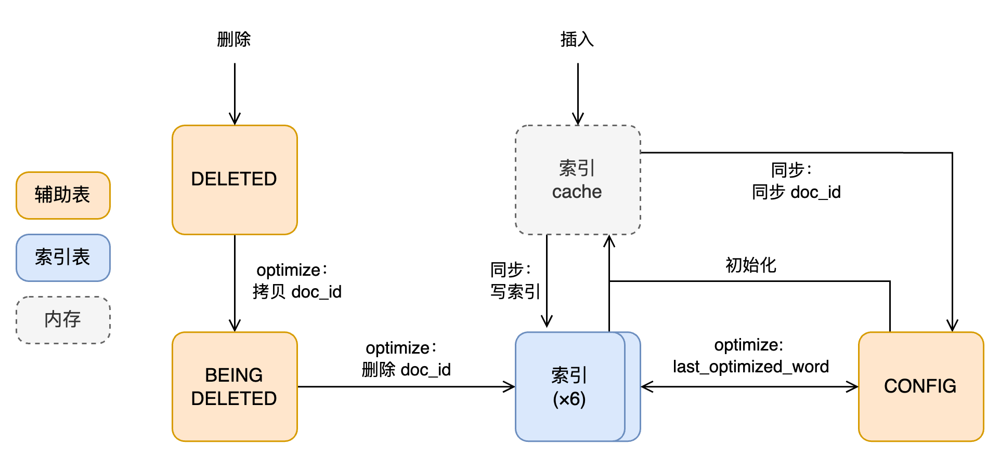

# InnoDB 全文索引：基本概念，插入和删除

**Date:** 2024/05
**Source:** http://mysql.taobao.org/monthly/2024/05/03/
**Images:** 2 images downloaded

---

数据库内核月报

 [
 # 数据库内核月报 － 2024 / 05
 ](/monthly/2024/05)

 * 当期文章

 MySQL 深潜 - 重构后的 ROLLUP 实现
* MySQL查询优化分析 - 常用分析方法
* InnoDB 全文索引：基本概念，插入和删除

 ## InnoDB 全文索引：基本概念，插入和删除 
 Author: 孙靖渊(劲川) 

 InnoDB 全文索引（FTS，以下默认指 InnoDB 中的 FTS）是通过在文本数据上建立倒排索引的方式，加速文本搜索的功能。和普通二级索引一样，FTS 也提供快速搜索和按条件过滤的能力，并额外支持计算文本相关性，提供按搜索相关性排序的能力。

## 设计逻辑

FTS 是倒排索引，对索引列上的文本分词并建立映射：分词 → 记录 + 记录中的位置。FTS 通过原表上一个额外的隐藏列定位到具体的行，每行有一个唯一的标志 `doc_id`，类似于自增唯一索引，并且在文本更新时也会触发产生新的 `doc_id`。为了记录倒排索引和相关信息，FTS 为带有 FTS 索引的表维护多张额外的表。这些表的维护穿插在常规建表/插入/删除等逻辑中。

因为原表的一个修改可能对应倒排索引的大量修改，FTS 在设计上尽可能推迟倒排索引上的修改，

1. 新增文本的索引项不随事务提交而落盘，只写入内存 cache，由额外的“同步”操作触发索引的修改
2. 删除文本的不删除 FTS 索引，仅记录删除的行，在 optimize 时触发真正的删除

这也间接导致了 FTS 的数据可见性与常规数据不同：

1. FTS 索引的修改只在提交时产生，新增数据对当前事务也不可见
2. FTS 上的查询不受事务可见性影响。对其他事务，FTS 索引中的数据*相当于*是 READ-COMMITTED 的

## 创建 FTS

同普通二级索引一样，FTS 索引可以在建表时指定，也可以通过 `alter table` 语句添加。

`mysql> CREATE TABLE opening_lines (
 id INT UNSIGNED AUTO_INCREMENT NOT NULL PRIMARY KEY,
 opening_line TEXT(500),
 author VARCHAR(200),
 title VARCHAR(200),
 FULLTEXT idx (opening_line)
 ) ENGINE=InnoDB;
`

（例子来自官方文档）

索引创建后会在原表添加隐藏列 `FTS_DOC_ID`，并在这列上添加索引 `FTS_DOC_ID_INDEX `，维护 `doc_id`。

 `FTS_DOC_ID` 列和索引也可以由用户显式创建，这种情况下由用户负责维护 `doc_id` 值。这比较适合主键也是 `doc_id` 的场景。

同时，立即产生 FTS 相关的辅助表：

1. `FTS_<table_id>_<index_id>_index_{1-6}`：即倒排索引表，“手动”分区分为 6 个表
2. `FTS_<table_id>_DELETED`：记录已删除的 `doc_id`
3. `FTS_<table_id>_DELETED_CACHE`：上表在特定情况产生的 snapshot，官方称之为上表的内存版本
4. `FTS_<table_id>_BEING_DELETED`：正在被删除的 `doc_id`
5. `FTS_<table_id>_BEING_DELETED_CACHE`：官方称之为上表的内存版本
6. `FTS_<table_id>_CONFIG`：FTS 相关配置，以键值对形式储存

（下面在提到这些表时，省略 `FTS_<table_id>` 前缀）

此外，创建索引时可以指定是否启用停词，并指定一个停词列表。停词不会被加入索引，也不会用于搜索，可以用来过滤没有意义的常用词，比如 an、the 等。

同一个表上的多个 FTS 索引会产生多套倒排索引表，但是共用上面的 2-6 表。这些表不能直接访问，但是可以通过 INFORMATION_SCHEMA 查看内容。首先设置全局变量 `INNODB_FT_AUX_TABLE` 指定要查看的表，然后访问：

1. `INNODB_FT_INDEX_TABLE`：索引文件内容
2. `INNODB_FT_INDEX_CACHE`：在内存中，尚未加入文件的索引内容
3. `INNODB_FT_CONFIG`：FTS 相关配置
4. `INNODB_FT_DEFAULT_STOPWORD`：InnoDB 默认停词列表
5. `INNODB_FT_DELETED`：已删除 `doc_id`
6. `INNODB_FT_BEING_DELETED`：正在被删除 `doc_id`

例如

`mysql> SELECT WORD, DOC_COUNT, DOC_ID, POSITION
 FROM INFORMATION_SCHEMA.INNODB_FT_INDEX_TABLE LIMIT 5;
+------------+-----------+--------+----------+
| WORD | DOC_COUNT | DOC_ID | POSITION |
+------------+-----------+--------+----------+
| 1001 | 1 | 4 | 0 |
| after | 1 | 2 | 22 |
| comparison | 1 | 5 | 44 |
| configured | 1 | 6 | 20 |
| database | 2 | 1 | 31 |
+------------+-----------+--------+----------+
`

### 倒排索引

倒排索引的表结构在代码中定义为

`(WORD VARCHAR(FTS_INDEX_WORD_LEN = 336), -- 分词
 FIRST_DOC_ID BIGINT UNSIGNED NOT NULL, -- 出现分词的最小 doc_id
 LAST_DOC_ID BIGINT UNSIGNED NOT NULL, -- 出现分词的最大 doc_id
 DOC_COUNT INT UNSIGNED NOT NULL, -- 出现文本数量
 ILIST BLOB) -- 出现位置列表
`

逻辑上，分词位置列表 `ilist` 是一个列表的列表，格式如下

`doc_id_0, 位置_0, 位置_1, 位置_2, ..., 终止符
doc_id_1, 位置_0, ..., 终止符
doc_id_2, 位置_0, ..., 终止符
...
`

`doc_id` 递增，同一个 `doc_id` 中的位置也递增。物理上，终止符为 0 ，且列表采用差值压缩，例如

`12 2 1 5 0 5 30 0
 │ │ │ │ │ │ │ ╰ 终止符
 │ │ │ │ │ │ ╰ 第一个位置 30
 │ │ │ │ │ ╰ 第二个 doc_id 12 + 5 = 17
 │ │ │ │ ╰ 终止符
 │ │ │ ╰ 第三个位置 3 + 5 = 8
 │ │ ╰ 第二个位置 2 + 1 = 3
 │ ╰ 第一个位置 2
 ╰ 第一个 doc_id 12
`

### 索引的分片

索引按照分词的第一个*字节*（即使不是单字节字符）值按区间手动分片，分隔数值如下表：

 分片
 1
 2
 3
 4
 5
 6

 分隔值
  
 65
 70
 75
 80
 85

 ASCII 字符
  
 A
 F
 K
 P
 U

 区间
 [0, 65)
 [65, 70)
 [70, 75)
 [75, 80)
 [80, 85)
 [85, 256)

差不多把大写字母 ASCII 码平均划分。很显然，这个分隔方法不太适合非拉丁字符的文本。

## FTS 操作

### 插入

插入的流程：

1. FTS 维护隐藏列 `FTS_DOC_ID` ，插入时需要为记录生成符合要求的 `doc_id` （单调增且不能比当前最大值大太多）
2. 在事务过程中，FTS 仅把新增行记录在事务的内存结构中
3. 事务提交时，FTS 对新增行中的文本分词并插入 FTS cache 中，不修改索引表

值得注意的：

1. 事务过程中，新增行只在这个事务的内存结构中，并且索引项还未生成，因此即使是同一个事务也看不到索引中的新增内容
2. 事务提交后，新增索引项仅在内存 FTS cache 中，FTS 不保证事务提交后相关的索引项进入倒排索引
3. FTS cache 每个表一份且全局可见，所以虽然索引文件没有发生修改，其他事务仍然可以找到新增的索引项

 FTS cache 并不是一般意义上的透明缓存（比如 CPU 上的缓存），FTS cache 只用于临时缓存尚未写入索引文件中的索引项，并不用于加速索引的访问，从索引表中读到的内容也不会重新加入 cache

### 同步

FTS 把索引内容实际写入索引表的操作称为“同步”。同步可以推迟，因为索引上的内容本质上是冗余的，只要原始文本可以查询到，就可以重新生成。同步的位点称为 `synced_doc_id` ，保存在 `_CONFIG` 表中。同步操作：

1. 把 FTS cache 中的内容写入倒排索引中，并保证完全写入
2. 更新 `synced_doc_id`
3. 把 cache 中删除的 `doc_id` 插入 `_DELETED_CACHE` （稍后详细说明）
4. 清空 FTS cache

为了保证 crash safe，FTS 索引在 MySQL 启动后初次使用时需要先同步 `synced_doc_id` 并重新生成 cache，使索引文件和内存状态一致，确保索引文件中的内容最终是完整的。

同步发生在这些场景：

1. 插入提交时，单表索引 cache 大小超过 `fts_max_cache_size / 10`，提交同步任务给后台线程`fts_optimize_thread`
2. 修改分区表过程中，FTS 的插入都是直接进入 cache 的。单表 cache 大小超过 `fts_max_cache_size / 5` 则直接触发同步
3. 后台线程也定期检查 FTS cache 总大小，如果超过 `fts_max_total_cache_size` 就设置标志位并在下次插入 cache 会做同步。
4. inplace `ALTER TABLE` 过程中发生同步
5. 用户执行 `OPTIMIZE TABLE`。如果 `innodb_optimize_fulltext_only = ON` 则只优化 FTS 索引，不做常规 optimize table
6. MySQL 正常关闭

### 删除

删除和插入的过程类似，事务过程中只把删除操作记录在事务的内存结构中。提交时，不直接从索引中删除对应的记录，而是将删除的 `doc_id` 记录在 `_DELETED` 表中。与插入不同，这是 InnoDB 表而不是内存结构，因此遵循一般的事务提交、刷盘规则。

 由于 `_DELETED` 表的插入是一个独立的后台事务，并且先于用户事务提交，如果在这个表的提交和用户事务提交之间发生崩溃，会导致 `_DELETED` 表中出现并未删除的 `doc_id` ，从而导致之后的查询出现问题。如果“再次”删除同一个 `doc_id` ，会导致插入 `_DELETED` 表产生 duplicate key 。按照代码注释，这是一个已知问题。使用独立事务的原因：

 When processing deleted record at the transaction commit time, do not use mysql transaction to insert into DELETED auxiliary table, as such transaction already in the “prepared” state.

 https://github.com/mysql/mysql-server/commit/d1a76346854bd9e8f8ba0c75bdcb53de53998358

### optimize

从索引表真正删除索引并清空 DELETED 表的操作是 optimize。optimize 发生的场景包括：

1. `fts_optimize_thread` 线程定期对已打开的包含 FTS 索引的表做 optimize
2. 用户执行 `OPTIMIZE TABLE`

 尽管同步和 optimize 经常同时出现在代码中，甚至共用同一个后台线程，同步和 optimize 是两个不同的操作。

optimize 的流程如下：

1. 拷贝 `_DELETED` 到 `_BEING_DELETED`
2. 拷贝 `_DELETED_CACHE` 到 `_BEING_DELETED_CACHE` （稍后详细说明）
3. 从 `_DELETED_BEING` 表读取需要删除的 doc_id
4. 遍历索引，重新生成每个分词的 `ilist`

optimize 操作非常慢，因此不会一次性做完所有分词。optimize 超时时间记录在 `_CONFIG` 表中 `optimize_checkpoint_limit` 项，目前硬编码 180 秒，无法查询和修改。每一次 optimize 后，优化过的分词会记录在 `_CONFIG` 表中 `fts_optimize_write_word` 项，下一次 optimize 会从这个分词之后开始，并且不重新生成 `_BEING_DELETED` ，保证（分多次完成的）一次完整的 optimize ，总是删除同一组 `doc_id`。

### 更新

为了保证 `doc_id` 能唯一确定一段文字（而不仅仅是是一行记录），记录更新时也会产生新的 `doc_id` 。更新实际上是先从 FTS 删除旧 `doc_id`，然后插入新的 `doc_id` ，删除和插入流程和上面基本一致。

## FTS 重要结构之间的关系

`_DELETE_CACHE` 表在同步时记录 cache 中 `deleted_doc_ids` 结构中的内容。按照注释，FTS 设计中考虑了添加额外的后台线程在事务提交前做 FTS cache 的异步插入，这个结构与之相关。但是目前的代码中没有任何用途。所以 `_DELETE_CACHE` 和 `_BEING_DELETE_CACHE` 表也是没有实际用途的。考虑到这个：

## 参考资料

* https://dev.mysql.com/doc/refman/8.0/en/innodb-fulltext-index.html
* http://mysql.taobao.org/monthly/2015/10/01/

 阅读： - 

本作品采用[知识共享署名-非商业性使用-相同方式共享 3.0 未本地化版本许可协议](http://creativecommons.org/licenses/by-nc-sa/3.0/)进行许可。

 