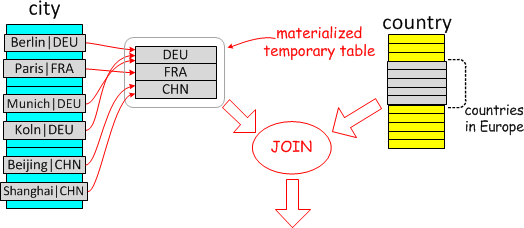
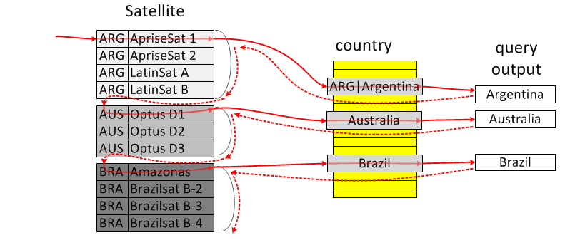

# MySQL 深潜 - Semijoin 丛林小道全览

**Date:** 2024/06
**Source:** http://mysql.taobao.org/monthly/2024/06/02/
**Images:** 5 images downloaded

---

数据库内核月报

 [
 # 数据库内核月报 － 2024 / 06
 ](/monthly/2024/06)

 * 当期文章

 PolarDB优化器功能 - 连接消除
* MySQL 深潜 - Semijoin 丛林小道全览

 ## MySQL 深潜 - Semijoin 丛林小道全览 
 Author: 李博 

 MySQL semijoin 也被称为半连接，主要是解决外查询一个或多个表的记录在包含一个或多个表的子查询结果中的存在性问题，比如 IN/EXIST 子查询。如果按照 IN/EXIST 谓词的原语义去执行，对外查询的每行记录都去计算 IN/EXIST 谓词的结果，子查询的内容就需要单独执行，在关联子查询的情况下，子查询需要多次重复执行，整体的执行效率很低。实际上，部分存在性问题(SPJ 子查询)类似于外查询的多个表与子查询的多个表(以下简述为外表和内表)的连接(JOIN)问题，能连接上说明存在。但是与普通 JOIN 不同的点在于，当外表和内表 JOIN 的时候，外表的每行记录都有可能和内表的多行连接上，这就导致了外表行的重复记录，但是按照原语义 IN/EXIST 子查询只是对外表行上进行的过滤，数据只能减少，而不能膨胀。

如何在外表和内表 JOIN 的同时保证这一点呢？MySQL 中实现了四种执行策略来避免重复行：Materialize、DuplicateWeedOut、FirstMatch 和 LooseScan，以下是几种执行方式的简单概括和示意图。

示意图均以该 SQL 举例：

`select * from Country
where Country.code IN (select City.Country
 from City
 where City.Population > 7*1000*1000)
 and Country.continent='Europe'
`

* Materialize

Materialize 是将内表独立进行 JOIN 后的结果物化到临时表并去重，然后将物化表与其他外表做 JOIN 的执行方式。由于物化表已经去重，与外表做 JOIN 并不会引起数据膨胀，所以就变成普通的 JOIN，与外表的 JOIN ORDER 可以任意调整。



* DuplicateWeedOut

DuplicateWeedout 是创建一个临时表，在执行将外表记录的主键写入临时表上带有唯一索引的 rowids 字段，起到对外表因为和内表 JOIN 之后产生的重复行去重的作用。


* FirstMatch

FirstMatch 是在外表的一行记录和内表 JOIN 得到一行输出后，直接跳过所有内表接下来的数据行，读取外表的下一行执行，从而避免外表产生重复行的方式。


* LooseScan

LooseScan 是在内表有索引存在的情况下，通过做内表上的 LooseScan (仅扫描索引记录不相同的行)来达到对内表记录去重的目的，然后和外表进行连接，这样也不会导致外表出现重复行。



## Semijoin 的灵活性

为什么要有四种执行策略呢？因为在内外表不同的 JOIN ORDER、索引存在性、不同的 JOIN 条件情况下，只有特定的执行策略才能被应用，四种组合起来才构成了 semijoin JOIN ORDER 的灵活性，MySQL 通过代价来选择 JOIN ORDER 和对应的执行策略。用以下 SQL 举例(后续文章中均采用同一 schema)，ct 表示 correlated table，为外查询中与子查询关联的表；it 表示 inner table，为子查询的内表。

`CREATE TABLE t1 (
 a INT,
 b INT,
 KEY(a),
 KEY(b)
);

INSERT INTO t1 VALUES (1, 2), (3, 4), (5, 6), (7, 8), (9, 10), (2, 1), (4, 3), (5, 6);

CREATE TABLE ct1 LIKE t1;
INSERT INTO ct1 SELECT * FROM t1;

CREATE TABLE ct2 LIKE t1;
INSERT INTO ct2 SELECT * FROM t1;

CREATE TABLE it1 LIKE t1;
INSERT INTO it1 SELECT * FROM t1;

CREATE TABLE it2 LIKE t1;
INSERT INTO it2 SELECT * FROM t1;

SELECT * FROM ct1, ct2 WHERE ct1.a IN (SELECT it1.a FROM it1, it2 WHERE it2.b = ct2.b);
`

重点关注 JOIN ORDER 中外表和内表的相对顺序，得到执行策略对 JOIN ORDER 的支持如下：

 JOIN ORDER
 (ct1, ct2), (it1, it2)
 (it1, it2), (ct1, ct2)
 ct1, it1, ct2, it2
 it1, ct1, it2, ct2
 ct1, (it1, it2), ct2
 it1, (ct1, ct2), it2

 MaterializeScan
 N[1](#fn:2)
 Y
 N[2](#fn:1)
 N[2](#fn:1)
 Y
 N[2](#fn:1)

 MaterializeLookup
 Y
 N[1](#fn:2)
 N[2](#fn:1)
 N[2](#fn:1)
 N[1](#fn:2)
 N[2](#fn:1)

 FirstMatch
 Y
 N[3](#fn:3)
 N[4](#fn:4)
 N[3](#fn:3)
 N[3](#fn:3)
 N[4](#fn:4)

 DuplicateWeedOut
 Y
 Y
 Y
 Y
 Y
 Y

 LooseScan
 N[5](#fn:5)
 N[6](#fn:6)
 N[7](#fn:7)
 N[7](#fn:7)
 Y
 N[7](#fn:7)

可以看到 DuplicateWeedOut 是最通用的策略，其他的策略只能应用在特定的 JOIN ORDER 下。表格中没有覆盖 it 表之间、ot 表之间交换顺序的情况；以及原 SQL 中还包含其他不和 IN/EXIST 子查询关联的外表时，大部分情况下，该外表可以在 ct 表之间灵活交换顺序，或者处于 semijoin 范围之外任意位置，所以实际场景中每种执行策略支持的 JOIN ORDER 范围会更广。

以下就深入内核，探寻 semijoin 应用的条件和优化器如何根据代价决定 semijoin 执行策略的。

## Prepare 阶段

### Semijoin 候选子查询的收集

在对外层查询的谓词 resolve/fix_fields() 过程中，递归对子查询 Query_block::prepare，由子查询自身调用 Query_block::resolve_subquery，判断可以转换为 semijoin 的基本条件，如果满足的话，就会将子查询对应的 Item_exists_subselect(Item_in_subselect 的基类)加入外层查询的 Query_block::sj_candidates 数组中，等待递归返回后，外层查询调用 Query_block::flatten_subqueries 处理。这些基本条件包括：

1. 子查询是 IN/EXIST 类型，=ANY 也会是 IN 子查询；
2. 是一个简单查询块(非 UNION/INTERSECT/EXCEPT 等集合操作符组成)；
3. 不带有显式或隐式的聚集函数、不带有 HAVING 和 WINDOW 函数(Semijoin 是将子查询里的表提出来与外层的表先 join 后再做后续运算，而这些操作符都是需要先读取完子查询里的表做运算后才能计算外层的谓词)；
4. 子查询处于 ON/WHERE 语法中，且是 AND 谓词连接的 top level；
5. 谓词 True/False、nullability 是和转换兼容的。

简单来说，最主要的条件就是 SPJ 的 IN/EXIST 子查询。

### 外层查询将子查询的表上拉，消除原子查询

在 bottom-up 的 resolve 过程中，由包含 semijoin 候选的外层查询块将子查询的表上拉，并消除子查询，这一过程在 Query_block::flatten_subqueries 中。

`for SELECT#1 WHERE X IN (SELECT #2 WHERE Y IN (SELECT#3)) :

Query_block::prepare() (select#1)
 -> fix_fields() on IN condition
 -> Query_block::prepare() on subquery (select#2)
 -> fix_fields() on IN condition
 -> Query_block::prepare() on subquery (select#3)
 <- Query_block::prepare()
 <- fix_fields()
 -> flatten_subqueries: merge #3 in #2
 <- flatten_subqueries
 <- Query_block::prepare()
 <- fix_fields()
 -> flatten_subqueries: merge #2 in #1
`

在外层查询块中，依次遍历所有 semijoin 的候选子查询：

1. 将它们在外层查询块的谓词位置(WHERE 条件或者嵌套 join 的 ON 条件)用恒 True 表达式替换；
2. 创建 semijoin 的 nested Table_ref 结构，加入到嵌套的 join nest 结构或者 outer-most join list 中，以下简称 (sj-nest)；
3. 将子查询所有的表加入到 Table_ref::NESTED_JOIN 中，链接进外层查询的 leaf_tables，给这些表按照外层的 tableno 重新编号；
4. 构建 NESTED_JOIN::sj_outer_exprs 和 NESTED_JOIN::sj_inner_exprs 向量，IN 子查询就是左表达式和子查询投影列一一对应起来，EXIST 子查询就是 WHERE/ON 条件中的关联条件(IN 子查询也会收集这些关联条件来方便执行使用)，被收集的条件原有位置置空或者 True，比如下列谓词：

`ot1.a = ANY(SELECT it1.a FROM it1, it2)`收集到`sj_outer_exprs: ot1.a; sj_inner_exprs: it1.a`

`ot1.a = ANY(SELECT it1.a FROM it1, it2 WHERE it1.b = ot2.b)`收集到`sj_outer_exprs: ot1.a, ot2.b; sj_inner_exprs: it1.a, it1.b`。

1. 确定子查询中剩下的 WHERE/ON 条件所依赖的外层表集合 NESTED_JOIN::sj_corr_tables(非简单关联条件，用于优化过程中判断 semijoin 条件是否可计算)；
2. 用 sj_outer_exprs 和 sj_inner_exprs 构建多个 Item_func_eq 表达式，与子查询剩下的 WHERE 条件结合，放入到外层查询对应 JOIN/WHERE 条件上；
3. NESTED_JOIN::sj_depends_on 包含所有 semijoin 条件和子查询 WHERE 条件中对原外查询中表的依赖，标记查询块 has_sj_nests/has_aj_nests 为 True。

之后，在`Query_block::apply_local_transforms -> Query_block::simplify_joins`中，会对嵌套的 semijoin/anti-join 做简单处理，将嵌套的结构展平，因为外层的结构是 semijoin 时，内层的输出结果是否发生重复也不影响结果，比如`A SJ (B SJ (C)) -> A SJ (B JOIN C), A AJ (B SJ (C)) -> A AJ (B JOIN C)`。将内层的 semijoin 的表移到外层的 join list 中，并移除原内层 (sj-nest)。记录 (sj-nest) Table_ref::sj_inner_tables 为原子查询所有内表的 used_tables，将所有的 (sj-nest) 加入当前查询块的 Query_block::sj_nests 数组中。

## Optimize 阶段(优化器)

MySQL 对 semijoin 的执行支持好几种不同的执行策略，在不同的执行策略下 semijoin 内表和外表的 JOIN ORDER 不同，从而能够提供更为灵活的 JOIN ORDER 选择；不同的执行策略通过不同的方式来达到去重的目的，避免原本的 semijoin 转化为 JOIN 之后的数据膨胀；不同的执行策略可以利用上不同的索引或者表访问方式。这些执行策略包括：FirstMatch、DuplicateWeedout、LooseScan、Materialize，Materialize 根据物化表和外表 JOIN ORDER 的不同又分为 MaterializeScan 和 MaterializeLookup。优化器的目的就是评估这些执行策略的可行性(开关、索引是否支持等)，选择估算代价最低的策略。

### 执行策略的代价选择

本小节会介绍这些执行策略的公共处理逻辑，具体到每种执行策略的不同和优化细节将会在以下每种执行策略的章节介绍。

主要的过程在 JOIN::make_join_plan 中:

* `pull_out_semijoin_tables`

在 update_ref_and_keys 之后，如果 semijoin 的内表是可以 eq_ref(唯一索引) 外表，且 (sj-nest) 中不存在其他内表依赖它，那么该表就可以从 (sj-nest) 中移出来，放置在外层的 join list 中，因为这样的表和外层表 join 是不会产生数据膨胀的。这样可以简化 (sj-nest) 的内表结构，如果所有的内表都可以被提出来，那么 (sj-nest) 就可以被直接移除，消除了 semijoin。

* `optimize_semijoin_nests_for_materialization`

在外层优化之前，为可能选择 Materialize 执行的 (sj-nest) 优化内表的 JOIN ORDER，计算其 cost 和 fanout，基于这些数据才能在和外层表的优化过程中计算 cost。详细见 Materialize 章节。

* `Optimize_table_order::best_extension_by_limited_search -> Optimize_table_order::advance_sj_state`

每当一个新表(外表 + 子查询的内表)被尝试加入到 JOIN 序列，且选择完它的最优访问方式(best_access_path)后，就会调用 Optimize_table_order::advance_sj_state 考虑此时可用的 semijoin 执行策略，并计算不同策略各自的 cost，选择最低代价的策略作为当前 JOIN 序列的最优策略，存放在当前表的 POSITION 中(不同策略有不同的状态变量)，并且更新最优策略下的代价和 cardinality(prefix_cost 和 prefix_rowcount)。

注意，这里对于部分执行方式，比如 Materilize/FirstMatch 会重新评估一定范围内每个表的访问方式，以算出在当前策略下，选取最优访问方式后的代价。但是这些访问方式的重新考虑并不会持久化到 JOIN::positions 枚举状态中，避免对外层接下来 greedy search 的影响。只是会持久化 prefix_cost/prefix_rowcount 和当前表 POSITION 中记录 semijoin 执行策略选择的变量，如果枚举完整 JOIN 序列仍然是最优 plan，就会持久化到 best_positions 中。所以当整个 greedy search 结束，在`Optimize_table_order::fix_semijoin_strategies`识别到 POSITION 中关于 semijoin 的策略选择结果，需要对涉及表的访问方式再次做选择，此时持久化访问方式。

具体对每种执行策略在代价上的考虑，在以下各执行策略章节陈述。

#### Materialize

Materialize 是将 (sj-nest) 的内表 JOIN 结果物化到临时表并去重后，物化表与其他外表做 JOIN 的执行方式。由于物化表已经去重，与外表做 JOIN 并不会引起数据膨胀，所以就变成普通的 JOIN，与外表的 JOIN ORDER 可以任意调整。根据物化表最终是全表扫、还是在临时表上索引的 eq_ref lookup 分为 MaterializeScan 和 MaterializeLookup 两种方式。

优化过程包括：

* `optimize_semijoin_nests_for_materialization`

`JOIN::make_join_plan -> optimize_semijoin_nests_for_materialization
 |--遍历所有的 (sj-nest)
 |--如果 NESTED_JOIN::sj_corr_tables 不为空，意味着子查询存在无法提取的复杂关联条件，这种情况下子查询无法独立物化，跳过
 |--semijoin_types_allow_materialization/types_allow_materialization 检查类型能否物化，物化表索引长度是否超过最大值
 |--Optimize_table_order::choose_table_order // 对 semijoin 的内表集合选取最优 join order
 |--calculate_materialization_costs // 计算物化表的 NDV、物化的代价、全表扫物化表的代价、物化表 lookup 的代价，
 // 存放在 NESTED_JOIN::Semijoin_mat_optimize 中，方便后续不同执行策略的代价比较
 |--根据优化得到的 best_positions 里每个表的 read_cost 和 evaluate cost 计算物化代价和 fanout 行数
 |--fanout 行数简单的与每个表的输出行数乘积取较小值作为物化表的输出 NDV
 |--Cost_model_server::tmptable_readwrite_cost 计算物化表操作代价
 |--将 best_positions 信息存储在 Semijoin_mat_optimize::positions 数组中作为 (sj-nest) 内表的最优计划
`

##### MaterializeScan

```
SET optimizer_switch='semijoin=on,materialization=on,loosescan=off,firstmatch=off,duplicateweedout=off';

EXPLAIN SELECT /*+ JOIN_SUFFIX(ct1, ct2) */ * FROM ct1, ct2 WHERE ct1.a IN (SELECT it1.a FROM it1, it2 WHERE it2.b = ct2.b);
+----+--------------+-------------+------------+-------+---------------+------+---------+---------------+------+----------+--------------------------------------------+
| id | select_type | table | partitions | type | possible_keys | key | key_len | ref | rows | filtered | Extra |
+----+--------------+-------------+------------+-------+---------------+------+---------+---------------+------+----------+--------------------------------------------+
| 1 | SIMPLE | <subquery2> | NULL | ALL | NULL | NULL | NULL | NULL | NULL | 100.00 | Using where |
| 1 | SIMPLE | ct1 | NULL | ref | a | a | 5 | <subquery2>.a | 1 | 100.00 | NULL |
| 1 | SIMPLE | ct2 | NULL | ref | b | b | 5 | <subquery2>.b | 1 | 100.00 | NULL |
| 2 | MATERIALIZED | it1 | NULL | index | a | a | 5 | NULL | 16 | 100.00 | Using index |
| 2 | MATERIALIZED | it2 | NULL | index | b | b | 5 | NULL | 16 | 100.00 | Using index; Using join buffer (hash join) |
+----+--------------+-------------+------------+-------+---------------+------+---------+---------------+------+----------+--------------------------------------------+

| -> Nested loop inner join (cost=259 rows=334)
 -> Nested loop inner join (cost=142 rows=293)
 -> Filter: ((`<subquery2>`.a is not null) and (`<subquery2>`.b is not null)) (cost=53.2..39.2 rows=256)
 -> Table scan on <subquery2> (cost=53.3..59 rows=256)
 -> Materialize with deduplication (cost=53.3..53.3 rows=256)
 -> Filter: ((it1.a is not null) and (it2.b is not null)) (cost=27.7 rows=256)
 -> Inner hash join (no condition) (cost=27.7 rows=256)
 -> Index scan on it2 using b (cost=0.116 rows=16)
 -> Hash
 -> Index scan on it1 using a (cost=1.85 rows=16)
 -> Index lookup on ct1 using a (a=`<subquery2>`.a) (cost=0.286 rows=1.14)
 -> Index lookup on ct2 using b (b=`<subquery2>`.b) (cost=73.2 rows=1.14)
 |

```

* `Optimize_table_order::advance_sj_state`

开始考虑 MaterializeScan 执行方式的前提条件(semijoin_order_allows_materialization)为，当前表为 (sj-nest) 内表，且所有其他内表都出现在前序且连续。代码里用 POSITION::sjm_scan_last_inner 来表示内表的最后一个位置，从下标`sjm_scan_last_inner - Table_ref::sj_inner_tables + 1 ~ sjm_scan_last_inner`为内表 POSITION 的范围。

从这个位置开始，将 POSITION::sjm_scan_need_tables 设置为所有 sj_inner_tables 和 NESTED_JOIN::sj_depends_on(semijoin条件依赖的外表)的集合，表示当这些表都处于 JOIN 前序时，才能做 MaterializeScan 的 JOIN。满足条件的情况下，会基于物化表的 fanout 重新评估 sjm_scan_last_inner 到当前位置所有外表的访问方式(遍历表调用 best_access_path 传入新的 fanout)，来计算如果选择 MaterializeScan 执行策略的代价，这个过程在`Optimize_table_order::semijoin_mat_scan_access_paths`中。

* 如果当前 JOIN 前缀下，MaterializeScan 已经是代价最低的策略，那么会标记当前外表的 POSITION::sj_strategy 为 SJ_OPT_MATERIALIZE_SCAN，同时加入下一个外表时，不再重新考虑 MaterializeScan 的访问方式代价，因为此时已经将之前选择 SJ_OPT_MATERIALIZE_SCAN 的 POSITION::prefix_cost/prefix_rowcount 设置为 MaterializeScan 的结果值，所以后续表的访问方式评估时已经是基于 MaterializeScan 计划的 cardinality 和代价，不需要重新评估。
* 否则，如果 MaterializeScan 并不是当前最优的 semijoin 策略，那么会在 greedy search 搜索到下一个新表时重复进行考虑，因为 MaterializeScan 下前序的 cardinality 不同，对于后续表的访问方式都可能产生影响。

##### MaterializeLookup

`SET optimizer_switch='semijoin=on,materialization=on,loosescan=off,firstmatch=off,duplicateweedout=off';

EXPLAIN SELECT * FROM ct1, ct2 WHERE ct1.a IN (SELECT it1.a FROM it1, it2 WHERE it2.b = ct2.b);
+----+--------------+-------------+------------+--------+---------------------+---------------------+---------+-----------------------+------+----------+------------------------------------------------------+
| id | select_type | table | partitions | type | possible_keys | key | key_len | ref | rows | filtered | Extra |
+----+--------------+-------------+------------+--------+---------------------+---------------------+---------+-----------------------+------+----------+------------------------------------------------------+
| 1 | SIMPLE | ct1 | NULL | ALL | a | NULL | NULL | NULL | 8 | 100.00 | Using where |
| 1 | SIMPLE | ct2 | NULL | range | b | b | 5 | NULL | 8 | 100.00 | Using index condition; Using join buffer (hash join) |
| 1 | SIMPLE | <subquery2> | NULL | eq_ref | <auto_distinct_key> | <auto_distinct_key> | 10 | test.ct1.a,test.ct2.b | 1 | 100.00 | NULL |
| 2 | MATERIALIZED | it1 | NULL | index | a | a | 5 | NULL | 16 | 100.00 | Using index |
| 2 | MATERIALIZED | it2 | NULL | index | b | b | 5 | NULL | 16 | 100.00 | Using index; Using join buffer (hash join) |
+----+--------------+-------------+------------+--------+---------------------+---------------------+---------+-----------------------+------+----------+------------------------------------------------------+

| -> Nested loop inner join (cost=1653 rows=16384)
 -> Inner hash join (no condition) (cost=7.7 rows=64)
 -> Index range scan on ct2 using b over (NULL < b), with index condition: (ct2.b is not null) (cost=0.131 rows=8)
 -> Hash
 -> Filter: (ct1.a is not null) (cost=1.05 rows=8)
 -> Table scan on ct1 (cost=1.05 rows=8)
 -> Single-row index lookup on <subquery2> using <auto_distinct_key> (a=ct1.a, b=ct2.b) (cost=53.3..53.3 rows=1)
 -> Materialize with deduplication (cost=53.3..53.3 rows=256)
 -> Filter: ((it1.a is not null) and (it2.b is not null)) (cost=27.7 rows=256)
 -> Inner hash join (no condition) (cost=27.7 rows=256)
 -> Index scan on it2 using b (cost=0.116 rows=16)
 -> Hash
 -> Index scan on it1 using a (cost=1.85 rows=16)
 |
`

* `Optimize_table_order::advance_sj_state`

考虑 MaterializeLookup 执行策略的条件为，（sj-nest) 的内表在 JOIN 前序紧密相连，且 semijoin 条件依赖的外表也都出现了，那么就可以考虑在物化表上使用 eq_ref 的 JOIN 方式。在`semijoin_mat_lookup_access_paths`函数中，基于前序最后一个外表的 prefix_rowcount 来计算物化表 lookup 的代价，加上物化表 setup 的代价作为这种执行方式的最终代价。

#### DuplicateWeedOut

DuplicateWeedout 适用的范围更广，原外层表和内层表之间的 JOIN ORDER 可以更灵活，实现原理就是创建一个临时表起到对外表因为和内表 JOIN 之后产生的数据膨胀去重的作用。当外表和 (sj-nest) 内表 JOIN 之后，会将 semijoin 涉及的外表主键紧密连接到一起，形成字符串写入 weedout-tmp 临时表的 rowids 字段中，在这个字段上存在唯一索引。如果写入成功，说明当前行组合是第一次出现，继续往后 JOIN；否则直接跳过该行。

`SET optimizer_switch='semijoin=on,materialization=off,loosescan=off,firstmatch=off,duplicateweedout=on';

# 传统格式的 EXPLAIN 中比较明显的标识是 Start temporary/End temporary。
EXPLAIN SELECT * FROM ct1, ct2 WHERE ct1.a IN (SELECT it1.a FROM it1, it2 WHERE it2.b = ct2.b);
+----+-------------+-------+------------+-------+---------------+------+---------+------------+------+----------+------------------------------------------------------+
| id | select_type | table | partitions | type | possible_keys | key | key_len | ref | rows | filtered | Extra |
+----+-------------+-------+------------+-------+---------------+------+---------+------------+------+----------+------------------------------------------------------+
| 1 | SIMPLE | ct1 | NULL | ALL | a | NULL | NULL | NULL | 8 | 100.00 | Using where; Start temporary |
| 1 | SIMPLE | it1 | NULL | ref | a | a | 5 | test.ct1.a | 2 | 100.00 | Using index |
| 1 | SIMPLE | ct2 | NULL | range | b | b | 5 | NULL | 8 | 100.00 | Using index condition; Using join buffer (hash join) |
| 1 | SIMPLE | it2 | NULL | ref | b | b | 5 | test.ct2.b | 2 | 100.00 | Using index; End temporary |
+----+-------------+-------+------------+-------+---------------+------+---------+------------+------+----------+------------------------------------------------------+

| -> Remove duplicate (ct1, ct2) rows using temporary table (weedout) (cost=89.8 rows=334)
 -> Nested loop inner join (cost=89.8 rows=334)
 -> Inner hash join (no condition) (cost=19.8 rows=146)
 -> Index range scan on ct2 using b over (NULL < b), with index condition: (ct2.b is not null) (cost=0.0574 rows=8)
 -> Hash
 -> Nested loop inner join (cost=4.88 rows=18.3)
 -> Filter: (ct1.a is not null) (cost=1.05 rows=8)
 -> Table scan on ct1 (cost=1.05 rows=8)
 -> Covering index lookup on it1 using a (a=ct1.a) (cost=0.279 rows=2.29)
 -> Covering index lookup on it2 using b (b=ct2.b) (cost=1.32 rows=2.29)
 |
`

* `Optimize_table_order::advance_sj_state`

考虑 DuplicateWeedOut 的条件很简单，就是 sj-cond 所有依赖的表(外表/内表)都已经出现在 JOIN 前缀时，就可以将 JOIN 的结果写入临时表进行去重了。POSITION::dupsweedout_tables 记录了这些依赖表的组合；POSITION::first_dupsweedout_table 记录的是 (sj-nest) 第一个内表出现的位置，之所以记录这个是方便计算 inner_tables 的存在对 JOIN 序列 fanout 的影响。

在满足条件后，每加入一个新的表到 JOIN 前缀中，都会重新考虑 DuplicateWeedOut 的代价，因为这些 JOIN 前缀产生的 cardinality 不同，导致临时表读取和写入的代价也不一样。代价的考虑在`semijoin_dupsweedout_access_paths`中，这里并不会对表的访问方式做重新考虑，只是着重计算经过去重后的 fanout 和临时表写入/读取的代价。对 fanout 的计算也不是很准确，用表行数最大的 fanout 做了限制。调用 Cost_model_server::tmptable_readwrite_cost 对临时表读写代价进行估算，读的行数为内外表 JOIN 产生的 cardinality 行数，写入的行数为估算最终外表 JOIN 产生的行数。

* 执行过程

`WeedoutIterator::Read
 |--m_source -> RowIterator::Read // 调用子算子完成前序 JOIN 过程
 |--do_sj_dups_weedout
 |--对涉及到的外表主键使用 memcpy 进行紧密填充
 |--handler::ha_write_row // 向临时表中写入 rowids 字段进行去重
`

#### FirstMatch

FirstMatch 是在和 (sj-nest) 的内表 JOIN 到一条输出后，跳过全部 inner_tables 接下来的数据行，直接跳到 JOIN 前序最后一个 outer_table 的位置，读取其下一行进行连接。FirstMatch 的 JOIN 序列范围内最后一定是连续的全部 inner_tables，不能穿插任何外表，假如是 ct1, it1, ct2, it2 序列，如果跳到 ct2 位置，那么会产生由于 it1 存在 JOIN 出的重复行；如果跳到 ct1 位置，那么会丢失 ct1 和 ct2 剩余数据可能 JOIN 出来的其他行。

`SET optimizer_switch='semijoin=on,materialization=off,loosescan=off,firstmatch=on,duplicateweedout=off';

EXPLAIN SELECT * FROM ct1, ct2 WHERE ct1.a IN (SELECT it1.a FROM it1, it2 WHERE it2.b = ct2.b);
+----+-------------+-------+------------+-------+---------------+------+---------+------------+------+----------+------------------------------------------------------+
| id | select_type | table | partitions | type | possible_keys | key | key_len | ref | rows | filtered | Extra |
+----+-------------+-------+------------+-------+---------------+------+---------+------------+------+----------+------------------------------------------------------+
| 1 | SIMPLE | ct1 | NULL | ALL | a | NULL | NULL | NULL | 8 | 100.00 | Using where |
| 1 | SIMPLE | ct2 | NULL | range | b | b | 5 | NULL | 8 | 100.00 | Using index condition; Using join buffer (hash join) |
| 1 | SIMPLE | it1 | NULL | ref | a | a | 5 | test.ct1.a | 2 | 100.00 | Using index |
| 1 | SIMPLE | it2 | NULL | ref | b | b | 5 | test.ct2.b | 2 | 100.00 | Using index; FirstMatch(ct2) |
+----+-------------+-------+------------+-------+---------------+------+---------+------------+------+----------+------------------------------------------------------+

| -> Nested loop semijoin (cost=57.2 rows=334)
 -> Inner hash join (no condition) (cost=7.7 rows=64)
 -> Index range scan on ct2 using b over (NULL < b), with index condition: (ct2.b is not null) (cost=0.131 rows=8)
 -> Hash
 -> Filter: (ct1.a is not null) (cost=1.05 rows=8)
 -> Table scan on ct1 (cost=1.05 rows=8)
 -> Nested loop inner join (cost=37.4 rows=5.22)
 -> Covering index lookup on it1 using a (a=ct1.a) (cost=0.254 rows=2.29)
 -> Covering index lookup on it2 using b (b=ct2.b) (cost=1.32 rows=2.29)
 |
`

* `Optimize_table_order::advance_sj_state`

当所有依赖的外表都已经在 JOIN 前序里，(sj-nest) 所有内表都连续出现，当前表为最后一个内表时，考虑 FirstMatch 的执行策略。POSITION::first_firstmatch_table 存放第一个内表的位置，最终执行时跳到的位置为其前一个外表，当出现不连续的内表时通过将该变量重置来避免 FirstMatch 的考虑。POSITION::dups_producing_tables 为前序可能产生 JOIN 重复数据的内表，当这个值不为 0 时说明处于一个 semijoin 的中间，不能开启一个新的 semijoin 执行策略考虑范围。

在`Optimize_table_order::semijoin_firstmatch_loosescan_access_paths`中计算 FirstMatch 的代价，考虑表的范围为 inner_tables 的第一个表到最后一个表，重新评估这些表的访问方式的原因是由于在 JOIN 出来第一行数据后，可以直接跳回最后一个外表的下一行数据，因此如果某些内表选择了 JOIN BUFFER，缓存的数据就浪费了。所以仅对选择了 JOIN BUFFER 的内表禁止 JOIN BUFFER 重新调用`best_access_path`决定计算访问方式和代价；如果只存在一个 inner table，那么前面的外表是可以使用 JOIN BUFFER 的。

对于代价的计算，由于快速跳回的执行机制存在，优化器认为平均每个内表只需要访问一次，所以将 POSITION::read_cost 累加起来，需要 evaluate 的 records 数为内/外表的 fanout 乘积，最终的 cardinality 为外表的 fanout 乘积。

* 执行过程

在执行器中实现 FirstMatch 的能力比较简单，只需要在对应的 JOIN iterator 上设置 JOIN 类型为 semijoin 或者某些状态变量，让内层算子在 JOIN 到一行数据后，能够跳出内层的 JOIN，直接读取外层表的下一行数据即可。举个例子：

`NestedLoopIterator::Read
 |--m_source_outer -> RowIterator::Read // 调用子算子读取外表的一行数据
 |--m_source_inner -> RowIterator::Read // 读取内表的一行数据
 |--一般情况下 INNER JOIN 状态会设置为 READING_INNER_ROWS 持续访问内表数据
 |--当类型为 JoinType::SEMI 时，直接设置状态为 NEEDS_OUTER_ROW，下次迭代调用时便会读外表的下一行数据

`

#### LooseScan

LooseScan 是在内表有索引存在的情况下，通过做第一个内表上的 LooseScan 来达到去重的目的，然后和外表进行连接，需要后续 semijoin 条件都基于第一个内表的索引字段。

`SET optimizer_switch='semijoin=on,materialization=off,loosescan=on,firstmatch=off,duplicateweedout=off';

EXPLAIN SELECT * FROM ct1, ct2 WHERE ct1.a IN (SELECT it1.a FROM it1, it2 WHERE it2.b = ct2.b);
+----+-------------+-------+------------+-------+---------------+------+---------+------------+------+----------+-------------------------------------+
| id | select_type | table | partitions | type | possible_keys | key | key_len | ref | rows | filtered | Extra |
+----+-------------+-------+------------+-------+---------------+------+---------+------------+------+----------+-------------------------------------+
| 1 | SIMPLE | ct1 | NULL | ALL | a | NULL | NULL | NULL | 8 | 100.00 | Using where |
| 1 | SIMPLE | it2 | NULL | index | b | b | 5 | NULL | 16 | 43.75 | Using where; Using index; LooseScan |
| 1 | SIMPLE | it1 | NULL | ref | a | a | 5 | test.ct1.a | 2 | 100.00 | Using index; FirstMatch(it2) |
| 1 | SIMPLE | ct2 | NULL | ref | b | b | 5 | test.it2.b | 1 | 100.00 | NULL |
+----+-------------+-------+------------+-------+---------------+------+---------+------------+------+----------+-------------------------------------+

| -> Nested loop inner join (cost=129 rows=146)
 -> Nested loop inner join (cost=30.6 rows=128)
 -> Filter: (ct1.a is not null) (cost=1.05 rows=8)
 -> Table scan on ct1 (cost=1.05 rows=8)
 -> Nested loop semijoin with duplicate removal on b (cost=33.8 rows=16)
 -> Filter: (it2.b is not null) (cost=0.119 rows=7)
 -> Index scan on it2 using b (cost=0.119 rows=16)
 -> Covering index lookup on it1 using a (a=ct1.a) (cost=0.252 rows=2.29)
 -> Index lookup on ct2 using b (b=it2.b) (cost=10.5 rows=1.14)
 |
`

* `Optimize_table_order::advance_sj_state`

开始记录 LooseScan 可能性状态的条件：

1. 新加入的表为第一个出现的 (sj-nest) 内表；
2. Keyuse 不为空(带有索引选择信息)；
3. 无法提取为 sj-cond 的关联条件依赖的表(sj_corr_tables)都已经在 JOIN 前缀里(因为即使 LooseScan 扫描的结果是去重的，但是在复杂条件上仍然可能和外表 JOIN 出多条记录)；
4. 后续表中存在 sj-cond 依赖的表。

LooseScan 必须是连续全部的 inner_tables，然后紧接着部分 outer_tables，所有依赖的表都在 JOIN 前序后进行一次考虑。当 (sj-nest) 中存在多个表时，LooseScan 会结合 FirstMatch 类似的执行方式去做，将最后一个内表跳转的位置设到 LooseScan 表，也就是第一个内表(但这和上面提到的 semijoin FirstMatch 的执行策略完全不同，FirstMatch 的执行策略是跳到外表)。FirstMatch 的引入带来的好处就是可以存在与非 LooseScan 内表的 sj-cond，但是依赖的外表必须在 JOIN 前缀出现(这样在扫非 LooseScan 表时就可以计算连接条件，FirstMatch 的存在保证了对于 LooseScan 表上的一条记录，其他 inner_tables 最多 JOIN 上一条)，而剩下的 sj-cond 必须仅依赖 LooseScan 表上的索引列来保证 JOIN 不会造成数据膨胀。

也是因为这种跳转式的执行方式存在，LooseScan 不允许在最后一个内表前出现 JOIN BUFFER，缓存后续的外表数据才是有意义的。在`semijoin_firstmatch_loosescan_access_paths`中会调用`best_access_path`对 LooseScan 表的所有索引访问方式进行评估，避免由于代价或者启发式规则对部分索引前缀不考虑，因为 LooseScan 首先关注的是可用性问题。在`semijoin_loosescan_fill_driving_table_position`中对可行性进行判断，依赖以下几个概念：

1. 完成所有 inner_tables JOIN 之后，已经满足的 sj-cond 集合(依赖的外表全在 JOIN 前缀)，用 bound_sj_equalities 表示(由于 FirstMatch 的实现，存在唯一的一行值满足这部分 sj-cond)；
2. 遍历同一索引的 Key-use，如果来自 sj-cond，且依赖后续的表，那么就是基于 LooseScan 的输出列处理的 sj-cond，用 handled_sj_equalities 表示，对应的 key_parts 用 handled_keyparts 表示。

基于上述概念，可以总结需要满足的条件为：

1. bound_sj_equalities 和 handled_sj_equalities 的集合组成了完整的 sj-cond；
2. Keyuse 的信息(ref 前序表和 LooseScan 的产出列)组成了索引前缀，这样才能做 LooseScan 去重；
3. 如果 bound_keyparts 包括了索引第一个字段，说明是 ref 访问方式，只需要输出 LooseScan 上的列即可(与前序表的连接在 ref 上)。否则，必须是一个覆盖索引，这样不需要回表来评估与前序表的连接条件，在这两种情况下分别计算对应的 cost 值，取最小的 Keyuse 作为 LooseScan 的索引。

执行前，在`setup_semijoin_dups_elimination`中将最后一个内表的 firstmatch_return 设置到 LooseScan 表的下标，作为 FirstMatch 的跳转位置。

* 执行过程

执行器是在 SQL 完成 LooseScan 的目的，当扫描一条记录 JOIN 上一行后，会保存当前的索引 key，然后读下一条记录时将索引 key 进行比较，如果相同则继续读下一行。InnoDB 底层就是索引扫描。

`NestedLoopSemiJoinWithDuplicateRemovalIterator::Init
 |--IndexScanIterator<false>::Init -> ha_innobase::index_init

NestedLoopSemiJoinWithDuplicateRemovalIterator::Read
 |--m_source_outer->Read() // 读取 LooseScan 表一行
 |--如果 m_deduplicate_against_previous_row 为 True，且比较索引 key 相同，那么继续读取下一行记录
 |--m_source_inner->Init() & m_source_inner->Read() // 内表读取一行 JOIN，由于对于每一行 LooseScan 记录，都重新 Init 和读取内表一行，不存在循环读取内表，通过这种方式实现 FirstMatch
 |--标记 m_deduplicate_against_previous_row 为 True 表示需要比较 Key 是否相同，并存储当前的 Key
`

### 根据确定的策略做执行前准备

* Optimize_table_order::fix_semijoin_strategies

在 greedy_search 的过程中，每当往 JOIN 前序中加入一个新表，就会考虑一次 semijoin 策略，并且重新考虑该策略所影响的范围内表的访问方式以计算最优代价，所以可能出现在加入不同表的过程中，最优代价的 semijoin 执行策略不同。每一个阶段得到的最优执行策略都被记录在对应表的 POSITION 上，如下所示：

`[ot1 it1 it2 ot2 ot3]
 sjX sjY -- sjX and sjY are different strategies
`

在得到最优的 JOIN ORDER 后，需要从后往前遍历每个 POSITION 位置上的 sj-strategy，因为靠后位置上记录的是更大 JOIN 前缀范围内最优的策略。优化过程中对范围内表的访问方式的考虑是没有记录到 POSITION 中的(只是算了总代价)，在这里应该根据确定的执行策略，将这些访问方式进行持久化。

Materialize 的执行策略需要将 NESTED_JOIN::sjm 中记录的内表最优 JOIN ORDER 对应的 POSITION 信息拷贝过去。

MaterializeScan 和 FirstMatch/LooseScan 分别调用`semijoin_mat_scan_access_paths`和`semijoin_firstmatch_loosescan_access_paths`重新计算到 semijoin 范围内每个表的最优访问方式并存储到 JOIN::best_positions 中。

此外，每种执行策略都会将对应的策略 sj_strategy/n_sj_tables 记录到涉及范围内第一个表的 POSITION 上，从而在前序遍历 POSITION 时能够优先发现 semijoin 策略。同时将涉及范围内表的其他 sj_strategy 重置。

* make_join_readinfo -> setup_semijoin_dups_elimination

顺序遍历 QEP_TAB，这样会首先看到范围内第一个表对应的 sj_strategy，针对每种执行策略做最后的设置。

DuplicateWeedOut 根据涉及外表的主键长度总和，在 create_sj_tmp_table 中创建对应的临时表和 rowids 上的唯一索引。

FirstMatch 将 inner tables 最后一个内表上的 QEP_TAB::firstmatch_return 设置到 inner tables 之前最后一个外表，表示所有 inner tables JOIN 出一条记录后，直接跳到最后一个外表的下一行执行。

LooseScan 通过 QEP_TAB::set_index 在第一个内表上设置上对应的索引，并且在存在多个 inner tables 时，将最后一个内表的 QEP_TAB::firstmatch_return 设置到 LooseScan 内表。

## 总结

以上就是 MySQL semijoin 从识别到优化器根据代价选择最优执行策略的全过程，可以看到 semijoin 的实现模块还是相对集中和逻辑清晰的。semijoin 的执行过程和普通的 JOIN 执行过程类似，只是在特定的策略情况下，做了细微操作来达到去重的目的，这些也已经在对应策略的章节提到，就不再赘述。

## 参考

[1] [Source code mysql / mysql-server 8.0.33](https://github.com/mysql/mysql-server/tree/mysql-8.0.33)

[2] [MySQL·源码分析·Semi-join优化执行代码分析](https://zhuanlan.zhihu.com/p/382416772)

[3] [MariaDB Semi-join Subquery Optimizations](https://mariadb.com/kb/en/semi-join-subquery-optimizations/)

 1. MaterializeLookup requires all dependent tables are in front of the inner tables. Use MaterializeScan instead. &#8617; &#8617;2 &#8617;3
2. Inner tables are not joined together. &#8617; &#8617;2 &#8617;3 &#8617;4 &#8617;5 &#8617;6
3. FirstMatch requires all dependent tables are in front of the inner tables. &#8617; &#8617;2 &#8617;3
4. FirstMatch doesn’t allow any outer tables to be interleaved within inner tables. &#8617; &#8617;2
5. LooseScan requires there exists at least a correlated outer table appears after the LooseScan inner table. &#8617;
6. LooseScan requires all semijoin conditions after the LooseScan table are only dependent on index columns of LooseScan. &#8617;
7. LooseScan requires inner tables appear continuously. &#8617; &#8617;2 &#8617;3

 阅读： - 

[](http://creativecommons.org/licenses/by-nc-sa/3.0/)
本作品采用[知识共享署名-非商业性使用-相同方式共享 3.0 未本地化版本许可协议](http://creativecommons.org/licenses/by-nc-sa/3.0/)进行许可。

 [

 ](#0)