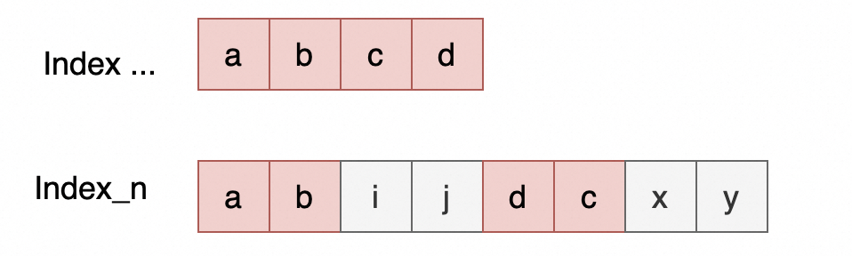

# MySQL Index-Merge代价估算原理

**Date:** 2024/09
**Source:** http://mysql.taobao.org/monthly/2024/09/04/
**Images:** 2 images downloaded

---

数据库内核月报

 [
 # 数据库内核月报 － 2024 / 09
 ](/monthly/2024/09)

 * 当期文章

 PostgreSQL 事件触发器 tag 原理简析
* MySQL 单表大数据量下的 B-tree 高度问题
* Mysql None-SPJ算子执行流程
* MySQL Index-Merge代价估算原理

 ## MySQL Index-Merge代价估算原理 
 Author: zhishu 

 # 线上高频慢查
在PolarDB-MySQL线上慢查问题中，经常遇到因选中Index-Merge索引反而导致查询更慢的情况，这种情况一般是没有太好的通用解决办法，一般是建议客户针对查询force index来固化某个索引，或者使用NO_INDEX_MERGE 的hint关闭index merge选项。

比如下面一个PolarDB客户的查询（已脱敏），优化器选择了Index Merge，但查询变的更慢了：

`*************************** 1. row ***************************
 id: 1
 select_type: SIMPLE
 table: p
 partitions: NULL
 type: index_merge
possible_keys: key1,key6,key8,key5,key7,key2,key4,key3
 key: key7,key5
 key_len: 254,17
 ref: NULL
 rows: 63220
 filtered: 10.00
 Extra: Using intersect(key7,key5); Using where

## 查看Trace信息：
{ ## range扫描的代价 
 "index": "key5",
 "index_dives_for_eq_ranges": true,
 "rowid_ordered": true,
 "using_mrr": false,
 "index_only": false,
 "in_memory": 0.0892,
 "rows": 83730, 
 "cost": 92104, ## key5 range扫描代价
 "chosen": true,
 "cause": "cost"
 },

 { ## range扫描的代价 
 "index": "key7",
 "index_dives_for_eq_ranges": true,
 "rowid_ordered": true,
 "using_mrr": false,
 "index_only": false,
 "in_memory": 0.0161,
 "rows": 188308, 
 "cost": 207140, ## key7 range扫描代价
 "chosen": false,
 "cause": "cost"
 },

"analyzing_roworder_intersect": {
 ### Index Merge的代价估算
 "intersecting_indexes": [
 {
 "index": "key7",
 "index_scan_cost": 5814.5,
 "cumulated_index_scan_cost": 5814.5,
 "disk_sweep_cost": 166598,
 "cumulated_total_cost": 172412, ## ror scan cost
 "usable": true,
 "matching_rows_now": 188308,
 "isect_covering_with_this_index": false,
 "chosen": true
 },
 {
 "index": "key5",
 "index_scan_cost": 239.13,
 "cumulated_index_scan_cost": 6053.7,
 "disk_sweep_cost": 59370,
 "cumulated_total_cost": 65423, ## ror intersect代价
 "usable": true,
 "matching_rows_now": 64048,
 "isect_covering_with_this_index": false,
 "chosen": true
 }
 ],
 "clustered_pk": {
 "clustered_pk_added_to_intersect": false,
 "cause": "no_clustered_pk_index"
 },
 "rows": 64047,
 "cost": 65423,
 "covering": false,
 "chosen": true
}

`

从trace中看到，Using intersect的代价估算比两个索引独立range scan都要小，最终选择了index merge。从结果上我们知道选择index merge并不是最优的，还变的更差了，本文将带着如下几个问题去探讨index merge：

1. 什么是Index Merge，都有哪些类型及基本原理；
2. 为什么要有Index Merge，解决了什么问题，它的优势在哪?
3. 了解Index Merge代价估算原理，为什么总遇到bad case？
4. 是否有减少bad case的解决思路

# Index Merge简介
Index Merge是通过同时扫描多个索引，再将数据合并到一起的访问方式。只适用于单表有多个索引可选的情况，不支持用多表场景。合并数据的种类有：unions，intersections。

`SELECT * FROM tbl_name WHERE key1 = 10 OR key2 = 20;

SELECT * FROM tbl_name
 WHERE (key1 = 10 OR key2 = 20) AND non_key = 30;

SELECT * FROM t1, t2
 WHERE (t1.key1 IN (1,2) OR t1.key2 LIKE 'value%')
 AND t2.key1 = t1.some_col;

SELECT * FROM t1, t2
 WHERE t1.key1 = 1
 AND (t2.key1 = t1.some_col OR t2.key2 = t1.some_col2);
`

 Inerge-Merge的使用限制：
● 如果where条件中有复杂的AND/OR嵌套，可能选不中较优的计划。建议做如下变换：
 ○ (x AND y) OR z => (x OR z) AND (y OR z)
 ○ (x OR y) AND z => (x AND z) OR (y AND z)
● 不支持full-text索引。

Index-Merge有多种执行方式，会在在Explain的Extra信息中显示：
● Using intersect(…)
● Using union(…)
● Using sort_union(…)

详细可以阅读[官网介绍](https://dev.mysql.com/doc/refman/8.0/en/index-merge-optimization.html)，下面简单总结下要点。

## ROR-Intersection
适用多个AND组合的range条件上都有索引，且索引必须满足如下条件之一：
● 如果是联合索引，索引的多个keyparts必须都被使用；
● 二级索引扫描是ROR(rowid ordered)
● 在主键上的range条件；

ROR-Intersection策略：
● 优先扫描二级索引，结果按照rowid进行合并取交集
● 主键索引条件只作为filter，并不做scan
● 合并后如果变为覆盖索引，可以避免回表

## ROR-Union
适用多个OR组合的range条件上都有索引，索引需满足的条件和Intersection一致。
Union策略：
● 如果是联合索引，索引的多个keyparts必须都被使用；
● 二级索引扫描是ROR(rowid ordered)
● 扫描多个索引数据，按照rowid进行去重取并集。

## Sort-Union
索引不满足ROR的，先对索引扫描的数据按照rowid进行排序，再进行去重取并集。

# Index Merge的意义
在AND组合条件中，选择Index Merge进行intersection，每个索引都要扫描一遍再取交集，扫描行数明显会变多，但取交集后结果集会变少，能`减少回表的开销`。若多个索引组合起来能覆盖所有访问的列，就变成了覆盖索引，可以直接避免回表。
在OR组合条件中，如果不选Index Merge，就只能全表扫描了，通过扫描多个索引取并集，可以`避免全表扫描`。

# 如何选择Index Merge
本章节主要介绍Index Merge代价估算原理。

## MySQL索引扫描代价计算
在介绍Index Merge代价估算原理前，先简单介绍下MySQL索引扫描方式代价计算原理：

***全表扫描，在主键上做全表扫描的代价***

 // table_scan_pages是扫描主键的pages数
table_scan_cost = table_scan_pages * page_read_cost + row_evaluate_cost(rows)

***索引扫描，覆盖索引***

 // index_scan_pages是扫描索引的pages数
index_scan_cost = index_scan_pages * index_page_read_cost

***索引扫描，非覆盖索引，考虑回表代价***

 //非覆盖索引扫描，MySQL认为每一行都要回表，将rows视为pages来计算整体代价
index_read_cost = (index_scan_rows + ranges) * page_read_cost

另外补充下page_read_cost和index_page_read_cost的区别，因为有的pages是在buffer pool缓存中，有的pages是在磁盘中，代价公式需要考虑pages在缓存中的比率来计算代价。区别就是page_read_cost中使用table_in_memory_estimate来计算，index_page_read_cost使用index_in_memory_estimate来计算。

`page_read_cost = mem_read_cost(table_pages_in_mem) + io_read_cost(table_pages_on_disk)
index_page_read_cost = mem_read_cost(index_pages_in_mem) + io_read_cost(index_pages_on_disk)
`

## ROR Intersection代价计算
使用non-covering ROR-intersection搜索算法找到最优的ROR-intersection计划。返回的计划，有可能是覆盖所有列的计划，无需再回表。

`# 检索最优的ROR-intersection
find_min_ror_intersection_scan()
{
 R= select all ROR scans; ## Sort indexes in an order that is likely to be a
 ## good index merge intersection order.

 S= first(R); -- set of scans that will be used for ROR-intersection
 R= R-first(S);
 min_cost= cost(S);
 min_scan= make_scan(S);
 while (R is not empty)
 {
 firstR= R - first(R);
 if (!(selectivity(S + firstR) < selectivity(S)))
 continue;

 S= S + first(R);
 if (cost(S) < min_cost)
 {
 min_cost= cost(S);
 min_scan= make_scan(S);
 }
 }
 return min_scan;
}

`

算法思路为：

1. 首先对ROR scan索引进行排序，目标是选择尽量少的索引进行ROR-intersection。
 a. 首先索引num_covered_fields_remaining（剩余未被覆盖的fields个数）少的排在前面，更容易组合成覆盖索引；
 b. 其次扫描行数少的排在前面；
2. 按照顺序依次计算合并后选择率、代价
 a. 计算合并后的选择率，若合并后的选择率不低于合并前，则跳过这个索引，继续考虑后面的
 b. 计算合并后的代价，比较并保存min_cost, min_scan组合
3. 最后输出认为代价最低的 min_scan

#### ROR-Intersection 选择率计算
整体算法思路比较清晰，算法关键点是ror-scan 合并后选择率的计算，前面提到的慢查问题，也多是这里存在当前算法不适用的场景，产生了bad case。下面介绍下选择率估算算法。

`# 假设有如下的多个索引的条件：
cond=k_11=c_11 AND k_12=c_12 AND ... // key_parts of first key
 k_21=c_21 AND k_22=c_22 AND ... // key_parts of second key
 ...
 k_n1=c_n1 AND k_n3=c_n3 AND ... // key_parts of n key

# 其中k_ij 和 k_pq 可能是相同的列

`

假设已计算完前n-1个ror-scan索引合并的代价为例，现在需要计算合并第n个索引的选择率乘数selectivity_mult，目的是计算合并后的out_rows和代价。

如上图示例中，合并第n个索引前，前面的索引合并起来已经覆盖到a,b,c,d（顺序无关）等列，第n个索引中部分keyparts和已合并的有重叠，这里selectivity_mult计算的是剩余非覆盖列的选择率乘数，计算方法如下：

`selectivity_mult = prefix_scan_records(..., j) / prefix_scan_records(..., b) 
 * prefix_scan_records(..., y) / prefix_scan_records(..., c)
 * ...
`

其中prefix_scan_records(…, b)的含义是索引按照这些前缀keyparts要扫描的行数，对应代码中的records_per_key[keyparts]，或者利用直方图、index dive来估算的固定索引前缀keyparts的扫描行数。

`info->out_rows *= selectivity_mult ## 计算合并后的输出行数
info->index_records += quick_rows[ror_scan->keynr]; ## 扫描行数累计
info->index_scan_cost += ror_scan->index_read_cost; ## index-only的扫描代价累计
bitmap_union(&info->covered_fields, &ror_scan->covered_fields); ##合并covered_fields

info->total_cost = info->index_scan_cost; 
if 非覆盖索引：
 sweep_cost = get_sweep_read_cost ## sweep就是计算回表的IO代价
 info->total_cost += sweep_cost; ## 
`

info->total_cost为ROR-intersection合并后的总代价，若info->total_cost比任意其它range scan的代价低的话，最终将选择index merge来替代range scan。

 问题：虽然在计算选择率乘数时，已经排除了重叠的fields，但非重叠的fields的selectivity_mult还是基于非相关的假设来计算的。如果两个索引中的列有强相关性，索引合并后并不能如预期的降低out_rows，也就是代价估算偏低选中了Index-Merge，但实际执行开销可能更高了。

## Sort-Union代价计算
如果查询语句包含多个OR条件索引，同时扫描多个索引，再去重后取并集。正常情况or条件无法选中索引，只能全表扫描，需要计算合并索引的代价是否低于best_plan。

`## ROR-Union的代价计算：
## 计算流程：(a = 1 and b = 2) or (c = 3 and d = 3)
Loop 'OR' range 条件tree：
 - cur_child = get_key_scans_params ## 获取当前range条件best range scan方式 
 ## 如果没有找到best range，则设置imerge_too_expensive = true
 - imerge_cost += (*cur_child)->cost_est; ## 累加对应range scan的代价
 - non_cpk_scan_records += (*cur_child)->records;

sweep_cost = get_sweep_read_cost ## 计算回表代价，回表行数就是non_cpk_scan_records
imerge_cost += sweep_cost

dup_removal_cost = Unique::get_use_cost ##计算
imerge_cost.add_cpu(dup_removal_cost);

# imerge_cost 为总代价
`
ROR-Union的代价计算比Intersection简单很多，基本思想就是将多个索引扫描代价累加，加上去重后回表的代价，再加上union去重的代价。

## ROR-Union代价计算
如果多个OR条件的索引都是ROR(rowid ordered)的，可以利用rowid有序的特性，快速去重，节省掉了Unique_set的开销。

`## ROR-Union的代价公式：

## 计算流程：(a = 1 and b = 2) or (c = 3 and d = 3)
Loop cur_child in range_scans: ## range_scans已经在计算sort-union时填充好了，这里无需再调用get_key_scans_params
 - cur_roru_plan = get_best_ror_intersect ## 复用ror-intersection来计算(a = 1 and b = 2) 单独某部分range条件的代价
 - roru_index_cost += (*cur_roru_plan)->index_scan_cost;
 - roru_total_records += (*cur_roru_plan)->records;
 - roru_intersect_part *=
 (*cur_roru_plan)->records / param->table->file->stats.records; # 计算去重率

# 估算去重后的行数
roru_total_records -=
 (ha_rows)(roru_intersect_part * param->table->file->stats.records);

sweep_cost = get_sweep_read_cost ## 回表行数roru_total_records

# Calculate cost:
roru_total_cost += roru_index_cost ## index only scan cost
roru_total_cost += sweep_cost # 回表代价
roru_total_cost.add_cpu(cost_model->key_compare_cost(
 rows2double(roru_total_records) * std::log2(n_child_scans))); ## queue_use_cost(rowid_len, n)

`

ROR-Union和Sort-Union的主要区别，一个是计算了去重率，回表代价按照去重后的行数来计算，但Sort-Union并没有计算去重率。第二个区别就是去重的代价，Sort-Union使用的是Unique_set，ROR-Union使用的是优先级queue来实现的。

# 总结
Index Merge原理是通过扫描多个索引，将各索引扫描的数据进行合并（交集、并集），预期是更快的计算出目标结果。比如ROR-intersection方式在合并后能减少回表的次数，甚至多个索引组合成覆盖索引可直接避免回表，大幅提升性能；ROR-Union方式通过扫描多个索引进行并集合并，避免扫描全表从而提升效率。

Index Merge并不总是能提升性能，比如ROR-intersection中，多个索引扫描的数据重叠路非常高，合并取交集并不会减少found_rows，这样既没有减少回表次数，又额外增加了N多个索引的扫描，开销反而增加了。再比如ROR-Union中，若多个OR条件的扫描行数都很大，加起来扫描行数可能比全表rows都要大，就不如直接扫全表了。所以基于代价的选择Index Merge成为了影响查询性能的关键:
● Intersection代价，关键在计算索引合并后的out_rows，也就是合并后的交集选择率乘数。
● Union的代价相对简单些，主要是将多个索引扫描的代价累加

ROR-Intersection的Index Merge在线上出现慢查的频率最高，主要问题出在索引合并选择率乘数的计算上，它是基于非相关性假设计算的。若真实业务数据两列存在较大的相关性，既两个索引扫描出的数据有大量重叠，这样两个索引相交后out_rows比预期要大很多，但代价计算中无法识别列间的相关性，估算的Index Merge代价通常会偏小，导致错选Index Merge引发慢查询。

***解决路径***
这个问题的优化思路就是支持列和列之间的相关性统计，一般称为dependency扩展统计信息，提升索引合并选择率的准确度。MySQL的统计信息仅支持索引前缀的基数估算，还有index dive作为补充。如果是非索引列，或者是索引的非前缀列，是没有单独的基数统计，这些条件的选择率计算就偏差非常大。 社区8.0开始也支持了Histogram，但并不支持自动更新，很难在生产环境被广泛使用。

PolarDB MySQL目前在做统计信息的增强，支持非索引列的ndv,null fraction, mcv，histogram, correlation等，还支持多列的dependency, multi-NDV, multi-MCV等扩展统计信息，并会推出一套完整的统计管理机制，实现扩展统计信息的自动更新、管理等。

 阅读： - 

本作品采用[知识共享署名-非商业性使用-相同方式共享 3.0 未本地化版本许可协议](http://creativecommons.org/licenses/by-nc-sa/3.0/)进行许可。

 