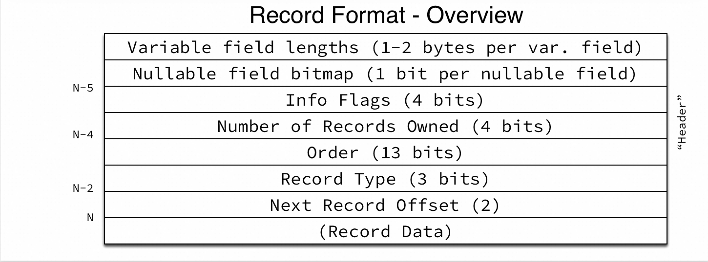

# MySQL 单表大数据量下的 B-tree 高度问题

**Date:** 2024/09
**Source:** http://mysql.taobao.org/monthly/2024/09/02/
**Images:** 4 images downloaded

---

数据库内核月报

 [
 # 数据库内核月报 － 2024 / 09
 ](/monthly/2024/09)

 * 当期文章

 PostgreSQL 事件触发器 tag 原理简析
* MySQL 单表大数据量下的 B-tree 高度问题
* Mysql None-SPJ算子执行流程
* MySQL Index-Merge代价估算原理

 ## MySQL 单表大数据量下的 B-tree 高度问题 
 Author: ba0tiao 

 有一些老的DBA 还记得在很早的时候, 坊间流传的是在MySQL里面单表不要超过500万行，单表超过 500 万必须要做分库分表. 有很多 DBA 同学担心MySQL 表大了以后, Btree 高度会变得非常大, 从而影响实例性能.

其实 Btree 是一个非常扁平的 Tree, 绝大部分 Btree 不超过 4 层的, 我们看一下实际情况

我们以常见的 sysbench table 举例子

`CREATE TABLE `sbtest1` (
 `id` int NOT NULL AUTO_INCREMENT,
 `k` int NOT NULL DEFAULT '0',
 `c` char(120) NOT NULL DEFAULT '',
 `pad` char(60) NOT NULL DEFAULT '',
 PRIMARY KEY (`id`),
 KEY `k_1` (`k`)
) ENGINE=InnoDB AUTO_INCREMENT=10958 DEFAULT CHARSET=latin1
`

在 InnoDB 里面主要 2 种类型 Page, leaf page and non-leaf page

Leaf Page 格式如下, 每一个 Record 主要由 Record Header + Record Body 组成, Record Header 主要用来配合 DD(data dictionary) 信息来接下 Record Body. Record Body 是 Record 的主要内容.

16KB page 里面sysbench 这样的表, Leaf Page 一个表里面可以存差不多存储的行数是:

(16 * 1024 - 200(Page 一些 Header, tail, Diretory slot 长度) )/ ((4 + 4 + 120 + 60)行数据长度 + 5(每行数据的 header) + 6(Transaction ID) + 7(Roll Pointer)) = 78.5

Non-leaf Page 格式如下:

因为 sysbench primary key id 是 int 是 4 个字节, 那么 16KB page 可以存的行数就是

(16 * 1024 - 200) / (5(每行数据 Header + 4 (Cluster Key) + 4(Child Page Number)) = 1233

那么不同高度的计算公式如下:

 高度
 Non-leaf pages
 Leaf pages
 行数
 大小

 1
 0
 1
 79
 16KB

 2
 1
 1233
 97407
 19MB

 3
 1234
 1520289
 120102831
 23GB

 4
 1521523
 1874516337
 148086790623
 27.9TB

从上面可以看到, 如果是类似 sysbench 这样的表, 那么单表 1400 亿行, 数据大小是 27.9TB 的情况下, Btree 的高度都不会超过 4 层. 所以不用担心数据量大了以后, Btree 高度增加的问题

这里如果 sysbench 的 primary key 是 BIGINT, 也就是 8 字节那么大概是怎样的呢?

leaf page 里面可以存的 record 行数就是:

(16 * 1024 - 200) / ((8 + 4 + 120 + 60) + 13) = 78.9

可以看到这个 leaf page record number 变化不大

non-leaf page 可以存的 record 数变化稍微大一些:

(16 * 1024 - 200)/(5+8+4) = 952

 高度
 Non-leaf pages
 Leaf pages
 行数
 大小

 1
 0
 1
 79
 16KB

 2
 1
 952
 75208
 15MB

 3
 953
 906304
 71598016
 13.8GB

 4
 907257
 862801408
 68161311232
 12.8TB

从上面可以看到, 如果 sysbench 的 primary key 改成 BIGINT 之后, 那么 4 层的 btree 可以存 600 亿行, 大概可以存 12TB 的数据.

如果 Sysbench 这样的 Table 不具有代表性, 那么更复杂的一些 Table, 比如 Polarbench(用于模拟各个行业的场景数据库使用场景的工具) 里面的 SaaS 场景常用的 log 表来看

`CREATE TABLE `prefix_off_saas_log_10` (
 `id` bigint(20) NOT NULL AUTO_INCREMENT,
 `saas_type` varchar(64) DEFAULT NULL,
 `saas_currency_code` varchar(3) DEFAULT NULL,
 `saas_amount` bigint(20) DEFAULT '0',
 `saas_direction` varchar(2) DEFAULT 'NA',
 `saas_status` varchar(64) DEFAULT NULL,
 `ewallet_ref` varchar(64) DEFAULT NULL,
 `merchant_ref` varchar(64) DEFAULT NULL,
 `third_party_ref` varchar(64) DEFAULT NULL,
 `created_date_time` datetime DEFAULT NULL,
 `updated_date_time` datetime DEFAULT NULL,
 `version` int(11) DEFAULT NULL,
 `saas_date_time` datetime DEFAULT NULL,
 `original_saas_ref` varchar(64) DEFAULT NULL,
 `source_of_fund` varchar(64) DEFAULT NULL,
 `external_saas_type` varchar(64) DEFAULT NULL,
 `user_id` varchar(64) DEFAULT NULL,
 `merchant_id` varchar(64) DEFAULT NULL,
 `merchant_id_ext` varchar(64) DEFAULT NULL,
 `mfg_no` varchar(64) DEFAULT NULL,
 `rfid_tag_no` varchar(64) DEFAULT NULL,
 `admin_fee` bigint(20) DEFAULT NULL,
 `ppu_type` varchar(64) DEFAULT NULL,
 PRIMARY KEY (`id`),
 KEY `saas_log_idx01` (`user_id`) USING BTREE,
 KEY `saas_log_idx02` (`saas_type`) USING BTREE,
 KEY `saas_log_idx03` (`saas_status`) USING BTREE,
 KEY `saas_log_idx04` (`merchant_ref`) USING BTREE,
 KEY `saas_log_idx05` (`third_party_ref`) USING BTREE,
 KEY `saas_log_idx08` (`mfg_no`) USING BTREE,
 KEY `saas_log_idx09` (`rfid_tag_no`) USING BTREE,
 KEY `saas_log_idx10` (`merchant_id`)
 ) ENGINE=InnoDB AUTO_INCREMENT=0 DEFAULT CHARSET=utf8
`

因为这里面有变长字段, 不过大部分 ref 是有值的, 所以假设 varchar 字段完全被使用的情况.

所有这些字段加起来, 再额外计算Record Header 信息, 差不多974 bytes.

那么 Leaf Page 可以存的 record 数就是 (16 * 1024 - 200)/974 = 16.6

对于 Non-Leaf Page 那么和之前 Sysbench BIGINT 一样, 可以存的 record 是 952

 高度
 Non-leaf pages
 Leaf pages
 行数
 大小

 1
 0
 1
 16
 16KB

 2
 1
 952
 15232
 15MB

 3
 953
 906304
 14500864
 13.8GB

 4
 907257
 862801408
 13804822528
 12.8TB

可以看到即使是单行差不多 1KB的 Table, 如果 primary key 还是 BIGINT 的话, 那么数据在 10T 以内, Btree 的高度也一定在 4 层之内, 同时在 4 层之内, 这个Table 大概可以存 138 亿行了.

所以 MySQL 存几十亿行这样的场景其实是完全没问题的.

MySQL 还是有一个最佳实践, “不建议使用 uuid 作为主键”. 我们来看看为什么?

比如上面的 prefix_off_saas_log_10 如果把 primary key 改成 32 字节的 uuid, 那么在 Leaf Page 不变的情况下,

Non-Leaf Page 存的 record number:

(16 * 1024 - 200)/(5+32+4) = 394

 高度
 Non-leaf pages
 Leaf pages
 行数
 大小

 1
 0
 1
 16
 16KB

 2
 1
 394
 6304
 6MB

 3
 395
 155236
 2483776
 2GB

 4
 155631
 61162984
 978607744
 981GB

 5
 61318615
 24098215696
 385571451136
 386TB

从上面的 Table 可以看出, 如果使用 uuid 作为主键以后, 那么同样 4 层的 Btree, 如果使用 BIGINT 那么可以存 138 亿行数据, 而使用 uuid 仅仅只能存9.7 亿行数据.

但是即使错误的使用 uuid 作为主键, 其实 MySQL 的 Btree 的深度也不会超过 5 层, 5 层最多可以存 3.8 千亿行了, 386TB 的数据. 其实是不可能的, 因为 MySQL 单表其实最大就支持 64TB 了.

整体而言MySQL 里面完全不用担心数据量大了以后, Btree 高度增加影响性能的问题, 10TB 以内的数据 Btree 高度一定在 4 层以内, 超过 10TB 以后也会停留在 5 层, 不会更高了, 因为 MySQL 单表最大就支持 64TB 了.

PolarDB 在线上支持了非常多的大表实例, 10+TB 的大表其实非常多, 我也看到之前很多大厂 DBA 朋友的实际分享, 比如微博6B(billion) 哥, 讲述微博的某一张单表 60 亿行数据等等, NineData 创始人斗佛公众号大圣聊数据库讲述海外类似微信业务单表几十亿都是运行的挺好的. 所以其实如果业务表结构设计合理, 其实大表是完全没问题的, 不用被现在的数据库厂商强行引导.

 阅读： - 

本作品采用[知识共享署名-非商业性使用-相同方式共享 3.0 未本地化版本许可协议](http://creativecommons.org/licenses/by-nc-sa/3.0/)进行许可。

 