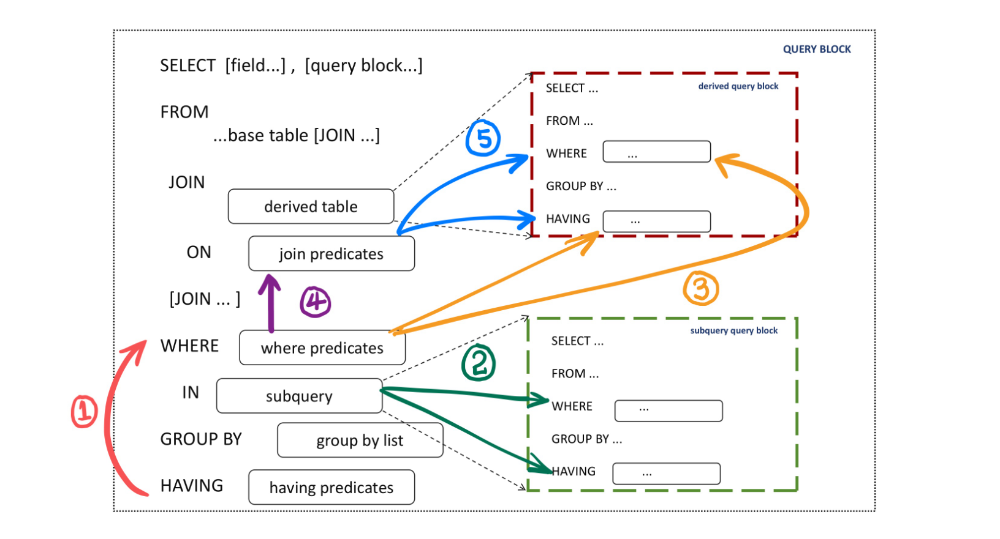

# MySQL · 功能特性 · 谓词下推增强

**Date:** 2024/11
**Source:** http://mysql.taobao.org/monthly/2024/11/02/
**Images:** 2 images downloaded

---

数据库内核月报

 [
 # 数据库内核月报 － 2024 / 11
 ](/monthly/2024/11)

 * 当期文章

 PostgreSQL LIKE 操作符走 B-tree 索引浅析
* MySQL · 功能特性 · 谓词下推增强

 ## MySQL · 功能特性 · 谓词下推增强 
 Author: 任卓 

 本文主要探讨我们在PolarDB MySQL产品中针对谓词下推这一优化器SQL重写规则所做的增强。在社区版本的基础上，我们进一步强化了下推逻辑对于等值关系的利用，通过等值语义的传递，增加了符合下推派生表规则的查询场景。此外，我们还扩展了谓词下推的范围，包括将HAVING子句中的谓词下推至WHERE子句、将WHERE子句中的谓词下推至子查询，以及将JOIN谓词下推至派生表。此系列优化旨在提升查询性能，显著改善用户的使用体验。

## 什么是谓词下推

在现代数据库系统中，用户场景的SQL查询往往复杂多样，涉及多个表的连接、子查询以及各种聚合操作。这种复杂性使得查询性能优化变得尤为重要。在这一背景下，谓词下推（Predicate Pushdown）作为一种重要的启发式优化规则，被广泛应用于优化器的查询模块中。它的核心思想是将查询条件（即谓词）尽可能早地应用于数据源，以减少后续操作的数据量。简而言之，就是在尽早的阶段对数据进行筛选，以避免不必要的数据处理，从而提高查询性能。

## 社区版本的谓词下推

Mysql社区优化器阶段的谓词下推指的是子查询派生条件下推，即在prepare阶段，Mysql会自顶向下，逐层处理每层查询的WHERE条件，将符合条件的谓词下推到子查询派生表中，比如下面的sql语句

`SELECT * FROM (SELECT i, j FROM t1) AS dt WHERE i > constant;

====>

SELECT * FROM (SELECT i, j FROM t1 where i > constant) AS dt;
`

当然，用户场景的sql要复杂很多，优化器要做的是准确识别SQL语句中符合谓词下推规则的部分，将尽可能多的条件下压。Mysql社区版本的谓词下推也是一个持续演进的过程。MySQL 8.0.22及以后版本支持为符合条件的子查询派生条件下推；在MySQL 8.0.29及更高版本中，派生表条件下推优化可以用于UNION查询。

要启用派生条件下推，必须将optimizer_switch系统变量的derived_condition_pushdown设置为on。如果optimizer_switch禁用了此优化，则可以使用DERIVED_CONDITION_PUSHDOWN优化器HINT为特定查询启用它。要禁用给定查询的优化，则使用NO_DERIVED_CONDITION_PUSHDOWN优化器HINT。具体可以参考[社区官网文档](https://dev.mysql.com/doc/refman/8.4/en/derived-condition-pushdown-optimization.html)。

`多层派生表的谓词下推:

EXPLAIN FORMAT=tree SELECT * FROM (SELECT * FROM (SELECT * FROM t1) as dt1) as dt2
WHERE f1 > 3 and f2 < 50 and f3 > 200;
EXPLAIN
-> Table scan on dt2 (rows=0.333)
 -> Materialize (rows=0.333)
 -> Table scan on dt1 (rows=0.333)
 -> Materialize (rows=0.333)
 -> Filter: ((t1.f2 < 50) and (t1.f3 > 200)) (rows=0.333)
 -> Index range scan on t1 using f1 over (3 < f1), with index condition: (t1.f1 > 3) (rows=2)
`

```
含union的谓词下推:

EXPLAIN FORMAT=tree SELECT *
FROM (SELECT f1, f2 FROM t1
UNION
SELECT f1, f2 FROM t2) as dt
WHERE f1 > 2;
EXPLAIN
-> Table scan on dt (rows=8)
 -> Union materialize with deduplication (rows=8)
 -> Filter: (t1.f1 > 2) (rows=4)
 -> Covering index range scan on t1 using f1_2 over (2 < f1) (rows=4)
 -> Filter: (t2.f1 > 2) (rows=4)
 -> Covering index range scan on t2 using f1_2 over (2 < f1) (rows=4)

```

### 谓词下推派生条件的核心逻辑
1.分析查询结构：识别查询中符合谓词下推规则的派生表以及外层中的WHERE条件作为下推的候选谓词

2.条件下推：提取仅仅包含对应派生表投影列的条件，将对应谓词的列转换为派生表中的列附加到对应子查询的 WHERE CLAUSE 或者 HAVING CLAUSE上。

3.递归下推：将外层下推的谓词作为新的下推候选谓词，递归地推送至子查询中的子查询，形成可能的下推路径。

以下是简化的伪代码，展示 MySQL 优化器如何识别并推送派生条件，实际的 MySQL 社区版源代码中包含了更多细节和复杂性。

`// 下推函数调用点 Query_block::prepare
Query_block::prepare() 
 apply_local_transforms()
 if (outest query block) // 自顶层调用，且内部query block已经自内向外做了前期fix和simplify_joins等操作
 push_conditions_to_derived_tables(); // 将条件下推到派生表中

// push_conditions_to_derived_tables 函数
void Query_block::push_conditions_to_derived_tables() 
 // 遍历每一个物化的派生表
 for (auto& derived_table : materialized_derived_tables)
 // 如果当前查询块中存在 WHERE 条件
 if (this->has_where_condition() && 其他规则检查) 
 // 从条件中提取只属于该派生表的部分
 Condition extracted_condition = extract_cond_for_table(); // 对条件谓词的field进行判断，提取仅属于派生表field的条件

 // 检查条件是否可以被下推到窗口函数之后的 HAVING 子句
 push_past_window_functions()
 // 无法下推的条件仍然保留在外层查询块中
 make_remainder_cond()
 
 // 检查条件是否可以进一步下推到 GROUP BY（如果存在）的 WHERE 子句
 push_past_group_by()
 // 无法下推的条件会成为派生表 HAVING 子句的一部分
 remained_conditions->add_items()

 // 将下推到派生表的having 和 where 条件做转换并真正附加到派生表查询表达式中（replace + attach）
 replace_columns_in_cond()
 attach_cond_to_derived()
 
 // 遍历当前查询块中的每一个查询表达式
 for (auto& query_expr : query_block) 
 query_expr.push_conditions_to_derived_tables() // 递归调用，将条件尽可能深地向下推

`

以上内容描述了社区整个谓词下推派生表实现的代码框架，其中核心函数为 extract_cond_for_table()。该函数的主要作用是生成从 WHERE 谓词派生出的下推候选谓词。此外，push_past_window_functions() 和 push_past_group_by() 等函数同样复用了 extract_cond_for_table() 的逻辑，目的是检查当前字段是否属于一组目标字段，从而验证字段所属`table`的合理性。

当然，不同的检查目的，对应了不同的`check`函数，具体如下：

`CHECK_FOR_DERIVED: &Item::is_valid_for_pushdown // 检查条件是否仅包含派生表表达式
CHECK_FOR_HAVING: &Item::check_column_in_window_functions // 检查条件是否可以推送到派生表的 HAVING 子句
CHECK_FOR_WHERE: &Item::check_column_in_group_by // 检查条件是否可以推送到派生表的 WHERE 子句
`

## PolarDB 谓词下推

PolarDB的谓词下推规则是在社区基础功能上的进一步增强，除了考虑谓词条件之间等值传递的语义，还扩充了谓词下推的场景，形成了完善的谓词下推路径，而不仅仅是针对派生表的下推。如下图所示，在prepare阶段的transform过程中，对于当前的query block，优化器会完成一系列下推谓词的操作。这些组合策略不仅提高了查询执行的效率，还为优化器提供了更为丰富的信息，进而使得数据检索的灵活性和精准度得以提升。

谓词下推框架如下图所示：



PolarDB支持的谓词下推场景分为以下四种：

(a) 将HAVING谓词下推至WHERE条件；

(b) 将WHERE谓词下推至IN子查询； 

(c) 将WHERE谓词下推至派生表（Derived Tables）； 

(d) 将JOIN谓词下推至派生表。

整个谓词下推的过程如下所示。首先，在SQL语句的`最外层查`询块（Query Block）中，调用谓词下推流程（包括上述四种操作）。具体的执行顺序如下:

第一步，执行操作(a)（对应图中（1）箭头）：利用WHERE条件中的等值关系，将HAVING谓词下推至WHERE条件，从而在结合新的HAVING条件后，构建出可供后续操作使用的新的等值关系。

第二步，执行操作(b)（对应图中（2）箭头）：基于上一步生成的WHERE等值关系，将符合下推规则的WHERE条件推送至IN子查询中，同时保持WHERE的原始条件不变。

第三步，执行操作(c)（对应图中（3）箭头）：在当前WHERE条件的等值关系基础上，将满足下推规则的条件推送至派生表中，然后从WHERE条件中去除已下推的非等值关系。关于保留等值关系的原因有两个：一是为了将这些等值关系传递到后续的JOIN条件中，以便进行相应的优化；二是在每一层保留更多的等值关系，以便在后续的优化流程中考虑更多的索引使用和连接优化选项。

第四步，执行操作(d)（对应图中（4）（5）箭头）：将WHERE中的等值关系逐层传递至每一层JOIN嵌套的ON条件，从而识别并将符合下推规则的JOIN条件推送至派生表。

至此，对于当前查询块的所有谓词下推操作已经完成。但是，接下来需要`递归`地对所有的查询块也进行谓词下推操作。由于谓词下推融合了多种下推类型，因此在递归调用的过程中，需要精确管理每个位置的处理顺序，以避免条件的重复考虑，进而引发某些位置出现重复条件的情况。通过这一系列的步骤，能够有效地优化SQL查询，提高执行效率。

每种谓词下推对应的参数开关如下，可通过以下方式开启。PolarDB提供了更细粒度范围的开启开关，设置`ON`表示对RW和RO节点都开启，`REPLICA_ON`表示只对ro节点开启，`OFF`表示对rw和ro节点都关闭。

`SET having_cond_pushdown_mode = ON / REPLICA_ON; -- 开启having谓词下推到where
SET derived_cond_pushdown_mode = ON / REPLICA_ON; -- 开启where谓词下推到derived
SET subquery_cond_pushdown_mode = ON / REPLICA_ON; -- 开启where谓词下推到 IN 子查询
SET join_cond_push_into_derived_mode = ON / REPLICA_ON; -- 开启join谓词下推到derived
`

以下篇幅讲分别介绍不同谓词下推的典型场景：

### 关于等值关系的利用

在 MySQL 社区版中，谓词条件的等值关系（Item_equal 类的构建）仅在优化（optimize）阶段进行。因此，社区版本在实现谓词下推至派生表时，并未充分利用等值关系。实际上，等值关系在许多查询转换过程中，尤其是谓词下推优化中，具有至关重要的作用。若能在 prepare 阶段提前构建等价类，将极大提升查询的优化潜力，尤其在涉及谓词下推时，能够显著改善性能表现。

尽管提前构建等价类本身并不复杂，但这一改动涉及到大量的适配工作。这是因为它打破了 MySQL 原有查询优化逻辑中的一些关键假设，从而使得代码适配变得相对繁琐。这种适配虽然带来了代码复杂度的增加，但通过优化等值关系的利用，最终能为性能提升带来实质性的回报。

### having 谓词下推 where

受到谓词下推派生表原理的启发， 我们针对没有派生表的查询SQL也进行了改进。将谓词从WHERE clause下推至HAVING CLAUSE。

HAVING 子句是在 GROUP BY 之后处理的，在满足SQL语义的前提下，如果能在聚合之前过滤数据，显然能起到提前过滤数据的效果。例如下面的SQL:

`EXPLAIN FORMAT=JSON SELECT t1.a,MAX(t1.b),t1.c
FROM t1
WHERE (t1.a=t1.c)
GROUP BY t1.a
HAVING (t1.a>1) AND (t1.c<3);

EXPLAIN
{
 "query_block": {
 "select_id": 1,
 "cost_info": {
 "query_cost": "1.15"
 },
 "grouping_operation": {
 "using_temporary_table": true,
 "using_filesort": false,
 "table": {
 "table_name": "t1",
 "access_type": "ALL",
 "rows_examined_per_scan": 5,
 "rows_produced_per_join": 1,
 "filtered": "20.00",
 "cost_info": {
 "read_cost": "0.65",
 "eval_cost": "0.10",
 "prefix_cost": "0.75",
 "data_read_per_join": "16"
 },
 "used_columns": [
 "a",
 "b",
 "c"
 ],
 "attached_condition": "((`test`.`t1`.`c` = `test`.`t1`.`a`) and (`test`.`t1`.`a` > 1) and (`test`.`t1`.`c` < 3))"
 }
 }
 }
}
`

分析SQL语义我们可以得出一个重要结论：HAVING子句中的谓词条件若希望被下推，必须确保不影响分组内部的数据。如果某一分组中的数据被过滤掉，这将直接影响到某些聚合函数的结果。因此，通过逻辑分析，我们可以推断：能够下推的谓词条件的列应当被包含在GROUP BY子句中。这样一来，被过滤的数据在逻辑上便是以分组为单位进行的，这符合SQL的原始语义。这样的认识不仅有助于优化查询性能，还能确保聚合结果的准确性。

### where 谓词下推派生表(视图)

关于PolarDB版本相较于社区版本的具体改进之处[之前的文章](http://mysql.taobao.org/monthly/2023/03/03/)有过详细的介绍: 

(1) 考虑等值条件的传递

(2) 支持下推到派生表union的部分“分查询”中

(3) 下推后的条件可进一步基于等价关系级联下推

此外，PolarDB还针对OR关联谓词实现了合取操作的优化，通过从每个OR部分中提取满足下推规则的条件，形成全新的条件集合，并将其有效下推至派生表。在此过程中，须注意的是，原有条件并不会被删除，而是与新条件共同存在。这一机制结合等值传递的应用，使得Polar在条件下推方面具备了更为强大的能力，能够更灵活地处理复杂查询的优化。例如，在处理如下SQL语句时，PolarDB展现了其优越的性能与效率。

`mysql> create view v1 as select a, b, max(c) as max_c, avg(c) as avg_c from t1
 group by a,b having max_c < 707;

mysql> explain format=tree select * from v1, t1 where v1.a=t1.c and ((t1.a<0 and t1.c>100) or (t1.a>1 and v1.b<20));
+-------------------------------------------------------------------------------------------------------------------+
| EXPLAIN |
+-------------------------------------------------------------------------------------------------------------------+
| -> Nested loop inner join
 -> Filter: ((((t1.a < 0) and (t1.c > 100)) or (t1.a > 1)) and (t1.c is not null)) (cost=2.25 rows=8)
 -> Table scan on t1 (cost=2.25 rows=20)
 -> Filter: (((t1.a < 0) and (t1.c > 100)) or ((t1.a > 1) and (v1.b < 20)))
 -> Index lookup on v1 using <auto_key0> (a=t1.c)
 -> Materialize
 -> Filter: (max_c < 707)
 -> Table scan on <temporary>
 -> Aggregate using temporary table
 -> Filter: ((t1.a > 100) or (t1.b < 20)) (cost=2.25 rows=11)
 -> Table scan on t1 (cost=2.25 rows=20)
 |
+-------------------------------------------------------------------------------------------------------------------+
1 row in set (0.01 sec)
`
对于谓词条件`v1.a=t1.c and ((t1.a<0 and t1.c>100) or (t1.a>1 and v1.b<20))`, 针对视图v1通过等值关系`v1.a=t1.c`推导出`(t1.a<0 and v1.a>100) or (t1.a>1 and v1.b<20)`, 再通过提取公因式, 推到出派生表v1必须满足 `v1.a>100 orv1.b<20`, 从而实现进一步下推。

### where 谓词下推subquery

在该场景中，所讨论的子查询（subquery）特指IN子查询的使用场景。IN子查询通常用于在主查询中筛选符合特定条件的结果集，IN子查询会在主查询的WHERE子句中使用一个子查询来生成一个值列表，主查询根据这些值来进行筛选。

假设我们有一个主查询，并且该查询的WHERE子句包含一个IN子查询，原始的查询结构可能类似于以下示例的形式, 在这个查询中，外部查询依赖于内部的子查询来筛选符合条件的`t1.a,t1.b,t1.c`, 标准的查询执行顺序通常是先执行子查询，然后将结果传递给外部查询进行进一步的筛选和计算, 在子查询结果集较大时，可能导致较高的物化开销。开启谓词下推subquery之后，从查询计划可以看出`((t1.c>60 OR t1.c<25) AND t1.b>2)` 可以通过IN的等值关系`(t1.a,t1.b,t1.c) = (t2.e,t2.f,MAX(t2.g))`等价转换成IN子查询内部对应的条件, 从而在子查询的执行阶段就应用条件限制，避免将不必要的结果传递到外部查询。

`mysql> EXPLAIN FORMAT=TREE SELECT * FROM t1
WHERE ((t1.c>60 OR t1.c<25) AND t1.b>2) AND
(t1.a,t1.b,t1.c) IN
(
SELECT t2.e,t2.f,MAX(t2.g)
FROM t2
WHERE t2.e<5
GROUP BY t2.e
);

+-------------------------------------------------------------------------------------------------------------------+
| EXPLAIN |
+-------------------------------------------------------------------------------------------------------------------+
EXPLAIN
| -> Filter: (((t1.c > 60) or (t1.c < 25)) and (t1.b > 2) and <in_optimizer>((t1.a,t1.b,t1.c),(t1.a,t1.b,t1.c) in (select #2))) (cost=1.85 rows=3)
 -> Table scan on t1 (cost=1.85 rows=16)
 -> Select #2 (subquery in condition; run only once)
 -> Filter: ((t1.a = `<materialized_subquery>`.e) and (t1.b = `<materialized_subquery>`.f) and (t1.c = `<materialized_subquery>`.`MAX(t2.g)`))
 -> Limit: 1 row(s)
 -> Index lookup on <materialized_subquery> using <auto_distinct_key> (e=t1.a, f=t1.b, MAX(t2.g)=t1.c)
 -> Materialize with deduplication
 -> Filter: (((max(t2.g) > 60) or (max(t2.g) < 25)) and (t2.f > 2))
 -> Table scan on <temporary>
 -> Aggregate using temporary table
 -> Filter: (t2.e < 5) (cost=1.45 rows=4)
 -> Table scan on t2 (cost=1.45 rows=12)
 |
+-------------------------------------------------------------------------------------------------------------------+
`

### join 谓词下推派生表(视图)

在深入分析客户场景的过程中，我们发现，对于涉及JOIN子查询的场景，谓词下推有潜在的进一步优化空间。客户的业务SQL通常涉及多表连接，但并非所有的JOIN谓词都可以在初期转换为WHERE条件以便同时考虑。在遵循SQL语义的前提下，对于INNER JOIN，其ON谓词可以有效地移至WHERE条件进行处理，这一过程可以通过前述的WHERE谓词下推技术在派生表（或视图）中实现下推优化。

然而，在OUTER JOIN的场景中，由于逻辑语义的不等价性，ON谓词与WHERE条件不能简单并列作为where的一部分来处理，而是需要单独实现下推逻辑。鉴于JOIN的嵌套关系，我们需将WHERE条件的等值语义逐层传递至当前查询块内的每一层JOIN操作，旨在通过JOIN谓词下推提前过滤数据，从而提升查询性能。

以下是一个示例SQL场景。在查询计划中，可以观察到WHERE条件中的等值信息t1.a=1成功传递至JOIN谓词上，推导出dt.x > 1，进而有效地下推至派生表dt中，这样一来，派生表dt中的数据量便得以进一步减少。

`mysql> explain format=tree select * from t1 left join (select * from t2) dt on dt.x > t1.a where t1.a=1;
+-------------------------------------------------------------------------------------------------------------------+
|EXPLAIN |
+-------------------------------------------------------------------------------------------------------------------+
| -> Left hash join (no condition)
 -> Filter: (t1.a = 1) (cost=0.55 rows=1)
 -> Table scan on t1 (cost=0.55 rows=3)
 -> Hash
 -> Table scan on dt
 -> Materialize
 -> Filter: (t2.x > 1) (cost=0.45 rows=1)
 -> Table scan on t2 (cost=0.45 rows=2)
|
+-------------------------------------------------------------------------------------------------------------------+
1 row in set (0.00 sec)
`

## 总结与展望

以上就是 PolarDB 从识别下推场景到优化器根据规则构造下推谓词，完成谓词下推的全过程。值得一提的是，PolarDB的谓词下推功能在传统等值关系的基础上，进一步扩展了非等值关系的支持，从而增加了更多的优化可能性。该功能现已实现，并可通过设置`set predicate_deduce_mode = ON/REPLICA_ON` 来启用。由于篇幅所限，关于这一功能的详细介绍将会在后续文章中进行深入探讨。

展望未来，PolarDB内核团队将持续致力于优化器的进一步提升，不断增强查询性能，为用户提供更优质的使用体验。

 阅读： - 

[](http://creativecommons.org/licenses/by-nc-sa/3.0/)
本作品采用[知识共享署名-非商业性使用-相同方式共享 3.0 未本地化版本许可协议](http://creativecommons.org/licenses/by-nc-sa/3.0/)进行许可。

 [

 ](#0)