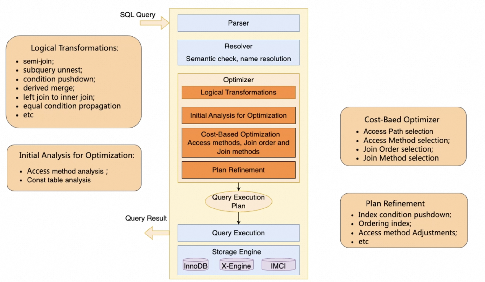
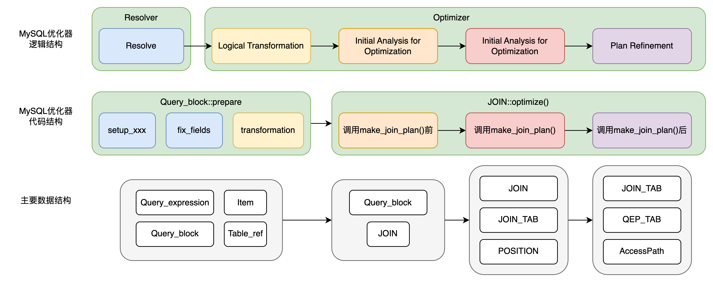
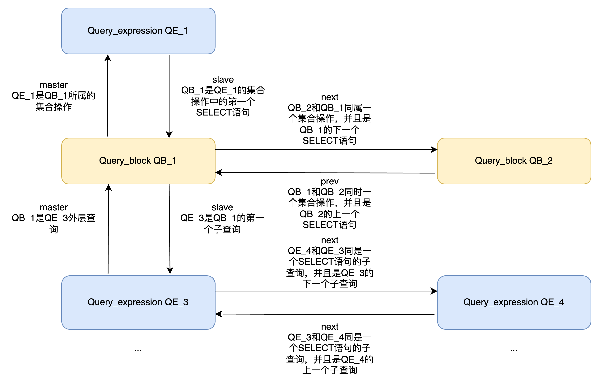
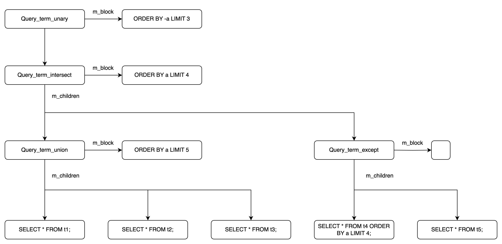
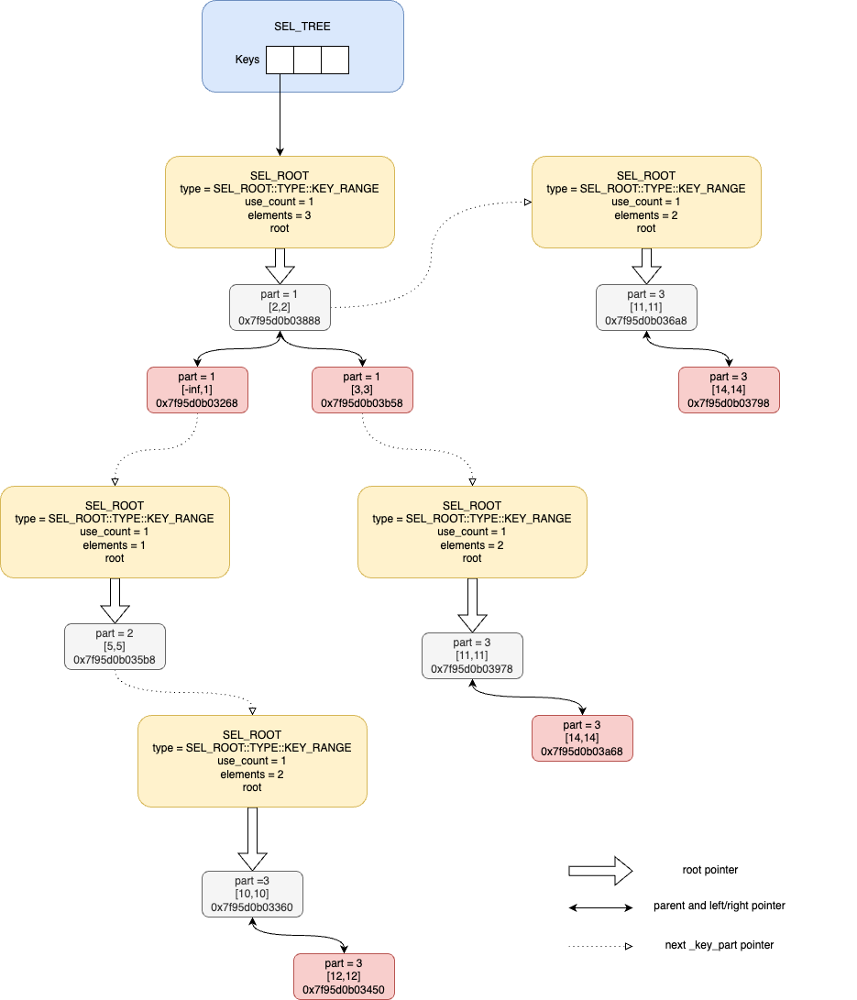

# MySQL优化器代码速览

**Date:** 2024/12
**Source:** http://mysql.taobao.org/monthly/2024/12/02/
**Images:** 6 images downloaded

---

数据库内核月报

 [
 # 数据库内核月报 － 2024 / 12
 ](/monthly/2024/12)

 * 当期文章

 AWS re:Invent2024 Aurora 发布了啥 -- DSQL 篇
* MySQL优化器代码速览
* MySQL查询优化分析 - 常见慢查问题与优化方法
* PostgreSQL 慢 SQL 优化分享
* What's new in PolarDB8.4(一) prepare once
* 白话 MySQL Online DDL 2 · 从 INT 列转 BIGINT 锁表看 MySQL DDL 执行过程

 ## MySQL优化器代码速览 
 Author: 田镜祺（缘祺） 

 MySQL的优化器实现在代码结构上比较混乱，每个阶段的界限不是特别清晰，同时，代码耦合度高，对其进行拓展和修改都难度极大。因此，对MySQL的优化器代码有一个整体上的感知是非常重要的。
本文对MySQL的优化器代码进行一个速览，本文将重点放在MySQL优化器的整体工作流程，会对每个主要步骤的作用和用到的数据结构做简要介绍但忽略其中的算法和具体实现，力求做到全但不求深，为的是能够让大家对MySQL优化器的总体工作流程有一定的理解，当遇到问题或者有功能开发需求时，能够快速定位到相应的代码模块。

一个数据库优化系统一般会顺序完成以下几个任务：

* 与数据库Catalog绑定，语义检查
* 基于规则的逻辑变形
* 基于代价的优化
* 生成物理执行计划

以下是MySQL优化器的逻辑架构图，可以发现MySQL的优化器确实顺序完成了上述提到的几个任务。



本文主要关注MySQL优化的代码结构，首先将MySQL优化器的逻辑结构和代码结构做一个对应。



从代码结构来看，优化器工作主要由两个函数构成，第一个是`Query_block::prepare()`，主要完成了Resolver和Logical Transformations的工作，第二个是`JOIN::optimize()`主要完成了CBO优化，生成物理执行计划等工作。MySQL这么划分的原因其实是prepare正好对应了PREPARE语句所需要进行的所有工作，对于普通语句，必须进行prepare -> optimize的完整流程，而对于PREPARE-EXECUTE语句，PREPARE时会执行prepare函数，而EXECUTE时只会执行optimize，不会重复prepare。
深入到`Query_block::prepare()`函数中，Resolver和Logical Transformation没有明确的分界，两者可能是交替进行的。深入到`JOIN::optimize()`函数，会首先进行些优化的前置分析，然后进行CBO的优化，Plan的Refine，生成执行计划等操作。

## Parser传递到Optimizer的主要数据结构

在一切开始前，我们需要看一下Parser完成解析后传递到Optimizer的主要数据结构，在这里我们重点介绍`Query_expression`，`Query_block`，`Item`，`Table_ref`四类。为了便于理解，我们将按照层级由下往上介绍。

### Table_ref

Table_ref最好理解，就是一条SQL中被解析为表的部分，只不过需要注意的是，`Table_ref`指的不一定是base table，也有可能是derived table，nested-join等在SQL中一切可以理解为一个表的结构。

### Item

`Item`代表了一条SQL中被解析为表达式的部分，`Item`做为基类，会向下派生出非常的子类，例如表示表中的一列会使用`Item_field`类，表示一个不等关系会使用`Item_func_ge`类，不等关系的LHS和RHS会以args的形式存储在`Item_func_ge`类中。

### Query_block

`Query_block`代表了一条完整的SELECT语句，包括所有SELECT语法中的所有子句，这些子句的parse信息与`Query_block`中的成员变量对应如下：

* SELECT：用`mem_root_deque<Item *> fields`表示，需要注意的是，在优化开始时，fields中保存的是Select list，但在优化过程中，fields中还会保存所有在join和filtering后需要用的所有fields，包括GROUP BY，ORDER BY等。用Item::hidden成员变量来区分这些fields在Select list还是其它位置。
* DISTINCT：用`m_active_options & SELECT_DISTINCT`表示，为true代表Select list有DISTINCT子句。
* WHERE：用`Item *m_where_cond`表示，WHERE子句后面的条件就是一个复杂的表达式，用Item表示即可。
* FROM：用`SQL_I_List<Table_ref> m_table_list{}`表示，FROM子句后是一些Table_ref，因此用Table_ref的侵入式链表表示。
* JOIN：JOIN的表示相对复杂，因为存在Implict Join和Explict Join两种，对于下面的SQL：
 ` SELECT * FROM t1, t2, t3 LEFT JOIN t4 ON t3.id = t4.id;
` 
 上面的SQL存在两个连接关系，分别是t3和t4的LEFT JOIN，和t1, t2, (t3 LEFT JOIN t4)的Implict Join。
 `mem_root_deque<Table_ref *> m_table_nest`表示了Query_block的最外层JOIN NEST，其中倒序保存了参与JOIN的表。
 该SQL的最外层JOIN是t1, t2, (t3 LEFT JOIN t4)的Implict Join，因此`m_table_nest`中的Table_ref为`[nest_last_join，t2，t1]`，nest_last_join是一个特殊的Table_ref，用来表示JOIN后的结果表。如果一个Table_ref是nest_last_join，那么该表的nested_join不为nullptr，并且在nested_join的`m_tables`中保存了参与JOIN的表。
* ON：用`Item* Table_ref::m_join_cond`表示，当存在t1 JOIN t2 ON join_cond时，会在t2的Table_ref上添加join_cond。
* HAVING：类似于WHERE，用`Item *m_having_cond`表示。
* ORDER BY：用`SQL_I_List<ORDER> order_list`表示，ORDER子句后面的表达式有着严格的顺序要求，因此用ORDER类包装了参与ORDER子句的表达式与ORDER的一些额外信息，并且用侵入性链表进行连接。
* GROUP BY：用`SQL_I_List<ORDER> group_list{}`表示，类似于ORDER BY。
* WINDOW：用`List<Window> m_windows;`表示，每个窗函数都会用Window类表示，多个窗函数用链表组织在一起。
* LIMIT：用`Item *select_limit`表示，也是一个表达式，
* OFFSET：用`Item *offset_limit`表示，类似于LIMIT子句。
* ROLLUP：用`olap_type olap`表示。
通过这些成员变量，能够描述一条SQL的基本结构，但仅仅有Query_block无法描述子查询，集合操作等复杂结构，因此又引入Query_expression这个更高层级的结构。

### Query_expression

`Query_expression`代表了由一组Query_block通过集合操作形成的语句，这里的集合操作有UNION，INTERSECT，EXCEPT三种。Query_expression与Query_block之间通过master，slave，next，prev指针相连来表示一个复杂的带有集合操作的嵌套SQL查询。
具体而言，这些指针的含义如下：

* Query_expression的slave指针指向一个Query_block，代表该Query_block是当前Query_expression的集合操作中的第一个SELECT语句。
* Query_expression的master指针指向一个Query_block，代表该Query_block是作为当前Query_expression的子查询存在的，
* Query_expression的next/prev指针指向一个Query_expression，代表该Query_expression和当前Query_expression是作为同一个Query_block的子查询存在的，并且在顺序上存在next/prev的关系。
* Query_block的slave指针指向一个Query_expression，代表该Query_expression是当前Query_block的第一个子查询。
* Query_block的master指针指向一个Query_expression，代表该Query_expression集合操作中的一个SELECT语句是当前Query_block。
* Query_block的next/slave指针指向一个Query_block，代表该Query_block和当前Query_block同属于一个Query_expression的集合操作，并且存在next/prev关系。

下图表示了这些指针的含义，需要注意的是，这个图并不完整，例如QB_2的master指针也会指向QE_1，QE_3肯定是还会有自己的slave的。


有了这个结构，还有两个问题没有解决：

1. 集合操作有三种，并且在一条SQL中，三种集合操作可能共存，但具体是哪种集合操作却没有表示。
2. 对于子查询而言，上述结构只能表示所属关系，但子查询出现在SQL中的位置没有表示。

#### 表示不同的集合操作

MySQL中使用`Query_term_set_op`去表示复杂的集合操作，整个原理也很简单，例如对于UNION操作，只需要给定这个集合操作的SELECT语句有哪些即可，对于INTERSECT，EXCEPT操作，只需要给出它的LHS和RHS即可，我们以一个实际例子来说明：

`(
 (SELECT * FROM t1 UNION SELECT * FROM t2 UNION ALL SELECT * FROM t3 ORDER BY a LIMIT 5) 
 INTERSECT
 (
 (
 (SELECT * FROM t4 ORDER BY a LIMIT 4)
 ) 
 EXCEPT
 SELECT * FROM t5
 )
 ORDER BY a LIMIT 4
) ORDER BY -a LIMIT 3;
`

SQL看着很长，但其实就是一个Query_expression下包含了五个Query_block，这五个Query_block组成了复杂的集合关系，转换为Query_term_set_op组成的数据结构如下：


看这个图就非常清晰了，首先是t1，t2，t3三个表做UNION，做完UNION后根据a排序，并且只取五条数据，然后t4和t5的结果做EXCEPT，最后将UNION结果和EXCEPT结果做INTERSECT，并且按照a排序，取四条数据，最后将整个结果再按照-a排序，只取三条数据。
而最顶层的`Query_term_set_op`会保存Query_expression的成员变量`Query_term *m_query_term`中。

#### 表示子查询

子查询的表示相对简单，对于一个Query_expression，如果它是一个Query_block的子查询，那么其实只需要说明它在Query_block中的位置，例如对于出现在FROM子句后的子查询，那么这个子查询所代表的一定是个派生表，用Query_expression的成员变量`Table_ref *derived_table`标记，如果这个子查询出现SELECT，WHERE等后面，那么所代表的一定是一个Item，用`Item_subselect *item`标记。相应的，Table_ref，Item_subselect中也会有对应指针指向这个Query_expression，以这种形式完成了对子查询的表示。

在介绍完Parser传递给Optimizer的主要数据结构后，就正式开始优化过程，优化过程的入口是对最外层Query_expression调用prepare函数，Query_expression会对所有它的所有slave调用prepare函数，并且处理集合操作。在prepare结束后，会对最外层的Query_expression调用optimize函数，同样的，也会对它的所有slave调用optimize函数。
由于Resolver和Logical Transformation的主要逻辑几乎都在`Query_block::prepare()`函数中，因此，我们就重点介绍该函数。

## 调用`Query_block::prepare()`

在MySQL中，Resolver过程和逻辑变形过程耦合在了函数`Query_block::prepare()`函数中，`Query_block::prepare()`函数可以被认为是优化过程的开始。
以下来介绍`Query_block::prepare()`函数的大致流程：

### 传递nullability

通过调用`propagate_nullability()`来完成，当一个表可能包含全为NULL的行时，这个表被称为nullable。当一个表是OUTER JOIN的内表时，会将这个表标记为nullable，并且向内传递。

### 解析占位符表

通过调用Query_block::resolve_placeholder_tables()来完成，在m_table_list中，有一部分表是base table，但也有一部分表是派生表，视图或者Table Function，在这个函数中，负责对这些表进行解析。如果一个表是派生表或者视图，那么还会对代表这个派生表的Query_expression执行prepare函数。
对这些表的处理有两种方案，第一种是derived_merge，会消除子查询，将这些表合并到外层的Query_block中，第二种是materialized，会真正地创建临时表，并且子查询/视图/Table Function的结果存储到这个临时表中。
优化器会优先考虑derived_merge策略，如果不满足derived_merge的条件，才会考虑进行materialized。

### 解析*符号

通过调用`Query_block::setup_wild()`函数完成，遍历fields，如果该fields是一个*符号，则将其展开。

### 建立base_ref_items

通过调用`setup_base_ref_items()`完成，该函数初始化了Ref_item_array base_ref_items对象，该对象可以理解为一个Item *类型的数组，在解析过程中的Item都会在base_ref_items中记录方便引用。

### 解析所有fields

通过调用`setup_fields()`此时fields中还只包含Select list，对所有fields与数据库的元信息进行绑定，绑定通过调用`fix_fields()`实现。

### 解析所有WHERE和JOIN条件

通过调用`Query_block::setup_conds()`实现，该函数首先对`m_where_cond`进行绑定，然后对`m_table_nest`进行深度优先遍历来对所有Join条件进行绑定。

### 解析GROUP BY

通过调用`Query_block::setup_group()`实现，该函数遍历group_list，对每个表达式进行绑定，在Select list和FROM后的表中搜索是否存在对应的列，判断是否是合法的GROUP BY语句。

### 解析HAVING

通过对`m_having_cond`调用`fix_fields()`实现。

### 解析ROLLUP

通过调用`resolve_rollup()`来实现。

### 解析ORDER BY

通过调用`setup_order()`实现，该函数会遍历`order_list`，对每个表达式进行绑定。

### 解析LIMIT和OFFSET

通过调用`Query_block::resolve_limits()`来完成，在该函数中，相继对`offset_limit`和`select_limit`调用fix_fields()。

### 移除子查询中的冗余子句

通过调用`Query_block::remove_redundant_subquery_clauses()`来完成，在子查询中，ORDER BY，GROUP BY，DISTINCT这三类子句在一些情况下不会影响查询结果，因此可以去除。

### 解析WINDOWS

通过调用`Window::setup_windows1()`来完成，在该函数中，遍历`m_windows`进行解析。

### 尝试移除DISTINCT

通过调用`can_skip_distinct()`和`remove_base_options()`来完成，如果存在GROUP BY子句，并且GROUP BY子句后的所有Item都出现在了Select list后，就可以去掉DISTINCT子句。

### 解析IN/=ANY，EXISTS子查询

通过调用`Query_block::resolve_subquery()`来完成，在该函数中，会对IN/=ANY，EXISTS子查询检查能否应用semijoin优化，如果不能，再判断能否使用subquery_to_derived优化，选择的优化策略保存在`Subquery_strategy Item_exists_subselect::strategy`成员变量中。
该函数不会做逻辑变形也不会做绑定操作（绑定操作在之间的`setup_cond()`函数中已经完成），只是对每个子查询判断能否成为semijoin/subquery_to_derived优化策略的候选，`Mem_root_array<Item_exists_subselect *> *sj_candidates{nullptr}`是Query_block中用来记录候选子查询的数组。

### 标量子查询转换为派生表

通过调用`Query_block::transform_scalar_subqueries_to_join_with_derived()`完成，该函数会从WHERE，ON，HAVING，SELECT后搜集标量子查询，然后尝试将标量子查询转换为派生表。

### 解析全文索引函数

通过调用`setup_ftfuncs()`函数完成，该函数会遍历`List<Item_func_match> *ftfunc_list`，对每个Item_func_match进行绑定。

### 子查询解嵌套

通过调用`Query_block::flatten_subquerie()`函数来完成，该函数会对`Query_block::resolve_subquery()`中得到的sj_candidates尝试进行解嵌套，首先进行subquery_to_derived优化，然后进行semijoin优化。

### 进行local变形

通过调用`Query_block::apply_local_transforms()`来完成，local意味着变形只在当前Query_block进行，不会进行Query_block之间的变形。该函数只会在最外层的Query_block进行调用，首先遍历自身所有的子查询，然后对每个子查询按照后序的方式遍历所有参与集合操作的SELECT语句，对这些语句递归调用apply_local_transforms()函数。
该函数主要进行了以下操作：

* `simplify_joins()`：外连接转换为内连接
* `prune_partitions()`：基于给定的条件对分区表的分区进行剪枝
* `push_conditions_to_derived_tables()`：将条件下推到派生表

### 消除没有用到的窗函数

通过调用`Window::eliminate_unused_objects()`来完成

## 调用`JOIN::optimize()`

Query_expression和Query_block是prepare过程用到的数据结构，所有的逻辑变形，绑定操作，都是对这两个数据结构进行的，而在optimize过程，可能会修改WHERE条件等，显然是不能直接在Query_expression和Query_block等结构体上直接操作的，因此需要一个数据结构来记录optimize过程产生的操作。`Query_block::optimize()`函数中，会首先创建一个JOIN对象，将自身的信息传递给optimize对象，并且优化过程也交给JOIN对象，以此来做到prepare和optimize的隔离。
JOIN类主要保存了两类数据：
第一类是直接从Query_block中获取到的fields，m_windows，order_list，group_list等数据。
第二类是优化过程需要用的额外的数据结构。

optimize的主要过程都在`Query_block::optimize()`函数中，按照逻辑可以分为Initail Analysis for Optimization，Cost-based Optimization，Plan Refinement三个阶段，如果对应到代码逻辑，可以分别对应为调用`JOIN::make_join_plan()`前，调用`JOIN::make_join_plan()`，调用`JOIN::make_join_plan()`后。

### 调用`JOIN::make_join_plan()`前

#### 统计临时表的fields信息

通过调用`count_field_types()`来完成，一个JOIN的结果是可能会被物化成临时表的，JOIN的成员变量`Temp_table_param tmp_table_param`记录了物化成的临时表的信息，该函数会遍历fields进行统计。

#### 获取一份WHERE/HAVING/ON的一次性副本

通过调用`Query_block::get_optimizable_conditions()`来完成，如果这条语句是PREPARE-EXECUTE方式触发的执行语句，那么优化过程是不能更改Query_block和Query_expression中的成员变量的，因为这个prepare好的Query_block和Query_expression会被后面的EXECUTE语句一直复用，所以在这里需要在JOIN中的复制一份一次性副本，JOIN可以进行任意修改而不影响Query_block和Query_expression。

#### 对生成派生表的Query_expression进行optimize

对每个表判断是否是派生表，如果是派生表，通过调用`Table_ref::optimize_derived()`来实现，该函数首先会对派生表的Query_expression调用`Query_expression::optimize()`，然后判断生成的派生表是否是const的，如果是，提前创建物化表并且物化，如果不是，那物化过程在迭代器中正常进行。

#### Zero Limit优化

如果发现当前JOIN只会返回零行，那么提前调用`JOIN::create_access_paths_for_zero_rows()`创建AccessPath，跳过剩余优化步骤。

#### WHERE优化

对WHERE后的条件进行等值传播，常量传播，平凡条件消除三个优化。

#### Impossible WHERE优化

如果发现优化后的WHERE是Impossible的条件，那么不会返回任何数据，调用`JOIN::create_access_paths_for_zero_rows()`创建AccessPath即可。

#### HAVING优化

对HAVING后的条件进行等值传播，常量传播，平凡条件消除三个优化。

#### Impossible HAVING

如果发现优化后的HAVING是Impossible的条件，那么不会返回任何数据，调用`JOIN::create_access_paths_for_zero_rows()`创建AccessPath即可。

#### 聚合优化

如果存在不带GROUP BY子句的隐式聚合，可能可以在优化阶段就完成聚合，并且用常量进行代替。例如，对于MIN/MAX，可能可以通过`ha_index_first()/ha_index_last()`的方式以O(1)复杂度完成。
优化后可能JOIN已经执行完成，此时可以直接返回。

#### 生成列替代

通过调用`substitute_gc()`来完成，SQL中可能包含一些完全等价于生成列的表达式，并且表中可能为这些生成列创建过索引，因此可以将这些表达式直接替换为生成列。

### 调用`JOIN::make_join_plan()`

`JOIN::make_join_plan()`是一个完整的生成Join Order的过程

#### 初始化相关变量

通过调用`JOIN::init_planner_arrays()`函数完成，该函数中初始化了`JOIN_TAB *join_tab`数组，`JOIN_TAB **best_ref`数组，`POSITION *positions`数组，`POSITION *best_positions`数组，`JOIN_TAB **map2table`数组。

* 初始化`JOIN_TAB *join_tab`数组，通过调用`alloc_jtab_array()`函数完成，创建一个等同于Query_block的`leaf_table_count`数量的JOIN_TAB数组。JOIN_TAB类中的`Table_ref *table_ref`指针指向了它对应的Table_ref对象，它额外包含了所有在`make_join_plan()`过程中计算得到的与该Table_ref相关的变量，例如，用于分析ref用到的Keyuse数组，表示表之间依赖关系的table_map变量等。
* 初始化`JOIN_TAB **best_ref`数组，该数组是一个指针数组，代表了当前得到的最好的Partial Join order，index代表了在Join order中序号，值是一个JOIN_TAB指针。
* 初始化`JOIN_TAB **map2table`数组，该数组是一个指针数组，代表了table no和JOIN_TAB之间的对应关系，index代表了table no，值是一个JOIN_TAB指针。
* 初始化`POSITION *positions`数组，该数组是一个POSITION数组，每个POSITION对象中代表了在Join order中的table，里面记录了优化过程中状态信息，例如rowcount，cost，semijoin相关信息等。该数组index代表了Join order中的序号，值是一个POSITION对象。
* 初始化`POSITION *best_positions`数组，该数组是一个POSITION数组，代表了优化过程产生的最终Join order。
除此之外，这些数组的大小其实都是不尽相同，用下面表格来整理：

 index含义
 大小

 JOIN_TAB *join_tab
 在Query_block的leaf_tables中序号
 leaf_table_count

 JOIN_TAB **best_ref
 在当前部分查询计划中，Join order的序号
 leaf_table_count + sj_nests + 2 + m_windows.elements

 POSITION *positions
 在当前部分查询计划中，Join order的序号
 leaf_table_count

 POSITION *best_positions
 在当前找到的最优执行计划中，Join order的序号
 table_count + sj_nests

 JOIN_TAB **map2table
 table no
 table_count + sj_nests

我们发现一个有意思的现象，positions，best_position，best_ref三者的大小是逐渐递增的，这其实是因为在Join reorder算法进行时，只需要考虑leaf_tables，也就是FROM子句后的表，但同时也会根据Join order结果考虑semijoin策略，策略可能是Materialized，而Materialized策略需要额外地创建JOIN_TAB和POSITION，因此在Join reorder算法完成后，semijoin策略确定后，positions可能会需要拓展，最多拓展sj_nests（semijoin的数量）个。所以，best_positions的数组大小需要比positions大sj_nests。考虑完semijoin之后，还需要考虑由于GROUP BY/ORDER BY/DISTINCT/WINDOWS带来的临时表，而一个Query_block中，最多创建2 + 窗函数数量的临时表，因此best_ref又在positions基础上加了2 + m_windows.elements，而这些临时表根本没有参与Join reorder算法，只是在JOIN子句完成后才会物化，因此没必要为其创建POSITION对象，但必须创建Table_ref对象，也就必须创建JOIN_TAB对象加入到best_ref中，最后用best_ref去生成物理执行计划。

#### 依赖性传播

通过调用`JOIN::propagate_dependencies()`完成，构建JOIN_TAB之间的依赖性，能够加速外连接的Join order枚举，并且能够捕捉到不合理的交叉引用（出现在recursive cte中）。

#### 更新所有表的keyuse数组

通过调用`update_ref_and_keys()`完成，该函数会根据WHERE子句和ON子句中的等值条件构造出一个Key_field对象，根据非常量的不等值条件构造出一个`SARGABLE_PARAM`对象，同时更新possible_keys。除此之外，如果表是派生表，还会通过调用派生表的`Table_ref::update_derived_keys()`函数来更新派生表的derived_key_list，然后调用`JOIN::generate_derived_keys()`函数为派生表的TABLE和TABLE_SHARE结构体上创建KEY，需要注意的是，此时派生表还没有物化，这些KEY也不是都会被使用，在后面会将不使用的KEY进行删除。

可以认为Key_field对象只代表了一条等值条件，但这个等值条件能被哪个索引使用还不清楚，因此，需要使用Key_field对象来构建Key_use_array，Key_field与Key_use之间是一对多的关系。
最后，对Key_use_array排序后进行两个简化

* 两个Key_use是同一个key和同一个keypart，但一个引用了常量，另一个是非常量，此时会把常量舍去
* 删除没有完整前缀的Key_use

#### 利用函数依赖性解除semijoin

通过调用`pull_out_semijoin_tables()`完成，该函数会判断参与semijoin的外表和内表之间是否存在函数依赖关系，如果存在，可以把semijion转换为普通的inner join进行执行。

#### 读const表

通过调用`JOIN::extract_const_tables()`完成，该函数会判断一个表是否是const表，如果是，会调用`join_read_const_table()`函数对const表进行读取。

#### 读函数性依赖常量的表

通过调用`JOIN::extract_func_dependent_tables()`完成，该函数会判断一个表是否函数性依赖一个常量，如果是，会调用`join_read_const_table()`函数对这些表进行读取。

到这一步，就完成了所有const表的处理，const表永远排在Join order的最前面，也不会参与Join reorder算法。

#### 更新sargable

通过调用`JOIN::update_sargable_from_const()`来完成，在读取了const表后，原先的sargable也需要进行些更新，该函数会判断sargable中的哪些值经过读取const表后转换为了常量，如果一个sargable的所有arg_value都变为了常量，并且存在以该sargable的field开头的Key，就把它加入到possible_keys中。

#### 单表行数估计

通过调用`JOIN::estimate_rowcount()`完成，该函数会针对每个参与Join的单表计算 读const表，全表扫描，覆盖索引扫描，索引范围扫描，skip scan，index merge等多种AccessPath的代价和估计的输出行数。
在行数估计过程中，会把一个复杂的WHERE条件用SEL_TREE结构来表示。SEL_TREE是可以简单理解为一个多个红黑树构成的森林，一个key_part上的所有不相邻区间按照顺序表示为一个红黑树，不同的key_part按照在Key中顺序关系通过next_key_part指针相连，以下面的SQL和图为例：

`SELECT *
FROM t1
WHERE (kp1 < 1
 AND kp2 = 5
 AND (kp3 = 10
 OR kp3 = 12))
 OR (kp1 = 2
 AND (kp3 = 11
 OR kp3 = 14))
 OR (kp1 = 3
 AND (kp3 = 11
 OR kp3 = 14));
`



该函数会根据代价选择出最佳的单表AccessPath，但会把所有计算了代价的索引的估计输出行数保存在quick_rows中，用在后续的ref行数估计中。

#### 计算semijoin采取物化策略时的Join order

通过调用`optimize_semijoin_nests_for_materialization()`完成，semijoin的内表可能也是由多个表通过join连接得到的，这些表同样存在join order的问题，在该函数中，会对所有可能采用物化策略的semijoin计算一个sub Join order（这个join order只包括参与semijion的内表）。

#### 执行Join reorder算法

通过调用`Optimize_table_order::choose_table_order()`完成，该函数会枚举不同的Join order并且分别计算代价，最后选择出一个最佳Join order以及在该Join order下所有表的最佳AccessPath。在计算Join order过程中，如果有semijoin，还会根据当前的Join order来判断可以使用semijoin策略，并计算使用这些策略的代价以选择最优的semijoin策略。在这步完成后，在best_positions中会记录搜索到的最优执行计划的行数估计，cost等信息，best_ref数组中会保留最优执行计划中对应的JOIN_TAB，由于此时只是选定了semijoin策略，但还没有创建任何临时表，也没有创建JOIN_TAB结构体，因此best_positions和best_ref中元素数量还只是leaf_table_counts。

#### 决定子查询的策略

通过调用`JOIN::decide_subquery_strategy()`完成，这里的子查询指的是那些不应用semijoin和subquery_to_derived优化的子查询，对于subquery_to_derived优化的子查询，已经在prepare阶段通过Query_block的变形变成了Join，对于semijoin优化的子查询，在前面的步骤中也已经决定了semijoin策略，而对于不应用这两种优化的子查询也还有两种执行方式，一种是依赖子查询，即每次都重新执行一遍子查询，另一种是物化，即第一次执行子查询时进行一次物化，之后都直接读这个被物化了的表。虽然这里都叫做物化，但semijion的物化，subquery_to_derived的物化，子查询的物化，三种方式是不同的，所生成的执行计划也是不同的。

以下面SQL为例：

`select * from t1 where t1.col1 in (select col1 from t2);
`

```
# 使用semijoin的materialization（t2去重后的表直接作为Join的表）
| -> Inner hash join (t1.col1 = `<subquery2>`.col1)
 -> Table scan on t1
 -> Hash
 -> Table scan on <subquery2>
 -> Materialize with deduplication
 -> Filter: (t2.col1 is not null)
 -> Table scan on t2

# 使用subquery_to_derived（t2表先去重，用到临时表，然后再物化，再Join）
| -> Inner hash join (t1.col1 = derived_1_2.Name_exp_1)
 -> Table scan on t1
 -> Hash
 -> Table scan on derived_1_2
 -> Materialize
 -> Table scan on <temporary>
 -> Temporary table with deduplication 
 -> Table scan on t2 (cost=0.35 rows=1)

# 使用子查询的物化（t2表去重，每次评估是否满足WHERE条件时，去执行Index loopup
| -> Filter: <in_optimizer>(t1.col1,t1.col1 in (select #2)) 
 -> Table scan on t1
 -> Select #2 (subquery in condition; run only once)
 -> Filter: ((t1.col1 = `<materialized_subquery>`.col1)) 
 -> Limit: 1 row(s)
 -> Index lookup on <materialized_subquery> using <auto_distinct_key> (col1=t1.col1)
 -> Materialize with deduplication 
 -> Table scan on t2 (cost=0.35 rows=1)

```

#### 为所有临时表创建JOIN_TAB，实际创建semijoin的物化表，并且更新best_positions和best_ref

通过调用`JOIN::get_best_combination()`函数来完成，该函数会统计采用了物化策略的semijoin个数记为sjm_nests，然后创建`sjm_nests + 2 + m_windows.element`个JOIN_TAB对象，并且会实际创建代表物化表的TABLE和TABLE_SHARE，并且更新best_ref和best_position，在这步操作完成后，就只剩执行过程中用来处理GROUP/ORDER/DISTINCT/WINDOWS的临时表还没有创建（但他们的JOIN_TAB对象已经被创建出来了，但还没有填入任何有效信息）。

#### 删除派生表中所有不需要的key

通过调用`JOIN::finalize_derived_keys()`函数来完成，在更新所有表的keyuse数组时，会为派生表创建多个索引，但经过Join reorder算法，已经确认了每个派生表要选择什么AccessPath，也就确认了要使用哪个索引，此时没有使用到的索引是可以删除的，该函数就针对派生表上建立的没有使用的索引进行删除工作。

到此，`JOIN::make_join_plan()`函数的主要逻辑基本完成，该函数结束后，确定所有表的AccessPath以及他们的Join order，但离完整的执行计划还差对于GROUP/ORDER/DISTINCT/WINDOWS子句执行时需要的临时表信息。

### 调用JOIN::make_join_plan()后

#### 初始化ref access

通过调用`JOIN::init_ref_access()`来完成，当一个表在Join order中是以ref的方式进行获取数据的时候，需要为这个表创建Index_lookup结构体，该结构体记录了用于ref的完整信息，并将作为参数传递给Iterator。

#### 为每个表attach condition以及重新考虑索引选择

通过调用`make_join_query_block()`来完成，该函数主要完成两个工作，第一个是为每个表attach condition，这个condition是当从这个表读完数据后能立马进行评估的condition，第二个是为每个表重新考虑索引选择，在两种情况下会重新考虑索引选择，第一种是NOT_FIRST_TABLE，当一个表不是Join order的第一个表时，它可能会由于某些依赖的值已经从驱动表中读完而能够使用某些索引。第二种是LOW_LIMIT，当一个表存在LIMIT子句时，意味着并不需要把所有数据读完，此时可能可以选择一些其它索引更快的找到满足条件的LIMIT条数据。

#### Impossible WHERE

在`make_join_plan()`中，会读const表，因此WHERE条件中一些值变为常量可能再次导致Impossible WHERE。

#### 优化DISTINCT/GROUP/ORDER

通过调用`JOIN::optimize_distinct_group_order()`来完成， 该函数主要通过表的索引特性来判断是否去去除DISTINCT/GROUP/OREDR子句，例如当Select list包含一个unique key的所有key part时，那么DISTINCT就可以去除。

#### Impossible HAVING

在`make_join_plan()`中，会读const表，因此HAVING条件中一些值变为常量可能再次导致Impossible HAVING。

#### 判断在窗函数前是否需要临时表

根据GROUP/ORDER/DISTINCT等子句的情况来判断窗函数前是否需要创建临时表。

#### 创建QEP_TAB数组

通过调用`alloc_qep()`函数来完成，该函数会为每个best_ref中的每个JOIN_TAB都创建一个QEP_TAB对象。JOIN_TAB可以理解为是`JOIN::make_join_plan()`过程中对每个表的抽象，而QEP_TAB实在生成执行器时对每个表的抽象。在创建完QEP_TAB后，会通过`QEP_TAB::init(JOIN_TAB *jt)`函数来将JOIN_TAB中需要共享的数据传递给QEP_TAB。其实，JOIN_TAB和QEP_TAB都继承了`QEP_shared_owner`，只不过他们额外保存了在各自阶段所需的对表的信息。

#### 判断能够跳过ORDER

通过调用`test_skip_sort()`函数来完成，该函数会判断能否利用索引有序性去除ORDER BY子句。

#### 最终确定每个表的condition

通过调用`JOIN::finalize_table_conditions()`函数来完成，该函数会最终确定每个表的condition，并且做冗余的去除和常量的缓存。

#### 设置执行器的一些信息

通过调用`make_join_readinfo()`函数来完成，该函数会开始设置实际执行一些必要信息，例如semjoin的执行信息，是否要是Join Buffer，是否使用Index Condition PushDown等。

#### 设置临时表信息

通过调用`JOIN::make_tmp_tables_info()`函数来完成，对于子查询产生的临时表，其实都已经在前面步骤中设置完成并且创建了，但对于DISTINCT/GROUP/ORDER/WINDOWS等子句所需的临时表还没有创建，在这个函数中进行了创建，并且将其加入到QEP_TAB数组的合适位置。

#### 生成总的AccessPath

通过调用`JOIN::create_access_paths()`函数来完成，在优化的最后，会根据QEP_TAB数组中保存的信息生成这个JOIN的m_root_access_path，AccessPath和Iterator之间的关系基本是一一对应的，到这一步，基本可以认为优化器的工作已经做完，生成了执行器。

## 总结

MySQL的优化器的原理还是较为复杂的，而且由于MySQL的优化是以Query_block为一个最小单位进行的，没有首先抽象出Logcial Operator Tree，因此各个优化过程耦合度极高，并且伴随着多年演进，优化器逻辑也逐渐复杂，本文也不能涵盖MySQL优化器的所有逻辑，只是选择出了其中最常命中的逻辑进行介绍，如有错漏之处，欢迎大家指出。

 阅读： - 

[](http://creativecommons.org/licenses/by-nc-sa/3.0/)
本作品采用[知识共享署名-非商业性使用-相同方式共享 3.0 未本地化版本许可协议](http://creativecommons.org/licenses/by-nc-sa/3.0/)进行许可。

 [

 ](#0)