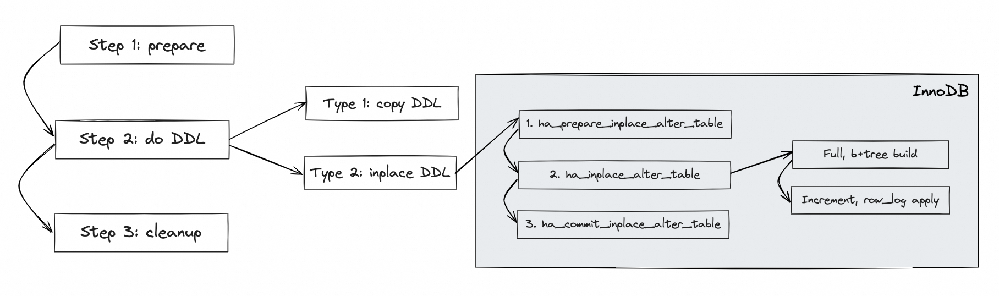
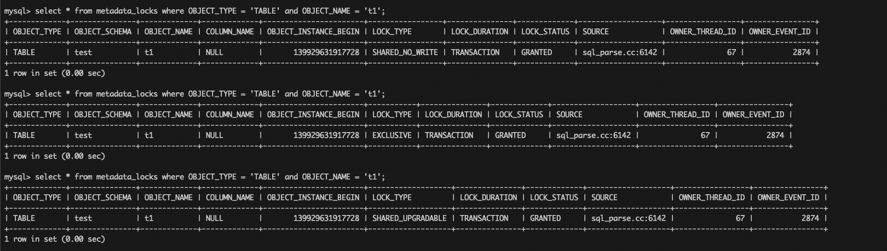
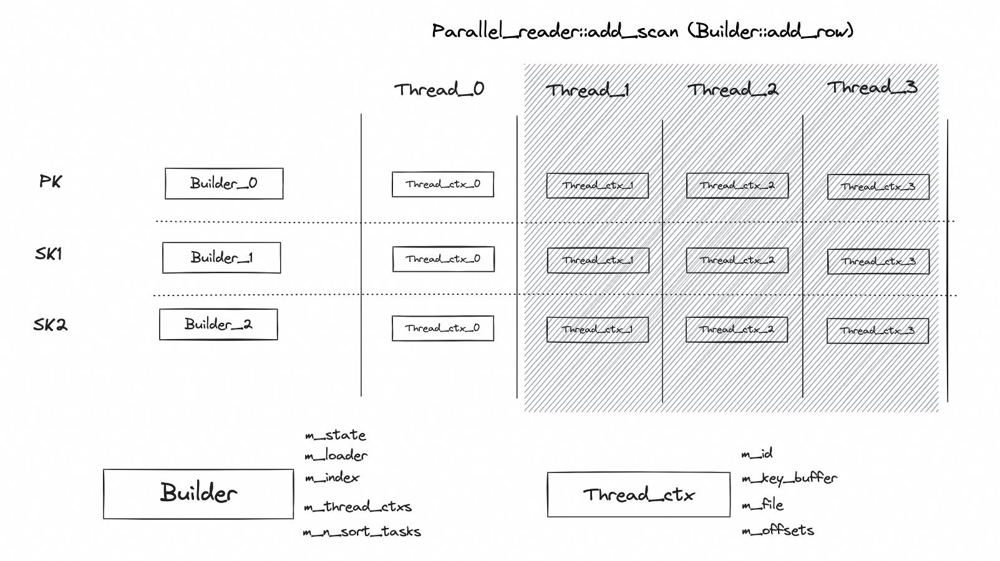
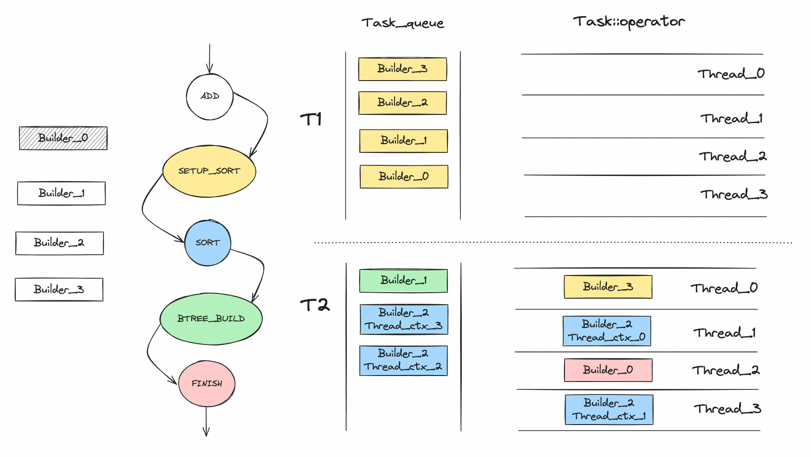

# 白话 MySQL Online DDL 2 · 从 INT 列转 BIGINT 锁表看 MySQL DDL 执行过程

**Date:** 2024/12
**Source:** http://mysql.taobao.org/monthly/2024/12/06/
**Images:** 5 images downloaded

---

数据库内核月报

 [
 # 数据库内核月报 － 2024 / 12
 ](/monthly/2024/12)

 * 当期文章

 AWS re:Invent2024 Aurora 发布了啥 -- DSQL 篇
* MySQL优化器代码速览
* MySQL查询优化分析 - 常见慢查问题与优化方法
* PostgreSQL 慢 SQL 优化分享
* What's new in PolarDB8.4(一) prepare once
* 白话 MySQL Online DDL 2 · 从 INT 列转 BIGINT 锁表看 MySQL DDL 执行过程

 ## 白话 MySQL Online DDL 2 · 从 INT 列转 BIGINT 锁表看 MySQL DDL 执行过程 
 Author: 翊云 

 ## 背景
笔者在几年前整理过一篇文章，介绍了 MySQL 当前 DDL 的能力情况（[白话Online DDL](http://mysql.taobao.org/monthly/2021/03/06/)）。之前的文章重点介绍了 MySQL 5.6、5.7 到 8.0 的 DDL 能力对比并且解释了几个 DDL 常见的问题，并没有从代码层面分析 MySQL DDL 的执行过程。最近笔者遇到有个客户询问“MySQL 的 INT 列转为 BIGINT 会不会锁表？”笔者看了下之前的文档发现，MySQL 当前在处理所有的列类型转换的时候都只能走 Copy DDL，所以 INT 列转为 BIGINT 肯定是需要锁表的。但是这听起来又很不合理，从 INT 列转为 BIGINT 的过程中其实完全不存在任何数据不兼容的问题，为什么 MySQL 还是要锁表？带着这个问题，笔者重新整理了 MyQSL DDL 的执行过程，本文将从代码层面分析 MySQL DDL 的执行过程，并试着解决 INT 列转为 BIGINT 锁表的问题。

## DDL 整体执行过程
在介绍 DDL 的执行细节前，先对 DDL 的整体执行过程做一个总结：



上图是 MySQL InnoDB 表（本文后续内容也都是基于 InnoDB 表） DDL 的一个整体过程，DDL 的处理过程会贯穿 Server 层和 Engine 层。Server 层会串联起整个 DDL 的基本步骤，大体可以分为三个阶段：

1. 准备阶段，DDL 前的准备工作。
2. 执行阶段，DDL 的执行过程。按照执行逻辑分类，MySQL DDL 的执行过程分为 Copy DDL 和 Inplace DDL 两类，8.0 新支持的 Instant DDL 也划分到 Inplace DDL 中。如果是 Copy DDL，直接在 Server 层完成；如果是 Inplace DDL，需要进入 InnoDB 层执行。InnoDB 层的执行逻辑同样也会分为三个阶段，此处先有个印象，后面再做展开。
3. 收尾阶段，DDL 后的清理工作。

本文后续内容主要基于上述内容进行展开。本文只要以 MySQL 8.0.36 代码为基础，部分和 5.7 版本差别很大的地方，会对比一下 5.7 和 8.0 版本的实现差异。

## Server 层 DDL 过程
前面提到 Server 层定义了整个 DDL 的执行过程，所以先对 Server 层 DDL 的过程进行介绍，主要代码路径如下：

`|--> mysql_alter_table
| |--> // Step 1: prepare
| |--> open_tables // 打开表
| |
| |--> mysql_prepare_alter_table
| |
| |--> fill_alter_inplace_info // 填充 handler_flags
| |
| |--> table->file->check_if_supported_inplace_alter // 调用 handler 接口判断是否支持 inplace DDL
| |
| |--> // Step 2: do DDL
| |--> // Type 2: Inplace DDL
| |--> mysql_inplace_alter_table
| | |--> // 1.
| | |--> ha_prepare_inplace_alter_table
| | |--> // 2.
| | |--> ha_inplace_alter_table
| | |--> // 3.
| | |--> ha_commit_inplace_alter_table
| |
| |--> // Type 1: Copy DDL
| |--> upgrade_shared_lock // MDL 锁升级为 MDL_SHARED_NO_WRITE
| |--> ha_create_table // tmp
| |--> open_table_uncached // tmp
| |--> lock_tables
| |
| |--> copy_data_between_tables
| |
| |--> close_temporary_table
| |--> wait_while_table_is_used
| | |--> upgrade_shared_lock // MDL 锁升级为 MDL_EXCLUSIVE
| | |--> tdc_remove_table
| | |--> table->file->ha_extra(HA_EXTRA_PREPARE_FOR_RENAME)
| |--> close_all_tables_for_name
| |--> mysql_rename_table // old name --> backup name
| |--> thd->dd_client()->store(non_dd_table_def.get())
| |--> mysql_rename_table // tmp name --> old name
| |--> quick_rm_table // backup name
| |
| |--> // Step 3: cleanup
| |--> ha_binlog_log_query
| |--> write_bin_log // 记录 binlog
| |
| |--> trans_commit_stmt // 事务提交
| |--> post_ddl // post_ddl 处理
| |
| |--> open_table(thd, &table_list_reopen, &ot_ctx) // 重新打开表
| |--> close_thread_table
`

Server 层的 DDL 处理过程可以分为以下几个阶段：

1. 阶段一：准备阶段，DDL 前的准备工作，包括打开表（加 MDL 锁），根据 DDL 的类型填充 handler_flags 信息，调用 handler 接口（check_if_supported_inplace_alter）判断是否支持 Inplace DDL 等。
2. 阶段二：执行阶段，DDL 执行过程：
 a. 如果支持 Inplace DDL ，那么进入到 mysql_inplace_alter_table 的逻辑，又会分为三个阶段，这部分后面展开；
 b. 如果不支持 Inplace DDL，那么进入到 copy DDL 的执行逻辑；
3. 阶段三：收尾阶段，DDL 后的清理工作，包括关闭临时表，重命名，记录 binlog，提交事务，post_ddl 处理等。

## Copy DDL 执行过程
Copy DDL 完全在 Server 层完成，主要代码路径如下：

`|--> copy_data_between_tables
| |--> to->file->ha_start_bulk_insert(from->file->stats.records)
| |--> to->file->ha_external_lock(thd, F_WRLCK)
| |
| |--> create_table_access_path
| |--> iterator = CreateIteratorFromAccessPath
| |
| |--> to->file->ha_extra(HA_EXTRA_BEGIN_ALTER_COPY)
| |
| |--> // loop
| |--> iterator->Read() // 从老表中按行读取数据
| |--> to->file->ha_write_row // 数据写入到临时表
| |--> // end loop
| |
| |--> to->file->ha_extra(HA_EXTRA_END_ALTER_COPY)
| |
| |--> to->file->ha_external_lock(thd, F_UNLCK)
`

Copy DDL 的核心就是通过 Handler 接口从老表中按行读取数据，然后将数据写入到临时表中。前面的代码中有提到，在进行数据拷贝前，已经对老表上的 MDL 锁进行了升级，MDL 锁升级为 MDL_SHARED_NO_WRITE（可读不可写），所以整个数据拷贝的过程是安全的。

## Inplace DDL 执行过程
Inplace DDL 的主要逻辑由 mysql_inplace_alter_table 实现，内部将 Inplace DDL 的过程又切分为三个阶段，主要代码路径如下：

`|--> mysql_inplace_alter_table
| |--> upgrade_shared_lock // MDL 锁升级为 MDL_EXCLUSIVE
| |--> lock_tables
| |
| |--> // 1.
| |--> ha_prepare_inplace_alter_table
| |--> table->mdl_ticket->downgrade_lock(MDL_SHARED_UPGRADABLE) // MDL 锁降级为 MDL_SHARED_UPGRADABLE
| |
| |--> // 2.
| |--> ha_inplace_alter_table
| |--> wait_while_table_is_used
| | |--> upgrade_shared_lock // MDL 锁升级为 MDL_EXCLUSIVE
| | |--> tdc_remove_table
| | |--> table->file->ha_extra(HA_EXTRA_PREPARE_FOR_RENAME)
| |
| |--> // 3.
| |--> ha_commit_inplace_alter_table
| |
| |--> close_all_tables_for_name
| |--> close_temporary_table
| |--> thd->dd_client()->drop(table_def)
| |--> thd->dd_client()->store(altered_table_def)
| |
| |--> ha_binlog_log_query
| |--> write_bin_log // 记录 binlog
| |
| |--> trans_commit_stmt // 事务提交
| |--> post_ddl // post_ddl 处理
| |
| |--> open_table(thd, &new_table_list, &ot_ctx) // 重新打开表
| |--> close_thread_table
`

Inplace DDL 的实际工作在 Engine 层完成，Server 层定义的 Hanlder 接口如下（后面会对每个接口的实现展开进行说明）：

1. ha_prepare_inplace_alter_table
2. ha_inplace_alter_table
3. ha_commit_inplace_alter_table

在之前白话 Online DDL 的文章（白话Online DDL）中，有一个很重要的问题是“Online DDL 会不会锁表”，当时有说过会在 DDL 的开始阶段和结束阶段持有 MDL X 锁，这里就可以展开说了。开始阶段和结束阶段分别指的就是 ha_prepare_inplace_alter_table 接口调用前，和 ha_commit_inplace_alter_table 接口调用前。从上面的代码可以看到，在上述接口调用前都会对 MDL 锁进行升级，MDL 锁会升级为 MDL_EXCLUSIVE（X 锁，不允许读写），执行完 ha_prepare_inplace_alter_table 后会将 MDL 锁降级为 MDL_SHARED_UPGRADABLE（允许读写），然后再进入到 ha_inplace_alter_table 进行真正的数据操作。执行完 ha_commit_inplace_alter_table 后不需要再对 MDL 锁进行降级，因为此时 DDL 已经快要执行完了，后面在事务提交的时候直接释放 MDL 锁了。



注意：关于 MDL 锁的升降级过程，可以通过 performance_schema.metadata_locks 表进行查看，但是社区的版本存在缺陷，升级级后锁类型没有更新，导致显示错误，笔者进行了修复（https://bugs.mysql.com/bug.php?id=116625）。

### ha_prepare_inplace_alter_table
本阶段的主要目的是生成 InnoDB 层的 dict_table_t 对象，创建 IBD 文件，生成 B+tree。主要代码路径如下：

`|--> ha_innobase::prepare_inplace_alter_table
| |--> prepare_inplace_alter_table_impl
| | |--> is_instant
| | |--> innobase_support_instant // 判断是否支持 Instant DDL
| | |
| | |--> innobase_index_name_is_reserved
| | |--> innobase_check_index_keys
| | |
| | |--> ha_innobase_inplace_ctx
| | |--> prepare_inplace_alter_table_dict
| | | |--> trx_start_if_not_started_xa(ctx->prebuilt->trx, true, UT_LOCATION_HERE)
| | | |
| | | |--> innobase_create_key_defs
| | | |--> new_clustered = DICT_CLUSTERED & index_defs[0].m_ind_type
| | | |
| | | |--> row_mysql_lock_data_dictionary // 上锁
| | | | |--> rw_lock_x_lock_gen(dict_operation_lock, 0, location) // dict_operation_lock 上 X 锁
| | | | |--> trx->dict_operation_lock_mode = RW_X_LATCH
| | | | |--> dict_sys_mutex_enter // 持有 dict_sys->mutex
| | | |
| | | |--> dict_stats_wait_bg_to_stop_using_table
| | | |--> online_retry_drop_dict_indexes
| | | |
| | | |--> // new_clustered
| | | |--> dict_mem_create_temporary_tablename
| | | |--> dd_table_open_on_name
| | | |--> dict_mem_table_create // 创建 dict_table_t 对象（InnoDB 中的表）
| | | |--> // loop
| | | |--> dict_mem_table_add_col
| | | |--> // end loop
| | | |
| | | |--> dict_sys_mutex_exit
| | | |--> row_create_table_for_mysql // 创建 IBD 文件和 B+tree
| | | |--> dict_sys_mutex_enter
| | | |
| | | |--> dict_table_allow_eviction
| | | |--> dd_table_open_on_name_in_mem
| | | |--> innobase_build_col_map
| | | |
| | | |--> // loop, ctx->num_to_add_index
| | | |--> ddl::create_index
| | | | |--> dict_mem_index_create
| | | | |--> dict_sys_mutex_exit
| | | | |--> dict_build_index_def
| | | | |--> dict_index_add_to_cache_w_vcol
| | | | |--> dict_table_get_index_on_name
| | | | |--> dict_create_index_tree_in_mem
| | | | |--> dict_sys_mutex_enter
| | | |--> // end loop
| | | |
| | | |--> // new_clustered && ctx->online
| | | |--> rw_lock_x_lock(&clust_index->lock, UT_LOCATION_HERE) // old_table
| | | |--> row_log_allocate
| | | |--> rw_lock_x_unlock(&clust_index->lock)
| | | |
| | | |--> // ctx->online
| | | |--> trx_assign_read_view
| | | |
| | | |--> row_mysql_unlock_data_dictionary(ctx->prebuilt->trx)
| | | |
| | | |--> dd_prepare_inplace_alter_table
| | | | |--> dd_drop_tablespace // old_space_id
| | | | |--> dd_create_implicit_tablespace
| | | | | |--> dd_create_tablespace
`

### ha_inplace_alter_table
本阶段的目的是进行完整的数据写入。和 Copy DDL 相同的是，数据的写入也依赖于从老表上读取数据，和 Copy DDL 不同的是，因为 Inplace DDL 过程中 MDL 锁已经降级为 MDL_SHARED_UPGRADABLE（允许读写），所以在 DDL 执行的过程中，老表上还会有新的数据写入（增删改）。Inplace DDL 解决这个问题的办法是将数据写入分为两个部分：全量数据重建和增量数据写入。

#### 全量数据重建
全量数据重建过程分为三个阶段：

1. scan，扫描老表的主键
2. merge & sort，临时文件排序（对于二级索引）
3. build，构建索引（B+tree）

在介绍 8.0 版本的实现前，先介绍一下 5.7 版本的实现方式，主要代码路径如下：

`|--> ha_innobase::inplace_alter_table
| |--> row_merge_build_indexes
| | |--> // prepare
| | |--> block = alloc.allocate_large(3 * srv_sort_buf_size, &block_pfx)
| | |--> flush_observer = UT_NEW_NOKEY(FlushObserver(...))
| | |--> trx_set_flush_observer
| | |--> merge_files = static_cast<merge_file_t*>(ut_malloc_nokey(n_indexes * sizeof *merge_files))
| | |
| | |--> row_merge_read_clustered_index
| | | |--> // prepare
| | | |--> merge_buf = static_cast<row_merge_buf_t**>(ut_malloc_nokey(n_index * sizeof *merge_buf)) 
| | | |--> // inner loop, indexes
| | | |--> row_merge_buf_create // 分配 merge_buf, innodb_sort_buffer_size
| | | |--> // end loop
| | | |
| | | |--> btr_pcur_open_at_index_side
| | | |--> // loop, 扫描老主键上的所有记录
| | | |--> btr_pcur_get_page_cur
| | | |--> page_cur_move_to_next
| | | |--> page_cur_get_rec
| | | |--> rec_get_offsets
| | | |--> row = row_build_w_add_vcol // 得到完整的行数据 row
| | | |
| | | |--> // inner loop, indexes
| | | |--> row_merge_buf_add // 写入 merge_buf
| | | |--> // 1. success
| | | |--> continue
| | | |--> // 2. failed, but buf->n_tuples > 0
| | | |--> row_merge_insert_index_tuples // pk, 直接写入 B+tree
| | | |--> row_merge_buf_sort // uk, duplicate check + 排序
| | | |--> row_merge_buf_sort // others, 直接排序
| | | |
| | | |--> row_merge_file_create_if_needed // 创建 merge_file
| | | | |--> row_merge_file_create // innodb_tmpdir 优先，否则 tmpdir
| | | |--> row_merge_buf_write // 写入 block（连续内容）
| | | |--> row_merge_write // 写入 merge_file
| | | |
| | | |--> row_merge_buf_empty // 清空 merge_buf
| | | |
| | | |--> row_merge_buf_add
| | | |--> // end inner loop
| | | |--> // end loop
| | | |
| | | |--> // cleanup
| | | |--> // inner loop, indexes
| | | |--> row_merge_buf_free // 回收 merge_buf
| | | |--> // end loop
| | | |--> ut_free(merge_buf)
| | | |
| | | |--> btr_pcur_close(&pcur)
| | |
| | |--> // loop, indexes
| | |--> row_merge_sort // merge_file 全排序
| | |--> row_merge_insert_index_tuples // 数据写入 B+tree
| | |--> row_merge_file_destroy // 删除 merge_file
| | |
| | |--> // old_table == new_table, 非重建表
| | |--> flush_observer->flush
| | | |--> buf_LRU_flush_or_remove_pages
| | |--> row_log_apply
| | |--> // end loop
| | |
| | |--> // flush_observer != nullptr
| | |--> flush_observer->flush
| | |--> // loop, new_table 所有 index
| | |--> row_merge_write_redo
| | |--> // end loop
| |
| |--> row_log_table_apply
`

可以看到：

1. 扫描过程会遍历老主键上的所有记录，然后生成完整的行数据 row；
2. 行数据 row 会按照目标索引的格式，先写到对应的 merge_buf 中（innodb_sort_buffer_size 参数控制）；
3. 主键的构建并不需要到后续阶段，而是在每次 merge_buf 写满后就直接插入 B+tree 了（因为主键不需要重新排序了）；
4. 二级索引的构建会先对 merge_buf 进行排序，然后将组织好的数据写入到 merge_file 中（innodb_online_alter_log_max_size 参数控制），再对整个 merge_file 中的数据排序后，最后写入 B+tree 中；

相比 5.7 版本，8.0 版本的修改包括以下关键点：

1. 支持了 Parallel DDL，DDL 过程支持并行；
2. 在 Parallel DDL 的逻辑下，并行分为两个部分：
 a. 扫描阶段（scan 阶段）的并行，复用了 Parallel read 的逻辑，并行线程数由 innodb_parallel_read_threads 控制；
 b. 排序和构建索引阶段（load 阶段）的并行，并行线程数由 innodb_ddl_threads 控制；

8.0 版本主要代码路径如下：

`|--> ha_innobase::inplace_alter_table
| |--> inplace_alter_table_impl
| | |--> ddl::Context ddl
| | | |--> observer = ut::new_withkey<Flush_observer>(...)
| | | |--> trx_set_flush_observer
| | |
| | |--> ddl.build() // ddl::Context
| | | |--> loader.build_all() // Loader
| | | | |--> prepare
| | | | | |--> // loop, 遍历所有的索引
| | | | | |--> m_builders.push_back(builder) // Builder
| | | | | |--> // end loop
| | | | |
| | | | |--> scan_and_build_indexes
| | | | | |--> auto cursor = Cursor::create_cursor(m_ctx) // Parallel_cursor
| | | | | |--> m_ctx.read_init(cursor)
| | | | | |--> cursor->open()
| | | | | |
| | | | | |--> cursor->scan(m_builders) // scan 阶段
| | | | | | |--> auto use_n_threads = thd_parallel_read_threads(m_ctx.m_trx->mysql_thd) // innodb_parallel_read_threads
| | | | | | |--> // is_skip_file_sort || is_spatial_index, 重建表或者是空间索引
| | | | | | |--> m_single_threaded_mode = true
| | | | | | |
| | | | | | |--> // loop, 遍历所有的 builder
| | | | | | |--> builder->init(*this, use_n_threads) // Builder::init
| | | | | | |--> // end loop
| | | | | | |
| | | | | | |--> Parallel_reader reader{n_threads}
| | | | | | |--> reader.set_finish_callback
| | | | | | |--> reader.add_scan
| | | | | | | |--> auto &row = rows[thread_id] // Row
| | | | | | | |--> row.build
| | | | | | | | |--> row_build_w_add_vcol
| | | | | | | |--> bulk_inserter(read_ctx->thread_ctx(), row)
| | | | | | | | |--> // loop, 遍历所有的 builder
| | | | | | | | |--> builder->add_row // Builder::add_row
| | | | | | | | |--> // end loop
| | | | | | |
| | | | | | |--> reader.run(n_threads)
| | | | | | | |--> spawn(n_threads)
| | | | | | | | |--> parallel_read
| | | | | | | | | |--> // loop, 遍历所有的线程 m_n_threads
| | | | | | | | | |--> Parallel_reader::worker
| | | | | | | | | | |--> // loop
| | | | | | | | | | |--> ctx->traverse // Parallel_reader::Ctx
| | | | | | | | | | | |--> traverse_recs
| | | | | | | | | | | | |--> page_cur_get_rec
| | | | | | | | | | | | |--> m_scan_ctx->m_f(this) // scan 回调
| | | | | | | | | |--> // end loop
| | | | | |
| | | | | |--> cursor->finish
| | | | | |
| | | | | |--> load // load 阶段
| | | | | | |--> // loop, 遍历所有的 builder
| | | | | | |--> builder->set_next_state() // ADD --> SETUP_SORT
| | | | | | |--> add_task(Task{builder}) // task 和 builder 对应，即和索引对应
| | | | | | |--> // end loop
| | | | | | |
| | | | | | |--> // loop, 多线程 m_max_threads (innodb_ddl_threads)
| | | | | | |--> threads.push_back(std::thread{fn, i})
| | | | | | | |--> Task_queue::execute // 状态机
| | | | | | | | |--> // loop
| | | | | | | | |--> auto task = m_tasks.front()
| | | | | | | | |--> task() // Loader::Task::operator()
| | | | | | | | |--> // end loop
| | | | | | |--> // end loop
| | | |
| | | |--> cleanup
| | |
| | |--> clean_up()
| | | |--> row_log_table_apply

`

可以看到：

1. 整个 DDL 过程可以切分为 scan 和 load 两个阶段；
2. 在最新的 8.0 代码中（8.0.27 之后），所有 DDL 的数据扫描都已经切换到了并行扫描的接口（Parallel_reader）；
3. 对于需要重建表的 DDL，scan 阶段只能是单线程模式（仍然是 Parallel_reader）；

注意：当前社区版本的实现中，对于需要重建表的 DDL，并行扫描的线程数固定为 1，即无法进行并行扫描，后续排序和构建索引阶段仍然可以并行（索引粒度）。

**scan 阶段**，Parallel_reader 提供了回调函数的注册接口，主要保留了 set_finish_callback 和 add_scan，其中 add_scan 定义了对于从原主键读到的数据的处理逻辑，在 DDL 过程中此处被定义为了 Builder::add_row（Parallel_reader 从设计上是想做成一个通用的接口，查询、DDL 等都可以通过自定义 add_scan 回调来实现各自的目的）。

主要代码路径：

`|--> Builder::init
| |--> // loop, n_threads
| |--> create_thread_ctx
| | |--> key_buffer = ut::new_withkey<Key_sort_buffer>(...)
| | |--> thread_ctx = ut::new_withkey<Thread_ctx>(...)
| | |--> m_thread_ctxs.push_back(thread_ctx)
| |--> // end loop
| |
| |--> // is_skip_file_sort
| |--> m_btr_load = ut::new_withkey<Btree_load>(...)
`

Builder 初始化，最主要的工作是初始化 Thread_ctx，Thread_ctx 保存了每个线程处理所需要的上下文，包括在前面 5.7 版本中提到的最重要的 merge_buf 和 merge_file（8.0 的命名稍有区别）。关于 key_buffer 的大小，8.0 中引入了一个新的参数 innodb_ddl_buffer_size，该参数定义了所有线程使用的 key_buffer 大小，对于每个 Thread_ctx 需要除以线程数。

`|--> Builder::add_row
| |--> m_ctx.check_state_of_online_build_log
| |
| |--> bulk_add_row
| | |--> thread_ctx = m_thread_ctxs[thread_id]
| | |--> key_buffer = thread_ctx->m_key_buffer
| | |
| | |--> // loop
| | |--> Copy_ctx ctx{row, m_ctx.m_eval_table, thread_id}
| | |--> add_to_key_buffer // 写入 key_buffer
| | | |--> copy_row
| | | | |--> // key_buffer->full
| | | | |--> return DB_OVERFLOW
| | | | |
| | | | |--> // loop, 拷贝行 ctx.m_n_mv_rows_to_add
| | | | |--> copy_columns
| | | | | |--> // loop, 拷贝列 ctx.m_n_fields
| | | | | |--> dfield_copy // 拷贝列数据
| | | | | |--> // end loop
| | | | |--> // end loop
| | |
| | |--> // 1. not DB_OVERFLOW
| | |--> return
| | |
| | |--> // 2. DB_OVERFLOW
| | |--> key_buffer_sort // key_buffer 排序
| | |
| | |--> // skip_file_sort, 主键不需要排序，直接写入 B+tree
| | |--> insert_direct
| | | |--> Key_sort_buffer_cursor key_buffer_cursor(this, key_buffer)
| | | |--> m_btr_load->build(key_buffer_cursor) // Btree_load::build
| | |--> key_buffer->clear
| | |
| | |--> // 二级索引，需要借助临时文件做排序
| | |--> create_file // thread_ctx->m_file
| | | |--> ddl::file_create
| | |--> key_buffer->serialize(io_buffer, persistor) // 写入临时文件
| | | |--> ddl::pwrite
| | |--> key_buffer->clear
| | |--> // end loop
`

抛去 Parallel_reader 的执行过程，Builder::add_row 中对于从老表读取到的数据的处理过程和 5.7 版本其实基本上是一样的，也是先将行数据写入到 key_buffer，如果 key_buffer 满了之后，会根据索引的类型判断是直接写入到 B+tree 还是写入到临时文件中。

scan 阶段的逻辑可以总结成下图：



scan 阶段的关键点是：

1. scan 阶段基本上就是复用了 Parallel_reader 的扫描过程（并行的线程数由 innodb_parallel_read_threads 控制），通过 add_scan 接口将 Builder::add_row 函数进行注入；
2. 核心的逻辑封装在 Builer 和 Thread_ctx 两个类中，其中 Builer 负责数据处理过程（scan 阶段和 load 阶段都会使用），Thread_ctx 负责保留多线程上下文以及管理临时数据；
3. index 和 Builer 是 1 对 1 的关系，每个索引需要一个 Builder 进行处理；
4. Build 和 Thread_ctx 是 1 对多的关系，每个 Builder 会包含多个 Thread_ctx，具体取决的 Paralle_reader 使用的线程数；简单来说就是 1 个线程处理 1 个 index 的时候需要一个 Thread_ctx；
5. Thread_ctx 中保存了 m_key_buffer 和 m_file 信息，这部分和 5.7 中的 merge_buf 和 merge_file 其实是一样的；不同的地方在于，在 5.7 中每个索引的处理值需要一个 merge_buf 和一个 merge_file，但是在 8.0 中需要多个；
6. 只要 DDL 涉及到主键（其实就是需要进行表重建），那么 Parallel_reader 就会退化成单线程模式（同步模式）；

**load 阶段**，8.0 版本将排序和索引构建的过程进行了并行化，并且引入了一个简单的状态机来管理，每一个状态对应一种类型的任务，多个线程通过从一个全局队列里面获取任务的方式进行并行化调度（流水线 + 生产者消费者模型）。主要的状态如下：

1. SETUP_SORT，setup_sort 任务
2. SORT，merge_sort 任务
3. BTREE_BUILD，btree_build 任务
4. FINISH，finish 任务

状态机流转过程如下：

`dberr_t Loader::Task::operator()() noexcept {
 dberr_t err;

 switch (m_builder->get_state()) {
 case Builder::State::SETUP_SORT:
 ut_a(!m_builder->is_skip_file_sort());
 err = m_builder->setup_sort();
 break;

 case Builder::State::SORT:
 ut_a(!m_builder->is_skip_file_sort());
 err = m_builder->merge_sort(m_thread_id);
 break;

 case Builder::State::BTREE_BUILD:
 err = m_builder->btree_build();
 break;

 case Builder::State::FTS_SORT_AND_BUILD:
 ut_a(m_builder->is_fts_index());
 err = m_builder->fts_sort_and_build();
 break;

 case Builder::State::FINISH:
 err = m_builder->finish();
 break;

 case Builder::State::ERROR:
 err = m_builder->get_error();
 break;

 case Builder::State::ADD:
 case Builder::State::INIT:
 case Builder::State::STOP:
 default:
 ut_error;
 }

 return err;
}
`

各个任务的执行逻辑如下：

`// 生成排序任务
|--> Builder::setup_sort
| |--> create_merge_sort_tasks
| | |--> set_next_state // SETUP_SORT --> SORT
| | |--> m_n_sort_tasks.fetch_add(m_thread_ctxs.size(), ...)
| | |
| | |--> // loop, 遍历 m_thread_ctxs
| | |--> m_loader.add_task(Loader::Task{this, thread_ctx->m_id})
| | |--> // end loop

// 执行排序操作，生成 B+tree 写入任务
|--> Builder::merge_sort
| |--> thread_ctx = m_thread_ctxs[thread_id]
| |
| |--> Merge_file_sort::Context merge_ctx
| |--> merge_file_sort.sort(this, thread_ctx->m_offsets) // Merge_file_sort::sort
| |
| |--> // m_n_sort_tasks.fetch_sub(1, ...) == 1
| |--> set_next_state // SORT --> BTREE_BUILD
| |--> m_loader.add_task(Loader::Task{this})
`

```
// B+tree 写入，生成清理任务
|--> Builder::btree_build
| |--> Merge_cursor cursor(this, &dup, m_local_stage)
| |
| |--> // loop, 遍历 m_thread_ctxs
| |--> cursor.add_file(thread_ctx->m_file, io_buffer_size)
| |--> // end loop 
| |
| |--> Btree_load btr_load(m_index, m_ctx.m_trx, observer)
| |--> cursor.open
| |--> btr_load.build(cursor) // // Btree_load::build
| |
| |--> btr_load.finish
| |
| |--> set_next_state // BTREE_BUILD --> FINISH
| |--> m_loader.add_task(Loader::Task{this})

// B+tree 构建过程
|--> Btree_load::build
| |--> cursor.fetch(dtuple)
| |--> // loop
| |--> cursor.duplicates_detected
| |--> insert(dtuple, 0)
| | |--> insert(page_loader, tuple, big_rec, rec_size)
| | | |--> page_loader->insert(tuple, big_rec, rec_size) // Page_load::insert
| |--> cursor.next
| |--> // end loop

```

```
// 清理任务
|--> Builder::finish
| |--> // loop, 遍历 m_thread_ctxs
| |--> thread_ctx->m_file.m_file.close
| |--> // end loop
| |
| |--> // m_old_table != m_new_table, 重建表
| |--> observer->flush
| | |--> buf_LRU_flush_or_remove_pages
| |
| |--> // 非重建表
| |--> finalize
| | |--> observer->flush
| | |--> write_redo
| | |--> row_log_apply
| |
| |--> set_next_state // FINISH --> STOP

```

load 阶段的逻辑可以总结成下图：



load 阶段的关键点是：

1. load 阶段的并行化采用了单独的一组线程（并行线程数由 innodb_ddl_threads 控制）；
2. 整个 scan 阶段的执行过程由状态来驱动，Builder 的状态决定了后续 Task 的处理逻辑；
3. Task 依然是基于 Builder （index）来生成，根据 Builder 状态的不同，生成 Task 的数量也有差异：
 a. SETUP_SORT 状态，1 个 Builder 生成 1 个 Task；
 b. SORT 状态，1 个 Builder 生成多个 Task，取决的 Builder 关联的 Thread_ctx 的数量（ Parallel_reader 并行扫描的线程数）；
 c. BTREE_BUILD 状态，1 个 Builer 生成 1 个 Task；
4. 前面提到过，8.0 的 scan 阶段里面，每个索引会有多个 merge_buf 和多个 merge_file；到了 load 阶段，这些 merge_file 依然不会合并掉，SORT 状态下只是每个 merge_file 自己排好序（不做合并）；因为这里涉及到了多个 Task，所有这里会有一个同步等到的过程，需要等到所有 Task 的排序都做完之后，再进入到 BTREE_BUILD 阶段；
5. 由于前面没有做 merge_file 的合并，所以在 BTREE_BUILD 状态下进行 B+tree 构建的时候，使用了 Merge_cursor 来进行数据的读取。这个东西本质上是一个优先队列（队列的个数就是 merge_file 的个数），每次取队列头部的元素（最小值），相比于 5.7 版本的时候合并成一个有序的临时文件，这里可能会有性能问题；

### 增量数据写入
增量数据指的是在 DDL 执行过程中，新产生的数据写入（增删改）。对于需要重建表的 Inplace DDL，InnoDB 将这部分数据以 row_log rec 的形式暂存到老表主键的 row_log 中，根据数据操作的类型不同，对应了三种不同的 rec 生成逻辑：

1. row_log_table_insert，数据插入
2. row_log_table_update，数据修改
3. row_log_table_delete，数据删除

对于不需要重建表的 Inplace DDL（只能是新建索引了），InnoDB 将这部分数据暂存到新索引的 row_log 中，不论是什么类型的数据操作，都会调用 row_log_online_op_try 来生成 rec。

下面以在执行 OPTIMIZE TABLE（需要重建表）过程期间，新插入了一行数据为例展开进行说明。首先会在主键完成插入之后调用 row_log_table_insert 插入数据，如果后续二级索引插入失败，那么在回滚阶段会调用 row_log_table_delete 做数据删除。

row_log 写入的主要代码路径如下：

`|--> row_log_table_insert
| |--> row_log_table_low
| | |--> row_log_table_open // 打开 row_log_table
| | | |--> row_log_block_allocate // 分配 block
| | |
| | |--> *b++ = insert ? ROW_T_INSERT : ROW_T_UPDATE // 确定 rec 类型
| | |--> memcpy(b, rec, rec_offs_data_size(offsets)) // 写入 rec
| | |
| | |--> row_log_table_close
| | | |--> row_log_table_close_func
| | | | |--> row_log_tmpfile
| | | | |--> os_file_write_int_fd

|--> row_log_table_delete
| |--> row_log_table_open
| |
| |--> *b++ = ROW_T_DELETE
| |--> rec_serialize_dtuple // 生成并写入 rec
| |
| |--> row_log_table_close
`

row_log 先写入到内存，再写入到文件，内存大小和文件大小分别由 innodb_sort_buffer_size 参数和 innodb_online_alter_log_max_size 参数控制。

row_log 应用的主要代码路径如下：

`|--> row_log_table_apply
| |--> clust_index = old_table->first_index()
| |--> rw_lock_x_lock(dict_index_get_lock(clust_index), UT_LOCATION_HERE) // 加 old 表 clust_index X 锁
| |
| |--> ddl::Dup dup = {clust_index, table, clust_index->online_log->col_map, 0}
| |--> row_log_table_apply_ops
| | |--> // loop, next_block
| | |--> has_index_lock = true
| | |--> // 1. head == tail
| | |--> next_mrec = index->online_log->tail.block
| | |--> next_mrec_end = next_mrec + index->online_log->tail.bytes
| | |
| | |--> // 2. head != tail
| | |--> has_index_lock = false
| | |--> rw_lock_x_unlock(dict_index_get_lock(index)) // 释放 old 表 clust_index X 锁
| | |--> os_file_read_no_error_handling_int_fd
| | |--> next_mrec = index->online_log->head.block
| | |--> next_mrec_end = next_mrec + srv_sort_buf_size
| | |
| | |--> // 跨 block 的 rec
| | |--> mrec = row_log_table_apply_op(...)
| | |--> index->online_log->head.bytes = mrec - mrec_end
| | |--> next_mrec += index->online_log->head.bytes
| | |
| | |--> mrec_end = next_mrec_end
| | |
| | |--> // inner loop
| | |--> mrec = next_mrec
| | |--> next_mrec = row_log_table_apply_op(..., mrec, ...)
| | | |--> row_log_table_apply_insert // ROW_T_INSERT
| | | | |--> row_log_table_apply_convert_mrec // 转换行数据
| | | | |--> row_log_table_apply_insert_low
| | | | | |--> row_build_index_entry
| | | | | |--> row_ins_clust_index_entry_low
| | | |
| | | |--> row_log_table_apply_delete // ROW_T_DELETE
| | | | |--> pcur.open
| | | | |--> rec_get_offsets
| | | | |--> row_log_table_apply_delete_low
| | | | | |--> row_build
| | | | | |--> btr_cur_pessimistic_delete // 删除主键
| | | | | |--> // loop, 遍历二级索引
| | | | | |--> row_build_index_entry
| | | | | |--> row_log_table_delete_sec
| | | | | |--> // end loop
| | | |
| | | |--> row_log_table_apply_update // ROW_T_UPDATE
| | | | |--> row_log_table_apply_convert_mrec
| | | | |--> pcur.open
| | | | |
| | | | |--> pcur.get_rec()
| | | | |--> row_log_table_apply_insert_low
| | | | |
| | | | |--> rec_get_offsets
| | | | |--> row_log_table_apply_delete_low
| | | | |--> row_build_index_entry_low
| | | | |--> row_log_table_apply_insert_low
| | | | |
| | | | |--> btr_cur_pessimistic_update
| | | | |--> btr_cur_pessimistic_delete
| | | | |--> row_build_index_entry
| | | | |--> row_ins_sec_index_entry_low
| | |
| | |--> // 1. error
| | |--> goto func_exit
| | |
| | |--> // 2. next_mrec == next_mrec_end
| | |--> // has_index_lock
| | |--> goto all_done
| | |--> // else, process_next_block
| | |--> rw_lock_x_lock(dict_index_get_lock(index), UT_LOCATION_HERE) // 重新加 old 表 clust_index X 锁
| | |--> has_index_lock = true
| | |--> index->online_log->head.bytes = 0
| | |--> index->online_log->head.blocks++
| | |--> goto next_block
| | |
| | |--> // 3. next_mrec != nullptr 
| | |--> index->online_log->head.bytes += next_mrec - mrec
| | |--> continue
| | |
| | |--> // 4. else
| | |--> memcpy(index->online_log->head.buf, mrec, mrec_end - mrec)
| | |--> mrec_end += index->online_log->head.buf - mrec
| | |--> mrec = index->online_log->head.buf
| | |--> goto process_next_block
| | |--> // end inner loop
| | |
| | |--> // end loop
| |
| |--> rw_lock_x_unlock(dict_index_get_lock(clust_index)) // 释放 old 表 clust_index X 锁
`

注意：上述过程可能造成一个问题，以 PK 不冲突，UK 冲突为例，因为 row_log_table 同时写入了ROW_T_INSERT 和 ROW_T_DELETE，在 DDL 追增量数据的过程中是顺序应用的，所以应用 ROW_T_INSERT 时也会失败，导致 DDL 失败。

在应用 row_log 时，首先会加老表主键上的 X 锁，然后进入到实际的应用 rec 的过程。笔者之前误认为整个应用过程都会一直持有这个 X 锁（表上的 MDL 锁此时还是 MDL_SHARED_UPGRADABLE 锁），但是深入代码后发现：

1. row_log 的应用和 row_log 的写入类似，都是以 block （row_log_buf_t）为粒度；
2. row_log 维护了两个指针，head 和 tail，写的时候推进 tail 指针，读的时候推进 head 指针，只有当 head 和 tail 重合的时候（读写同一个 block）时才会一直持有 X 锁，否则会释放掉 X 锁，然后处理完 head 对应的 block 后再次拿 X 锁；
3. 单个 block 内 rec 从前往后应用，可能存在跨 block 的 rec，留到下一轮处理；
4. 全部应用完之后，会释放掉老表主键上的 X 锁，此时表上的 MDL 锁还是 MDL_SHARED_UPGRADABLE 锁，所有还会再次写入 row_log，这部分的数据会在 DDL 的 commit 阶段再次应用；

## ha_commit_inplace_alter_table
本阶段的主要代码路径如下：

`|--> ha_innobase::commit_inplace_alter_table
| |--> commit_inplace_alter_table_impl
| | |--> // loop, 遍历 ctx_array
| | |--> ddl::lock_table(m_prebuilt->trx, ctx->old_table, LOCK_X) // old_table 上 X 锁
| | | |--> lock_table_for_trx
| | | | |--> lock_table
| | |--> // end loop
| | |
| | |--> new_clustered = ctx0->need_rebuild()
| | |
| | |--> // loop, ctx_array
| | |--> // need rebuild
| | |--> dict_mem_create_temporary_tablename // new_table
| | |--> dd::acquire_exclusive_table_mdl // new_table
| | | |--> acquire_exclusive_mdl
| | | | |--> MDL_key::TABLE // MDL_EXCLUSIVE
| | | | |--> MDL_key::GLOBAL // MDL_INTENTION_EXCLUSIVE
| | | | |--> MDL_key::BACKUP_LOCK // MDL_INTENTION_EXCLUSIVE
| | |--> // end loop
| | |
| | |--> row_mysql_lock_data_dictionary // 上锁
| | | |--> rw_lock_x_lock_gen(dict_operation_lock, 0, location) // dict_operation_lock 上 X 锁
| | | |--> trx->dict_operation_lock_mode = RW_X_LATCH
| | | |--> dict_sys_mutex_enter // 持有 dict_sys->mutex
| | |
| | |--> // loop
| | | |--> // inner loop, ctx_array
| | | |--> dict_stats_stop_bg // old_table
| | | |--> dict_stats_stop_bg // new_table
| | | |--> // end inner loop
| | |--> // end loop
| | |
| | |--> // loop, ctx_array
| | |--> commit_get_autoinc
| | |--> // need rebuild
| | |--> commit_try_rebuild
| | | |--> row_log_table_apply // 再次应用 row_log
| | |--> log_ddl->write_drop_log // old table, Log_Type::DROP_LOG
| | | |--> insert_drop_log 
| | |--> // else
| | |--> commit_try_norebuild
| | |--> // end loop
| | |
| | |--> // new_clustered
| | |--> //loop, ctx_array
| | |--> fil_rename_precheck
| | |--> // end loop
| | |
| | |--> // loop, ctx_array
| | |--> // new_clustered
| | |--> innobase_online_rebuild_log_free // old table, 释放 row_log
| | | |--> rw_lock_x_lock(&clust_index->lock, ...)
| | | |--> row_log_free
| | | |--> rw_lock_x_unlock(&clust_index->lock)
| | |
| | |--> innobase_copy_frm_flags_from_table_share
| | |
| | |--> // new_clustered
| | |--> commit_cache_rebuild
| | | |--> dict_table_rename_in_cache // old_table -> tmp_name
| | | | |--> fil_rename_tablespace_check
| | | | |--> fil_rename_tablespace
| | | | |
| | | | |--> log_ddl->write_rename_table_log // Log_Type::RENAME_TABLE_LOG
| | | | | |--> insert_rename_table_log
| | | |--> dict_table_rename_in_cache // new_table -> old_name 
| | |--> // end loop
| | |
| | |--> srv_active_wake_master_thread
| | |
| | |--> // loop, ctx_array
| | |--> dict_table_autoinc_lock // new_table
| | |--> dict_table_autoinc_initialize
| | |--> dict_table_autoinc_unlock
| | |
| | |--> dict_stats_drop_table // new_table
| | |
| | |--> row_prebuilt_free
| | |
| | |--> ddl::drop_table // old_table
| | | |--> row_drop_table_for_mysql 
| | |
| | |--> row_create_prebuilt
| | |--> // end loop
| | |
| | |--> row_mysql_unlock_data_dictionary
| | | |--> dict_sys_mutex_exit // dict_sys->mutex
| | | |--> rw_lock_x_unlock(dict_operation_lock)
| | | |--> trx->dict_operation_lock_mode = 0
| | |
| | |--> // new_clustered
| | |--> alter_stats_rebuild
| | |--> // else
| | |--> alter_stats_norebuild
| | |
| | |--> innobase_parse_hint_from_comment
| |
| |--> is_instant
| |--> executor.commit_instant_ddl // Instant_ddl_impl<Table>::commit_instant_ddl
| | |--> // INSTANT_ADD_DROP_COLUMN
| | |--> dd_copy_private
| | |--> populate_to_be_instant_columns
| | |
| | |--> commit_instant_drop_col
| | |
| | |--> commit_instant_add_col
| |
| |--> dd_commit_inplace_no_change
| |
| |--> dd_commit_inplace_alter_table
| | |--> dd_set_table_options
| | |--> dd_write_table
`

commit 阶段的主要操作都是在 row_mysql_lock_data_dictionary 保护下进行，主要包括：

1. 再次应用 row_log（row_log_table_apply），在前面已经应用过一次，但是由于没有在 MDL_EXCLUSIVE 的保护下，并且应用完之后又释放了老表主键上的 X 锁，所以可能还会写入新的 row_log rec，这里再做一次应用，应用完之后会释放 row_log 的内存；可能有读者会问既然这里还有再应用一次 row_log，能不能取消掉前面的一次应用？答案是不能，原因留给读者自己去思考。
2. 重命名老表和新表（dict_table_rename_in_cache），IBD 文件重命名，dict_table_t 对应的 HASH 结构也需要调整；
3. 删除老表（row_drop_table_for_mysql），准确的说是删除 InnoDB 中的老表（dict_table_t 对象和 IBD 文件，实际的文件删除会延后到 post_ddl 中，这里只是记录了 DDL log）；

对于 Instant DDL 来说，虽然复用了 Inplace DDL 的过程，但是前面两个阶段都是直接跳过，只有到了 commit 阶段才会开始进行 DD 的修改。这里简单补充一下 DD 修改的过程，代码路径如下：

`|--> Instant_ddl_impl<Table>::commit_instant_ddl
| |--> // INSTANT_NO_CHANGE
| |--> dd_commit_inplace_no_change
| | |--> copy_dropped_columns
| | |--> dd_copy_private 
| | |--> dd_copy_table
| |
| |--> // INSTANT_COLUMN_RENAME
| |--> dd_commit_inplace_no_change
| |--> row_mysql_lock_data_dictionary
| |--> innobase_discard_table
| | |--> dict_stats_drop_table
| |--> row_mysql_unlock_data_dictionary
| |
| |--> // INSTANT_ADD_DROP_COLUMN
| |--> dd_copy_private
| |--> populate_to_be_instant_columns
| | |--> populate_to_be_instant_columns_low
| |
| |--> commit_instant_drop_col
| | |--> commit_instant_drop_col_low
| | | |--> dd_copy_table_columns
| | | |--> dd_drop_instant_columns
| | | | |--> dd_table_has_instant_drop_cols
| | | | |--> copy_dropped_columns
| | | | |
| | | | |--> // loop, 遍历 cols_to_drop
| | | | |--> set_dropped_column_name
| | | | |--> dd_add_hidden_column
| | | | |--> // set metadata
| | | | |--> // end loop
| | | | |
| | | | |--> instant_update_table_cols_count
| |
| |--> commit_instant_add_col
| | |--> commit_instant_drop_col_low
| | | |--> dd_copy_table_columns
| | | |--> dd_add_instant_columns
| | | | |--> dd_table_has_instant_drop_cols
| | | | |--> copy_dropped_columns
| | | | |
| | | | |--> // loop, 遍历 cols_to_add
| | | | |--> // populate se_private_data
| | | | |--> set_col_default
| | | | |--> // end loop
| | | | |
| | | | |--> instant_update_table_cols_count
| |
| |--> row_mysql_lock_data_dictionary
| |--> innobase_discard_table
| |--> row_mysql_unlock_data_dictionary
`

MySQL 8.0 当前的 Instant DDL 主要支持的是列的增加与删除操作：

1. 对于列的增加，新的 DD 对象中会增加新创建的列信息，并记录列增加的版本信息（se_private_data，version_added）
2. 对于列的删除，新的 DD 对象中并不会直接删除对应的列，而是将列以被删除的隐式保存，包括：
 
 修改列名（例如，!hidden!_dropped_v2_p6_c4）
3. 记录列删除的版本信息（se_private_data，version_dropped）

对于 Instant DDL，在 DDL 的执行阶段只做了 DD 的修改，所以后续进行数据操作时，需要按照正确的格式进行解析，这也会导致部分性能上的开销，当然这不是本文讨论的重点了。

## INT 列转为 BIGINT 可以不锁表吗
以上对 MySQL DDL 的执行过程进行了一个梳理，现在回答文章最开头的问题，INT 列转为 BIGINT 可以不锁表吗？

答案是完全可以。笔者试着去理解了一下 MySQL 社区为什么将所有的数据类型转换都放在 Server 层使用 Copy DDL 来做，笔者认为最主要的原因还是 Server 层和 Engine 层的数据类型是不一样的，所有数据类型的操作都需要留在 Server 层来做。这个其实也是 MySQL 多引擎架构发展到现在的问题，笔者之前也在其他文章中提到了这个问题。但是，这个问题是不是完全无解？

一方面，对于 INT 列转 BIGINT 其实完全不存在任何数据不兼容的问题，而且 InnoDB 层本身也是将两者当成同一种数据类型来处理的，所以完全可以将 INT 列转 BIGINT 的操作下沉到 InnoDB 去做；另一方面，MySQL 8.0 中已经通过 DD 统一了 Server 层和 Engine 层的表定义，所以数据类型的管理也是可以统一的。基于此，AliSQL 实现了 INT 列转为 BIGINT 支持 Online DDL 的功能，将在后续版本发布上线。

## 后记
几年前在写白话 Online DDL 的时候（[白话Online DDL](http://mysql.taobao.org/monthly/2021/03/06/)），笔者本来已经整理了部分代码实现细节，可是发现网上相关的介绍其实已经很多了，所以后续的文章就跳票了。最近正好遇到了客户询问“MySQL 的 INT 列转为 BIGINT 会不会锁表？”这个问题，笔者重新把之前的内容进行梳理，增加了 8.0 版本中新增加的 Parallel DDL 部分的内容，同时基于上述的分析在 AliSQL 上实现了 INT 列转为 BIGINT 支持 Online DDL 的 patch，本文也当是还历史债了。

 阅读： - 

[](http://creativecommons.org/licenses/by-nc-sa/3.0/)
本作品采用[知识共享署名-非商业性使用-相同方式共享 3.0 未本地化版本许可协议](http://creativecommons.org/licenses/by-nc-sa/3.0/)进行许可。

 [

 ](#0)