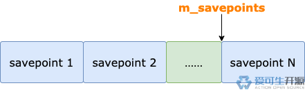
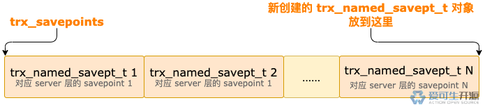
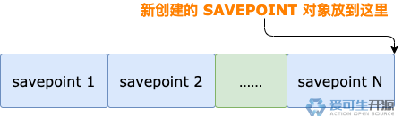

# 12 期 | 创建 savepoint

**原文链接**: https://opensource.actionsky.com/12-%e6%9c%9f-%e5%88%9b%e5%bb%ba-savepoint/
**分类**: 技术干货
**发布时间**: 2024-04-06T21:40:33-08:00

---

回滚操作，除了回滚整个事务，还可以部分回滚。部分回滚，需要保存点（savepoint）的协助。本文我们先看看保存点里面都有什么。
> 作者：操盛春，爱可生技术专家，公众号『一树一溪』作者，专注于研究 MySQL 和 OceanBase 源码。
爱可生开源社区出品，原创内容未经授权不得随意使用，转载请联系小编并注明来源
本文基于 MySQL 8.0.32 源码，存储引擎为 InnoDB。
## 1. undo 日志序号
InnoDB 的事务对象有一个名为 `undo_no` 的属性。事务每次改变（插入、更新、删除）某个表的一条记录，都会产生一条 undo 日志。这条 undo 日志中会存储它自己的序号。这个序号就来源于事务对象的 undo_no 属性。
也就是说，事务对象的 undo_no 属性中保存着事务改变（插入、更新、删除）某个表中下一条记录产生的 undo 日志的序号。
每个事务都维护着各自独立的 undo 日志序号，和其它事务无关。
每个事务的 undo 日志序号都从 0 开始。事务产生的第 1 条 undo 日志的序号为 0，第 2 条 undo 日志的序号为 1，依此类推。
InnoDB 的 savepoint 结构中会保存创建 savepoint 时事务对象的 undo_no 属性值。
## 2. savepoint 结构
我们通过 SQL 语句创建一个 savepoint 时，server 层、binlog、InnoDB 会各自创建用于保存 savepoint 信息的结构。
server 层的 savepoint 结构是一个 `SAVEPOINT` 类型的对象，主要属性如下：
- **prev**：指向 server 层的 savepoint 链表中，上一次创建的 SAVEPOINT 对象。
- **name**：savepoint 的名字。
- **mdl_savepoint**：创建这个 savepoint 之前，事务加了哪些 MDL 锁。
binlog 的 savepoint 结构很简单，是一个 8 字节的整数。这个整数的值，是创建 savepoint 时事务已经产生的 binlog 日志的**字节数**，也是接下来新产生的 binlog 日志写入 trx_cache 的 offset。
> 为了方便介绍，我们把这个整数值称为 **binlog offset**。
InnoDB 的 savepoint 结构是一个 `trx_named_savept_t` 类型的对象，主要属性如下：
- **name**：InnoDB 的 savepoint 名字。这个名字是 InnoDB 自己生成的，和 server 层的 SAVEPOINT 对象中保存的 savepoint 名字不一样。
- **savept**：也是一个对象，类型为 `trx_savept_t`，里面保存着创建 savepoint 时，事务对象的 undo_no 属性值。
- **trx_savepoints**：InnoDB 中多个 `trx_named_savept_t` 对象形成的链表。
创建 savepoint 时，server 层会分配一块 **96 字节**的内存，除了存放它自己的 `SAVEPOINT` 对象，还会存放 `binlog offset` 和 InnoDB 的 `trx_named_savept_t` 对象。
server 层的 SAVEPOINT 对象占用这块内存的前 48 字节，InnoDB 的 trx_named_savept_t 对象占用中间的 40 字节，binlog offset 占用最后的 8 字节。

## 3. 查找同名 savepoint
客户端连接到 MySQL 之后，MySQL 会分配一个专门用于该连接的用户线程。
用户线程中有一个 `m_savepoints` 链表，用户创建的多个 savepoint 通过 prev 属性形成链表，m_savepoints 就指向最新创建的 savepoint。

server 层创建 savepoint 之前，会按照创建时间从新到老，逐个查看链表中是否存在和本次创建的 savepoint 同名的 savepoint。
## 4. 删除同名 savepoint
如果在用户线程的 m_savepoints 链表中找到了和本次创建的 savepoint 同名的 savepoint，需要先删除 m_savepoints 链表中的同名 savepoint。
找到的同名 savepoint，是 server 层的 `SAVEPOINT` 对象，它后面的内存区域分别保存着 InnoDB 的 trx_named_savept_t 对象、binlog offset。
binlog 是个老实孩子，乖乖的把 binlog offset 写入了 server 层为它分配的内存里。删除同名 savepoint 时，不需要单独处理 binlog offset。
InnoDB 就不老实了，虽然 server 层也为 InnoDB 的 trx_named_savept_t 对象分配了内存，但是 InnoDB 并没有往里面写入内容。
事务执行过程中，用户每次创建一个 savepoint，InnoDB 都会创建一个对应的 trx_named_savept_t 对象，并加入 InnoDB 事务对象的 trx_savepoints 链表的**末尾**。
因为 InnoDB 自己维护了一个存放 savepoint 结构的链表，server 层删除同名 savepoint 时，InnoDB 需要找到这个链表中对应的 savepoint 结构并删除，流程如下：
- server 层把同名 savepoint 的 `SAVEPOINT` 对象后面分配给 trx_named_savept_t 对象的**内存地址**传给 InnoDB。
- InnoDB 根据自己的算法把内存地址转换为字符串，作为 InnoDB 的 savepoint 名字，到事务对象的 `trx_savepoints` 链表中找到对应的 trx_named_savept_t 对象，并从链表中删除该对象。
InnoDB 从事务对象的 trx_savepoints 链表中删除 trx_named_savept_t 对象之后，server 层接着从用户线程的 m_savepoints 链表中删除 server 层的 `SAVEPOINT` 对象，也就连带着清理了 `binlog offset`。
## 5. 保存 savepoint
处理完查找、删除同名 savepoint 之后，server 层就正式开始创建 savepoint 了，这个过程分为 3 步。
**第 1 步**，binlog 会生成一个 Query_log_event。
以创建名为 `test_savept` 的 savepoint 为例，这个 event 的内容如下：
`SAVEPOINT `test_savept`
`
binlog event 写入 trx_cache 之后，binlog offset 会写入 server 层为它分配的 8 字节的内存中。
**第 2 步**，InnoDB 创建 `trx_named_savept_t` 对象，并放入事务对象的 trx_savepoints 链表的**末尾**。

trx_named_savept_t 对象的 name 属性值是 InnoDB 的 savepoint 名字。这个名字是根据 server 层为 InnoDB 的 trx_named_savept_t 对象分配的内存的地址计算得到的。
trx_named_savept_t 对象的 `savept` 属性，是一个 `trx_savept_t` 类型的对象。这个对象里保存着创建 savepoint 时，事务对象中 undo_no 属性的值，也就是下一条 undo 日志的序号。
**第 3 步**，把 server 层的 `SAVEPOINT` 对象加入用户线程的 `m_savepoints` 链表的尾部。

## 6. 总结
server 层会创建一个 `SAVEPOINT` 对象，用于存放 savepoint 信息。
binlog 会把 `binlog offset` 写入 server 层为它分配的一块 8 字节的内存里。
InnoDB 会维护自己的 savepoint 链表，里面保存着 `trx_named_savept_t` 对象。
如果 m_savepoints 链表中存在和本次创建的 savepoint 同名的 savepoint，
创建新的 savepoint 之前，server 层会从链表中删除这个同名的 savepoint。
server 层创建的 SAVEPOINT 对象会放入 `m_savepoints` 链表的末尾。
InnoDB 创建的 trx_named_savept_t 对象会放入事务对象的 `trx_savepoints` 链表的末尾。
> **本期问题**：创建 savepoint 时，为什么要把 SAVEPOINT xxx 写入 trx_cache 并最终写入 binlog 日志文件呢？这个问题我还没有答案，欢迎大家在留言区留下你的想法。
**下期预告**：MySQL 核心模块揭秘 | 13 期 | 回滚到 savepoint。