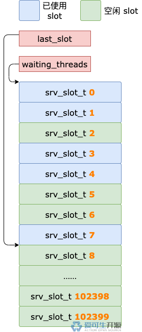

# 24 期 | 锁等待超时

**原文链接**: https://opensource.actionsky.com/24-%e6%9c%9f-%e9%94%81%e7%ad%89%e5%be%85%e8%b6%85%e6%97%b6/
**分类**: 技术干货
**发布时间**: 2024-07-15T00:27:28-08:00

---

锁等待之后有两种结果：获得锁、超时，这一期先来看看锁等待超时之后都要干什么？
> 作者：操盛春，爱可生技术专家，公众号『一树一溪』作者，专注于研究 MySQL 和 OceanBase 源码。
爱可生开源社区出品，原创内容未经授权不得随意使用，转载请联系小编并注明来源。
本文基于 MySQL 8.0.32 源码，存储引擎为 InnoDB。
**正文**
## 1. 超时检查线程
InnoDB 有个名为 `ib_srv_lock_to` 的后台线程，每秒进行一次超时检查，看看是否有锁等待超时的事务。
前面介绍锁等待时，我们介绍过：如果事务加锁进入锁等待状态，会给后台线程发送通知，告诉后台线程发生了锁等待，这个后台线程就是**超时检查线程**。
既然每个事务进入锁等待状态都会通知超时检查线程，那么，每秒进行一次超时检查的说法是不是有问题？
这自然是没问题的了。
因为超时检查线程是个多面手，它不只会进行超时检查，还会做别的事情，那就是死锁检查。
事务进入锁等待状态时，给超时检查线程发送通知，是为了触发这个线程马上进行死锁检查。
收到通知之后，超时检查线程会判断距离上一次超时检查的时间。如果小于 1s，就不进行超时检查，大于等于 1s 才会进行超时检查。
## 2. 找到超时事务
超时检查，是为了找到那些锁等待超时的事务。处于锁等待状态的事务有可能很多，怎么能快速找到哪些事务已经等到花儿都谢了？
锁模块结构有个 `waiting_threads` 属性，是个指针，指向一片内存区域。
这片内存区域有 srv_max_n_threads 个 slot，每个 slot 存放一个 srv_slot_t 对象。
srv_slot_t 对象中保存着事务对象、开始等待时间、超时时间等相关信息。
锁模块结构还有个 `last_slot` 属性，也是个指针，和 waiting_threads 指向同一片内存区域，但是它指向的不是这片内存区域的开始处，而是已被使用的最后一个 slot 后面的那个 slot。
也就是说，last_slot 指向的那个 slot 和后面所有的 slot 都是空闲状态。

上图中已被使用的最后一个 slot 是 `srv_slot_t 7`，last_slot 指向它后面的那个 slot，也就是 `srv_slot_t 8`。
另外，从上图中我们也可以看到 waiting_threads 和 last_slot 之间，并不是所有 slot 都被使用了，也会有空闲的。
对 waiting_threads、last_slot 指向的内存区域有所了解之后，我们就可以更好的欣赏超时检查线程的表演了。
找到锁等待超时的事务，需要遍历 `waiting_threads` 指向的内存区域中的 slot，从第一个 slot 开始，到已被使用的最后一个 slot 为止。
> 已被使用的最后一个 slot，就是 last_slot 指向的那个 slot 前面的 slot。
遍历过程中，每次取一个 slot，如果这个 slot 已被使用，就检查它对应的锁等待是否超时。
加锁事务进入锁等待状态之前，会把锁等待的开始时间记录到 srv_slot_t 对象的 `suspend_time` 属性中，还会把超时时间记录到 srv_slot_t 对象的 `wait_timeout` 属性中。
检查 slot 对应的锁等待是否超时，步骤如下：
- 用当前时间减去锁等待的开始时间（`suspend_time` 属性值），得到一个差值。
- 判断上一步的差值是否**大于**锁等待超时时间（`wait_timeout` 属性值）。
如果大于，说明这个 slot 对应的锁等待超时了，需要进一步处理超时逻辑。
## 3. 处理超时逻辑
超时检查线程每找到一个锁等待超时的事务，都有一系列的工作要做，重要工作是从链表中删除对应的锁结构。
如果事务等待行锁超时，从链表中删除行锁结构的步骤如下：
- 从事务对象的 `trx_locks 链表`中删除行锁结构。
- 找到 rec_hash 的数组中对应的行锁结构链表，从链表中删除这个行锁结构。
如果事务等待表锁超时，从链表中删除表锁结构的步骤如下：
- 从事务对象的 `trx_locks 链表`中删除表锁结构。
- 从表对象的 `locks 链表`中删除表锁结构。
从链表中删除对应的锁结构，是因为锁等待超时有可能会自动回滚事务，这个行为由系统变量 `innodb_rollback_on_timeout` 控制。
这个系统变量的默认值为 false，表示锁等待超时不会回滚事务，修改为 true，锁等待超时就会回滚事务。
如果事务回滚了，它创建的锁结构不删除，这个锁结构就无主了。为了避免出现无主的锁结构，删除操作就必须要做了。
## 4. 通知超时事务
事务加锁进入锁等待状态，会找到一个空闲的 slot，记录加锁的相关信息。
如果这个 slot 对象之前没有被使用过，InnoDB 会创建一个事件对象，保存到这个 slot 对象的 `event` 属性中。
超时检查线程处理完超时逻辑之后，会触发这个 slot 对象的 event 属性中保存的事件，通知对应的事务锁等待超时了。
收到通知之后，锁等待事务会进行接下来的处理逻辑，主要干几件事：
- 如果事务等待行锁超时，用当前时间，减去锁等待的开始时间，得到锁等待消耗的时间，这个时间会记录到慢查询日志中。
- 生成锁等待超时报错信息。
- 如果系统变量 innodb_rollback_on_timeout 的值为 true，回滚事务。
## 5. 总结
锁等待超时有两类参与者，主动者是超时检查线程，被动者是锁等待事务。
超时检查线程的主要流程如下：
- 遍历 waiting_threads 和 last_slot 之间的 slot。
- 对于已被使用的 slot，判断锁等待是否超时。
- 如果超时，处理这个 slot 对应的锁等待超时逻辑。
- 通知锁等待超时的事务。
锁等待事务收到通知之后，也有一些事情要干，完事之后，这个事务的锁等待过程也就结束了。