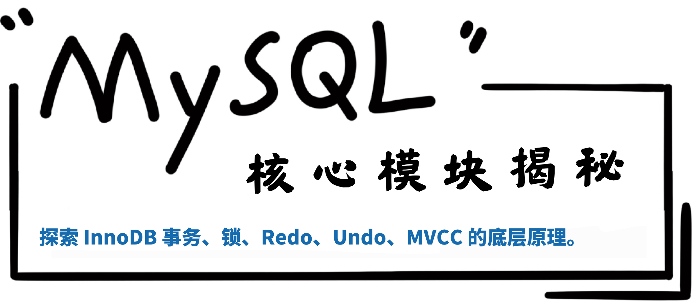

# MySQL 核心模块揭秘 |《发刊词》

**原文链接**: https://opensource.actionsky.com/mysql-%e6%a0%b8%e5%bf%83%e6%a8%a1%e5%9d%97%e6%8f%ad%e7%a7%98-%e3%80%8a%e5%8f%91%e5%88%8a%e8%af%8d%e3%80%8b/
**分类**: MySQL 新特性
**发布时间**: 2023-12-27T18:02:31-08:00

---

## 1. 为什么要写专栏？
我还在做业务系统研发的时候，有一段时间，系统不稳定，慢 SQL 很多。我们团队花了很长时间持续优化 SQL。
我们有一个表格，从慢查询日志里整理出了很多慢 SQL。其中一些 SQL，按照我们的理解，根本不应该出现在表格里，但是它们却经常出现。
我对这些 SQL 印象深刻，它们是：
- update xxx set xxx where id = xxx
- commit
- truncate table xxx
以我们当时对 MySQL 有限的了解，这些 SQL 执行起来都很快，不应该出现在慢查询日志里。
我们不了解这些 SQL 执行过程中都干了些什么，不理解它们是怎么执行的，想要优化也就无处下手了。
随着逐渐深入研究 MySQL 源码，我已经能解释这些 SQL 为什么会出现在慢查询日志里了。
对 SQL 执行过程不了解，这是我曾经的痛点，相信也是很多业务系统研发和 DBA 的痛点。
我投入了很多时间研究 MySQL 源码，正在逐步解决这些痛点。
现在，我把这些内容写出来，分享给需要的各位读者，希望也能帮助大家解决工作过程中遇到的痛点。
## 2. 专栏包含哪些内容？
我正在研究 InnoDB 的几个模块，专栏内容都来源于这些模块：
- 事务
- 锁（InnoDB 的记录锁和表锁，不包含 server 层的元数据锁）
- Redo
- Undo
- MVCC
## 3. 专栏内容怎么呈现？
关于专栏的内容，我考虑过 3 种呈现方式。
**① 源码详细分析**。
以讲解源码为主，在讲解源码的过程中，顺便介绍原理。
之前写过几篇 MySQL 功能实现的源码分析文章、也结合源码写了几篇分析线上问题的文章，有读者反馈看不懂源码，对于这样的文章，他们会直接跳过源码，只看原理介绍。
**② 源码关键节点 + 原理介绍：**
用 SQL 执行过程中经历的关键节点的源码把原理串起来。
这种方式按照 SQL 的执行流程，通过源码关键节点来介绍原理，文章内容可能会有点碎片化，不好抽象成介绍原理且逻辑流畅的文章。
**③ 原理介绍：**
这种方式以讲解原理为主，在需要的时候会加上一点点源码作为辅助，方便理解。我之前写的公众号文章主要以这种方式呈现。
考虑到目标读者是想了解 MySQL 底层原理的业务系统研发和 DBA，最终还是确定以**第 ③ 种**方式（**原理介绍**）来写专栏的系列文章。
## 4. 聊聊心路历程
这个专栏从虚无中诞生，算是个结果。凡事有果必有因，我们再来聊聊是什么因结出了这个果。
细算起来，我已经 4 个月没写文章了，停更这么久，并不是放弃了写文章，而是把重点转移到研究 MySQL 源码上了。
这段暂停时期，既是意料之外，也是顺理成章。
意料之外在于，我也没有想到 8 月份写完《InnoDB 全表扫描和全主键扫描一样吗？》这篇文章之后，就会停更，并且一停就是 4 个月。
顺理成章在于，8 月份之前已经有一段时间感觉到写文章吃力了，停更也是迟早的事。
**我思考过感到吃力的原因：**
因为我的目标是每周发一篇文章，一周之内我需要找到一个文章主题、并且研究这个主题相关的代码、写成文章。
其中最费时间的就是研究代码了，这通常会占据我一周中大部分用于写文章的业余时间。
研究代码占用了大量时间，再加上写文章，这让我感到越来越吃力。
到 8 月份写完前面提到的那篇文章之后，有一些复杂的感觉交织在一起：如释重负、元气耗尽、迷茫，让我没有动力继续写下一篇文章了。
这些复杂的感觉交织的过程中，我也在思考接下来要怎么办？写文章这件事怎么才能做到更轻松更持久？
为此，我先总结了一下我写文章的几个阶段。
**第 1 阶段：**
刚开始研究 MySQL 源码的时候，我也会写文章，发到我的博客上。
写完文章之后还会给同事看，同事说看不懂。
当时我也很郁闷，我很用心的花了很长时间写的文章，同事看不懂。
虽然郁闷，但日子还要继续过下去，还得继续研究源码、继续写文章。
**第 2 阶段：**
就这样一边郁闷，一边研究代码，一边写文章，时间就过去了几个月。
某一天，我又写了一篇文章，发给同事看。同事看了之后，给出了很不错的评价。
这让理解了从读者的角度来看，什么样的文章算是好文章。
接下来的事就顺理成章了：注册公众号、继续研究源码、继续写文章。
> 
这里要郑重感谢一下我前面提到同事 **@李亮**，在前期给了我很重要的帮助。
**第 3 阶段：**
全职研究代码，基本上一周发一篇文章。
这个阶段虽然没有收入，但是每天动力很足，有一种感觉就是日子过的红红火火。
这叫什么？这就叫穷开心！
**第 4 阶段：**
我上班了，只能利用业余时间研究代码。
想要像之前那样写长文章，还每周发一篇，已经不太可能实现了。
这个阶段的主旋律就是围绕问题研究代码、写文章，同事和读者有时候会问我一些问题，我就围绕问题去研究代码，写成文章。
开始一段时间，依然乐此不疲。虽然吃力，也还基本能应付过来。
时间一长，吃力感越来越明显了，持续到 8 月份，写文章之事就由于不堪重负暂时停了下来。
我还想继续写文章，但需要找到一种相对来说更轻松的方式，这样才能可持续发展。
经过一番思考之后，我决定把写文章的事放一放，先专心研究一段时间代码，把 InnoDB 几个主要模块的细节都研究一遍，再接着写文章。
时间飞快，转眼已是四个月，从秋高气爽到白雪皑皑，我恢复了元气，又可以继续写文章了。
重生的文章，以系列的形式连载，需要新的载体，于是就有了这个专栏。
接下来，就要进入**第 5 阶段**了。这个专栏和第 5 阶段相伴而生，我在此许下一个愿望：希望专栏和第 5 阶段都能够持续的很久~很久~，和大家一起奔赴未来！
## 5. 我们一起奔赴未来！
**《MySQL 核心模块揭秘》**专栏预期每周发布一篇文章，持续一年左右。
接下来的一年，我们一起 **探索 InnoDB 事务、锁、Redo、Undo、MVCC 的底层原理**，看看 MySQL 运行时都干了什么？
风起于青萍之末，浪成于微澜之间。下一期（专栏的第 1 篇正式文章）我们会聊聊 InnoDB 事务的起源：**事务池和事务池管理器**。