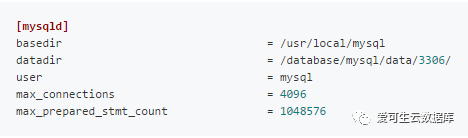
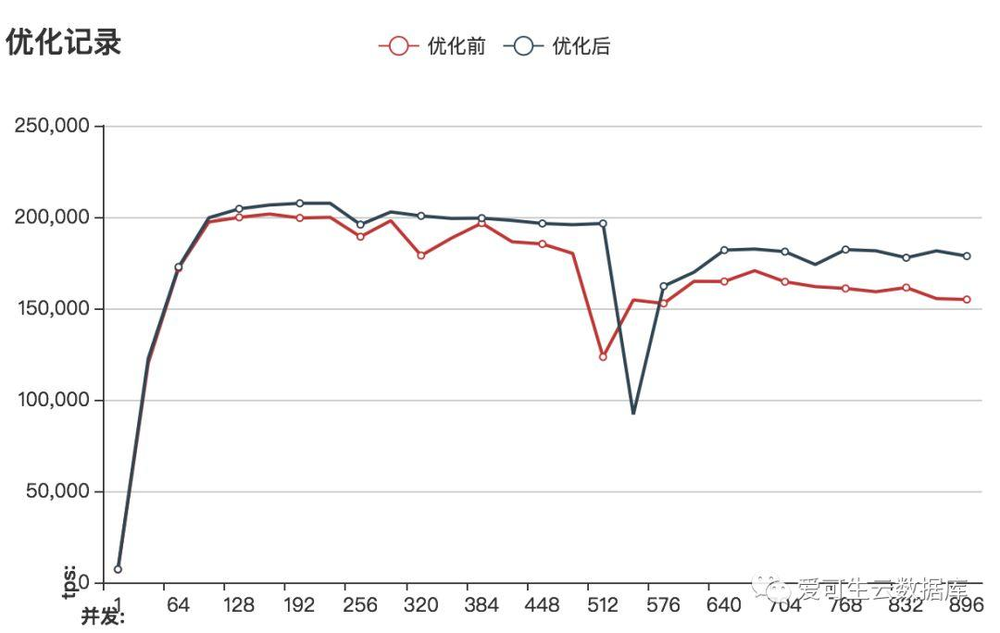

# MySQL瓶颈分析与优化

**原文链接**: https://opensource.actionsky.com/20190311-mysql/
**分类**: MySQL 新特性
**发布时间**: 2019-03-11T00:00:50-08:00

---

前  言
本文是由爱可生运维团队出品的「MySQL专栏」系列文章，内容来自于运维团队一线实战经验，涵盖MySQL各种特性的实践，优化案例，数据库架构，HA，监控等，有扫雷功效。
爱可生开源社区持续运营维护的小目标：
- 
每周至少推送一篇高质量技术文章
- 
每月研发团队发布开源组件新版
- 
每年1024开源一款企业级组件
- 
2019年至少25场社区活动
欢迎大家持续关注～
**简介**
通过sysbench的oltp_read_write测试来模拟业务压力，以此来给指定的硬件环境配置一份比较合理的MySQL配置文件。
**环境介绍**
- 
硬件配置

- 
软件环境

**优化层级与指导思想**
**1.优化层级**
MySQL数据库优化可以在多个不同的层级进行，常见的有：
- 
SQL优化
- 
参数优化 
- 
架构优化
本文重点关注：参数优化
**2.指导思想**
- 
日志先行 &#8212; 一个事务能否成功提交的关键是日志是否成功落盘，与数据没有太大的关系；也就是说对写的优化可以表述为各方面的资源向写操作倾斜。
- 
瓶颈分析 &#8212; 通过show global status 的各个计数器的值基本上就能分析出当前瓶颈所在，再结合一些简单的系统层面的监控工具如top iostat 就能明确瓶颈。
- 
整体性能是“读”&#038;“写”之间的再平衡。
**优化过程**
**优化前**
my.cnf中的内容(关键部分)

**监控数据**
- 
show global status 中Innodb_data_pending_fsyncs 这个status比较高；
- 
iostat的util项有比较明显的波峰，峰值使用率高达85%；
**监控数据分析与优化思路**
对监控数据有两种可能的解释：
- 
由于最小化的安装的buffer_pool_size比较小，所以会频繁的触发innodb_buffer_pool的最大脏页的限制，使得innodb进入暴力刷盘的模式，这种情况下io使用率会明显上升。
- 
redo日志重用。 最终的影响可能是两者的叠加，这里先从buffer_pool开始优化。
**优化缓冲池**
my.cnf中的内容(关键部分)

**监控数据**
- 
show global status 中Innodb_data_pending_fsyncs 这个status减小到了 1；
- 
iostat的util项峰值有所下降；
- 
从性能图像可以看出增大innodb_buffer_pool_size的值后、性能的峰值所对应的并发更高了(当innodb_buffer_pool_size默认的128M调整到200G时innodb_buffer_pool_instances自动增大到了8)
> 
调整innodb_buffer_pool_size前后的性能对比 

**性能大概提高3倍 **
**监控数据分析与优化思路**
- 
针对innob_buffer_pool_size的调整取得了一定的收获，下面将要调整的就是针对redo重用的情况了，也就是说我们要增大innodb_log_files_in_group和innodb_log_file_size到一个合适的值。
- 
innob_buffer_pool_size取得的收获还可以进一步扩大，那就是增大innodb_buffer_pool_instances的值。
**优化日志文件**
根据对之前测试的记录每完成一组测试LSN增大4.5G、测试持续时间大概是5分钟；理论上把redo文件增大到5G可以做到整个测试的过程中不发生日志重用、这样的话测试的跑分会更高、曲也线更平滑，不过这个会影响数据库宕机恢复的时间。MySQL在默认配置下innodb_log_files_in_group=2，innodb_log_file_size=48M也就是说跑完一组测试redo日志要刷新48轮(1024*4.5/96 ==48) 先看一下把日志刷新减少到9轮的情况。
my.cnf中的内容(关键部分)

> 
调整innodb_log_files_in_group&#038;innodb_log_file_size前后的性能对比

**性能大概提高2倍**
**现在看一下日志重用控制在一轮(5G)之内的性能表现**
my.cnf中的内容(关键部分)

> 
调整innodb_log_files_in_group&#038;innodb_log_file_size前后的性能对比 
****
**性能大概提高2倍**
**监控数据分析与优化思路**
- 
增大redo到5G的情况下由于整个测试过程中几乎没有日志文件重用的问题，这样也就规避由些引发的大量数据刷盘行为，所以性能曲线也就更平滑了。
- 
通过show global status 发现Table_open_cache_overflows=200W+、Thread_created=2k+
- 
%Cpus : 80.5 us, 13.8 sy, 0.0 ni, 5.4 id, 0.0 wa, 0.0 hi, 0.3 si, 0.0 st 95%的使用率cpu资源成了大问题，这个使用率下能调整的参数不多了
- 
对磁盘的监控数据表明util的峰值已经下降到14%、磁盘已经不在是问题；所以针对innodb_buffer_pool_size、innodb_log_files_in_group&#038;innodb_log_file_size 这两次优化的进入一步优化innodb_buffer_pool_instances、innodb_log_buffer_size 先不进行；在些采用“抓大放小”的方式先调整表缓存与线程缓存。
**优化其它已知项**
cpu使用率达到了95%，看到这个数值有一种发自内心的无力感，所以打算所目前status中能明确的一些问题直接一起调整了；增大table_open_cache&#038;table_open_cache_instances用于优化表缓存、增大thread_cache_size使cpu不用频繁的创建销毁线程。
my.cnf中的内容(关键部分)**
**

> 
调整前后的比较

**总结**
一、考虑到cpu使用率已经达到95%且增加物理cpu不现实的情况下，决定MySQL参数优化到此为止；最后来看一眼这次优化成果。

二、前面由于篇幅只给出配置文件的一部分、现在我们来看一下完整的配置文件。

**说明**
- 
之所以max_prepared_stmt_count要调整到这么是因为sysbench的oltp_read_write这个测试会用于prepare语句、如果这个值不够大的话我们测试不了800+并发，你测试sysbench其它oltp用例可能不用这么做，同理max_connections的配置也是如此(不过它确实设置的大了点)
- 
有些参数在优化过程中我并没有调整主要原因有两个：
①.这是有方法论指导的优化、它更像定向爆破，所以没用的我不去动、在关键参数上调整后已经解决问题的情况下，其它相关的参数我更加倾向不动。
②.对于从show global status 中能看出非常明确指向的我也会采取多个参数一起调整的策略。
> 
**Tips ：**
作者自己维护了一个MySQL配置文件生成站点，有兴趣的可以访问：https://www.sqlpy.com/mycnf/

**喜****欢点****分享，****不行就****好看，****多喝热水重启试试**
