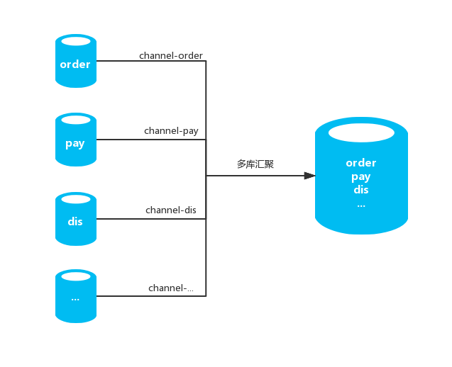
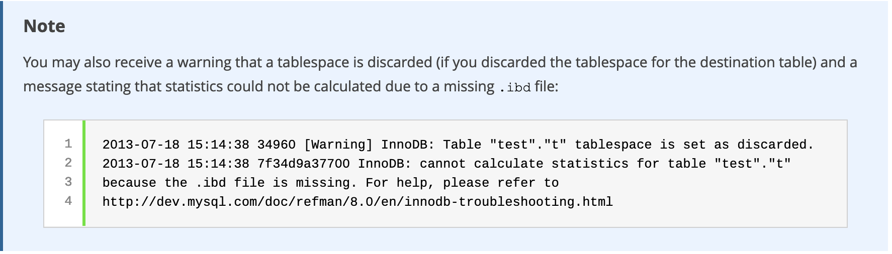

# 基于Xtrabackup及可传输表空间实现多源数据恢复

**原文链接**: https://opensource.actionsky.com/%e5%9f%ba%e4%ba%8extrabackup%e5%8f%8a%e5%8f%af%e4%bc%a0%e8%be%93%e8%a1%a8%e7%a9%ba%e9%97%b4%e5%ae%9e%e7%8e%b0%e5%a4%9a%e6%ba%90%e6%95%b0%e6%8d%ae%e6%81%a2%e5%a4%8d/
**分类**: 技术干货
**发布时间**: 2019-03-05T01:47:48-08:00

---

# MySQL多库汇聚的初始化数据可行性方案
@(MySQL)[xtrabackup, Transportable Tablespaces, mysqldump, multi-source replication]
目录
**
- [MySQL多库汇聚的初始化数据可行性方案](#MySQL)[一、使用背景](#i)[1.可传输表空间基本流程](#1)
- [二、技术要点](#i-2)
- [三、实施步骤](#i-3)[1.实验环境](#1-2)
- [2.源端操作](#2)[1) 造测试数据并模拟小压力](#1-3)
- [2) 备份单库数据](#2-2)
- [3) 备份表结构](#3)
- [4) 批量生成可传输表空间命令](#4)
- [3.目标端操作](#3-2)[1) 备份数据恢复准备](#1-4)
- [2) 恢复表结构至目标端](#2-3)
- [3) 舍弃目标端对应表空间文件](#3-3)
- [4) 拷贝表数据及配置文件到目标端sbtest库数据目录](#4_sbtest)
- [5) 执行导入表空间文件操作](#5)
- [4.建立复制(多源复制)](#4-2)
- [四、参考链接](#i-4)
## 一、使用背景
> 
MySQL在5.7以后引入了`多源复制(Multi-Source)`功能，可用于将多个单独的数据库汇聚到一个数据库实例下，方便用户进行数据分析、汇总或推送至其他数据库平台。早期针对汇聚场景初始化各源端数据到汇聚库，为了提升效率通常会使用使用开源并行逻辑导入导出工具`myloader/mydumper`进行数据导入/导出，当源端多实例多库`数据量较大(100G以上)`情况下，使用mydumper/myloader花费的时间则可能`无法满足时间要求`，需要考虑是否有`更高效的`方式进行数据初始化同步操作，以及当复制通道异常时更便捷快速修复。
ps：多源复制使用物理备份(xtrabackup)做数据初始化时，常规方式只有第一个通道可做覆盖还原，后续通道需逻辑还原或用其他方式还原，如该方案所描述的方式。
MySQL在5.6以后支持了`可传输表空间`功能,以及Xtrabackup针对该功能在备份时提供了一个对应参数`export`,该参数支持对`InnoDB存储引擎表的备份数据export转换`，且与常规备份操作一样可生成备份时间点的binlog信息(GTID信息),结合这两特性可以更高效和快速的方式实现`多库数据汇聚的初始导入`操作。
- **场景架构图**
[](https://i.loli.net/2019/03/05/5c7e44417c714.png)
### 1.可传输表空间基本流程
> 
先简单梳理一下可传输表空间基本流程
1. 在源端将InnoDB表进行ibd数据文件导出处理(`export tablespace`)
2. 在目标端创建与源端相同表结构的表
3. 将目标端的表数据文件舍弃(`discard tablespace`)
4. 用源端的相对应ibd文件覆盖到目标端
5. 在目标端执行表空间文件的导入/置换(`import tablespace`)
单纯使用可传输表空间功能无法记录对应表的事务点，也就是如果需要进行汇聚复制同步，无法知道从binlog哪个文件的哪个position点进行数据同步，这也就是需要引入xtrabackup及export功能的原因。备份元数据信息本身会记录复制同步点信息。
###2.使用前提条件/限制
1. MySQL须为5.6以上版本
2. 表存储引擎须为InnoDB存储引擎(支持可传输表空间)
3. 导入完成后建议执行ANALYZE TABLE更新统计信息
## 二、技术要点
- **`sysbench`** 源端造测试数据并模拟压力
- **`mysqldump`** 备份源端表结构
- **`concat()`** 拼接批量可传输表空间SQL
- **`xtrabackup`** 备份源端单库(部分库)数据
- **`Transportable Tablespace`** InnoDB可传输表空间功能
- **`Multi-source Replication`**  多源复制
- **`mysql-error.log`** 错误信息日志校验
- **`ANALYZE TABLE`**更新统计信息
## 三、实施步骤
### 1.实验环境
| 角色 | IP | 数据库 | MySQL Version |
| --- | --- | --- | --- |
| 源端 | 10.186.60.16 | sbtest | 5.7.24 Community |
| 目标端 | 10.186.60.18 | sbtest | 5.7.24 Community |
### 2.源端操作
#### 1) 造测试数据并模拟小压力
> 
使用sysbench创建4张各100W记录的测试表，并使用2个并发持续模拟业务压力
`## 造数据
shell> /opt/sysbench-0.9/sysbench/sysbench --test=/opt/sysbench-0.9/sysbench/tests/db/oltp.lua --oltp-table-size=1000000 --oltp-tables-count=4 --mysql-user=sysbench --mysql-password=sysbench --mysql-host=10.186.60.16 --mysql-port=3333 prepare
## 模拟小压力
shell> /opt/sysbench-0.9/sysbench/sysbench --test=/opt/sysbench-0.9/sysbench/tests/db/oltp.lua --oltp-table-size=1000000 --oltp-tables-count=4 --mysql-user=sysbench --mysql-password=sysbench --mysql-host=10.186.60.16 --mysql-port=3333 --num-threads=2 --max-requests=0 --max-time=0 --report-interval=1 run
`
#### 2) 备份单库数据
> 
使用xtrabackup备份工具对源端sbtest库进行单库备份，保存至/data/mysql/backup/目录下
`shell> innobackupex --databases=sbtest /data/mysql/backup/
`
#### 3) 备份表结构
> 
为可传输表空间做准备，将源端表结构备份并后续在目标端导入
`shell> cd /data/mysql/backup
shell> mysqldump --no-data --set-gtid-purged=off sbtest>sbtest_schema.sql
`
#### 4) 批量生成可传输表空间命令
- **discard**
使用concat函数拼接出批量DISCARD TABLESPACE的SQL
```
shell> cd /data/mysql/backup
shell> mysql -ssre "select concat('ALTER TABLE ',TABLE_SCHEMA,'.',TABLE_NAME,' DISCARD TABLESPACE;') from information_schema.tables where TABLE_SCHEMA='sbtest';" >discard_tbs.sql
## 输出文件如下所示
shell> cat discard_tbs.sql
ALTER TABLE sbtest.sbtest1 DISCARD TABLESPACE;
ALTER TABLE sbtest.sbtest2 DISCARD TABLESPACE;
ALTER TABLE sbtest.sbtest3 DISCARD TABLESPACE;
ALTER TABLE sbtest.sbtest4 DISCARD TABLESPACE;
```
- **import**
使用concat函数拼接出批量IMPORT TABLESPACE的SQL
```
shell> cd /data/mysql/backup
shell> mysql -ssre "select concat('ALTER TABLE ',TABLE_SCHEMA,'.',TABLE_NAME,' IMPORT TABLESPACE;') from information_schema.tables where TABLE_SCHEMA='sbtest';">import_tbs.sql
## 输出文件如下所示
shell> cat import_tbs.sql
ALTER TABLE sbtest.sbtest1 IMPORT TABLESPACE;
ALTER TABLE sbtest.sbtest2 IMPORT TABLESPACE;
ALTER TABLE sbtest.sbtest3 IMPORT TABLESPACE;
ALTER TABLE sbtest.sbtest4 IMPORT TABLESPACE;
```
**`拷贝源端/data/mysql/backup目录下生成的所有相关文件到目标端/data/mysql/backup下`**
### 3.目标端操作
#### 1) 备份数据恢复准备
> 
对备份数据进行apply-log日志应用及将数据进行export转换生成配置文件
`shell> innobackupex --apply-log --export /data/mysql/backup/2019-02-22_15-26-20/
## export执行完后sbtest库下备份文件如下所示
## exp结尾的文件为Percona针对Percona XtraDB做export的配置文件
## cfg结尾的文件为Percona针对MySQL可传输表空间export的配置文件
shell>  ll /data/mysql/backup/2019-02-22_15-26-20/sbtest/
总用量 999556
-rw-r----- 1 root root        67 2月  22 15:40 db.opt
-rw-r--r-- 1 root root       569 2月  22 15:53 sbtest1.cfg
-rw-r----- 1 root root     16384 2月  22 15:53 sbtest1.exp
-rw-r----- 1 root root      8632 2月  22 15:40 sbtest1.frm
-rw-r----- 1 root root 255852544 2月  22 15:53 sbtest1.ibd
-rw-r--r-- 1 root root       569 2月  22 15:53 sbtest2.cfg
-rw-r----- 1 root root     16384 2月  22 15:53 sbtest2.exp
-rw-r----- 1 root root      8632 2月  22 15:40 sbtest2.frm
-rw-r----- 1 root root 255852544 2月  22 15:53 sbtest2.ibd
-rw-r--r-- 1 root root       569 2月  22 15:53 sbtest3.cfg
-rw-r----- 1 root root     16384 2月  22 15:53 sbtest3.exp
-rw-r----- 1 root root      8632 2月  22 15:40 sbtest3.frm
-rw-r----- 1 root root 255852544 2月  22 15:53 sbtest3.ibd
-rw-r--r-- 1 root root       569 2月  22 15:53 sbtest4.cfg
-rw-r----- 1 root root     16384 2月  22 15:53 sbtest4.exp
-rw-r----- 1 root root      8632 2月  22 15:40 sbtest4.frm
-rw-r----- 1 root root 255852544 2月  22 15:53 sbtest4.ibd
`
#### 2) 恢复表结构至目标端
> 
将源端表结构在目标端数据库创建
`shell> cd /data/mysql/backup
## 手工创建sbtest库
shell> mysql -e "create database sbtest;"
## 导入源端对应的表结构
shell> mysql sbtest< sbtest_schema.sql
## 验证
shell> mysql -e "show tables from sbtest;"
`
#### 3) 舍弃目标端对应表空间文件
```
shell> cd /data/mysql/backup
shell> mysql <discard_tbs.sql
## 执行后效果如下所示，ibd文件已被舍弃
shell>  ll /data/mysql/data/sbtest/
-rw-r----- 1 mysql mysql   67 2月  22 15:58 db.opt
-rw-r----- 1 mysql mysql 8632 2月  22 15:58 sbtest1.frm
-rw-r----- 1 mysql mysql 8632 2月  22 15:58 sbtest2.frm
-rw-r----- 1 mysql mysql 8632 2月  22 15:58 sbtest3.frm
-rw-r----- 1 mysql mysql 8632 2月  22 15:58 sbtest4.frm
```
#### 4) 拷贝表数据及配置文件到目标端sbtest库数据目录
```
## 拷贝ibd文件
shell> cp /data/mysql/backup/2019-02-22_15-26-20/sbtest/*.ibd /data/mysql/data/sbtest/
## 拷贝cfg文件
shell> cp /data/mysql/backup/2019-02-22_15-26-20/sbtest/*.cfg /data/mysql/data/sbtest/
## 修改文件权限为mysql用户
shell> chown -R mysql:mysql /data/mysql/data/sbtest
```
#### 5) 执行导入表空间文件操作
```
shell> cd /data/mysql/backup
## 出现Warning为可传输表空间正常输出，可忽略,详情可参考下图所示note说明
shell> mysql <import_tbs.sql
Warning (Code 1814): InnoDB: Tablespace has been discarded for table 'sbtest1'
Warning (Code 1814): InnoDB: Tablespace has been discarded for table 'sbtest2'
Warning (Code 1814): InnoDB: Tablespace has been discarded for table 'sbtest3'
Warning (Code 1814): InnoDB: Tablespace has been discarded for table 'sbtest4'
## 可通过MySQL错误日志查看import期间是否存在导入异常
shell> less /data/mysql/data/mysql-error.log
```
[](https://i.loli.net/2019/03/05/5c7e44680b436.png)
### 4.建立复制(多源复制)
`mysql> CHANGE MASTER TO 
MASTER_HOST='10.186.60.16', 
MASTER_USER='repl', 
MASTER_PORT=3333, 
MASTER_PASSWORD='repl',
MASTER_LOG_FILE='mysql-bin.000004',
MASTER_LOG_POS=149327998 FOR CHANNEL '10-186-60-16';
mysql> CHANGE REPLICATION FILTER REPLICATE_WILD_DO_TABLE=('sbtest.%');
mysql> START SLAVE FOR CHANNEL '10-186-60-16';
mysql> SHOW SLAVE STATUS FOR CHANNEL '10-186-60-16'\G;
`
## 四、参考链接
- Percona xtrabackup export功能介绍
https://www.percona.com/doc/percona-xtrabackup/2.4/xtrabackup_bin/restoring_individual_tables.html
- MySQL 可传输表空间功能说明
https://dev.mysql.com/doc/refman/5.7/en/tablespace-copying.html
- 场景示例思路来源博客
http://www.cnblogs.com/xuanzhi201111/p/6609867.html
开源分布式中间件DBLE
社区官网：https://opensource.actionsky.com/
GitHub主页：https://github.com/actiontech/dble
技术交流群：669663113
开源数据传输中间件DTLE
社区官网：https://opensource.actionsky.com/
GitHub主页：https://github.com/actiontech/dtle
技术交流群：852990221
[](https://i.loli.net/2019/03/05/5c7e44fc5be40.png)