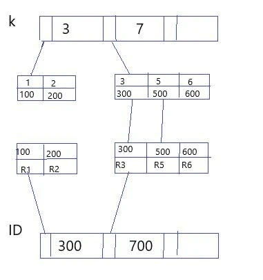

# 常见索引问题处理

**原文链接**: https://opensource.actionsky.com/20200317-mysql/
**分类**: MySQL 新特性
**发布时间**: 2020-03-19T02:44:25-08:00

---

作者：EneTakane
数据库技术爱好者，爱可生 DBA 团队成员，负责 MySQL 日常问题处理以及数据库运维平台的问题排查，擅长 MySQL 主从复制及优化，喜欢钻研技术问题，还有不得不提的 warship。
本文来源：原创投稿
*爱可生开源社区出品，原创内容未经授权不得随意使用，转载请联系小编并注明来源。
在满足语句需求的情况下，尽量少的访问资源是数据库设计的重要原则，这和执行的 SQL 有直接的关系，索引问题又是 SQL 问题中出现频率最高的，常见的索引问题包括：无索引（失效）、隐式转换。
**1. SQL 执行流程**
看一个问题，在下面这个表 T 中，如果我要执行 `select * from T where k between 3 and 5;` 需要执行几次树的搜索操作，会扫描多少行？- `mysql> create table T (`
- `    -> ID int primary key,`
- `    -> k int NOT NULL DEFAULT 0,`
- `    -> s varchar(16) NOT NULL DEFAULT '',`
- `    -> index k(k))`
- `    -> engine=InnoDB;`
- `mysql> insert into T values(100,1, 'aa'),(200,2,'bb'),\`
- `      (300,3,'cc'),(500,5,'ee'),(600,6,'ff'),(700,7,'gg');`
这分别是 ID 字段索引树、k 字段索引树。
											
这条 SQL 语句的执行流程：
1. 在 k 索引树上找到 k=3，获得 ID=3002. 回表到 ID 索引树查找 ID=300 的记录，对应 R33. 在 k 索引树找到下一个值 k=5，ID=5004. 再回到 ID 索引树找到对应 ID=500 的 R45. 在 k 索引树去下一个值 k=6，不符合条件，循环结束
这个过程读取了 k 索引树的三条记录，回表了两次。因为查询结果所需要的数据只在主键索引上有，所以必须得回表。所以，我们该如何通过优化索引，来避免回表呢？
**2. 常见索引优化**
2.1 覆盖索引**覆盖索引**，换言之就是索引要覆盖我们的查询请求，无需回表。如果执行的语句是 `select ID from T wherek between 3 and 5;`，这样的话因为 ID 的值在 k 索引树上，就不需要回表了。
覆盖索引可以减少树的搜索次数，显著提升查询性能，是常用的性能优化手段。
但是，维护索引是有代价的，所以在建立冗余索引来支持覆盖索引时要权衡利弊。
2.2 最左前缀原则B+ 树的数据项是复合的数据结构，比如 `(name,sex，age)` 的时候，B+ 树是按照从左到右的顺序来建立搜索树的，当 `(张三,F,26)` 这样的数据来检索的时候，B+ 树会优先比较 name 来确定下一步的检索方向，如果 name 相同再依次比较 sex 和 age，最后得到检索的数据。
- `# 有这样一个表 P`
- 
- `mysql> create table P (id int primary key, name varchar(10) not null, sex varchar(1), age int, index tl(name,sex,age)) engine=IInnoDB;`
- `mysql> insert into P values(1,'张三','F',26),(2,'张三','M',27),(3,'李四','F',28),(4,'乌兹','F',22),(5,'张三','M',21),(6,'王五','M',28);`
- 
- `# 下面的语句结果相同`
- 
- `mysql> select * from P where name='张三' and sex='F';     ## A1`
- `mysql> select * from P where sex='F' and age=26;         ## A2`
- 
- `# explain 看一下`
- 
- `mysql> explain select * from P where name='张三' and sex='F';`
- `+----+-------------+-------+------------+------+---------------+------+---------+-------------+------+----------+-------------+`
- `| id | select_type | table | partitions | type | possible_keys | key  | key_len | ref         | rows | filtered | Extra       |`
- `+----+-------------+-------+------------+------+---------------+------+---------+-------------+------+----------+-------------+`
- `|  1 | SIMPLE      | P     | NULL       | ref  | tl            | tl   | 38      | const,const |    1 |   100.00 | Using index |`
- `+----+-------------+-------+------------+------+---------------+------+---------+-------------+------+----------+-------------+`
- 
- `mysql> explain select * from P where sex='F' and age=26;`
- `+----+-------------+-------+------------+-------+---------------+------+---------+------+------+----------+--------------------------+`
- `| id | select_type | table | partitions | type  | possible_keys | key  | key_len | ref  | rows | filtered | Extra                    |`
- `+----+-------------+-------+------------+-------+---------------+------+---------+------+------+----------+--------------------------+`
- `|  1 | SIMPLE      | P     | NULL       | index | NULL          | tl   | 43      | NULL |    6 |    16.67 | Using where; Using index |`
- `+----+-------------+-------+------------+-------+---------------+------+---------+------+------+----------+--------------------------+`
可以清楚的看到，A1 使用 tl 索引，A2 进行了全表扫描，虽然 A2 的两个条件都在 tl 索引中出现，但是没有使用到 name 列，不符合最左前缀原则，无法使用索引。所以**在建立联合索引的时候，如何安排索引内的字段排序是关键。**评估标准是索引的复用能力，因为支持最左前缀，所以当建立（a，b）这个联合索引之后，就不需要给 a 单独建立索引。**原则上，如果通过调整顺序，可以少维护一个索引，那么这个顺序往往就是需要优先考虑采用的。**上面这个例子中，如果查询条件里只有 b，就是没法利用（a，b）这个联合索引的，这时候就不得不维护另一个索引，也就是说要同时维护（a，b）、（b）两个索引。这样的话，就需要考虑空间占用了，比如，name 和 age 的联合索引，name 字段比 age 字段占用空间大，所以创建（name，age）联合索引和（age）索引占用空间是要小于（age，name）、(name）索引的。
2.3 索引下推
以人员表的联合索引（name, age）为例。如果现在有一个需求：检索出表中“名字第一个字是张，而且年龄是26岁的所有男性”。那么，SQL 语句是这么写的- `mysql> select * from tuser where name like '张%' and age=26 and sex=M;`
通过最左前缀索引规则，会找到 ID1，然后需要判断其他条件是否满足在 MySQL 5.6 之前，只能从 ID1 开始一个个回表。到主键索引上找出数据行，再对比字段值。而 MySQL 5.6 引入的索引下推优化(index condition pushdown)，可以在索引遍历过程中，对索引中包含的字段先做判断，直接过滤掉不满足条件的记录，减少回表次数。这样，减少了回表次数和之后再次过滤的工作量，明显提高检索速度。
2.4 隐式类型转化
隐式类型转化主要原因是，表结构中指定的数据类型与传入的数据类型不同，导致索引无法使用。所以有两种方案：- 修改表结构，修改字段数据类型。
- 修改应用，将应用中传入的字符类型改为与表结构相同类型。
**3. 为什么会选错索引**
3.1 优化器选择索引是优化器的工作，其目的是找到一个最优的执行方案，用最小的代价去执行语句。在数据库中，扫描行数是影响执行代价的因素之一。扫描的行数越少，意味着访问磁盘数据的次数越少，消耗的 CPU 资源越少。当然，扫描行数并不是唯一的判断标准，优化器还会结合是否使用临时表、是否排序等因素进行综合判断。
3.2 扫描行数
MySQL 在真正开始执行语句之前，并不能精确的知道满足这个条件的记录有多少条，只能通过索引的区分度来判断。显然，一个索引上不同的值越多，索引的区分度就越好，而一个索引上不同值的个数我们称为“基数”，也就是说，这个基数越大，索引的区分度越好。- `# 通过 show index 方法，查看索引的基数`
- `mysql> show index from t;`
- `+-------+------------+----------+--------------+-------------+-----------+-------------+----------+--------+------+------------+---------+---------------+`
- `| Table | Non_unique | Key_name | Seq_in_index | Column_name | Collation | Cardinality | Sub_part | Packed | Null | Index_type | Comment | Index_comment |`
- `+-------+------------+----------+--------------+-------------+-----------+-------------+----------+--------+------+------------+---------+---------------+`
- `| t     |          0 | PRIMARY  |            1 | id          | A         |       95636 |     NULL | NULL   |      | BTREE      |         |               |`
- `| t     |          1 | a        |            1 | a           | A         |       96436 |     NULL | NULL   | YES  | BTREE      |         |               |`
- `| t     |          1 | b        |            1 | b           | A         |       96436 |     NULL | NULL   | YES  | BTREE      |         |               |`
- `+-------+------------+----------+--------------+-------------+-----------+-------------+----------+--------+------+------------+---------+---------------+`
**MySQL 使用采样统计方法来估算基数：**采样统计的时候，InnoDB 默认会选择 N 个数据页，统计这些页面上的不同值，得到一个平均值，然后乘以这个索引的页面数，就得到了这个索引的基数。而数据表是会持续更新的，索引统计信息也不会固定不变。所以，当变更的数据行数超过 1/M 的时候，会自动触发重新做一次索引统计。在 MySQL 中，有两种存储索引统计的方式，可以通过设置参数 innodb_stats_persistent 的值来选择：
- on 表示统计信息会持久化存储。默认 N = 20，M = 10。
- off 表示统计信息只存储在内存中。默认 N = 8，M = 16。
由于是采样统计，所以不管 N 是 20 还是 8，这个基数都很容易不准确。所以，冤有头债有主，MySQL 选错索引，还得归咎到没能准确地判断出扫描行数。可以用 `analyze table` 来重新统计索引信息，进行修正。
- `ANALYZE [LOCAL | NO_WRITE_TO_BINLOG] TABLE tbl_name [, tbl_name] ...`
3.3 索引选择异常和处理1. 采用 force index 强行选择一个索引。2. 可以考虑修改语句，引导 MySQL 使用我们期望的索引。3. 有些场景下，可以新建一个更合适的索引，来提供给优化器做选择，或删掉误用的索引。