# 技术分享 | Charset 和 Collat​​ion 设置对 MySQL 性能的影响

**原文链接**: https://opensource.actionsky.com/20190807-mysql/
**分类**: MySQL 新特性
**发布时间**: 2019-08-07T00:59:11-08:00

---

> 
作者：Vadim Tkachenko
通过测试，比较 MySQL 5.7.25 和 MySQL 8.0.15 之间字符集和校验规则的设置所带来的性能差异。
**测试环境**- 系统 | Ubuntu 18.04 LTS (bionic)
- 内核 | 4.15.0-20-generic
- 处理器 | physical = 2, cores = 28, virtual = 56, hyperthreading = yes
- 型号 | 56xIntel(R) Xeon(R) Gold 5120 CPU @ 2.20GHz<
- 内存 | 376.6G
我将用 sysbench 测试不同数量的线程下 oltp_read_only 和 oltp_point_select 两种工作负载。
- `sysbench oltp_read_only --mysql-ssl=off --report-interval=1 --time=300 --threads=$i --tables=10 --table-size=10000000 --mysql-user=root run
`
- `sysbench oltp_point_select --mysql-ssl=off --report-interval=1 --time=300 --threads=$i --tables=10 --table-size=10000000 --mysql-user=root ru`
OLTP_READ_ONLY （latin1 字符集）的结果：
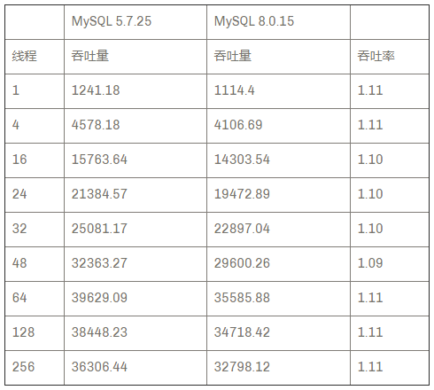											
OLTP_POINT_SELECT（latin1 字符集）的结果：
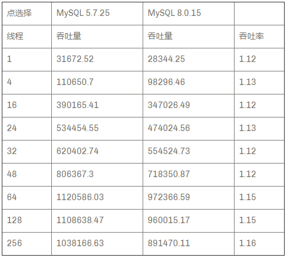											
我们可以看到，在 OLTP_READ_ONLY 的工作负载中，MySQL 8.0.15 慢了 10％，而对于 OLTP_POINT_SELECT 的工作负载，MySQL 8.0.15 慢了 12-16％。
虽然差异不一定很大，但这足以说明 MySQL 8.0.15 在这组测试的各种工作负载中，性能不如 MySQL 5.7.25。
但是，如果我们使用 utf8mb4 字符集而不是 latin1，结果的似乎会改变。
因为 utf8mb4 现在是 MySQL 8.0 中的默认字符集，让我们比较 MySQL 5.7.25 的 latin1 和 utf8mb4。
但在我们这样做之前，让我们来看看 COLLATION（校对字符集）。
MySQL 5.7.25 使用默认排序规则 utf8mb4_general_ci，但是，我读到要对东欧语言使用正确的排序和比较，您可能需要使用 utf8mb4_unicode_ci 排序规则。
所以让我们比较每个版本 latin1 和 utf8mb4（默认排序规则）。首先是 5.7：
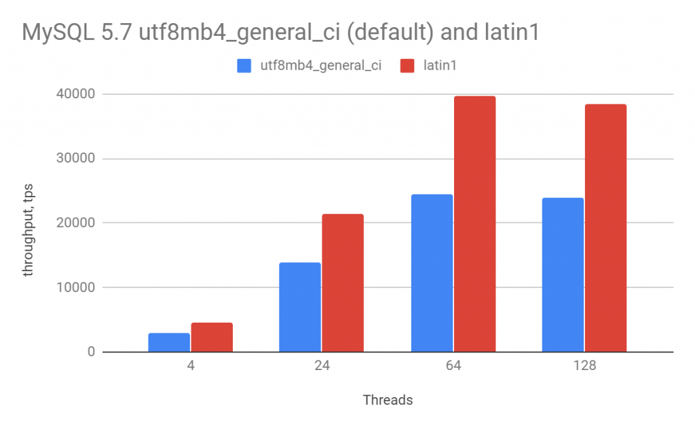											
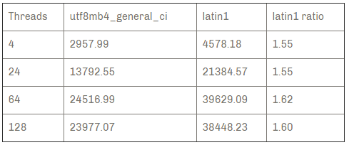											
所以在这里我们可以看到 MySQL 5.7 中的 utf8mb4 实际上比 latin1 慢得多（55-60％）
对于 MySQL 8.0.15 也一样
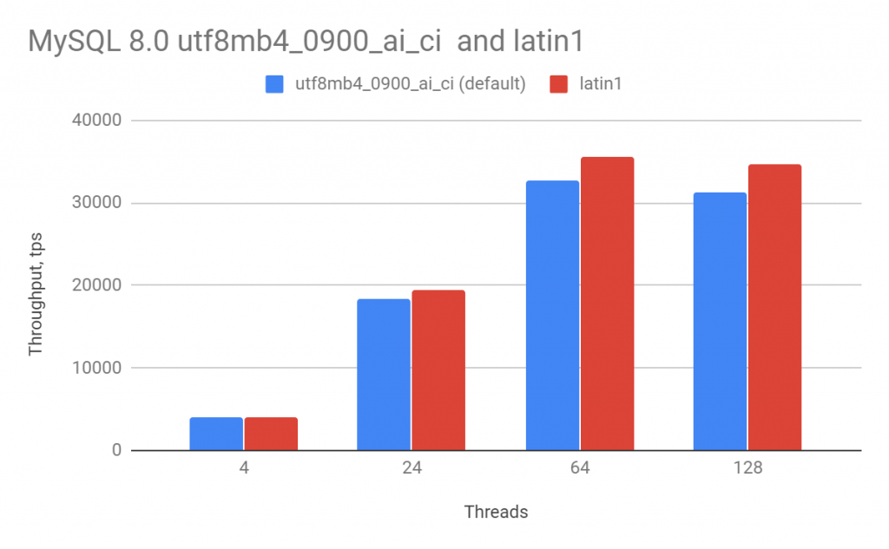											
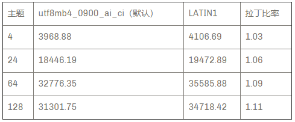											
对于 MySQL 8.0，utf8mb4 的命中率要低得多（高达11％）
现在让我们比较 utf8mb4 的所有排序规则
对于 MySQL 5.7
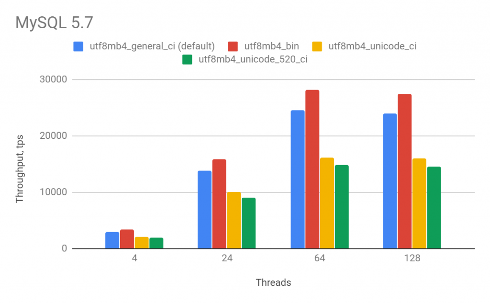											
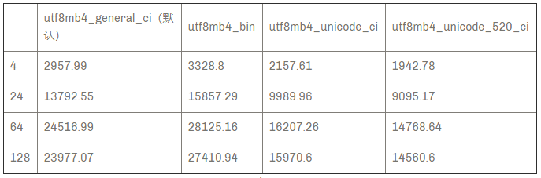											
如果你打算使用 utf8mb4_unicode_ci，你将获得更高的性能（与 utf8mb4_general_ci 相比）
对于 MySQL 8.0.15
											
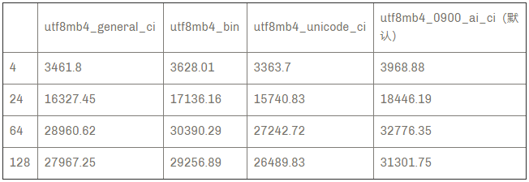											
现在让我们在 utf8mb4 中使用默认排序规则比较 MySQL 8.0 和 MySQL 5.7：
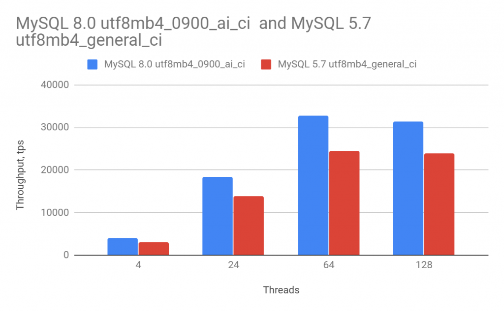											
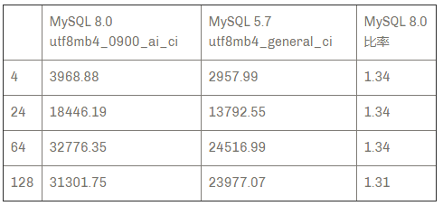											
在这种情况下，MySQL 8.0 实际上比 MySQL 5.7 好34％
**结论**- MySQL 5.7 在 latin1 字符集中胜过 MySQL 8.0
- 如果我们使用 utf8mb4 字符集，MySQL 8.0 会大幅超越 MySQL 5.7
- 请注意，MySQL 8.0 现在默认为 utf8mb4 ，而 MySQL 5.7 默认为 latin1
- 当运行 MySQL 8.0 与 MySQL 5.7 之间的比较时，请注意您正在使用的字符集，因为它可能会影响比较很多。
阅读原文：https://www.percona.com/blog/2019/02/27/charset-and-collation-settings-impact-on-mysql-performance/
**近期社区动态**
