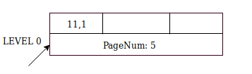
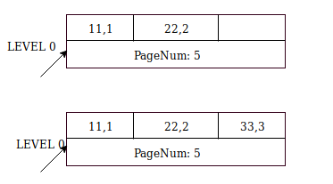
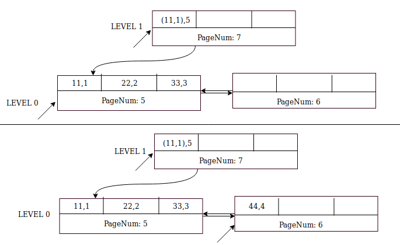
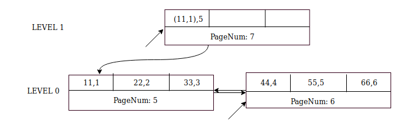
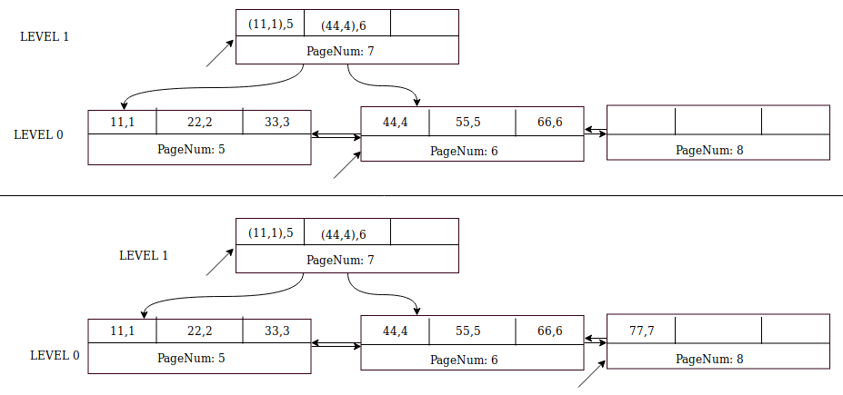
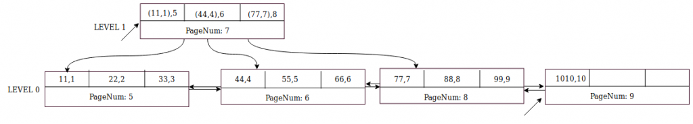

# 技术分享 | InnoDB 排序索引的构建

**原文链接**: https://opensource.actionsky.com/2019-0809-innodb/
**分类**: 技术干货
**发布时间**: 2019-08-12T00:43:07-08:00

---

作者：Satya Bodapati
从 MySQL 5.7 开始，开发人员改变了 InnoDB 构建二级索引的方式，采用自下而上的方法，而不是早期版本中自上而下的方法了。在这篇文章中，我们将通过一个示例来说明如何构建 InnoDB 索引。最后，我将解释如何通过为 innodb_fill_factor 设置更合适的值。
## 索引构建过程
在有数据的表上构建索引，InnoDB 中有以下几个阶段：**1.读取阶段（从聚簇索引读取并构建二级索引条目）
2.合并排序阶段
3.插入阶段（将排序记录插入二级索引）**在 5.6 版本之前，MySQL 通过一次插入一条记录来构建二级索引。这是一种“自上而下”的方法。搜索插入位置从树的根部（顶部）开始并达到叶页（底部）。该记录插入光标指向的叶页上。在查找插入位置和进行业面拆分和合并方面开销很大。从MySQL 5.7开始，添加索引期间的插入阶段使用“排序索引构建”，也称为“批量索引加载”。在这种方法中，索引是“自下而上”构建的。即叶页（底部）首先构建，然后非叶级别直到根（顶部）。
## # 示例
在这些情况下使用排序的索引构建：- ALTER TABLE t1 ADD INDEX（or CREATE INDEX）
- ALTER TABLE t1 ADD FULLTEXT INDEX
- ALTER TABLE t1 ADD COLUMN, ALGORITHM = INPLACE
- OPIMIZE t1
对于最后两个用例，ALTER 会创建一个中间表。中间表索引（主要和次要）使用“排序索引构建”构建。
## # 算法
- 在 0 级别创建页，还要为此页创建一个游标
- 使用 0 级别处的游标插入页面，直到填满
- 页面填满后，创建一个兄弟页（不要插入到兄弟页）
- 为当前的整页创建节点指针（子页中的最小键，子页码），并将节点指针插入上一级（父页）
- 在较高级别，检查游标是否已定位。如果没有，请为该级别创建父页和游标
- 在父页插入节点指针
- 如果父页已填满，请重复步骤 3, 4, 5, 6
- 现在插入兄弟页并使游标指向兄弟页
- 在所有插入的末尾，每个级别的游标指向最右边的页。提交所有游标（意味着提交修改页面的迷你事务，释放所有锁存器）
为简单起见，上述算法跳过了有关压缩页和 BLOB（外部存储的 BLOB）处理的细节。
## # 通过自下而上的方式构建索引
为简单起见，假设子页和非子页中允许的 **最大记录数为 3**
CREATE TABLE t1 (a INT PRIMARY KEY, b INT, c BLOB);
INSERT INTO t1 VALUES (1, 11, 'hello111');
INSERT INTO t1 VALUES (2, 22, 'hello222');
INSERT INTO t1 VALUES (3, 33, 'hello333');
INSERT INTO t1 VALUES (4, 44, 'hello444');
INSERT INTO t1 VALUES (5, 55, 'hello555');
INSERT INTO t1 VALUES (6, 66, 'hello666');
INSERT INTO t1 VALUES (7, 77, 'hello777');
INSERT INTO t1 VALUES (8, 88, 'hello888');
INSERT INTO t1 VALUES (9, 99, 'hello999');
INSERT INTO t1 VALUES (10, 1010, 'hello101010');
ALTER TABLE t1 ADD INDEX k1(b);
InnoDB 将主键字段追加到二级索引。二级索引 k1 的记录格式为(b, a)。在排序阶段完成后，记录为：
(11,1), (22,2), (33,3), (44,4), (55,5), (66,6), (77,7), (88,8), (99,9), (1010, 10)
## 初始插入阶段
让我们从记录 (11,1) 开始。- 在 0 级别（叶级别）创建页
- 创建一个到页的游标
- 所有插入都将转到此页面，直到它填满了
											
箭头显示游标当前指向的位置。它目前位于第 5 页，下一个插入将转到此页面。还有两个空闲插槽，因此插入记录 (22,2) 和 (33,3) 非常简单
											
对于下一条记录 (44,4)，页码 5 已满（前面提到的假设最大记录数为 3）。这就是步骤。
## 页填充时的索引构建
- 创建一个兄弟页，页码 6
- 不要插入兄弟页
- 在游标处提交页面，即迷你事务提交，释放锁存器等
- 作为提交的一部分，创建节点指针并将其插入到 【当前级别 + 1】 的父页面中（即在 1 级别）
- 节点指针的格式 (子页面中的最小键,子页码) 。第 5 页的最小键是 (11,1) 。在父级别插入记录 ((11,1)，5)。
- 1 级别的父页尚不存在，MySQL 创建页码 7 和指向页码 7 的游标。
- 将 ((11,1)，5) 插入第 7 页
- 现在，返回到 0 级并创建从第 5 页到第 6 页的链接，反之亦然
- 0 级别的游标现在指向兄弟页，页码为 6
- 将 (44,4) 插入第 6 页
											
下一个插入 &#8211; (55,5) 和 (66,6) &#8211; 很简单，它们转到第 6 页。
											
插入记录 (77,7) 类似于 (44,4)，除了父页面 （页面编号 7） 已经存在并且它有两个以上记录的空间。首先将节点指针 ((44,4),8) 插入第 7 页，然后将 (77,7) 记录到同级 8 页中。
											
插入记录 (88,8) 和 (99,9) 很简单，因为第 8 页有两个空闲插槽。
											
下一个插入 (1010,10) 。将节点指针 ((77,7),8) 插入 1级别的父页（页码 7）。
MySQL 在 0 级创建同级页码 9。将记录 (1010,10) 插入第 9 页并将光标更改为此页面。
											
以此类推。在上面的示例中，数据库在 0 级别提交到第 9 页，在 1 级别提交到第 7 页。
我们现在有了一个完整的 B+-tree 索引，它是自下至上构建的！
## # 索引填充因子
全局变量 innodb_fill_factor 用于设置插入 B-tree 页中的空间量。默认值为 100，表示使用整个业面（不包括页眉）。聚簇索引具有 innodb_fill_factor=100 的免除项。 在这种情况下，聚簇索引也空间的 1 /16 保持空闲。即 6.25% 的空间用于未来的 DML。
值 80 意味着 MySQL 使用了 80% 的页空间填充，预留 20% 于未来的更新。
如果 innodb_fill_factor=100 则没有剩余空间供未来插入二级索引。如果在添加索引后，期望表上有更多的 DML，则可能导致业面拆分并再次合并。在这种情况下，建议使用 80-90 之间的值。此变量还会影响使用 OPTIMIZE TABLE 和 ALTER TABLE DROP COLUMN, ALGOITHM=INPLACE 重新创建的索引。
也不应该设置太低的值，例如低于 50。因为索引会占用浪费更多的磁盘空间，值较低时，索引中的页数较多，索引统计信息的采样可能不是最佳的。优化器可以选择具有次优统计信息的错误查询计划。
## # 排序索引构建的优点
- 没有页面拆分（不包括压缩表）和合并
- 没有重复搜索插入位置
- 插入不会被重做记录（页分配除外），因此重做日志子系统的压力较小
## # 缺点
ALTER 正在进行时，插入性能降低 **Bug＃82940**，但在后续版本中计划修复。
阅读原文：https://www.percona.com/blog/2019/05/08/mysql-innodb-sorted-index-builds/
**近期社区动态**
