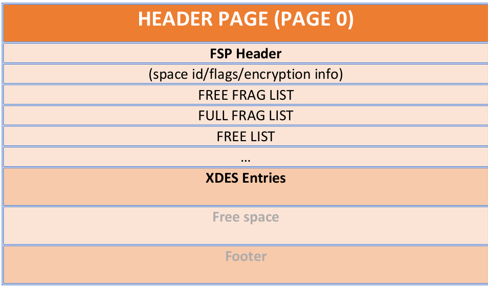

# 技术分享 | InnoDB 的表空间管理

**原文链接**: https://opensource.actionsky.com/20191114-innodb/
**分类**: 技术干货
**发布时间**: 2019-11-17T22:08:22-08:00

---

**作者：****Mayank Prasad**
原文：https://mysqlserverteam.com/innodb-tablespace-space-management/
在 InnoDB 中，用户定义的表及其对应的索引数据存储在扩展名为 `.ibd` 的文件中。表空间有两种类型，常规（或共享）表空间和每表独立表空间。对于共享表空间，来自许多不同表及其对应索引的数据可以驻留在单个 `.ibd` 文件中。而对于每表独立表空间，单个表的数据及其索引位于一个 `.ibd` 文件中。
**. IBD 文件**这些文件通常位于数据目录中。让我们尝试创建一个表 `test.t1`。- `mysql>CREATE TABLE test.t1 (c INT) engine=InnoDB;`
- 
- `$ cd <PATH_TO_DATA_DIR>/test`
- `$ ls`
- `t1.ibd`
上面是独立表空间文件，即与表 `t1` 相关的表和索引数据将驻留在此文件中。
**表空间（TABLESPACE）**对于每表独立表空间，表空间名称与 文件/表 名称的名称相同，即对于上面的表 `t1`，表空间名称将为 `t1`。如果它是使用名称 `my_tablespace` 创建的常规（或共享）表空间，则该表空间名称将是 `my_tablespace`。这些表空间用唯一的 ID 标识，称为 tablespace ID。
**页（PAGES） **表空间文件由固定大小的页数组成。有不同类型的页面可用于不同目的。我们将在接下来的部分中详细介绍所有这些内容。在此只需记住，表空间文件是许多固定大小的页面的集合。
											
**区（EXTENTS） **区是表空间内连续页面的集合。区大小为 1 MB。因此，如果页面大小为 16 Kb，则一个区中可能有 64 页。因此，如果我们再次查看表空间文件，它是区的集合。
											
**标头页（HEADER PAGE） **表空间的元数据信息没有单独的存储。它存储在标头页（始终为 0 页）的同一文件中。现在让我们详细了解一下。
											
空闲片段列表（FREE FRAGS LIST）：区段链接列表的基节点指针，这些区段具有要“单独”分配的页面。此列表包含具有至少一个可用页面分配的范围。
完整列表（FULL FRAGS LIST）：区段链接列表的基节点指针，这些区段具有要“单独”分配的页面。此列表包含没有可用页面分配的范围。
空闲列表（FREE LIST）：区自由分配的链接列表的基本节点指针。该列表的区可以分配给文件段（稍后描述），也可以分配给空闲片段列表。
XDES 条目（XDES Entries）：表空间中第一组扩展的扩展描述符条目（稍后描述）。
**扩展描述符页（XDES页）**区是页的集合。我们需要存储与属于某个范围的页相关的一些元数据信息。要存储此信息，我们有“扩展描述符页”。对于 16 K 的页大小，一个 XDES 条目（稍后描述）的大小为 40 字节，用于提供有关 64 页的元数据信息。为了易于实现，一个 XDES 页面条目所覆盖的页面数等于页大小。基于此，可以很容易地找到每个页面大小的 XDES 页中 XDES 条目的数量。
											
随着表空间的增加（即添加了更多数据），将分配更多的扩展数据块（更多的页）。一旦区的总数量大于 XDES 页可以跟踪的范围，就会分配一个新的 XDES 页，该页将用于跟踪下一组区。注意：对于第一组扩展，标头页用于存储 XDES 条目。下图描述了一个 EXTENT 描述符页和各个 XDES 条目。
											
注意：列表节点中的上一个和下一个指针指向列表中的 上一个 / 下一个 区：- FULL，NOT_FULL 和 FREE LIST（如果此区属于文件段）。
- FREEFRAG，FULLFRAG，FREE，其它。
**一些数字！**一个扩展区大小 = 1 MB
一页大小 = 16 KB
一个区内的总页数 = 64 页
一个 XDES 页中的 XDES 条目总数 = 256
可以在一个 XDES 页面中涵盖总范围 = 256
总页面数可以包含一个 XDES 页面 = 16384
*因此，一旦表空间大小超过 16384 页，我们需要分配一个新的 XDES 页以保留更多数据区（待分配）。*
**INODE 页（INODE PAGE）**这些页面保留有关文件段（FSEG）的信息。因此，在进入 INDOE 页条目之前，让我们了解文件段。
**文件段（FILE SEGMENT）  **文件段是一个逻辑单元，是页面和区段的集合。下图描述了文件段的高级逻辑（非物理）视图。
											
- FRAG ARRAY
分配给该段的单页数组（32 个条目）。
- NOT FULL LIST
基本节点指针，指向分配给该段的扩展区的链接列表，并具有至少一个空闲页面。
- FULL LIST
指向分配给此段的扩展区的链表的基本节点指针，并且没有空闲页。
- FREE LIST
指向分配给该段的扩展区的链接列表的基本节点指针，并具有所有可用页。
**注意 1：**FRAG ARRAY 中的页面属于一个区，该区是 FRAG_FULL / FRAG_FREE LIST 的一部分（即文件段 ID 为 0），并在表空间标头页中维护。如前所述，这些扩展区中的页面被许多段共享。如下图所示：
											
**注意 2：**当扩展区变为空闲（即不再使用的页面）时，它不会移动到“文件段”的“空闲”列表中。相反，它将移至在表空间级别维护的 FREE LIST。> **问：为什么我们需要文件段？****答：这是为了简化页面管理。因此，一旦删除文件段，就知道要释放所有扩展区和页面。**
随着表的增长，它将在每个文件段中分配各个页面，直到片段数组变满为止，然后切换到一次分配一个扩展区，最终切换到一次分配四个扩展区。
**INODE 页（重新访问）**现在，让我们回到 INODE 页面。INODE 页保留文件段的条目，即 INODE 页中的每个条目代表一个文件段。上面描述的图 6（在其中描述了文件段的高级视图）实际上是 INODE 页面中的条目，被称为“ INODE 文件段条目”。让我们再来看一看：
											
> **问：索引中如何使用文件段？****答：InnoDB 中的每个索引（由 B +树表示）使用两个文件段。**
- 叶子页段：将叶子页存储在 B 树中。
- 非叶子页段：将非叶子（中间）页面存储在 B 树中。
在页面上，FSEG HEADER 是存储这两个文件段 INODE 条目信息的位置。从这些条目中，我们查询 INODE 页面以找到相应的文件段信息。
											
**注意：**对于索引，因为索引只有一个叶子段和一个非叶子段，所以仅使用根页的 FSEG HEADER 存储这些信息。对于 B 树中的其余页面，FSEG HEADER 填充为 0。杰里米·科尔（Jeremy Cole）在他的博客中给出的一个很好的说明性示例：*“例如，在一个新创建的表中，唯一存在的页面将是根页面，它也是一个叶页面，但存在于“内部”文件段中（因此以后不必移动它）。“叶”文件段 INODE 列表和片段数组将全部为空。“内部”文件段 INODE 列表将全部为空，并且单个根页面将在片段数组中。”*
											
**摘要**那么，当我们 创建/删除 索引时，它们如何工作？如上所述，一旦创建索引（即，至少创建根页面），将为该索引分配两个文件段。一个用于叶子页面，到目前为止将没有页面，一个用于非叶子页面，将仅分配一个页面即根页面。现在，随着索引大小的增长，即 B 树的增长，- 步骤 1：新页面在 FRAG ARRAY 中分配。
- 步骤 2：需求跨越 32 页后，便会将一个区分配给分段并将其移至 “FREE LIST”。
- 步骤 3：一旦使用了该新扩展区的页面，该扩展区将移至 “非完整列表”。
- 步骤 4：一旦使用了该区的所有页面，它将移至 “FULL LIST” 并分配一个新的区（与步骤 3 相同）。
从根页面删除索引后，我们将知道两个文件段。我们继续将这两个文件段中的所有扩展区标记为空闲。感谢您使用 MySQL！
**社区近期动态**
**No.1**
**Mycat 问题免费诊断**
诊断范围支持：
Mycat 的故障诊断、源码分析、性能优化
服务支持渠道：
技术交流群，进群后可提问
QQ群（669663113）
社区通道，邮件&电话
osc@actionsky.com
现场拜访，线下实地，1天免费拜访
关注“爱可生开源社区”公众号，回复关键字“Mycat”，获取活动详情。
**No.2**
**社区技术内容征稿**
征稿内容：
格式：.md/.doc/.txt
主题：MySQL、分布式中间件DBLE、数据传输组件DTLE相关技术内容
要求：原创且未发布过
奖励：作者署名；200元京东E卡+社区周边
投稿方式：
邮箱：osc@actionsky.com
格式：[投稿]姓名+文章标题
以附件形式发送，正文需注明姓名、手机号、微信号，以便小编及时联系