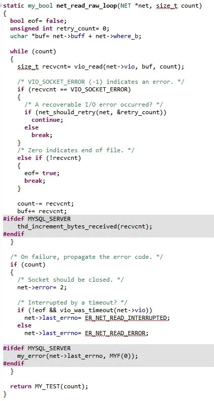
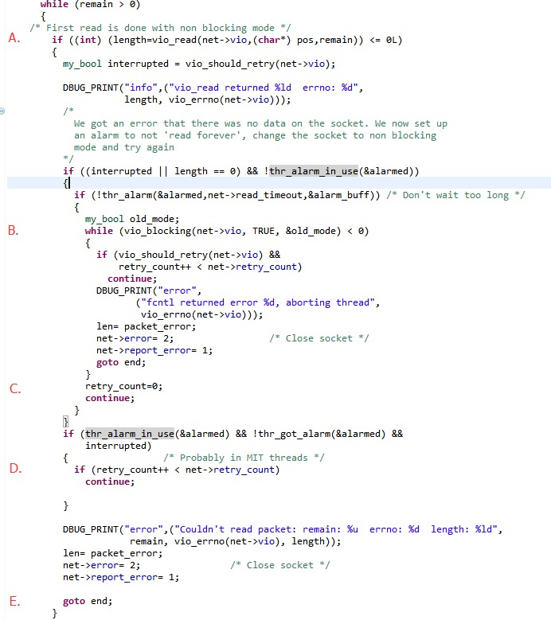

# 技术分享 | MySQL C API 参数 MYSQL_OPT_READ_TIMEOUT 的一些行为分析

**原文链接**: https://opensource.actionsky.com/20191224-mysql/
**分类**: MySQL 新特性
**发布时间**: 2019-12-23T23:45:59-08:00

---

MYSQL_OPT_READ_TIMEOUT 是 MySQL c api 客户端中用来设置读取超时时间的参数。在 MySQL 的官方文档中，该参数的描述是这样的：
MYSQL_OPT_READ_TIMEOUT (argument type: unsigned int *)
The timeout in seconds for each attempt to read from the server. There are retries if necessary, so the total effective timeout value is three times the option value. You can set the value so that a lost connection can be detected earlier than the TCP/IPClose_Wait_Timeout value of 10 minutes.
也就是说在需要的时候，实际的超时时间会是设定值的 3 倍。但是实际测试后发现实际的超时时间和设置的超时时间一致。
而具体什么时候发生三倍超时，在文档中没有找到。所以对 MySQL 5.7.20 的源码进行了一些分析。
使用 GDB 调试代码找了实际与 mysql server 通信的代码，如下：
											
其中 vio_read() 函数中，使用 recv 和 poll 来读取报文和做读取超时。net_should_retry() 函数只有在发生 EINTR 时才会返回 true。从这段代码来看是符合测试结果的，并没有对读取进行三次重试。只有在读取操作被系统中断打断时才会重试，但是这个重试并没有次数限制。
从上面代码的分析可以看出，代码的逻辑和文档的描述不符。于是在一顿搜索后，找到了一个 MySQL 的 BUG(Bug #31163)。该 BUG 报告了在 MySQL 5.0 中，MySQL c api 读取的实际超时时间是设置的三倍，与现有文档描述相符。于是对 MySQL 5.0.96 的代码又进行分析。
同样使用 GDB 找到了通信部分的代码。这次找到了重试三次的代码，如下：
											
这个版本的 MySQL api 的读写超时是直接使用的 setsockopt 设置的。第一次循环，在 A 点发生了第一次超时（虽然注释写的非阻塞，但是客户端的连接始终是阻塞模式的）。然后在 B 点将该 socket 设置为阻塞模式，C 点这里重置 retry 次数。由于设置了 alarm 第二次以后的循环会直接进入 D 点的这个分支，并且判断循环次数。作为客户端时 net->retry_count 始终是 1，所以重试了两次，共计进行了 3 次 vioread 后从 E 点退出函数。
由上面的分析可知，MySQL 文档对于该参数的描述已经过时，现在的 MYSQL_OPT_READ_TIMEOUT 并不会出现三倍超时的问题。而 Bug #31163 中的处理结果也是将文档中该参数的描述更新为实际读取超时时间是设定时间的三倍。也许是 MySQL 的维护者们在后续版本更新时忘记更新文档吧。
**社区近期动态**
**No.1**
**Mycat 问题免费诊断**
诊断范围支持：
Mycat 的故障诊断、源码分析、性能优化
服务支持渠道：
技术交流群，进群后可提问
QQ群（669663113）
社区通道，邮件&电话
osc@actionsky.com
现场拜访，线下实地，1天免费拜访
关注“爱可生开源社区”公众号，回复关键字“Mycat”，获取活动详情。
**No.2**
**社区技术内容征稿**
征稿内容：
格式：.md/.doc/.txt
主题：MySQL、分布式中间件DBLE、数据传输组件DTLE相关技术内容
要求：原创且未发布过
奖励：作者署名；200元京东E卡+社区周边
投稿方式：
邮箱：osc@actionsky.com
格式：[投稿]姓名+文章标题
以附件形式发送，正文需注明姓名、手机号、微信号，以便小编及时联系