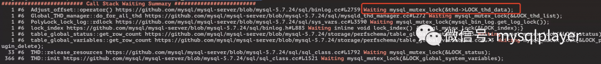
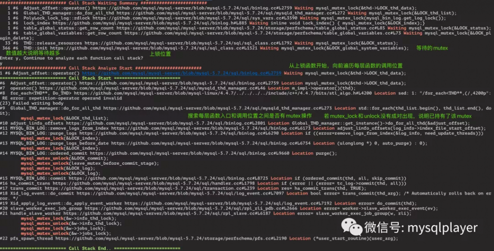
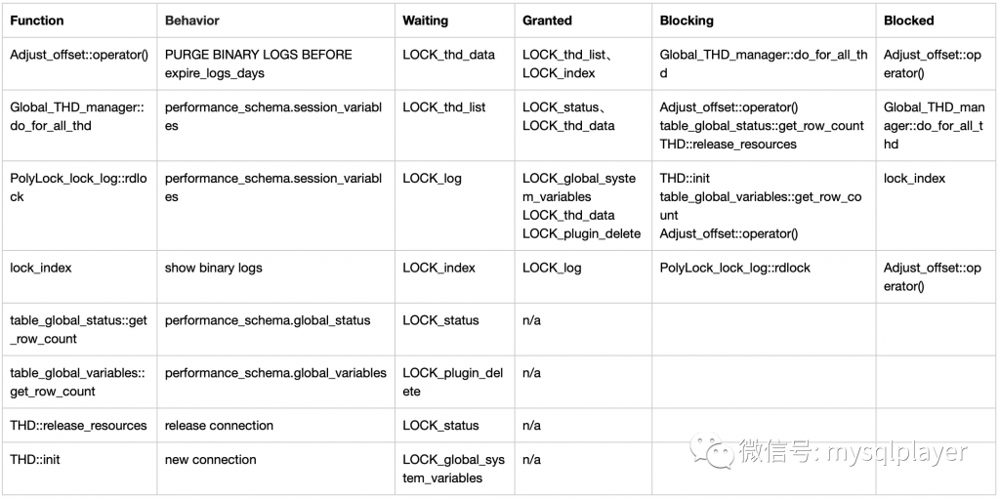

# 技术分享 | MySQL Hang 了，如何快速分析 Call Stack 有效信息

**原文链接**: https://opensource.actionsky.com/20210129-mysql/
**分类**: MySQL 新特性
**发布时间**: 2021-01-29T01:04:54-08:00

---

作者：洪斌
爱可生南区负责人兼技术服务总监，MySQL  ACE，擅长数据库架构规划、故障诊断、性能优化分析，实践经验丰富，帮助各行业客户解决 MySQL 技术问题，为金融、运营商、互联网等行业客户提供 MySQL 整体解决方案。
本文来源：转载自公众号-玩转MySQL
*爱可生开源社区出品，原创内容未经授权不得随意使用，转载请联系小编并注明来源。
你是否会经常遇到 MySQL hang 了而不知所措？面对繁杂的 callstack 信息如何才能快速分析出原因？
本文将通过一个案例，介绍如何快速分析这类问题的方法。
当我们遇到 MySQL hang 的场景时，大概率是程序内部发生了 mutex 冲突造成的。这时我们需要在重启服务前，先搜集 callstack 信息。
`pstack `pidof mysqld` > mysql_callstack
`注意：mysqld 需要包含符号表
有了 callstack 信息，我们便可以开始进行分析了。
## 分析步骤
1. 首先，在 callstack 日志筛选出每个线程调用 inline_mysql_mutex_lock 前的函数，以及对应的 mutex 代码位置，此处便是线程在等待的 mutex。
											
2. 然后，从该函数向前遍历每个函数调用，寻找这些函数，看已经成功获得哪些 mutex。
											
这里我用脚本对日志进行格式化处理，将每个函数都映射到了 github 的代码位置，点击链接可以直接跳转，使用 Chrome 浏览器配合 sourcegraph 查看代码也很香。
3. 最后，从日志中回溯每个上锁函数所对应的前端操作行为，并绘制一张关于线程持有和等待 mutex 的表格，便能直观的分析出函数的冲突关系。
											
## 总结
由于 show binlog logs 操作、purge binlog 以及从读取 performance_schema 读取会话变量几个操作并行发生产生 mutex 冲突，导致无法新建连接请求。
- show binary logs，持有 LOCK_log，等待 LOCK_index
- binlog purge，持有 LOCK_index,  等待 LOCK_thd_data
- 读取 performance_schema.session_variables，持有 LOCK_thd_data, LOCK_global_system_variables, 等待 LOCK_log
- 新建连接，等待 LOCK_global_system_variables
最终确认是 binlog_transaction_dependency_* 变量的读取需要获取 LOCK_log 锁，此处容易造成死锁，MySQL 5.7.25 修复了此问题。
分析脚本：https://gist.github.com/kevinbin/27c371abf3ef5b80c03e05357afcfccd