# 技术分享 | MySQL binlog 分析工具 analysis_binlog 的使用介绍

**原文链接**: https://opensource.actionsky.com/20210331-mysql/
**分类**: MySQL 新特性
**发布时间**: 2021-03-31T00:39:30-08:00

---

作者：莫善
某互联网公司高级 DBA。
本文来源：原创投稿
*爱可生开源社区出品，原创内容未经授权不得随意使用，转载请联系小编并注明来源。
**本文目录**一、概述二、环境信息三、环境准备    1、centos1    2、centos2    3、centos3四、测试    1、准备数据    2、flush binlog    3、MySQL 压测    4、解析 binlog五、总结
## 一、概述
作为一个 MySQL DBA，查看分析 binlog 是日常工作的一部分。不知道你是否遇到过这样的需求：查询一个时间段内各个表的 dml 统计情况。但，如果 binlog 文件很多呢？又或者负责的业务线比较多，有多个业务都有这种需求呢？
其实需求很简单，只是操作起来有点头疼？所以，本文就针对这类需求做了一个测试。
如果你在工作中也有类似的烦恼，或者经常需要批量解析 binlog，这篇文章或许对你有帮助。
## 二、环境信息
											
## 三、环境准备
#### 1、centos1
**（1）安装 MySQL**
`hostname
ip a|grep 192
cat /proc/cpuinfo | grep processor
free -m
df -h|grep data
/usr/local/mysql80/bin/mysql -uroot -p1234567890 -h192.168.1.10 -P3306 -e "select version()"`
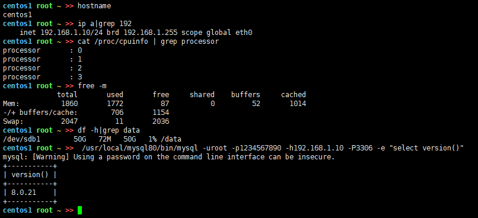											
提示：省略安装 MySQL 的步骤。
#### 2、centos2
**（1）安装 sysbench**
`sysbench --version`
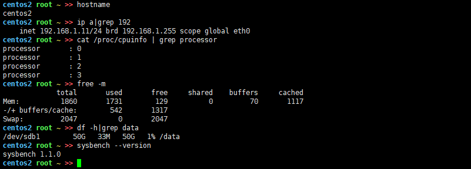											
提示：省略安装 sysbench 的步骤。centos 6 的 yum 可以参照如下操作配置。
`备份源文件：
mv /etc/yum.repos.d/CentOS-Base.repo /etc/yum.repos.d/CentOS-Base.repo-backup 
编辑文件：vi /etc/yum.repos.d/CentOS-Base.repo
[base]
name=CentOS-6
failovermethod=priority
#baseurl=https://vault.centos.org/6.9/os/x86_64/
baseurl=http://mirrors.sohu.com/centos/6.10/os/x86_64/
gpgcheck=0
清理软件源,重新建立源数据缓存
yum clean all && yum makecache`
**（2）准备测试脚本**
`https://gitee.com/mo-shan/script/blob/master/sysbench.sh   #这里获取，或者可以自己写脚本`
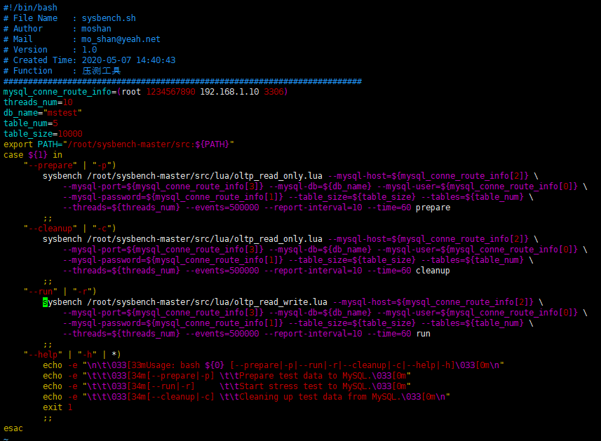											
											
#### 3、centos3
**（1）analysis_binlog**
analysis_binlog 是 git 开源项目，可实现高效分析 binlog，现有功能如下：
- 统计各个表的 dml 次数，表的最后修改时间。
- 业务表的 binlog to sql。
- 多个 binlog 文件可并行解析。
`# yum –y install git #没有git环境的需要安装git
mkdir -p /data/git && cd /data/git/ && git clone https://gitee.com/mo-shan/analysis_binlog.git
# https://gitee.com/mo-shan/analysis_binlog/tree/master # 安装详情可参考这里`
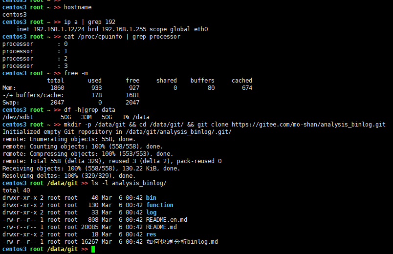											
常用参数介绍
`--mysqlbinlog-path or –mpath     #mysqlbinlog工具的路径，不指定就使用系统PATH
--binlog-file or -bfile           #binlog文件列表，逗号隔开 
--threads or -w                   #线程数，并行解析binlog。 
--binlog2sql or -sql              #将binlog解析成sql`
**（2）准备 MySQL**
不需要安装 MySQL，但是分析工具依赖 mysqlbinlog 工具，所以需要用同版本的 MySQL 安装包。
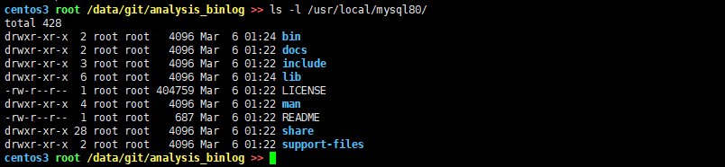											
## 四、测试
#### 1、准备数据
利用测试脚本准备五张表，并分别 insert 1w 行的数据。请先创建测试库。
`/usr/local/mysql80/bin/mysql -uroot -p1234567890 -h192.168.1.10 -P3306
create database if not exists mstest; #创建测试库这个库名跟sysbench脚本对应`
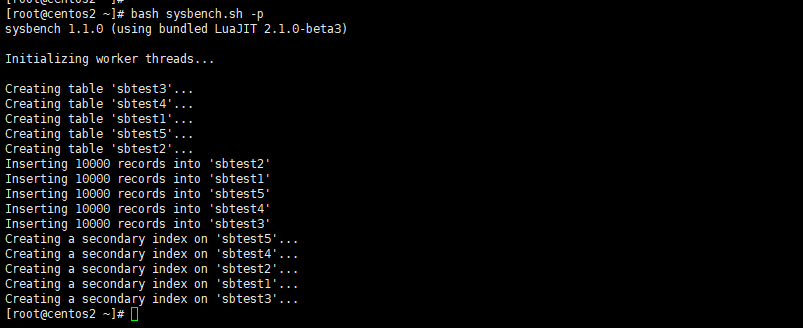											
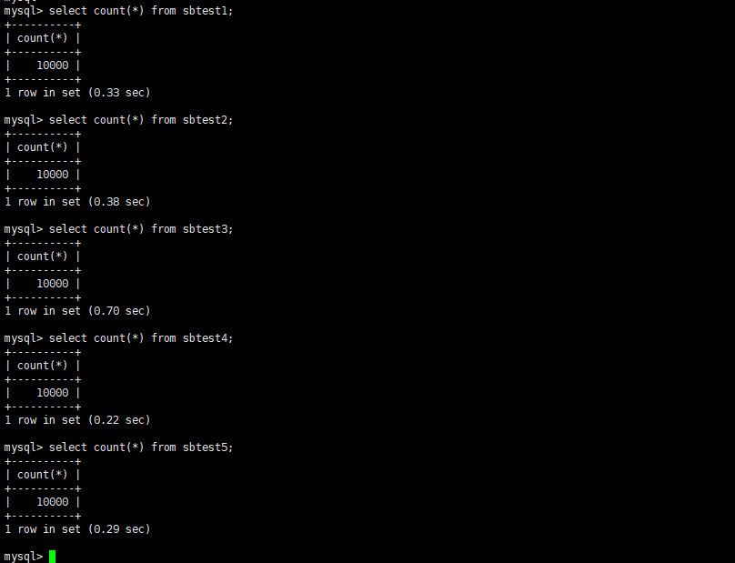											
#### 2、flush binlog
为了测试结果更加直观，建议先 flush MySQL 的 binlog。
`/usr/local/mysql80/bin/mysql -uroot -p1234567890 -h192.168.1.10 -P3306
flush binary logs;
show binary logs;`
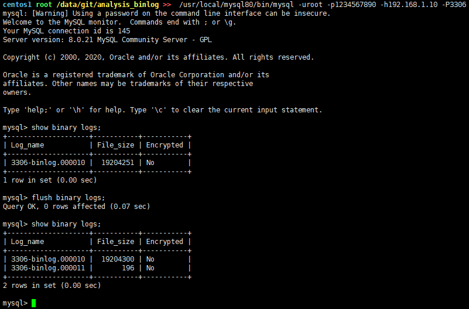											
#### 3、MySQL 压测
利用 sysbench 并发十个线程开始压测。
select 操作时不会记录 binlog，为了结果更加直观，本次使用的 lua 脚本只有写操作。【oltp_update_non_index.lua】 压测时间为 60s，压测结果如下：2860 个 dml，即 2860 个事务。
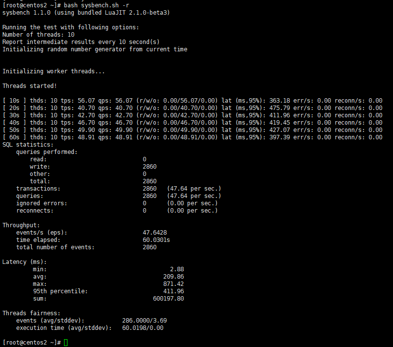											
#### 4、解析 binlog
**（1）拷贝 binlog 文件**
将需要解析的 binlog 拷贝到分析服务器【centos1  centos3】。本次测试只需要分析【3306-binlog.000011】一个文件。
											
**（2）解析 binlog- 统计 dml**
统计各个表的 dml 情况。结果如下：统计到总共有 2860 个 update，2860 个事务。
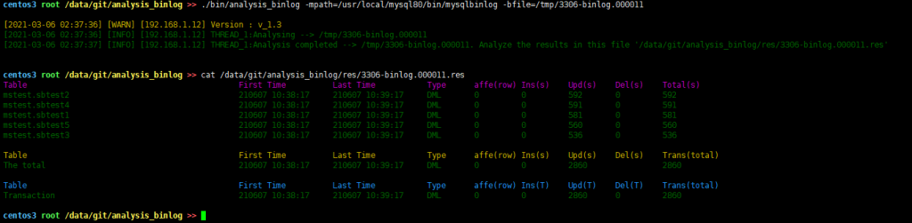											
**（3）解析 binlog-binlog2sql**
针对各个表可以实现 binlog2sql。
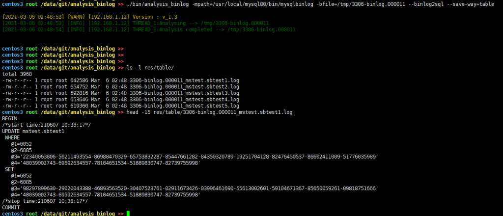											
**（4）解析 binlog- 并行**
并行解析多个文件。
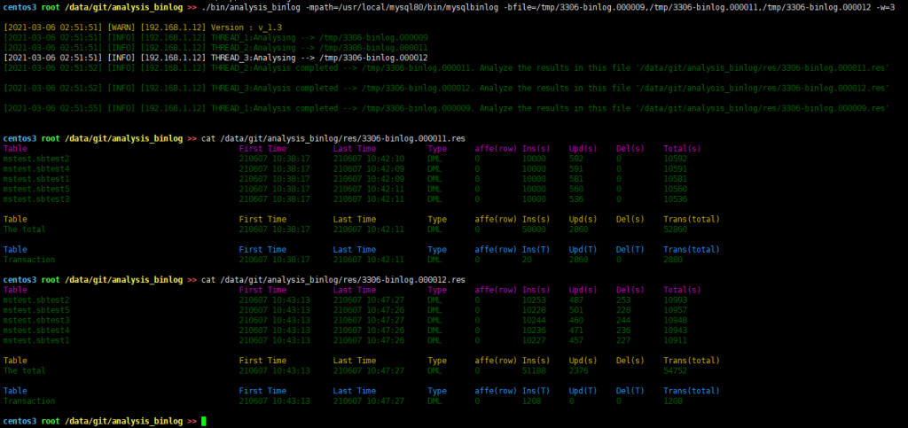											
## 五、总结
本文主要介绍了通过 analysis_binlog 工具解决开篇提出的需求，希望对你有帮助。
analysis_binlog 工具还有很多可选的参数，有兴趣的读者可以通过【&#8211;help】查看帮助手册。
analysis_binlog 工具利用内存换取时间，加上可以并行分析多个文件，所以能做到高效解析 binlog，但是这可能也是缺点。不建议在生产环境服务器使用，否则容易将内存打满。
使用 analysis_binlog 工具过程中有任何问题都可以在 git 上给我留言或者也欢迎广大读者提 Issues。
**相关推荐：**
[技术分享 | MySQL Load Data 的多种用法](https://opensource.actionsky.com/20210325-mysql/)
[技术分享 | MySQL 主从复制中创建复制用户的时机探讨](https://opensource.actionsky.com/20210318-mysql/)
[技术分享 | 一次数据库迁移](https://opensource.actionsky.com/20210312-mysql/)