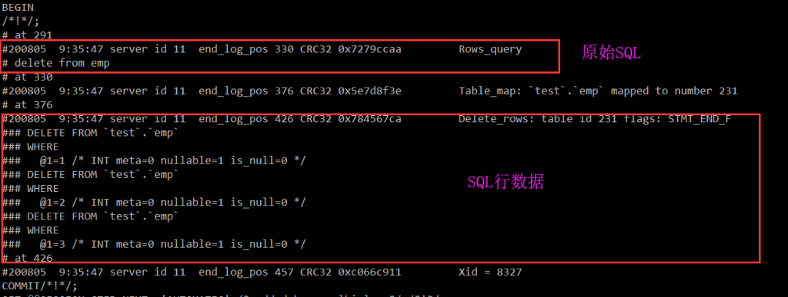
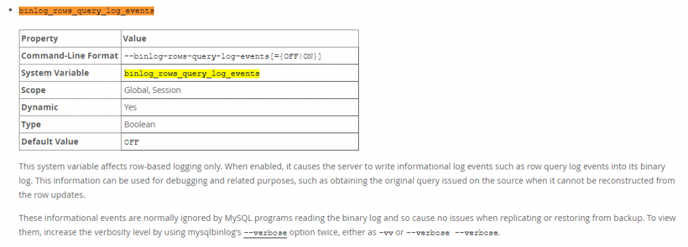
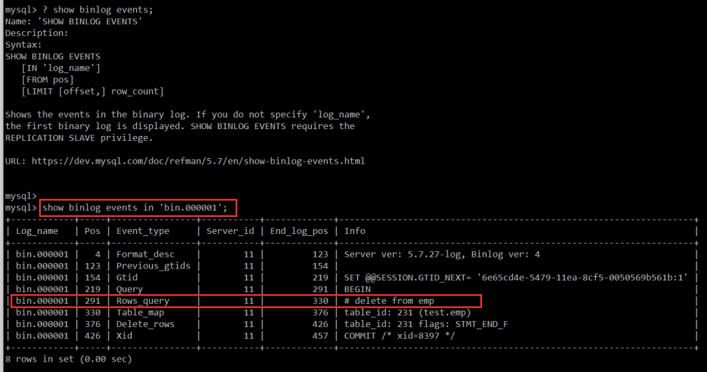
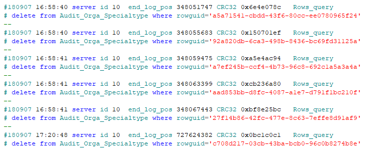

# 技术分享 | MySQL binlog 日志解析

**原文链接**: https://opensource.actionsky.com/20200807-mysql/
**分类**: MySQL 新特性
**发布时间**: 2020-08-07T00:32:02-08:00

---

作者：xuty
本文来源：原创投稿
*爱可生开源社区出品，原创内容未经授权不得随意使用，转载请联系小编并注明来源。
很多时候，当我们的业务数据产生了不正常的变化，但却无法得知这类操作是在哪里进行，并且如何进行，单单从程序当面排查很费力。那么就需要通过分析数据库日志来得到历史执行 SQL，根据 SQL 执行逻辑来确认代码位置，进而确认是否是 BUG，亦或是误操作等。
#### 一 、binlog 简介
**binlog** 是 MySQL Server 层记录的二进制日志文件，用于记录 MySQL 的数据更新或者潜在更新（比如 DELETE 语句执行删除而实际并没有符合条件的数据），**select 或 show** 等不会修改数据的操作则不会记录在 binlog 中。
通常在 **binlog_format =  ROW** 的环境下，我们可以通过 binlog 获取历史的 SQL 执行记录，前提是必须开启 **binlog_rows_query_log_events** 参数（默认关闭，建议开启），该参数可以通过**rows_query_event** 事件记录原始的 SQL，如果不开启的话，则只能获取 SQL 对应的行数据。
											
											
#### 二、binlog 解析
> 由于 binlog 是二进制文件，所以无法直接使用文本打开，需要使用对应的解析工具才可以查看具体内容。
2.1 show binlog events> show binlog events 方式可以解析指定 binlog 日志，但不适宜提取大量日志，速度很慢，不建议使用。
											
##### 2.2 mysqlbinlog
> mysqlbinlog 是 mysql 原生自带的 binlog 解析工具，速度快而且可以配合管道命令过滤数据，适合解析大量 binlog 文件，建议使用。
由于 windows 下面无法使用管道命令如此简洁的提取出 SQL，所以这边就只写 Linux 下的使用方法。我平时的做法会将 windows 下面的 binlog 拷贝到 Linux 下，再利用 Linux 的管道命令解析。
个人常用的 Linux 下解析命令：**mysqlbinlog /data/mysql_data/bin.000008  &#8211;database EpointFrame  &#8211;base64-output=decode-rows -vv  &#8211;skip-gtids=true |grep  -C 1 -i &#8220;delete from  Audit_Orga_Specialtype&#8221; > /opt/sql.log**- /data/mysql_data/bin.000008：需要解析的 binlog 日志。
- database：只列出该数据库下的行数据，但无法过滤 Rows_query_event。
- base64-output=decode-rows -vv：显示具体 SQL 语句。
- skip-gtids=true：忽略 GTID 显示。
- grep  -C 1  -i  &#8220;delete from dataex_trigger_record&#8221;：通过管道命令筛选出所需 SQL 及执行时间。
- /opt/sql.log：将结果导入到日志文件，方便查看。
结果示例：
											
**小贴士：**
1. 如果不确定 SQL 格式或是无法筛选到数据，比如因为 delete from 中间冷不丁多一个空格出来，可以使用 grep 多次过滤筛选，比如 **grep  -C 1 -i &#8220;Rows_query&#8221; |grep -C 1    -i &#8220;Audit_Orga_Specialtype&#8221; |grep -C 1 -i &#8220;delete&#8221; **筛选对应表上的 delete 操作。
2. 触发器执行的 SQL 不会记录在 Rows_query_event 中，只会记录对应的行数据。
3. **&#8211;database** 是无法过滤 Rows_query_event 的，只可以过滤行数据。
#### 三、解析方式对比
对于常见的数据库（**SQL Server、Oracle、MySQL**）来说，都具有类似相同的日志来记录历史 SQL，不同的只是日志的记录方式和解析方法：
											
相关文章推荐：
[故障分析 | MySQL 优化案例 &#8211; select count(*)](https://opensource.actionsky.com/20200707-mysql/)
[故障分析 | MySQL 优化案例 &#8211; 字符集转换](https://opensource.actionsky.com/20200630-mysql/)