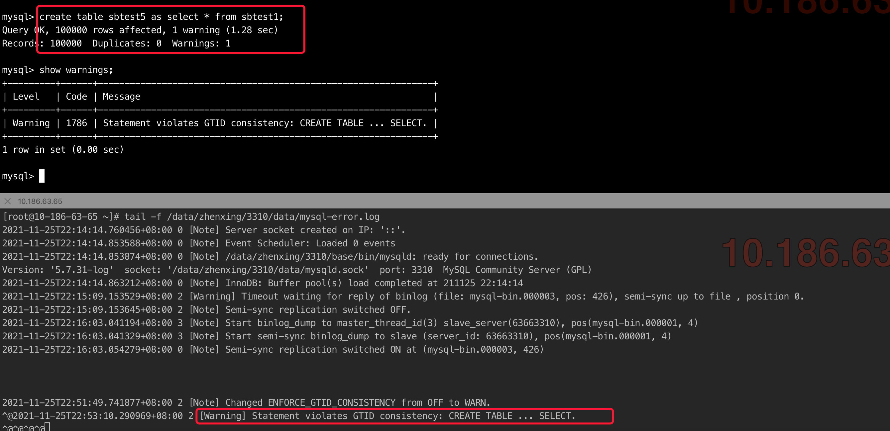
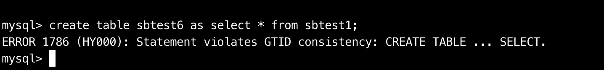
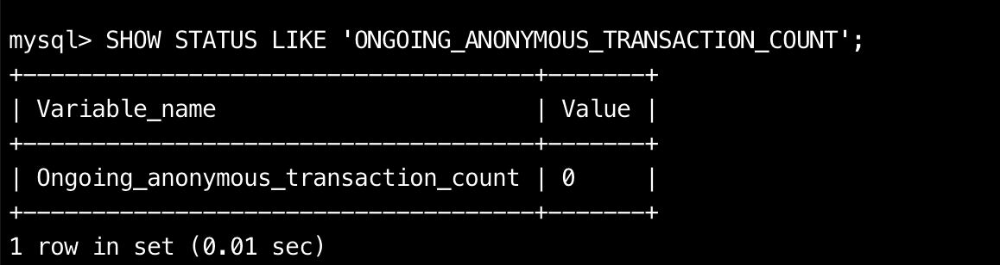
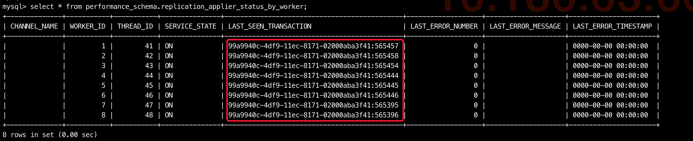

# 技术分享 | MySQL 在线开启 GTID 的每个阶段是要做什么

**原文链接**: https://opensource.actionsky.com/20220120-mysql/
**分类**: MySQL 新特性
**发布时间**: 2022-01-20T00:19:09-08:00

---

作者：余振兴
爱可生 DBA 团队成员，热衷技术分享、编写技术文档。
本文来源：原创投稿
*爱可生开源社区出品，原创内容未经授权不得随意使用，转载请联系小编并注明来源。
## 基本概述
我们知道 MySQL 有 2 种方式指定复制同步的方式，分别为：
- 
基于 binlog 文件名及位点的指定方式
匿名事务(Anonymous_gtid_log_event)
- 
基于GTID(全局事务 ID )的指定方式
GTID事务(Gtid_log_event)
而基于 GTID 的方式在一主多从的架构下主从切换有着明显优势外，对于日常复制异常的故障诊断也更为方便，在日常运维或 MySQL 升级过程中我们免不了要做GTID的开启或关闭，从个人角度而言，我也更倾向于大家做在线开启或关闭 GTID 的操作，一方面该操作能尽可能小的影响数据库停机时间，另一方面在开启或关闭的过程中也顺便可以验证该参数的调整是否会对应用造成影响，从 MySQL 5.7.6 之后便开始支持动态开启和关闭 GTID 模式，其参数 GTID_MODE 有以下取值
- 
OFF &#8211; 只允许匿名事务被复制同步
- 
OFF_PERMISSIVE &#8211; 新产生的事务都是匿名事务，但也允许有 GTID 事务被复制同步
- 
ON_PERMISSIVE &#8211; 新产生的都是 GTID 事务，但也允许有匿名事务被复制同步
- 
ON &#8211; 只允许 GTID 事务被复制同步
其实从该参数的几个取值我们就能看出，在线修改是循序渐进的将匿名事务转化为 GTID 事务过程(反之也一样)，我们先看看在线开启 GTID 分别要做哪些事
## 在线开启GTID
###### 1. 设置 GTID 校验 ENFORCE_GTID_CONSISTENCY为WARN
该操作的目的是允许在主库执行的 SQL 语句违反GTID一致性校验，且只在主库的错误日志中输出 warning 级别日志以作提醒，我们知道 GTID 复制还是有一些限制条件的，其实这里就是为了考虑如果复制方式直接改为 GTID 模式后应用程序因为 GTID 的一些限制导致异常报错，这样做的好处是当我需要开启 GTID 前，我可以把 ENFORCE_GTID_CONSISTENCY 参数开成 WARN 观测一段时间，比如一天，如果观测周期内在错误日志中并没有发现相关的 Warning 信息，那我们再考虑正式开启 GTID 的操作
- 
示例：使用 CREATE TABLE AS SELECT 语法在 GTID 模式下不支持（**题外话：CTAS语法在 8.0.21 以后 GTID 模式下也是支持的，该语法变更为了一个特殊的原子性 DDL 操作**），而 ENFORCE_GTID_CONSISTENCY 设置为 WARN 时，只会在错误日志提示，不会直接报错，

`## 该操作在主从库均执行
SET @@GLOBAL.ENFORCE_GTID_CONSISTENCY = WARN;
`
###### 2. 设置 GTID 校验 ENFORCE_GTID_CONSISTENCY 为 ON
确认上一个步骤未在错误日志中出现相关 Warning 信息后，正式开启 GTID 一致性校验，当设置为 ON 后，如果再执行 CREATE TABLE AS SELECT 语句则会直接报错

`## 该操作在主从库均执行
SET @@GLOBAL.ENFORCE_GTID_CONSISTENCY = ON;
`
###### 3. 设置 GTID_MODE为OFF_PERMISSIVE
如前面对 GTID_MODE 可取值的描述，该操作表示新产生的事务依旧是匿名事务，但也允许有 GTID 事务被复制同步，对于在线开启 GTID 模式而言，该步骤就是一个单纯的过渡属性(注意是为在线关闭 GTID 准备的)，执行完后可快速到下一个阶段
`## 该操作在主从库均执行
SET @@GLOBAL.GTID_MODE = OFF_PERMISSIVE;
`
###### 4. 设置 GTID_MODE为ON_PERMISSIVE
该操作依旧是一个过渡属性，其表示的则是新产生的都是 GTID 事务，但也允许有匿名事务被复制，从这个阶段开始就已经是一个正式转化的过程，但依旧是对两种事务做兼容。
`## 该操作在主从库均执行
SET @@GLOBAL.GTID_MODE = ON_PERMISSIVE;
`
###### 5. (关键点)确保匿名事务回放完毕
该步骤的目的是确保在正式转换为完整的 GTID 模式前，老的匿名事务均已被回放完毕，确保 GTID_MODE 设置为 ON 时，不会因为残留的匿名事务导致复制同步报错，有以下 2 种方式进行校验
`## 该操作仅在从库执行即可
## 方式1:确保该状态值输出的匿名事务数显示为0(注意:只要出现过0即可表示已经转换完成,即使后续该状态值从0变为了大于0的值也不影响)
SHOW STATUS LIKE 'ONGOING_ANONYMOUS_TRANSACTION_COUNT';
## 在从库上多次执行该语句
## 方式2: 查询该视图中LAST_SEEN_TRANSACTION可以观测当前同步的事务是否还存在ANONYMOUS事务
select * from performance_schema.replication_applier_status_by_worker;
`
确保匿名事务数为0

确保回放线程回放的事务都已是GTID事务

###### 6. 触发一轮日志切换 FLUSH LOGS
该操作的目的是为了在主库触发 binlog 的轮换，使新生成的 binlog 都是包含 GTID 的事务（防止一个 binlog 中包含2种类型的事务日志）
`## 该操作仅在主库执行即可
FLUSH LOGS;
`
###### 7. 正式开启 GTID_MODE为ON
正式开启 GTID
`## 该操作在主从库均执行
SET @@GLOBAL.GTID_MODE = ON;
SELECT @@GTID_MODE,@@ENFORCE_GTID_CONSISTENCY;
`
###### 8. 修改配置文件确保 GTID 参数持久化
在 my.cnf 配置文件中增加 GTID 参数，确保重启不会失效，该操作也可在第一步进行
`## 该操作在主从库均执行
gtid-mode                 = ON
enforce-gtid-consistency  = 1
`
###### 9. 修改复制模式为 GTID 方式
在开启 GTID 模式后我们也要将将复制模式从基于 POS 点改为基于 GTID ，操作比较简单
`## 停止复制
STOP SLAVE;
## 修改为GTID模式
CHANGE MASTER TO MASTER_AUTO_POSITION = 1;
## 开启复制
START SLAVE;
## 观测复制同步状态
SHOW SLAVE STATUS\G
`
## 在线关闭 GTID
在线关闭的方式基本就类似于在线开启 GTID 的逆向操作,以下只写出步骤和具体命令，不做详细解释
- 
先将 GTID 模式的复制改为基于 POS 点的复制
- 
设置 GTID_MODE为ON_PERMISSIVE
- 
设置 GTID_MODE为OFF_PERMISSIVE
- 
观测 GTID_OWNED 状态变量变为空值及 replication_applier_status_by_worker 表中事务均转为匿名事务
- 
触发 FLUSH LOGS
- 
设置 GTID_MODE 为 OFF
- 
设置 ENFORCE_GTID_CONSISTENCY 为 OFF
- 
修改 my.cnf 配置文件中 GTID 相关参数为 OFF
###### 1. 将复制改为基于POS点方式
`stop slave;
show slave status\G
## 取show slave status\G中的Master_Log_File和Exec_Master_Log_Pos填入
## 这里一定不要漏掉MASTER_AUTO_POSITION = 0这个配置
CHANGE MASTER TO
MASTER_AUTO_POSITION = 0,
MASTER_LOG_FILE='mysql-bin.000017',
MASTER_LOG_POS=224126137;
start slave;
show slave status\G
`
###### 2. 设置 GTID_MODE为ON_PERMISSIVE
`## 该操作在主从库均执行
SET @@GLOBAL.GTID_MODE = ON_PERMISSIVE;
`
###### 3. 设置 GTID_MODE为OFF_PERMISSIVE
`## 该操作在主从库均执行
SET @@GLOBAL.GTID_MODE = OFF_PERMISSIVE;
`
###### 4. （关键点）确保 GTID 事务回放完毕
观测 GTID_OWNED 状态变量变为空值及 replication_applier_status_by_worker 表中事务均转为匿名事务
`## 该操作在从库执行即可
SELECT @@GLOBAL.GTID_OWNED;
select * from performance_schema.replication_applier_status_by_worker;
`
###### 5. 触发 FLUSH LOGS
`## 该操作在主库执行即可
FLUSH LOGS;
`
###### 6. 设置 GTID_MODE 为 OFF
`## 该操作在主从库均执行
SET @@GLOBAL.GTID_MODE = OFF;
`
###### 7. 设置 ENFORCE_GTID_CONSISTENCY 为 OFF
`## 该操作在主从库均执行
SET @@GLOBAL.ENFORCE_GTID_CONSISTENCY = OFF;
`
###### 8. 修改 my.cnf 配置文件中 GTID 相关参数为 OFF
`## 该操作在主从库均执行
gtid-mode                 = OFF
enforce-gtid-consistency  = 1
`
## 命令简版
###### 1. 在线开启 GTID
自行判断命令在主库还是从库执行
`SET @@GLOBAL.ENFORCE_GTID_CONSISTENCY = WARN;
SET @@GLOBAL.ENFORCE_GTID_CONSISTENCY = ON;
SET @@GLOBAL.GTID_MODE = OFF_PERMISSIVE;
SET @@GLOBAL.GTID_MODE = ON_PERMISSIVE;
SHOW STATUS LIKE 'ONGOING_ANONYMOUS_TRANSACTION_COUNT';
select * from performance_schema.replication_applier_status_by_worker;
FLUSH LOGS;
SET @@GLOBAL.GTID_MODE = ON;
## 配置文件修改
gtid-mode                 = ON
enforce-gtid-consistency  = 1
## 将复制模式从基于POS点改为基于GTID
STOP SLAVE;
CHANGE MASTER TO MASTER_AUTO_POSITION = 1;
START SLAVE;
SHOW SLAVE STATUS\G
`
###### 2. 在线关闭 GTID
自行判断命令在主库还是从库执行
`stop slave;
show slave status\G
## 取show slave status\G中的Master_Log_File和Exec_Master_Log_Pos填入
CHANGE MASTER TO
MASTER_AUTO_POSITION = 0,
MASTER_LOG_FILE='mysql-bin.000017',
MASTER_LOG_POS=224126137;
start slave;
show slave status\G
SET @@GLOBAL.GTID_MODE = ON_PERMISSIVE;
SET @@GLOBAL.GTID_MODE = OFF_PERMISSIVE;
SELECT @@GLOBAL.GTID_OWNED;
select * from performance_schema.replication_applier_status_by_worker;
FLUSH LOGS;
SET @@GLOBAL.GTID_MODE = OFF;
SET @@GLOBAL.ENFORCE_GTID_CONSISTENCY = OFF;
## 修改my.cnf配置文件中GTID相关参数为OFF
gtid-mode                 = OFF
enforce-gtid-consistency  = 1
`
## 技术总结
其实在线开启和在线关闭 GTID 看上去命令较多，但实际基本都是很快的速度就能完成且对业务几乎没有影响，其中更重要的反而是在正式开启之前的一个校验过程。
#### 参考链接
https://dev.mysql.com/doc/refman/5.7/en/replication-mode-change-online-enable-gtids.html
https://dev.mysql.com/doc/refman/5.7/en/replication-mode-change-online-disable-gtids.html