# 技术分享 | MySQL 查询优化

**原文链接**: https://opensource.actionsky.com/20190903-mysql/
**分类**: MySQL 新特性
**发布时间**: 2019-09-03T01:28:53-08:00

---

文章转载自公众号    MySQL解决方案工程师 ， 作者 徐轶韬
上周徐轶韬老师在 MySQL 团队的网络研讨会上，分享了 MySQL 查询优化相关内容，以下是相关内容整理，供各位参考。
内容分为如下几个方面：
1. 基于成本的 MySQL 查询优化。
2. 监视、分析和查询优化的工具有哪些？
3. 数据访问方法与如何选择索引。
4. 如何对连接进行优化。
5. 如何影响优化器。
接下来，简明介绍一下相关内容，**网络研讨会的视频**可关注微信公众号：爱可生开源社区，进行观看。
**1. 基于成本的 MySQL 查询优化：**
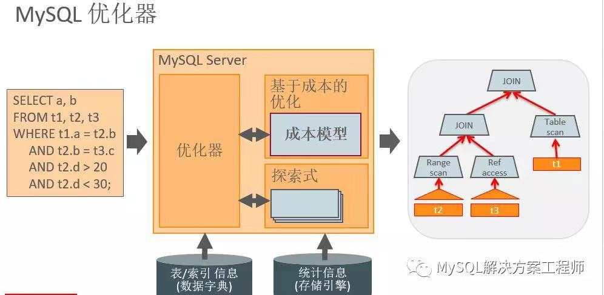											
MySQL 的优化器将 SQL 查询作为输入，并产生一个计划来执行该查询。
例如，应该按什么顺序连接表以及应该使用哪些索引。目标是能够从众多可能的执行计划中找到最佳的执行计划。
MySQL 使用基于成本的优化器。计划的成本大致反映了查询所需的资源，其中主要因素是计算查询时将要访问的行数。在优化过程中，优化器会选择连接顺序，决定使用哪个索引等等。同时，优化器还会根据从存储引擎获取的数据的统计信息作出决定。并且还依赖于数据字典中的元数据信息。
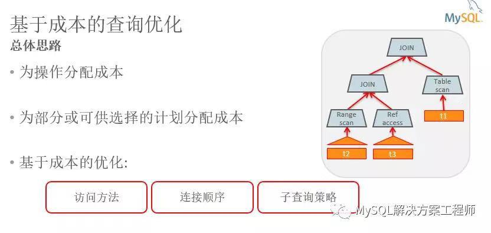											
因此，查询优化的总体思路如上图所示。
基于成本的查询优化器将为不同的操作分配成本，如表扫描和索引查找。
成本单位是从磁盘读取随机数据页的成本。所有其他成本数字都与此成本单位有关。基于这些成本，优化器将计算可供选择的计划的成本。最终它将选择成本最低的计划。
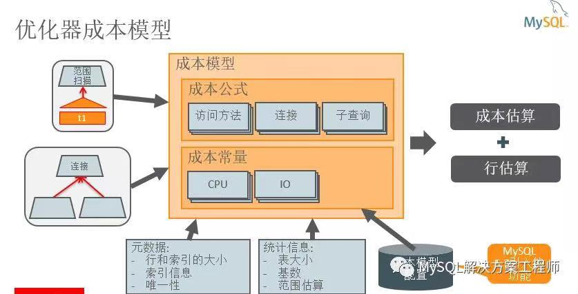											
这是 MySQL 中成本模型的一个非常简单的视图。
作为输入，它需要基本操作，例如从表格读取数据或连接两个表格。作为输出，它产生对执行此操作的成本的估计。除了成本估算之外，它还会估算该操作产生的行数。成本模型由计算不同操作的成本和估计行数的公式组成。除了成本公式之外，成本模型还包含一组“成本常数”。这些是 MySQL 服务器在执行查询时执行的基本操作的成本。
成本模型使用来自数据字典的信息和来自存储引擎的统计信息来进行计算。主要的统计信息是表中的行数，对于索引，也获得基数，即有多少个不同的列值，以及索引范围中的行数。从数据字典中，我们使用关于行和索引的信息：如行和键的长度，唯一性以及列是否可以为空。
在 MySQL 5.7 中，已经配置了成本模型。成本常数存储在数据库表中，可以更改以更好地表示系统的特征。
使用这个模型，优化器在大多数情况下会选择一个最好的计划。但是，有时候优化器不能成功找到最佳计划。这可能是由于其决策所依据的数据不准确或由于成本模型本身的不准确性。
**2. 监视、分析和查询优化的工具有哪些？**
**监视分析工具**
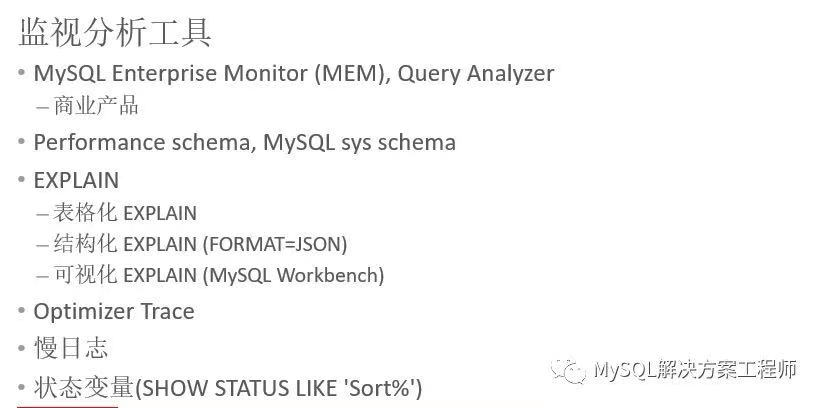											
了解 MySQL 的优化器原理之后，我们来通过一些工具来对 MySQL 的性能进行监视分析。工具包括如下：
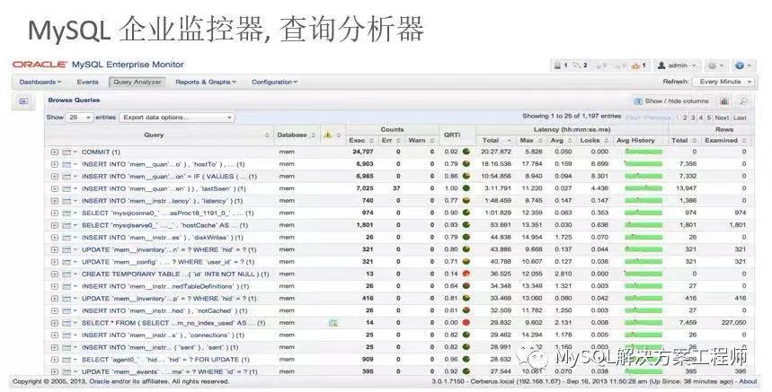											
MySQL 企业版监控器的查询分析器提供了一个概览，使用户能够快速识别开销大的查询。用户还可以对单个查询进行深入研究，以查看关于查询的细粒度统计信息。
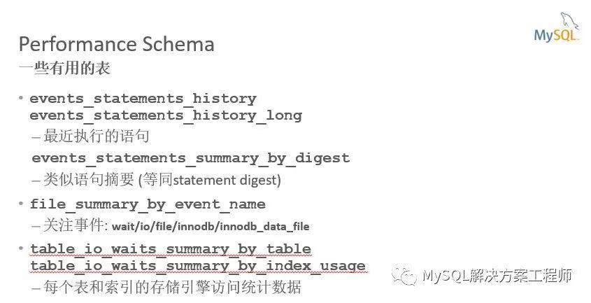											
Performance Schema 有大量的表与性能相关的数据。events_statements_history 表提供最近执行的查询的统计信息。events_statements_summary_by_digest 表中汇总类似查询的数据。file_summary_by_event_name 表包含获取文件 I/O 的统计信息。table_io_waits_summary 表提供有关表和索引使用情况的统计信息。
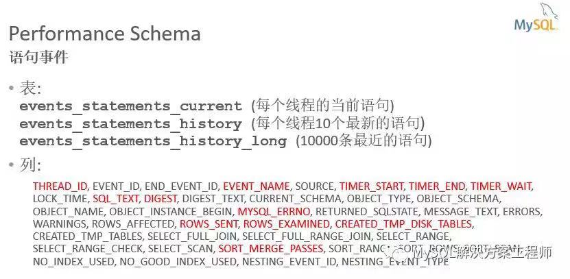											
语句事件表提供有关最近运行的查询的信息。
events_statements_current 表将显示每个连接或线程的当前语句。
历史表默认给出每个线程最近的 10 条语句，
history_long 表给出了全部 10000 条最新的语句。
历史记录表的大小是可配置的。
已经用红色标出了这些表格中的最有用的信息。
例如，TIMER_WAIT 给出了执行查询需要多长时间。单位是皮秒。
ROWS_SENT 是结果中的行数，而 ROWS_EXAMINED 是执行查询时必须访问的行数。
ROWS_EXAMINED 比 ROWS_SENT 大得多，通常表明查询需要优化。
CREATED_TMP_DISK_TABLES 告诉查询是否创建了磁盘上的临时表。
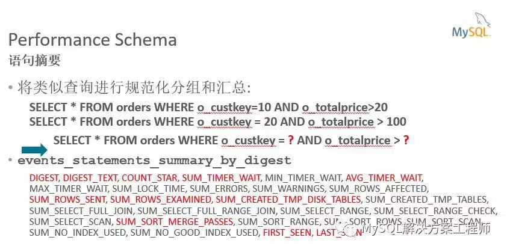											
语句摘要是将类似查询分组在一起的一种方法。在这里你可以看到两个查询的例子，这两个查询的区别，仅在于使用的常量。这样的查询将得到相同的摘要。摘要计算也会忽略空白和数值。events_statements_summary_by_digest 表包含每个摘要汇总的统计信息。DIGEST_TEXT 提供规范化的查询文本，COUNT_STAR 是执行此类型查询的次数。SUM_TIMER_WAIT 是执行此查询所用的总时间，AVG_TIMER_WAIT 是每次执行的平均时间。大多数其他列是各个查询的值的总和。在调查最近的性能退化时，FIRST_SEEN 列对于查找可能导致问题的新查询非常有用。
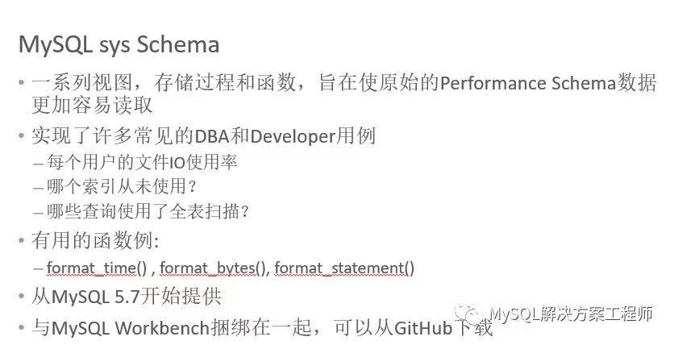											
Performance schema 非常庞大，有很多细节。因此，MySQL 团队开发了 sys_schema，这是一个视图，存储过程和函数的集合，旨在使访问 Performanceschema 数据变得更加容易。
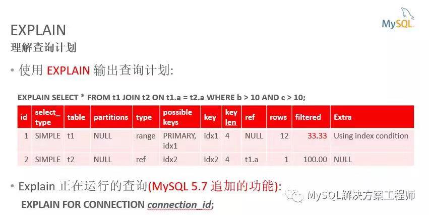											
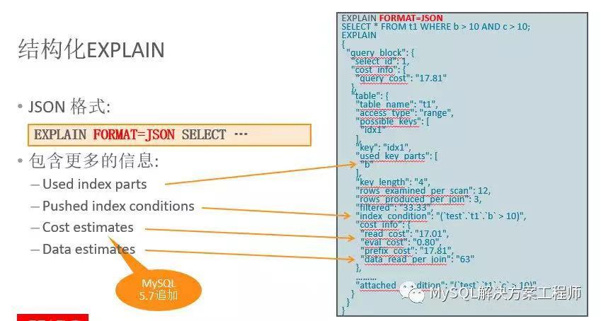											
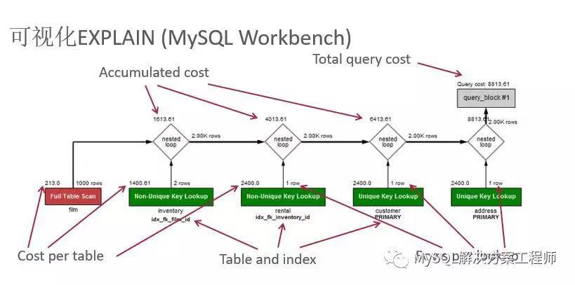											
EXPLAIN 有三种格式，表格，JSON 及可视化。通过使用 EXPLAIN 可以获取查询的执行计划。
结构化的 EXPLAIN以JSON 格式提供查询计划，可以通过在 EXPLAIN 之后指定 FORMAT= JSON 来获得此信息。使用 JSON 可以更容易地显示查询的结构。MySQL Workbench 使用结构化 EXPLAIN 的输出来优化查询计划。上图按从左到右的连接顺序显示表。红色框表示全表扫描，而绿色框表示使用索引查找。对于每个表，显示使用的索引。还要注意的是，每个表格的框上方是每个表访问所发现的行数的估计值以及访问该表的成本。
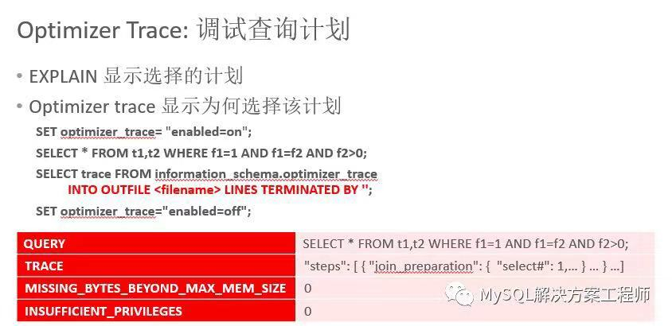											
如果您想更深入地了解为什么选择某个查询计划，那么优化器跟踪非常有用。虽然 EXPLAIN 显示选定的计划，但优化程序跟踪显示为什么选择计划：您将能够看到替代计划，估计成本以及做出的决策。跟踪采用 JSON 格式。要打开 optimizer_trace，可以在 optimizer_trace 会话变量中设置 enabled 标志。解释或运行查询后，可以从 informationschema 中的 optimizer_trace 表中获取跟踪。通常会将跟踪转存到文件以供进一步检查。optimizer_trace 表有 3 个其他列，查询的文本，Missing_bytes_beyond_max_mem_size。如果这不是零，则需要增加用于捕获跟踪的内存缓冲区的大小。insufficient_privileges。如果不为零，则表示用户缺乏查看有关查询或查询中使用的存储例程的信息的权限。
**3. 数据访问方法与如何选择索引**
**数据访问方法**
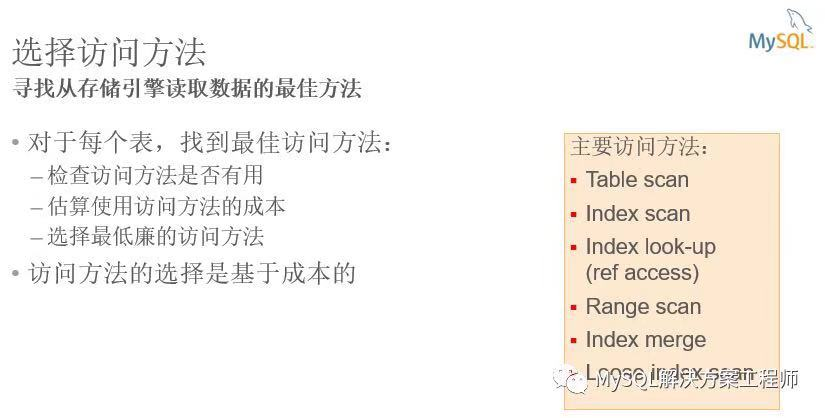											
选择访问方法的目标是为查询中的每个表找到读取所需数据的最佳方式。
对于查询的每个表，我们执行以下操作：
检查访问方法是否有用，估计使用该访问方法的成本，以及选择成本最低的访问方法。
关于访问方法的详细内容请观看**网络研讨会的视频，**可关注微信公众号：爱可生开源社区，进行观看。
**4. 如何对连接进行优化**
**连接的优化**
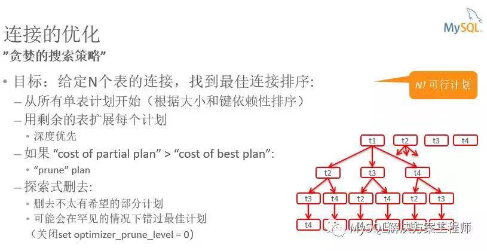											
连接优化器的作用是找到连接表的最佳顺序。我们的连接优化器使用“贪婪搜索策略”来计算所有可能的连接顺序。这是以深度优先的方式完成的。为了缩小范围，将会删去比迄今为止发现的最佳计划花费更多的部分计划。为了使这种删去更高效，首先会对大小和键依赖关系进行排序。这样增加了尽早找到一个好计划的机会，以便更多的计划将被删去。连接优化器默认也会删去一些不那么有希望的计划，而这些计划不一定比目前的最佳计划花费更多。在某些情况下，可能会因此而错过最佳计划。探索式删去可以通过将 optimizer_prune_level 设置为 0 来关闭。
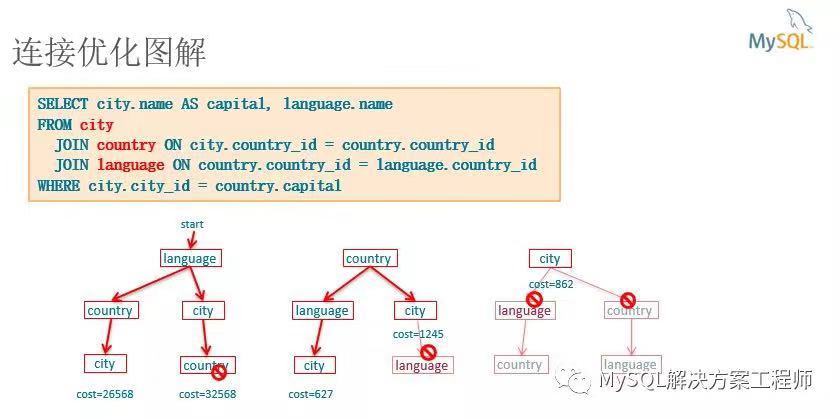											
1. 我现在将展示一个关于连接优化器如何工作的例子。我们的示例查询加入了三个表格，语言，国家和城市。优化器通常会从最小的表开始。语言是最小的表2. 它首先添加国家3. 然后城市。此连接顺序的估计总成本为 265684. 将其记录为迄今最好的计划5. 然后它回溯并添加城市6. 然后是国家。此连接顺序的总成本为 32568，比之前的计划成本大。现在所有以语言开始的可能计划都已经尝试过了，我们将继续以国家为起点的计划。7. 我们首先添加语言8. 然后城市。总成本是 6279. 所以这个连接顺序是迄今为止最好的。10. 然后我们尝试将城市作为第二张表，并且看到这个部分计划的成本是 1245。11. 这比迄今为止发现的最佳计划还要大。因此，我们将在此停止并且不向此部分连接顺序添加更多表。12. 我们继续与城市和单独访问该表的成本是 862。13. 这也比迄今为止的最低成本要高，我们将删去这个搜索树的其余部分。通过这种方式，连接优化器已经确定最佳连接顺序是 Country 优先，然后是 Language，然后是 City。
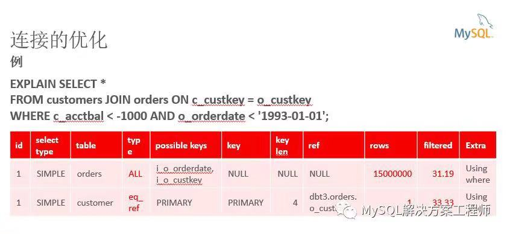											
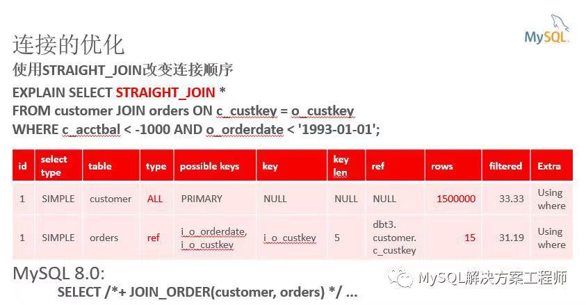											
可以通过改变连接的顺序进行优化，翻转连接顺序，执行时间从 15 秒减少到不到 1 秒。反向顺序更好的原因是，实际上很少有客户的帐户余额很低。因此，通过从客户表开始，大多数行将被过滤掉，并且实际上很少有查询到订单表。
**5. 如何影响优化器******
**影响优化器**
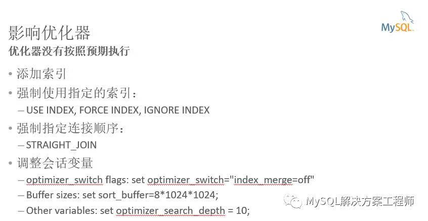											
可以通过上图的方法对优化器进行影响，以达到预期效果。
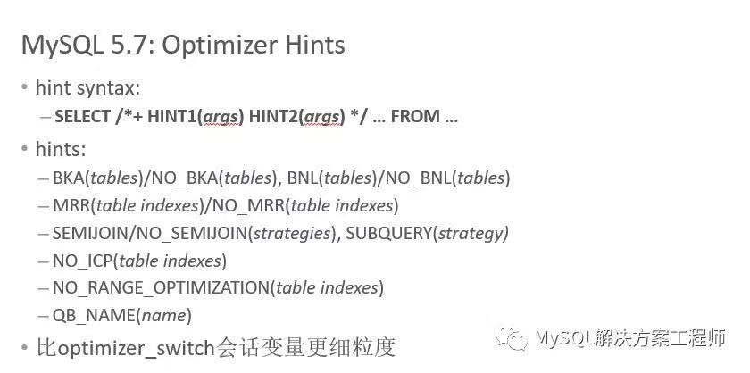											
MySQL 5.7 引入了优化器提示的新语法。
在 SELECT 之后，新的提示应该放在一个特殊的注释中
这些提示中的许多提示都对应于 optimizer_switch 会话变量可以控制的功能。这些提示允许打开或关闭单个查询的功能，或者仅用于查询的某些表或索引。
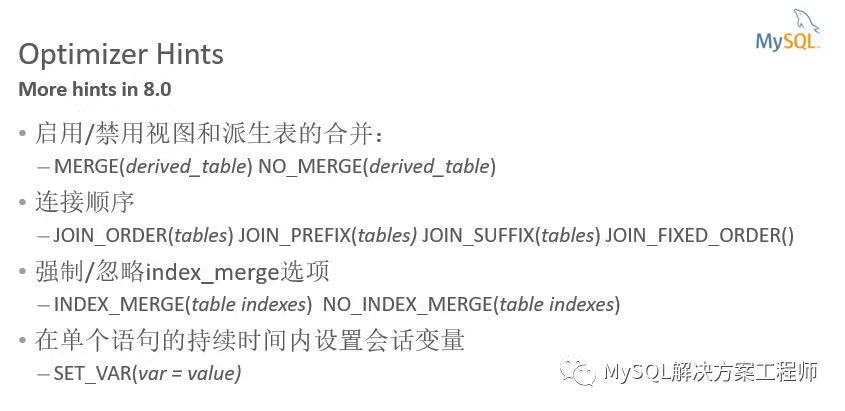											
MySQL 8.0，已经添加了提示来控制派生表和视图是否合并。
还添加了几个连接顺序提示。这些新的联接提示比现有的 STRAIGHT_JOIN 提示更灵活，它要求 FROM 子句中的表按特定顺序列出。
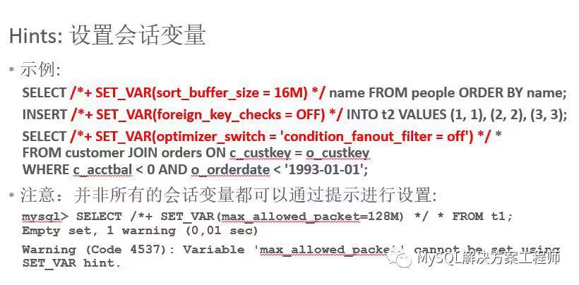											
MySQL 8.0 还可以在查询期间临时设置会话变量。
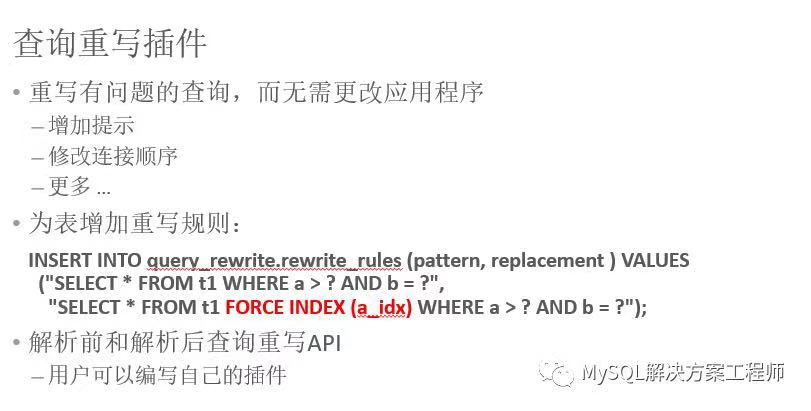											
从 MySQL 5.7 开始，提供了一个插件，可用于在不更改应用程序的情况下重写有问题的查询。
查询可以在到达 MySQL 服务器时重写。
用户可以使用这个插件添加提示，修改连接顺序等等。
在这张幻灯片的例子中，插入一条规则来将 FORCEINDEX 提示添加到匹配模式的查询中。与 performance schema 中使用的相同的查询摘要用于传入查询与重写规则的高效匹配。
这样，对于不符合任何重写规则的查询，应该几乎没有开销。
以上内容是关于 MySQL 查询优化的一个简明总结，详细内容请观看网络研讨会的视频，可关注微信公众号：爱可生开源社区，进行观看。
感谢您关注 MySQL ！
**社区近期动态**
**No.1**
**Mycat 问题免费诊断**
诊断范围支持：
Mycat 的故障诊断、源码分析、性能优化
服务支持渠道：
- 技术交流群，进群后可提问
QQ群（669663113）
- 社区通道，邮件&电话
osc@actionsky.com
- 现场拜访，线下实地，1天免费拜访
关注“爱可生开源社区”公众号，回复关键字“Mycat”，获取活动详情。
**No.2**
**社区技术内容征稿**
征稿内容：
- 格式：.md/.doc/.txt
- 主题：MySQL、分布式中间件DBLE、数据传输组件DTLE相关技术内容
- 要求：原创且未发布过
- 奖励：作者署名；200元京东E卡+社区周边
投稿方式：
- 邮箱：osc@actionsky.com
- 格式：[投稿]姓名+文章标题
- 以附件形式发送，正文需注明姓名、手机号、微信号，以便小编及时联系